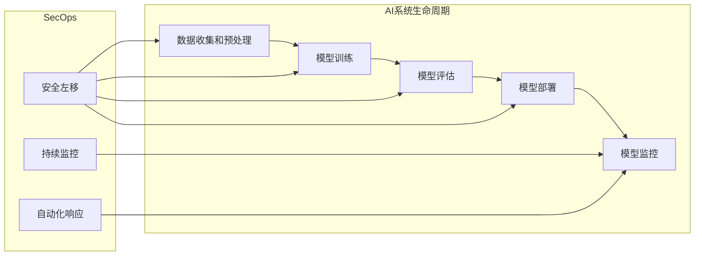

## AI系统SecOps原理与代码实战案例讲解

作者：禅与计算机程序设计艺术

## 1. 背景介绍

### 1.1 人工智能时代的安全挑战

近年来，人工智能(AI)技术发展迅猛，在各个领域展现出巨大的应用潜力。然而，随着AI系统复杂性的不断增加以及应用场景的不断拓展，其安全问题也日益凸显。传统的安全防护手段难以应对AI系统所面临的独特挑战，例如：

* **数据中毒攻击**: 攻击者可以通过恶意篡改训练数据，影响AI模型的训练过程，导致模型输出错误的结果。
* **对抗样本攻击**: 攻击者可以构造出人眼难以察觉的微小扰动，添加到输入数据中，导致AI模型误判。
* **模型窃取攻击**: 攻击者可以通过访问AI模型的API接口或窃取模型文件，获取模型的内部结构和参数，进而进行恶意利用。

### 1.2  SecOps: 保障AI系统安全的新思路

为了应对AI系统面临的安全挑战，安全领域提出了SecOps (Security Operations) 的概念，旨在将安全融入到AI系统的整个生命周期中，实现安全与开发运维一体化。

SecOps强调以下原则：

* **安全左移**: 在AI系统的设计和开发阶段就将安全考虑进去，而不是等到系统部署后才进行安全防护。
* **持续监控**: 对AI系统的运行状态进行持续监控，及时发现并响应安全威胁。
* **自动化响应**: 利用自动化工具和流程，快速响应和处置安全事件。

### 1.3 本文目标

本文将深入探讨AI系统SecOps的原理和实践，并结合代码实战案例，帮助读者理解如何在实际项目中落地AI系统SecOps。

## 2. 核心概念与联系

### 2.1  AI系统生命周期

AI系统的生命周期一般包括以下阶段：

1. **数据收集和预处理**: 收集和清洗训练数据，为模型训练做准备。
2. **模型训练**:  使用训练数据训练AI模型。
3. **模型评估**:  使用测试数据评估模型的性能。
4. **模型部署**: 将训练好的模型部署到生产环境中。
5. **模型监控**:  对模型的运行状态进行持续监控。

### 2.2  SecOps在AI系统生命周期中的应用

SecOps的理念贯穿于AI系统的整个生命周期，每个阶段都需要考虑相应的安全措施：

1. **数据收集和预处理**: 
    * 数据来源安全：确保训练数据来自可信的来源，防止数据中毒攻击。
    * 数据隐私保护： 对敏感数据进行脱敏处理，保护用户隐私。

2. **模型训练**:
    * 训练环境安全： 加固训练环境，防止恶意代码入侵。
    * 模型训练过程监控： 监控模型训练过程中的异常行为，例如梯度异常、损失函数波动等，及时发现潜在的安全威胁。

3. **模型评估**:
    * 对抗样本测试： 使用对抗样本对模型进行测试，评估模型的鲁棒性。
    * 模型解释性分析： 分析模型的决策依据，确保模型的公平性和可解释性。

4. **模型部署**:
    * 安全容器化部署： 使用容器技术对模型进行封装和隔离，提高模型部署的安全性。
    * API访问控制： 对模型API接口进行访问控制，防止未授权访问。

5. **模型监控**:
    * 模型性能监控： 监控模型的性能指标，例如准确率、召回率等，及时发现模型衰减或异常。
    * 安全事件监控： 监控模型运行过程中的安全事件，例如异常输入、异常输出等，及时发现和响应安全威胁。

### 2.3  核心概念关系图



## 3. 核心算法原理具体操作步骤

### 3.1 数据安全

#### 3.1.1 数据来源安全

* **数据来源验证**:  对训练数据的来源进行验证，确保数据来自可信的渠道。例如，可以使用数字签名技术验证数据的完整性和真实性。
* **数据清洗**:  对训练数据进行清洗，去除重复数据、异常数据和噪声数据，防止数据中毒攻击。

#### 3.1.2 数据隐私保护

* **数据脱敏**:  对敏感数据进行脱敏处理，例如使用k-匿名、差分隐私等技术，保护用户隐私。
* **联邦学习**:  使用联邦学习技术，在不共享原始数据的情况下进行模型训练，保护数据隐私。

### 3.2 模型安全

#### 3.2.1 训练环境安全

* **容器化训练**:  使用容器技术构建隔离的训练环境，防止恶意代码入侵。
* **安全镜像**: 使用经过安全扫描的镜像构建训练环境，确保环境的安全性。

#### 3.2.2 模型训练过程监控

* **梯度监控**: 监控模型训练过程中的梯度变化，及时发现梯度爆炸或梯度消失等问题，防止模型训练失败。
* **损失函数监控**: 监控模型训练过程中的损失函数变化，及时发现模型过拟合或欠拟合等问题，优化模型性能。

### 3.3 模型评估安全

#### 3.3.1 对抗样本测试

* **生成对抗样本**: 使用FGSM、JSMA等算法生成对抗样本，对模型进行攻击测试。
* **对抗训练**:  将对抗样本添加到训练数据中，重新训练模型，提高模型的鲁棒性。

#### 3.3.2 模型解释性分析

* **特征重要性分析**: 分析模型预测结果的影响因素，识别模型的关键特征。
* **局部解释性**: 使用LIME、SHAP等方法解释模型对单个样本的预测结果。


### 3.4 模型部署安全

#### 3.4.1 安全容器化部署

* **镜像签名**:  对模型镜像进行签名，确保镜像的完整性和来源可靠性。
* **安全扫描**: 对模型镜像进行安全扫描，识别潜在的安全漏洞。

#### 3.4.2 API访问控制

* **身份认证**:  对API访问请求进行身份认证，确保只有授权用户才能访问模型API。
* **授权**:  根据用户的角色和权限，控制用户对模型API的访问权限。

### 3.5 模型监控安全

#### 3.5.1 模型性能监控

* **性能指标监控**: 监控模型的性能指标，例如准确率、召回率、F1值等，及时发现模型衰减或异常。
* **漂移检测**: 监控模型输入数据的分布变化，及时发现数据漂移现象，并采取相应的措施。

#### 3.5.2 安全事件监控

* **异常输入检测**:  监控模型的输入数据，识别异常的输入数据，例如超出正常范围的数据、格式错误的数据等。
* **异常输出检测**:  监控模型的输出结果，识别异常的输出结果，例如置信度过低的结果、与预期结果不符的结果等。


## 4. 数学模型和公式详细讲解举例说明

### 4.1 逻辑回归模型

逻辑回归是一种常用的分类算法，可以用于预测二分类问题。其数学模型如下：

$$
P(y=1|x) = \frac{1}{1 + e^{-(w^Tx + b)}}
$$

其中：

* $P(y=1|x)$ 表示给定输入 $x$，模型预测为正类的概率。
* $w$ 是模型的权重向量。
* $x$ 是模型的输入特征向量。
* $b$ 是模型的偏置项。

#### 4.1.1 损失函数

逻辑回归模型的损失函数是交叉熵损失函数，其公式如下：

$$
L = -\frac{1}{N}\sum_{i=1}^{N}[y_i\log(p_i) + (1-y_i)\log(1-p_i)]
$$

其中：

* $N$ 是样本数量。
* $y_i$ 是第 $i$ 个样本的真实标签。
* $p_i$ 是模型对第 $i$ 个样本预测为正类的概率。

#### 4.1.2 梯度下降法

逻辑回归模型的参数可以使用梯度下降法进行优化，其迭代公式如下：

$$
w = w - \alpha \frac{\partial L}{\partial w}
$$

$$
b = b - \alpha \frac{\partial L}{\partial b}
$$

其中：

* $\alpha$ 是学习率。
* $\frac{\partial L}{\partial w}$ 是损失函数对权重 $w$ 的偏导数。
* $\frac{\partial L}{\partial b}$ 是损失函数对偏置项 $b$ 的偏导数。

### 4.2  举例说明

假设我们有一个二分类数据集，包含两个特征：年龄和收入，标签为是否购买保险。我们可以使用逻辑回归模型来预测一个人是否会购买保险。

首先，我们需要将数据分为训练集和测试集。然后，我们可以使用训练集来训练逻辑回归模型，并使用测试集来评估模型的性能。

在训练过程中，我们可以使用梯度下降法来优化模型的参数。在每次迭代中，我们计算损失函数对参数的偏导数，并使用偏导数来更新参数。

训练完成后，我们可以使用测试集来评估模型的性能。常用的评估指标包括准确率、召回率、F1值等。

## 5. 项目实践：代码实例和详细解释说明

### 5.1 数据集介绍

在本节中，我们将使用信用卡欺诈检测数据集来演示如何使用 Python 实现 AI 系统 SecOps。该数据集包含信用卡交易数据，其中包含交易金额、时间、地点等特征，以及是否为欺诈交易的标签。

### 5.2 代码实现

#### 5.2.1 数据预处理

```python
import pandas as pd
from sklearn.model_selection import train_test_split
from sklearn.preprocessing import StandardScaler

# 加载数据集
data = pd.read_csv('creditcard.csv')

# 将数据分为特征和标签
X = data.drop('Class', axis=1)
y = data['Class']

# 将数据分为训练集和测试集
X_train, X_test, y_train, y_test = train_test_split(X, y, test_size=0.2, random_state=42)

# 对特征进行标准化
scaler = StandardScaler()
X_train = scaler.fit_transform(X_train)
X_test = scaler.transform(X_test)
```

#### 5.2.2 模型训练

```python
from sklearn.linear_model import LogisticRegression

# 创建逻辑回归模型
model = LogisticRegression()

# 训练模型
model.fit(X_train, y_train)
```

#### 5.2.3 模型评估

```python
from sklearn.metrics import accuracy_score, precision_score, recall_score, f1_score

# 预测测试集
y_pred = model.predict(X_test)

# 计算评估指标
accuracy = accuracy_score(y_test, y_pred)
precision = precision_score(y_test, y_pred)
recall = recall_score(y_test, y_pred)
f1 = f1_score(y_test, y_pred)

# 打印评估指标
print(f'Accuracy: {accuracy}')
print(f'Precision: {precision}')
print(f'Recall: {recall}')
print(f'F1 Score: {f1}')
```

#### 5.2.4 模型部署

```python
import pickle

# 保存模型
filename = 'creditcard_fraud_detection_model.pkl'
pickle.dump(model, open(filename, 'wb'))

# 加载模型
loaded_model = pickle.load(open(filename, 'rb'))

# 使用模型进行预测
y_pred = loaded_model.predict(X_test)
```

## 6. 实际应用场景

AI系统SecOps的应用场景非常广泛，涵盖了各个行业和领域，例如：

* **金融**:  信用卡欺诈检测、反洗钱、风险评估
* **医疗**: 疾病诊断、药物研发、个性化医疗
* **自动驾驶**:  自动驾驶汽车的安全测试和验证
* **网络安全**: 入侵检测、恶意软件分析、威胁情报

## 7. 工具和资源推荐

### 7.1 工具

* **TensorFlow Privacy**:  TensorFlow Privacy 是一个开源库，用于训练具有差分隐私保证的机器学习模型。
* **CleverHans**: CleverHans 是一个 Python 库，用于测试机器学习模型对对抗样本的鲁棒性。
* **LIME**: LIME 是一种模型解释性方法，可以解释模型对单个样本的预测结果。

### 7.2 资源

* **MITRE ATLAS**: MITRE ATLAS 是一个对抗战术、技术和常识的知识库。
* **Google AI Principles**: Google AI Principles 是一套人工智能伦理原则，旨在指导人工智能的发展和应用。

## 8. 总结：未来发展趋势与挑战

### 8.1 未来发展趋势

* **自动化**:  随着AI系统复杂性的不断增加，自动化安全工具和流程将变得越来越重要。
* **智能化**:  AI技术本身也将被用于提高安全防护能力，例如使用机器学习算法检测异常行为。
* **合规性**:  随着人工智能法规的不断完善，AI系统SecOps需要满足越来越多的合规性要求。

### 8.2 面临的挑战

* **人才短缺**: AI系统SecOps需要同时具备安全和人工智能方面的专业知识，人才培养是目前面临的一大挑战。
* **技术发展**:  人工智能技术发展迅速，安全技术需要不断更新迭代才能应对新的安全威胁。
* **成本**:  部署和维护AI系统SecOps需要投入大量的人力和物力成本。

## 9. 附录：常见问题与解答

### 9.1 什么是数据中毒攻击？

数据中毒攻击是指攻击者通过恶意篡改训练数据，影响AI模型的训练过程，导致模型输出错误的结果。

### 9.2 如何防止数据中毒攻击？

* **数据来源验证**:  对训练数据的来源进行验证，确保数据来自可信的渠道。
* **数据清洗**:  对训练数据进行清洗，去除重复数据、异常数据和噪声数据。

### 9.3 什么是对抗样本攻击？

对抗样本攻击是指攻击者可以构造出人眼难以察觉的微小扰动，添加到输入数据中，导致AI模型误判。

### 9.4 如何防御对抗样本攻击？

* **对抗训练**:  将对抗样本添加到训练数据中，重新训练模型，提高模型的鲁棒性。
* **输入预处理**:  对模型的输入数据进行预处理，例如去噪、平滑等，可以降低对抗样本的攻击效果。


## 10. 结束语

本文详细介绍了AI系统SecOps的原理、实践和未来发展趋势。AI系统SecOps是保障AI系统安全的重要手段，需要引起足够的重视。希望本文能够帮助读者更好地理解AI系统SecOps，并在实际项目中落地AI系统SecOps，构建更加安全可靠的AI系统。
