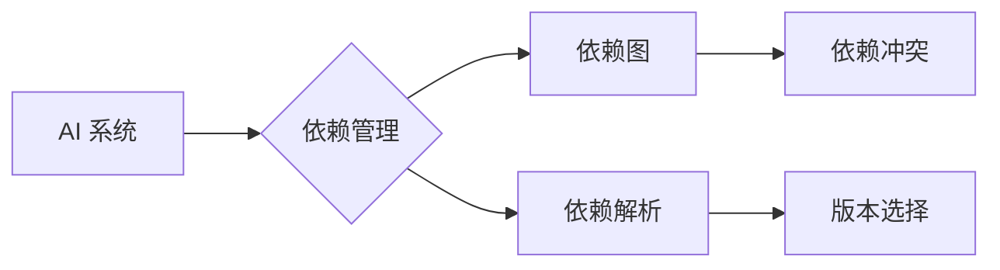

## 1. 背景介绍

### 1.1  AI 系统复杂性的挑战

近年来，人工智能（AI）技术飞速发展，各种 AI 系统在各个领域得到广泛应用。然而，随着 AI 系统规模和复杂性的不断增加，依赖管理成为了一个日益突出的挑战。传统的依赖管理方法难以满足 AI 系统的需求，主要体现在以下几个方面：

* **依赖数量庞大:**  AI 系统通常依赖于大量的第三方库和框架，例如 TensorFlow、PyTorch、Scikit-learn 等，这些库之间又存在着复杂的依赖关系。
* **依赖版本冲突:** 不同的 AI 库可能依赖于相同库的不同版本，导致版本冲突问题。
* **环境配置复杂:**  AI 系统的运行环境通常需要安装大量的依赖库，并且需要进行复杂的配置。
* **可复现性问题:** 由于依赖关系的复杂性，很难保证 AI 系统在不同的环境中能够完全复现。

### 1.2  AI 系统依赖管理的重要性

有效地进行 AI 系统依赖管理对于确保系统的稳定性、可靠性和可复现性至关重要。良好的依赖管理可以带来以下好处：

* **提高开发效率:**  简化依赖管理流程，减少因依赖问题导致的开发时间浪费。
* **增强代码可维护性:**  清晰的依赖关系使得代码更易于理解和维护。
* **保证系统稳定性:**  避免因依赖冲突或版本问题导致的系统崩溃。
* **提高可复现性:**  确保 AI 系统在不同的环境中能够一致地运行。

## 2. 核心概念与联系

### 2.1  依赖管理的基本概念

* **依赖:**  一个软件组件（例如库、模块、包）所依赖的其他软件组件。
* **依赖图:**  用于描述软件组件之间依赖关系的有向图。
* **依赖冲突:**  当两个或多个软件组件依赖于相同软件组件的不同版本时，就会发生依赖冲突。
* **依赖解析:**  根据依赖关系图和约束条件，确定每个软件组件的具体版本。

### 2.2  AI 系统依赖管理的特点

* **依赖类型多样:**  除了传统的代码库依赖，AI 系统还可能依赖于数据、模型、硬件等资源。
* **动态依赖:**  AI 系统的依赖关系可能在运行时动态变化，例如根据不同的输入数据加载不同的模型。
* **版本敏感性高:**  AI 库的更新迭代速度快，版本之间可能存在较大差异，对系统稳定性影响较大。

### 2.3  核心概念联系

下图展示了 AI 系统依赖管理中各个核心概念之间的联系：



## 3. 核心算法原理具体操作步骤

### 3.1  依赖解析算法

依赖解析是依赖管理的核心环节，其目标是根据依赖关系图和约束条件，确定每个软件组件的具体版本。常用的依赖解析算法包括：

* **递归回溯算法:**  从根节点开始，递归地遍历依赖图，尝试找到满足所有约束条件的版本组合。
* **拓扑排序算法:**  对依赖图进行拓扑排序，然后按照顺序依次解决每个节点的依赖关系。
* **约束满足问题（CSP）求解算法:**  将依赖解析问题转化为约束满足问题，并使用 CSP 求解器进行求解。

### 3.2  版本选择策略

当存在多个满足约束条件的版本时，需要选择一个最优版本。常用的版本选择策略包括：

* **最新版本优先:**  选择依赖树中最新的版本。
* **语义化版本控制:**  根据语义化版本控制规范，选择兼容性最好的版本。
* **手动指定版本:**  允许用户手动指定特定软件组件的版本。

### 3.3  具体操作步骤

以使用 pip 工具管理 Python 项目依赖为例，具体操作步骤如下：

1. **创建 requirements.txt 文件:**  在项目根目录下创建 requirements.txt 文件，用于记录项目依赖的软件包及其版本。
2. **添加依赖:**  使用 `pip freeze > requirements.txt` 命令将当前环境中安装的软件包及其版本写入 requirements.txt 文件。
3. **安装依赖:**  使用 `pip install -r requirements.txt` 命令安装项目依赖。
4. **更新依赖:**  使用 `pip install --upgrade <package_name>` 命令更新特定软件包的版本。

## 4. 数学模型和公式详细讲解举例说明

### 4.1  依赖图的数学表示

可以使用图论中的有向图来表示软件组件之间的依赖关系。

* **节点:**  表示软件组件。
* **边:**  表示依赖关系，方向从依赖方指向被依赖方。

例如，假设软件组件 A 依赖于软件组件 B 和 C，软件组件 B 依赖于软件组件 D，则可以使用以下有向图表示：

```
A --> B
A --> C
B --> D
```

### 4.2  依赖冲突的数学描述

假设有两个软件组件 A 和 B，它们都依赖于软件组件 C，但 A 依赖于 C 的 1.0 版本，B 依赖于 C 的 2.0 版本，则可以将依赖冲突描述为以下不等式组：

```
A >= C(1.0)
B >= C(2.0)
```

由于 C(1.0) 和 C(2.0) 是两个不同的版本，因此无法同时满足上述两个不等式，即发生了依赖冲突。

### 4.3  举例说明

假设有一个 AI 项目，其依赖关系如下：

```
project --> tensorflow(2.4.0)
project --> scikit-learn(0.23.2)
tensorflow(2.4.0) --> numpy(1.19.2)
scikit-learn(0.23.2) --> numpy(>=1.13.3)
```

其中，`project` 表示 AI 项目本身，箭头表示依赖关系，括号中的数字表示版本号。

根据上述依赖关系，可以得到以下信息：

* `project` 依赖于 `tensorflow(2.4.0)` 和 `scikit-learn(0.23.2)`。
* `tensorflow(2.4.0)` 依赖于 `numpy(1.19.2)`。
* `scikit-learn(0.23.2)` 依赖于 `numpy`，且版本号必须大于等于 1.13.3。

## 5. 项目实践：代码实例和详细解释说明

### 5.1  使用 pip 管理 Python 项目依赖

以下是一个使用 pip 管理 Python 项目依赖的示例：

```
# requirements.txt

tensorflow==2.4.0
scikit-learn==0.23.2
```

在项目根目录下创建 `requirements.txt` 文件，并将项目依赖的软件包及其版本写入该文件。

使用以下命令安装项目依赖：

```
pip install -r requirements.txt
```

### 5.2  使用 conda 管理 Python 环境和依赖

以下是一个使用 conda 管理 Python 环境和依赖的示例：

```
# environment.yml

name: my-ai-env
channels:
  - defaults
dependencies:
  - python=3.8
  - tensorflow=2.4.0
  - scikit-learn=0.23.2
```

在项目根目录下创建 `environment.yml` 文件，并定义环境名称、依赖的软件包及其版本。

使用以下命令创建 conda 环境：

```
conda env create -f environment.yml
```

激活 conda 环境：

```
conda activate my-ai-env
```

## 6. 实际应用场景

### 6.1  模型训练与部署

在模型训练阶段，可以使用依赖管理工具确保训练环境的一致性，避免因依赖问题导致的模型训练失败或结果不一致。在模型部署阶段，可以使用依赖管理工具创建独立的运行环境，避免与其他系统发生依赖冲突。

### 6.2  代码共享与协作

在团队协作开发过程中，可以使用依赖管理工具确保所有开发者使用相同版本的依赖库，避免因版本不一致导致的代码冲突或运行错误。

### 6.3  可复现性研究

在进行可复现性研究时，可以使用依赖管理工具记录所有依赖库及其版本，确保实验结果的可复现性。

## 7. 工具和资源推荐

### 7.1  Python 包管理工具

* **pip:**  Python 官方的包管理工具。
* **conda:**  跨平台的包和环境管理工具。

### 7.2  依赖管理平台

* **PyPI:**  Python 包索引，提供了大量的 Python 包。
* **conda-forge:**  conda 的社区维护的软件包仓库。

### 7.3  其他资源

* **Semantic Versioning:**  语义化版本控制规范。
* **Dependency Hell:**  维基百科关于依赖地狱的介绍。

## 8. 总结：未来发展趋势与挑战

### 8.1  未来发展趋势

* **自动化依赖管理:**  随着 AI 系统复杂性的不断增加，自动化依赖管理将成为未来发展趋势，例如自动检测和解决依赖冲突、自动更新依赖库等。
* **云原生依赖管理:**  随着云计算的普及，云原生依赖管理将成为趋势，例如使用容器技术打包 AI 系统及其依赖，实现跨平台部署和运行。
* **AI 驱动的依赖管理:**  未来，AI 技术将被应用于依赖管理领域，例如使用机器学习算法预测依赖冲突、推荐最佳版本等。

### 8.2  挑战

* **动态依赖管理:**  如何有效地管理 AI 系统的动态依赖关系，例如根据不同的输入数据加载不同的模型，是未来需要解决的挑战。
* **跨平台兼容性:**  不同的操作系统和硬件平台可能存在差异，如何确保 AI 系统及其依赖在不同平台上的兼容性是另一个挑战。

## 9. 附录：常见问题与解答

### 9.1  如何解决依赖冲突？

解决依赖冲突的方法包括：

* **升级版本:**  尝试将冲突的软件包升级到兼容的版本。
* **降级版本:**  尝试将冲突的软件包降级到兼容的版本。
* **使用虚拟环境:**  创建独立的虚拟环境，在不同的环境中安装不同版本的软件包。
* **手动解决:**  手动修改代码或配置文件，解决依赖冲突。

### 9.2  如何保证依赖库的安全性？

* **使用官方源:**  尽量从官方源下载和安装依赖库。
* **检查依赖库的来源:**  在安装依赖库之前，检查其来源和作者信息。
* **使用安全扫描工具:**  使用安全扫描工具扫描依赖库，检测潜在的安全漏洞。
* **及时更新依赖库:**  及时更新依赖库，修复已知的安全漏洞。


## 10. 后记

AI 系统依赖管理是一个复杂而重要的课题，本文介绍了 AI 系统依赖管理的基本概念、原理、方法和工具，并结合代码实例进行了详细讲解。希望本文能够帮助读者更好地理解和实践 AI 系统依赖管理，从而构建更加稳定、可靠和高效的 AI 系统。