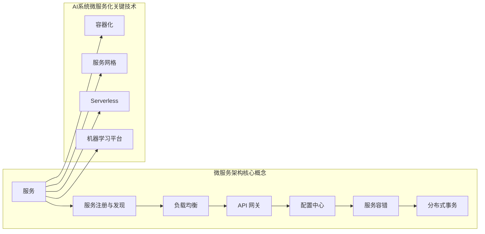

##  AI系统微服务架构原理与代码实战案例讲解

作者：禅与计算机程序设计艺术

## 1. 背景介绍

### 1.1 人工智能发展与挑战

近年来，人工智能(AI)技术发展迅猛，已经在图像识别、自然语言处理、语音识别等领域取得了突破性进展，并逐渐渗透到各个行业，为人类社会带来了巨大的变革。然而，随着AI应用场景的不断扩展和数据规模的爆炸式增长，传统的单体架构AI系统面临着越来越多的挑战，主要体现在以下几个方面:

* **可扩展性**: 单体架构难以满足日益增长的用户需求和数据规模，系统的性能和稳定性面临巨大挑战。
* **可维护性**: 随着业务逻辑的复杂化，单体架构的代码耦合度越来越高，维护和更新成本居高不下。
* **可重用性**: 单体架构的各个模块之间相互依赖，难以独立部署和复用，限制了开发效率和资源利用率。
* **技术选型**: 单体架构的技术栈往往比较单一，难以适应快速变化的技术发展趋势，限制了系统的灵活性和可扩展性。

### 1.2 微服务架构的优势

为了应对上述挑战，微服务架构应运而生。微服务架构是一种将单体应用拆分成多个小型、独立、自治的服务单元的架构风格，每个服务单元都可以独立部署、扩展和维护，服务之间通过轻量级的通信机制进行协作。相比于传统的单体架构，微服务架构具有以下优势:

* **高可扩展性**:  每个微服务都可以独立扩展，可以根据实际需求灵活调整资源配置，提升系统的整体性能和稳定性。
* **高可维护性**: 每个微服务只负责单一的业务功能，代码量相对较小，易于理解和维护，降低了开发和维护成本。
* **高可重用性**: 每个微服务都可以独立部署和复用，可以快速构建新的应用，提高了开发效率和资源利用率。
* **技术异构性**:  微服务架构可以采用不同的技术栈来实现不同的服务，可以根据实际需求选择最合适的技术，提升系统的灵活性和可扩展性。

### 1.3 AI系统微服务化的必要性

AI系统通常由多个模块组成，例如数据预处理、模型训练、模型部署、模型监控等。每个模块都具有不同的功能和特点，采用微服务架构可以将这些模块拆分成独立的服务单元，每个服务单元都可以独立部署、扩展和维护，从而提高AI系统的可扩展性、可维护性、可重用性和技术选型灵活性。

## 2. 核心概念与联系

### 2.1 微服务架构核心概念

* **服务**:  微服务架构中的基本单元，负责完成特定的业务功能，例如数据预处理、模型训练、模型预测等。
* **服务注册与发现**:  微服务架构中的服务实例动态注册到服务注册中心，客户端通过服务发现机制获取可用的服务实例地址列表。
* **负载均衡**:  将来自客户端的请求均匀地分发到多个服务实例上，避免单个服务实例过载。
* **API 网关**:  作为微服务架构的统一入口，负责路由、鉴权、限流、熔断等功能。
* **配置中心**:  集中管理微服务架构的配置信息，例如数据库连接信息、缓存配置等，可以实现配置的动态更新和热加载。
* **服务容错**:  微服务架构中，任何一个服务实例都可能出现故障，需要通过服务降级、服务熔断、服务限流等机制来保证系统的稳定性。
* **分布式事务**:  微服务架构中，一个业务操作可能涉及多个服务，需要保证数据的一致性，可以使用两阶段提交、TCC等分布式事务解决方案。

### 2.2 AI系统微服务化关键技术

* **容器化**:  使用 Docker、Kubernetes 等容器化技术可以简化微服务的部署和管理，提高资源利用率。
* **服务网格**:  使用 Istio、Linkerd 等服务网格技术可以实现服务治理、流量控制、安全认证等功能，简化微服务架构的运维管理。
* **Serverless**:  使用 AWS Lambda、Azure Functions 等 Serverless 平台可以将 AI 模型部署为无服务器函数，实现弹性伸缩和按需付费。
* **机器学习平台**:  使用 TensorFlow Serving、MLflow 等机器学习平台可以简化 AI 模型的部署、管理和监控。

### 2.3 核心概念关系图



## 3. 核心算法原理具体操作步骤

### 3.1 AI系统微服务化设计步骤

1. **业务领域划分**:  根据业务功能将 AI 系统拆分成多个独立的微服务，每个微服务负责完成特定的业务功能。
2. **服务接口设计**:  定义每个微服务的接口规范，包括接口地址、请求参数、响应结果等，可以使用 RESTful API 或者 gRPC 等技术。
3. **数据库设计**:  根据每个微服务的业务需求设计数据库表结构，可以采用关系型数据库或者 NoSQL 数据库。
4. **技术选型**:  根据每个微服务的业务特点选择合适的技术栈，例如编程语言、框架、数据库等。
5. **服务部署**:  将每个微服务部署到独立的服务器或者容器中，可以使用 Docker、Kubernetes 等技术。
6. **服务注册与发现**:  将每个微服务实例注册到服务注册中心，客户端通过服务发现机制获取可用的服务实例地址列表。
7. **API 网关**:  部署 API 网关，作为微服务架构的统一入口，负责路由、鉴权、限流、熔断等功能。
8. **服务监控**:  对每个微服务的性能指标进行监控，例如请求量、响应时间、错误率等，可以使用 Prometheus、Grafana 等工具。

### 3.2 以图像识别服务为例，说明微服务化设计过程

#### 3.2.1 业务领域划分

将图像识别服务拆分成以下三个微服务:

* **图像上传服务**:  负责接收用户上传的图像，并将图像存储到分布式文件系统中。
* **图像识别服务**:  负责调用图像识别模型对图像进行识别，并将识别结果返回给客户端。
* **结果存储服务**:  负责将图像识别结果存储到数据库中，方便后续查询和分析。

#### 3.2.2 服务接口设计

* **图像上传服务**:
    * 接口地址:  `/api/images/upload`
    * 请求方法:  `POST`
    * 请求参数:  图像文件
    * 响应结果:  图像 URL
* **图像识别服务**:
    * 接口地址:  `/api/images/recognition`
    * 请求方法:  `POST`
    * 请求参数:  图像 URL
    * 响应结果:  识别结果
* **结果存储服务**:
    * 接口地址:  `/api/results/save`
    * 请求方法:  `POST`
    * 请求参数:  图像 URL、识别结果
    * 响应结果:  成功/失败

#### 3.2.3 数据库设计

* **图像上传服务**:  不需要数据库。
* **图像识别服务**:  不需要数据库。
* **结果存储服务**:  需要创建一个表存储图像识别结果，表结构如下:

| 字段名 | 数据类型 | 说明 |
|---|---|---|
| image_url | VARCHAR(255) | 图像 URL |
| result | TEXT | 识别结果 |

#### 3.2.4 技术选型

* **编程语言**:  Python
* **框架**:  Flask
* **数据库**:  MySQL
* **图像识别模型**:  ResNet50

#### 3.2.5 服务部署

将每个微服务部署到独立的 Docker 容器中，并使用 Kubernetes 进行管理。

#### 3.2.6 服务注册与发现

使用 Consul 作为服务注册中心，每个微服务启动时都将自己的地址注册到 Consul 中，客户端通过 Consul 获取可用的服务实例地址列表。

#### 3.2.7 API 网关

使用 Kong 作为 API 网关，负责路由、鉴权、限流、熔断等功能。

#### 3.2.8 服务监控

使用 Prometheus 和 Grafana 对每个微服务的性能指标进行监控，例如请求量、响应时间、错误率等。

## 4. 数学模型和公式详细讲解举例说明

### 4.1 图像分类模型：ResNet50

ResNet50 是一个 50 层的残差网络，可以用于图像分类任务。残差网络的核心思想是引入残差块，残差块可以学习输入和输出之间的残差，从而解决深度神经网络中存在的梯度消失和梯度爆炸问题，提高模型的训练效果。

#### 4.1.1 残差块结构

```
                 x
                 |
            -----------------
            |                |
        --> | 线性变换 + ReLU | -->
            |                |
            -----------------       +
                 |              |
                 |              x
                 |
            -----------------
            |                |
        --> | 线性变换 + ReLU | -->
            |                |
            -----------------
                 |
                 y
```

#### 4.1.2 残差块公式

$$y = F(x) + x$$

其中:

* $x$ 为输入
* $F(x)$ 为残差函数
* $y$ 为输出

#### 4.1.3 ResNet50 网络结构

ResNet50 网络结构由多个残差块组成，如下图所示:

```
输入 --> 卷积层 --> 池化层 --> 残差块 x 16 --> 平均池化层 --> 全连接层 --> 输出
```

### 4.2 模型评估指标

#### 4.2.1 精度(Accuracy)

精度是指模型预测正确的样本数占总样本数的比例，计算公式如下:

$$Accuracy = \frac{TP + TN}{TP + TN + FP + FN}$$

其中:

* TP:  真正例，模型预测为正例，实际也为正例
* TN:  真负例，模型预测为负例，实际也为负例
* FP:  假正例，模型预测为正例，实际为负例
* FN:  假负例，模型预测为负例，实际为正例

#### 4.2.2 精确率(Precision)

精确率是指模型预测为正例的样本中，实际为正例的比例，计算公式如下:

$$Precision = \frac{TP}{TP + FP}$$

#### 4.2.3 召回率(Recall)

召回率是指实际为正例的样本中，模型预测为正例的比例，计算公式如下:

$$Recall = \frac{TP}{TP + FN}$$

#### 4.2.4 F1 值

F1 值是精确率和召回率的调和平均数，计算公式如下:

$$F1 = \frac{2 * Precision * Recall}{Precision + Recall}$$

### 4.3 举例说明

假设我们使用 ResNet50 模型对 1000 张图片进行分类，其中 800 张图片被正确分类，则:

* 精度 = 800 / 1000 = 0.8
* 假设模型预测为正例的样本有 200 张，其中 180 张实际为正例，则:
    * 精确率 = 180 / 200 = 0.9
    * 召回率 = 180 / (180 + 20) = 0.9
    * F1 值 = (2 * 0.9 * 0.9) / (0.9 + 0.9) = 0.9

## 5. 项目实践：代码实例和详细解释说明

### 5.1 图像上传服务

```python
from flask import Flask, request, jsonify
from werkzeug.utils import secure_filename
import os

app = Flask(__name__)

UPLOAD_FOLDER = 'uploads'
app.config['UPLOAD_FOLDER'] = UPLOAD_FOLDER

@app.route('/api/images/upload', methods=['POST'])
def upload_image():
    """
    上传图像
    """
    if 'image' not in request.files:
        return jsonify({'error': 'No image file'}), 400

    image = request.files['image']
    if image.filename == '':
        return jsonify({'error': 'No selected file'}), 400

    if image and allowed_file(image.filename):
        filename = secure_filename(image.filename)
        image.save(os.path.join(app.config['UPLOAD_FOLDER'], filename))
        return jsonify({'url': f'/uploads/{filename}'}), 201

    return jsonify({'error': 'Invalid file type'}), 400


def allowed_file(filename):
    """
    检查文件类型是否允许
    """
    ALLOWED_EXTENSIONS = {'png', 'jpg', 'jpeg'}
    return '.' in filename and \
           filename.rsplit('.', 1)[1].lower() in ALLOWED_EXTENSIONS

if __name__ == '__main__':
    app.run(debug=True)
```

**代码解释:**

* 该代码使用 Flask 框架创建了一个 Web 服务，监听 `/api/images/upload` 路径的 POST 请求。
* 当接收到请求时，代码首先检查请求中是否包含名为 `image` 的文件。
* 如果文件存在，则检查文件名是否为空，文件类型是否允许。
* 如果文件有效，则将文件保存到 `uploads` 目录下，并返回文件的 URL。

### 5.2 图像识别服务

```python
from flask import Flask, request, jsonify
from tensorflow.keras.applications.resnet50 import ResNet50
from tensorflow.keras.preprocessing import image
from tensorflow.keras.applications.resnet50 import preprocess_input, decode_predictions
import numpy as np
import requests

app = Flask(__name__)

model = ResNet50(weights='imagenet')

@app.route('/api/images/recognition', methods=['POST'])
def recognize_image():
    """
    识别图像
    """
    if 'url' not in request.json:
        return jsonify({'error': 'No image url'}), 400

    image_url = request.json['url']

    try:
        img = image.load_img(requests.get(image_url, stream=True).raw, target_size=(224, 224))
    except Exception as e:
        return jsonify({'error': f'Failed to load image: {e}'}), 500

    x = image.img_to_array(img)
    x = np.expand_dims(x, axis=0)
    x = preprocess_input(x)

    preds = model.predict(x)
    decoded_preds = decode_predictions(preds, top=3)[0]

    results = []
    for i, (imagenetID, label, prob) in enumerate(decoded_preds):
        results.append({'label': label, 'probability': float(prob)})

    return jsonify(results), 200

if __name__ == '__main__':
    app.run(debug=True)
```

**代码解释:**

* 该代码使用 Flask 框架创建了一个 Web 服务，监听 `/api/images/recognition` 路径的 POST 请求。
* 当接收到请求时，代码首先检查请求中是否包含名为 `url` 的参数，该参数表示要识别的图像的 URL。
* 如果 URL 存在，则使用 `requests` 库下载图像，并使用 `tensorflow.keras.preprocessing.image` 模块将图像加载到内存中。
* 然后，使用预训练的 ResNet50 模型对图像进行识别，并使用 `decode_predictions` 函数将识别结果解码为可读的标签。
* 最后，将识别结果以 JSON 格式返回给客户端。

### 5.3 结果存储服务

```python
from flask import Flask, request, jsonify
import mysql.connector

app = Flask(__name__)

# 数据库配置
db_config = {
    'host': 'localhost',
    'user': 'root',
    'password': 'password',
    'database': 'image_recognition'
}

@app.route('/api/results/save', methods=['POST'])
def save_result():
    """
    保存识别结果
    """
    if 'url' not in request.json or 'result' not in request.json:
        return jsonify({'error': 'Missing parameters'}), 400

    image_url = request.json['url']
    result = request.json['result']

    try:
        conn = mysql.connector.connect(**db_config)
        cursor = conn.cursor()

        sql = "INSERT INTO results (image_url, result) VALUES (%s, %s)"
        val = (image_url, result)
        cursor.execute(sql, val)

        conn.commit()
        cursor.close()
        conn.close()

        return jsonify({'message': 'Result saved successfully'}), 201
    except Exception as e:
        return jsonify({'error': f'Failed to save result: {e}'}), 500

if __name__ == '__main__':
    app.run(debug=True)
```

**代码解释:**

* 该代码使用 Flask 框架创建了一个 Web 服务，监听 `/api/results/save` 路径的 POST 请求。
* 当接收到