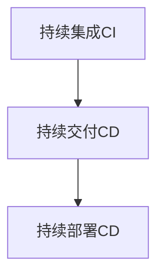

# AI系统持续集成原理与代码实战案例讲解

作者：禅与计算机程序设计艺术

## 1.背景介绍

### 1.1 持续集成的起源与发展

持续集成（Continuous Integration，CI）作为一种软件开发实践，最早由极限编程（Extreme Programming，XP）的创始人之一Kent Beck提出。它的核心思想是通过频繁地将代码集成到主干，来尽早发现集成错误，从而提高软件质量和开发效率。随着DevOps理念的普及，CI已经成为现代软件开发流程的标准实践之一。

### 1.2 AI系统开发的独特挑战

AI系统的开发不同于传统软件开发，涉及大量的数据处理、模型训练和验证。AI模型的迭代速度快，且需要频繁地调整超参数和训练数据，这使得AI系统的持续集成变得尤为重要。传统的CI工具和流程往往无法满足AI系统的需求，因此需要对CI流程进行定制和扩展。

### 1.3 持续集成在AI系统中的重要性

持续集成在AI系统中的应用，不仅可以提高模型的开发效率，还可以确保模型的质量和稳定性。通过自动化的CI流程，开发者可以快速迭代模型，及时发现和修复问题，从而加速整个开发周期。此外，持续集成还可以帮助团队更好地协作，确保每个成员的代码和模型都能顺利集成。

## 2.核心概念与联系

### 2.1 持续集成的基本概念

持续集成是一种软件开发实践，指的是开发者频繁地将代码集成到主干，并通过自动化的构建和测试来验证集成的正确性。其核心目标是尽早发现和解决集成问题，从而提高软件质量和开发效率。

### 2.2 持续集成与持续交付、持续部署的关系

持续集成、持续交付（Continuous Delivery，CD）和持续部署（Continuous Deployment）是现代软件开发中的三大核心实践。持续集成侧重于代码的频繁集成和自动化测试，持续交付则进一步将构建的代码部署到预生产环境中进行验证，而持续部署则是将代码自动部署到生产环境中。三者之间的关系如下图所示：



### 2.3 持续集成在AI系统中的应用场景

在AI系统中，持续集成的应用场景主要包括以下几个方面：

1. **数据处理**：自动化的数据预处理和特征工程。
2. **模型训练**：自动化的模型训练和超参数调优。
3. **模型评估**：自动化的模型评估和验证。
4. **模型部署**：自动化的模型部署和监控。

## 3.核心算法原理具体操作步骤

### 3.1 数据预处理

数据预处理是AI系统开发中的重要环节，主要包括数据清洗、数据转换和特征工程等步骤。通过自动化的数据预处理流程，可以确保数据的一致性和质量。

#### 3.1.1 数据清洗

数据清洗是指对原始数据进行处理，去除噪声和异常值，填补缺失值等。常见的数据清洗方法包括：

- 去除重复数据
- 填补缺失值
- 处理异常值

#### 3.1.2 数据转换

数据转换是指将原始数据转换为模型可以接受的格式。常见的数据转换方法包括：

- 标准化和归一化
- 类别编码
- 时间序列处理

#### 3.1.3 特征工程

特征工程是指从原始数据中提取有用的特征，以提高模型的性能。常见的特征工程方法包括：

- 特征选择
- 特征组合
- 特征提取

### 3.2 模型训练

模型训练是AI系统开发中的核心环节，主要包括模型选择、超参数调优和训练过程的监控等步骤。

#### 3.2.1 模型选择

模型选择是指根据任务需求选择合适的模型。常见的模型包括：

- 线性回归
- 决策树
- 神经网络

#### 3.2.2 超参数调优

超参数调优是指通过调整模型的超参数来提高模型的性能。常见的超参数调优方法包括：

- 网格搜索
- 随机搜索
- 贝叶斯优化

#### 3.2.3 训练过程监控

训练过程监控是指在模型训练过程中，实时监控训练的指标和状态，以便及时发现和解决问题。常见的监控方法包括：

- 训练损失和验证损失的曲线图
- 训练精度和验证精度的曲线图
- 模型参数的变化情况

### 3.3 模型评估

模型评估是指对训练好的模型进行性能评估，以确定其在实际应用中的表现。常见的模型评估方法包括：

- 交叉验证
- 混淆矩阵
- ROC曲线和AUC值

### 3.4 模型部署

模型部署是指将训练好的模型部署到生产环境中，以便进行实际应用。常见的模型部署方法包括：

- REST API服务
- 微服务架构
- 云服务平台

## 4.数学模型和公式详细讲解举例说明

### 4.1 数据预处理中的数学模型

在数据预处理过程中，常用的数学模型包括标准化和归一化。标准化是指将数据转换为均值为0，标准差为1的标准正态分布。其公式如下：

$$
X_{std} = \frac{X - \mu}{\sigma}
$$

其中，$X$表示原始数据，$\mu$表示均值，$\sigma$表示标准差。

归一化是指将数据缩放到指定的范围内，通常是[0, 1]。其公式如下：

$$
X_{norm} = \frac{X - X_{min}}{X_{max} - X_{min}}
$$

其中，$X$表示原始数据，$X_{min}$表示最小值，$X_{max}$表示最大值。

### 4.2 模型训练中的数学模型

在模型训练过程中，常用的数学模型包括线性回归和神经网络。线性回归的目标是找到一组参数，使得预测值与实际值之间的均方误差最小。其损失函数如下：

$$
J(\theta) = \frac{1}{2m} \sum_{i=1}^{m} (h_\theta(x^{(i)}) - y^{(i)})^2
$$

其中，$m$表示样本数量，$h_\theta(x^{(i)})$表示预测值，$y^{(i)}$表示实际值。

神经网络的目标是通过反向传播算法，调整网络的权重和偏置，使得损失函数最小。其损失函数如下：

$$
L = - \frac{1}{m} \sum_{i=1}^{m} \left[ y^{(i)} \log(h_\theta(x^{(i)})) + (1 - y^{(i)}) \log(1 - h_\theta(x^{(i)})) \right]
$$

其中，$m$表示样本数量，$h_\theta(x^{(i)})$表示预测值，$y^{(i)}$表示实际值。

### 4.3 模型评估中的数学模型

在模型评估过程中，常用的数学模型包括混淆矩阵和ROC曲线。混淆矩阵用于评估分类模型的性能，其定义如下：

$$
\begin{array}{|c|c|c|}
\hline
& \text{Predicted Positive} & \text{Predicted Negative} \\
\hline
\text{Actual Positive} & TP & FN \\
\hline
\text{Actual Negative} & FP & TN \\
\hline
\end{array}
$$

其中，$TP$表示真正例，$FN$表示假负例，$FP$表示假正例，$TN$表示真负例。

ROC曲线用于评估分类模型在不同阈值下的性能，其横轴表示假阳性率（FPR），纵轴表示真阳性率（TPR）。其定义如下：

$$
FPR = \frac{FP}{FP + TN}
$$

$$
TPR = \frac{TP}{TP + FN}
$$

## 5.项目实践：代码实例和详细解释说明

### 5.1 数据预处理代码实例

以下是一个简单的数据预处理代码实例，使用Python和Pandas库：

```python
import pandas as pd
from sklearn.preprocessing import StandardScaler, MinMaxScaler

# 读取数据
data