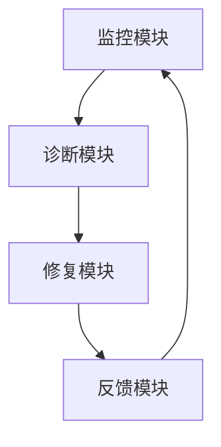

# AI系统故障自愈原理与代码实战案例讲解

作者：禅与计算机程序设计艺术

## 1. 背景介绍

### 1.1 什么是AI系统故障自愈

在现代复杂的AI系统中，故障的发生是不可避免的。故障自愈（Self-Healing）技术旨在通过自动检测、诊断和修复系统中的问题，确保系统能够持续稳定地运行。故障自愈技术的核心在于通过智能算法和自动化工具，减少人为干预，提高系统的可靠性和可用性。

### 1.2 故障自愈技术的重要性

随着AI系统在各行各业的广泛应用，其复杂性和依赖性也在不断增加。传统的手动故障排查和修复方法已经无法满足现代系统的需求。故障自愈技术的引入，使得系统能够在故障发生时自动采取措施进行修复，减少停机时间，提高系统的稳定性和用户体验。

### 1.3 现有技术和挑战

尽管故障自愈技术已经取得了显著进展，但在实际应用中仍面临诸多挑战。例如，如何准确检测故障、如何选择合适的修复策略、如何确保修复过程不影响系统的正常运行等。这些问题的解决需要结合机器学习、深度学习等先进技术，不断优化和改进现有方法。

## 2. 核心概念与联系

### 2.1 故障检测

故障检测是故障自愈的第一步。它涉及到对系统运行状态的监控，通过分析系统日志、性能指标等数据，识别出潜在的故障。常用的方法包括：

- **基于规则的方法**：通过预定义的规则和阈值，检测异常情况。
- **基于统计的方法**：通过统计分析方法，识别出异常数据点。
- **基于机器学习的方法**：利用机器学习模型，自动学习正常和异常状态的特征，进行故障检测。

### 2.2 故障诊断

故障诊断是在检测到故障后，确定故障的根本原因。故障诊断的方法通常包括：

- **因果分析**：通过分析故障的前因后果，确定故障的根本原因。
- **模式识别**：利用模式识别技术，从故障数据中提取特征，进行故障分类。
- **专家系统**：基于专家知识库，利用推理机制进行故障诊断。

### 2.3 故障修复

故障修复是故障自愈的最后一步。它涉及到对检测到的故障进行修复，恢复系统的正常运行。常见的故障修复方法包括：

- **重启服务**：通过重启故障服务，恢复系统的正常运行。
- **回滚操作**：将系统恢复到故障发生前的状态。
- **自动修复脚本**：利用预定义的修复脚本，自动执行修复操作。

### 2.4 故障自愈系统架构

故障自愈系统通常由以下几个模块组成：

- **监控模块**：负责收集和分析系统运行数据，进行故障检测。
- **诊断模块**：负责分析故障数据，确定故障原因。
- **修复模块**：负责执行修复操作，恢复系统正常运行。
- **反馈模块**：负责记录修复结果，优化故障自愈策略。



## 3. 核心算法原理具体操作步骤

### 3.1 故障检测算法

#### 3.1.1 基于规则的方法

基于规则的方法通过预定义的规则和阈值，检测系统中的异常情况。例如，可以定义CPU使用率超过80%为异常状态。

```python
def detect_fault(cpu_usage):
    if cpu_usage > 80:
        return True
    return False
```

#### 3.1.2 基于统计的方法

基于统计的方法通过统计分析方法，识别出异常数据点。例如，可以使用标准差方法检测异常数据。

```python
import numpy as np

def detect_fault(data):
    mean = np.mean(data)
    std_dev = np.std(data)
    for value in data:
        if abs(value - mean) > 2 * std_dev:
            return True
    return False
```

#### 3.1.3 基于机器学习的方法

基于机器学习的方法利用机器学习模型，自动学习正常和异常状态的特征，进行故障检测。例如，可以使用K-means聚类算法进行故障检测。

```python
from sklearn.cluster import KMeans

def detect_fault(data):
    kmeans = KMeans(n_clusters=2)
    kmeans.fit(data)
    labels = kmeans.labels_
    if 1 in labels:
        return True
    return False
```

### 3.2 故障诊断算法

#### 3.2.1 因果分析

因果分析通过分析故障的前因后果，确定故障的根本原因。例如，可以使用贝叶斯网络进行因果分析。

```python
import networkx as nx

def diagnose_fault(data):
    G = nx.DiGraph()
    G.add_edges_from(data)
    causes = list(nx.topological_sort(G))
    return causes
```

#### 3.2.2 模式识别

模式识别利用模式识别技术，从故障数据中提取特征，进行故障分类。例如，可以使用支持向量机进行模式识别。

```python
from sklearn.svm import SVC

def diagnose_fault(data, labels):
    svm = SVC()
    svm.fit(data, labels)
    return svm.predict(data)
```

#### 3.2.3 专家系统

专家系统基于专家知识库，利用推理机制进行故障诊断。例如，可以使用CLIPS进行专家系统的实现。

```clips
(defrule diagnose-fault
    (fault ?f)
    =>
    (assert (cause (find-cause ?f))))
```

### 3.3 故障修复算法

#### 3.3.1 重启服务

重启服务通过重启故障服务，恢复系统的正常运行。例如，可以使用Shell脚本实现服务重启。

```bash
#!/bin/bash
service myservice restart
```

#### 3.3.2 回滚操作

回滚操作将系统恢复到故障发生前的状态。例如，可以使用数据库的事务回滚功能实现。

```sql
ROLLBACK TO SAVEPOINT before_fault;
```

#### 3.3.3 自动修复脚本

自动修复脚本利用预定义的修复脚本，自动执行修复操作。例如，可以使用Python脚本实现自动修复。

```python
def repair_fault():
    # 修复操作
    pass
```

## 4. 数学模型和公式详细讲解举例说明

### 4.1 故障检测中的统计方法

在故障检测中，常用的统计方法包括均值和标准差。假设我们有一组数据 $X = \{x_1, x_2, ..., x_n\}$，其均值和标准差分别为：

$$
\mu = \frac{1}{n} \sum_{i=1}^n x_i
$$

$$
\sigma = \sqrt{\frac{1}{n} \sum_{i=1}^n (x_i - \mu)^2}
$$

在故障检测中，可以定义一个阈值，当数据点 $x_i$ 满足 $|x_i - \mu| > k\sigma$ 时，认为其为异常数据点，其中 $k$ 是一个常数。

### 4.2 故障诊断中的贝叶斯网络

贝叶斯网络是一种有向无环图（DAG），用于表示变量之间的因果关系。在贝叶斯网络中，每个节点表示一个变量，边表示变量之间的因果关系。贝叶斯网络的数学表示为：

$$
P(X_1, X_2, ..., X_n) = \prod_{i=1}^n P(X_i | \text{Parents}(X_i))
$$

其中，$P(X_i | \text{Parents}(X_i))$ 表示在给定父节点的条件下，节点 $X_i$ 的条件概率分布。

### 4.3 故障修复中的优化算法

在故障修复中，可以使用优化算法来选择最优的修复策略。例如，可以使用遗传算法来优化修复策略。遗传算法的基本步骤包括：

1. 初始化种群：随机生成一组初始解。
2. 选择操作：根据适应度函数选择适应度高的个体。
3. 交叉操作：对选择的个体进行交叉操作，生成新个体。
4. 变异操作：对新个体进行变异操作，生成新解。
5. 更新种群：用新解替换