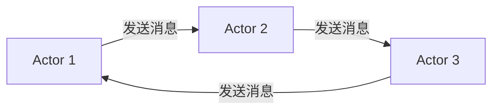
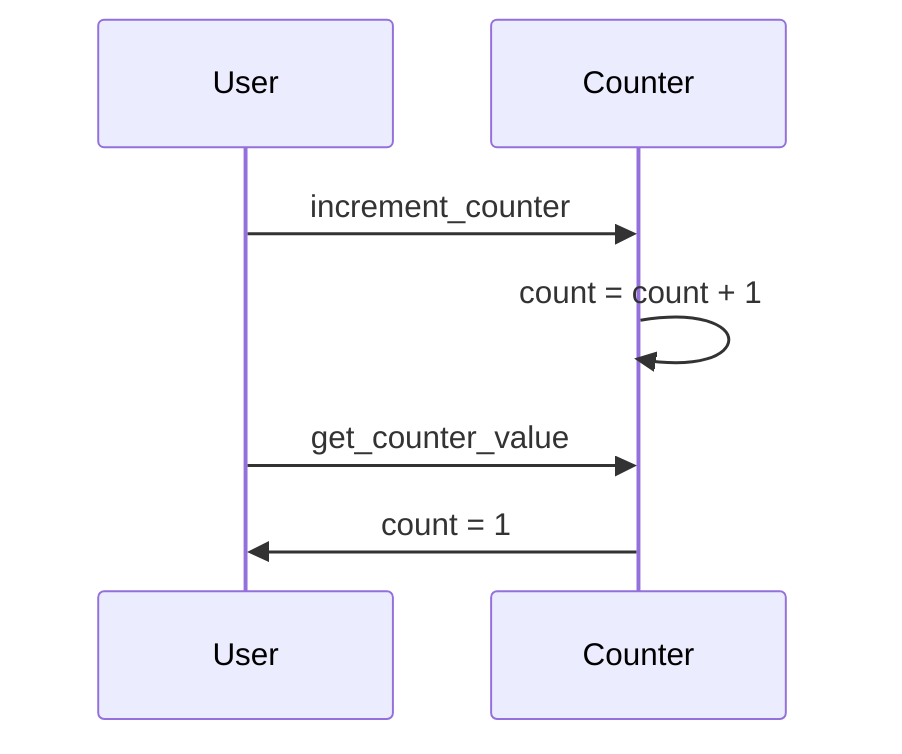

## 1. 背景介绍

### 1.1 并发编程的挑战

随着多核处理器和分布式系统的普及，并发编程已经成为软件开发中不可或缺的一部分。然而，传统的并发编程模型，例如线程和锁，存在着许多挑战：

* **共享状态的竞态条件:** 多个线程同时访问和修改共享数据可能导致数据不一致和难以调试的错误。
* **死锁:** 当多个线程相互等待对方释放资源时，就会发生死锁，导致程序无法继续执行。
* **代码复杂性:** 使用线程和锁进行并发编程需要程序员仔细地管理线程同步和互斥，这会增加代码的复杂性和出错的可能性。

### 1.2 Actor Model 的优势

Actor Model 是一种并发计算模型，它提供了一种更简单、更可靠的方法来构建并发和分布式系统。与线程和锁模型不同，Actor Model 避免了共享状态和锁，从而消除了竞态条件和死锁的风险。

Actor Model 的主要优势包括：

* **简化并发编程:** Actor Model 提供了一种更高级别的抽象，使程序员能够更轻松地编写并发代码，而无需处理底层的线程和锁。
* **提高代码可维护性:** Actor 之间通过消息传递进行通信，这使得代码更易于理解、测试和维护。
* **增强容错性:** Actor Model 内置了容错机制，可以在单个 Actor 出现故障时保持系统的稳定性。

### 1.3 Actor Model 的应用

Actor Model 已被广泛应用于各种领域，包括：

* **并发编程:** 构建高性能、可扩展的并发应用程序。
* **分布式系统:** 构建容错、可扩展的分布式系统。
* **实时系统:** 构建响应迅速、可靠的实时系统。

## 2. 核心概念与联系

### 2.1 Actor

Actor 是 Actor Model 中的基本单元，它是一个独立的计算实体，拥有自己的状态和行为。Actor 之间不共享任何内存，它们只能通过消息传递进行通信。

### 2.2 消息

消息是 Actor 之间通信的唯一方式。每个 Actor 都有一个邮箱，用于接收发送给它的消息。

### 2.3 行为

行为定义了 Actor 如何处理接收到的消息。当 Actor 收到一条消息时，它会根据消息类型执行相应的操作，例如更新其内部状态、发送消息给其他 Actor 或创建新的 Actor。

### 2.4 邮箱

邮箱是 Actor 接收消息的队列。每个 Actor 都有一个唯一的邮箱，用于存储发送给它的消息。

### 2.5 关系图



## 3. 核心算法原理具体操作步骤

Actor Model 的核心算法是消息传递机制。当一个 Actor 需要与另一个 Actor 通信时，它会向目标 Actor 发送一条消息。目标 Actor 收到消息后，会将其放入自己的邮箱中。Actor 会不断地从邮箱中取出消息并进行处理。

具体操作步骤如下：

1. **创建 Actor:** 首先，需要创建 Actor 实例。每个 Actor 都有一个唯一的标识符和一个邮箱。
2. **发送消息:** 当一个 Actor 需要与另一个 Actor 通信时，它会创建一个消息并将其发送到目标 Actor 的邮箱中。
3. **接收消息:** 目标 Actor 会不断地从邮箱中取出消息。
4. **处理消息:** 当 Actor 收到一条消息时，它会根据消息类型执行相应的操作。
5. **回复消息:** 如果需要，Actor 可以向消息发送者发送回复消息。

## 4. 数学模型和公式详细讲解举例说明

Actor Model 可以使用数学模型来描述。一个 Actor 系统可以表示为一个元组 $(A, M)$, 其中：

* $A$ 表示 Actor 的集合。
* $M$ 表示消息的集合。

每个 Actor $a \in A$ 都有一个状态 $s_a$ 和一个行为函数 $b_a$。行为函数定义了 Actor 如何根据当前状态和接收到的消息来更新其状态和发送消息。

当 Actor $a$ 收到消息 $m$ 时，它的状态会更新为 $s_a' = b_a(s_a, m)$，并发送消息 $M' = b_a(s_a, m)$。

**举例说明:**

假设有两个 Actor，`Counter` 和 `User`。`Counter` Actor 负责维护一个计数器的值，`User` Actor 可以向 `Counter` Actor 发送消息来增加或获取计数器的值。

**`Counter` Actor:**

* 状态: `count` (初始值为 0)
* 行为函数:
    * `increment`: `count = count + 1`
    * `get`: 发送消息 `count` 给消息发送者

**`User` Actor:**

* 状态: 无
* 行为函数:
    * `increment_counter`: 发送消息 `increment` 给 `Counter` Actor
    * `get_counter_value`: 发送消息 `get` 给 `Counter` Actor，并等待回复消息

**消息传递序列图:**



## 5. 项目实践：代码实例和详细解释说明

```python
from typing import Any
from dataclasses import dataclass
from collections import deque
from concurrent.futures import ThreadPoolExecutor

@dataclass
class Message:
    sender: 'Actor'
    message: Any

class Actor:
    def __init__(self, name: str):
        self.name = name
        self.mailbox = deque()

    def send(self, message: Any, to: 'Actor'):
        to.mailbox.append(Message(self, message))

    def receive(self) -> Message:
        return self.mailbox.popleft()

    def __repr__(self):
        return f"Actor(name='{self.name}')"

class Counter(Actor):
    def __init__(self, name: str):
        super().__init__(name)
        self.count = 0

    def handle_message(self, message: Message):
        if message.message == 'increment':
            self.count += 1
        elif message.message == 'get':
            message.sender.send(self.count, self)

class User(Actor):
    def __init__(self, name: str, counter: Counter):
        super().__init__(name)
        self.counter = counter

    def handle_message(self, message: Message):
        if isinstance(message.message, int):
            print(f"{self.name} received counter value: {message.message}")

def run_actor(actor: Actor):
    while True:
        if actor.mailbox:
            message = actor.receive()
            actor.handle_message(message)

# 创建 Actor 实例
counter = Counter('counter')
user1 = User('user1', counter)
user2 = User('user2', counter)

# 使用线程池运行 Actor
with ThreadPoolExecutor(max_workers=3) as executor:
    executor.submit(run_actor, counter)
    executor.submit(run_actor, user1)
    executor.submit(run_actor, user2)

    # 发送消息
    user1.send('increment', counter)
    user2.send('increment', counter)
    user1.send('get', counter)
    user2.send('get', counter)
```

**代码解释:**

* `Actor` 类是所有 Actor 的基类，它定义了 `send`、`receive` 和 `__repr__` 方法。
* `Counter` 类继承自 `Actor` 类，它实现了计数器的逻辑。
* `User` 类也继承自 `Actor` 类，它可以与 `Counter` Actor 交互。
* `run_actor` 函数用于运行 Actor，它会不断地从邮箱中取出消息并调用 Actor 的 `handle_message` 方法进行处理。
* 主程序创建了 `Counter`、`user1` 和 `user2` 三个 Actor 实例，并使用线程池运行它们。
* 然后，主程序发送消息来测试 Actor 之间的通信。

**输出结果:**

```
user1 received counter value: 2
user2 received counter value: 2
```

## 6. 实际应用场景

Actor Model 适用于各种并发和分布式应用场景，例如：

* **Web 服务器:** 处理并发请求，提高服务器吞吐量。
* **游戏开发:** 构建游戏 AI、处理玩家交互等。
* **金融交易系统:** 处理高频交易、风险管理等。
* **物联网:** 处理传感器数据、控制设备等。

## 7. 工具和资源推荐

* **Akka:** 基于 JVM 的 Actor Model 实现，提供丰富的功能和工具。
* **Erlang/OTP:** 函数式编程语言 Erlang 和其并发框架 OTP 对 Actor Model 有着原生支持。
* **Thespian:** Python 的 Actor Model 库，提供轻量级的实现。

## 8. 总结：未来发展趋势与挑战

Actor Model 是一种强大的并发编程模型，它可以简化并发编程、提高代码可维护性和增强容错性。随着多核处理器和分布式系统的普及，Actor Model 的应用将会越来越广泛。

未来发展趋势：

* **与云原生技术的融合:** Actor Model 可以与容器、微服务等云原生技术结合，构建更灵活、可扩展的分布式系统。
* **与机器学习的结合:** Actor Model 可以用于构建分布式机器学习系统，提高训练效率和模型性能。

挑战：

* **性能优化:** Actor Model 的性能取决于消息传递的效率，需要进行优化以提高性能。
* **调试和监控:** Actor Model 的并发模型使得调试和监控更加困难，需要开发专门的工具和技术。

## 9. 附录：常见问题与解答

### 9.1 Actor Model 和线程的区别是什么？

| 特性 | Actor Model | 线程 |
|---|---|---|
| 通信方式 | 消息传递 | 共享内存 |
| 状态管理 | Actor 内部状态私有 | 线程共享状态 |
| 并发控制 | Actor 框架负责 | 程序员手动管理 |
| 容错性 | Actor 框架提供 | 需要程序员自己实现 |

### 9.2 Actor Model 如何处理错误？

Actor Model 通过监督机制来处理错误。每个 Actor 都有一个监督者，当 Actor 出现错误时，监督者会收到通知并采取相应的措施，例如重启 Actor 或停止 Actor。

### 9.3 Actor Model 如何实现分布式系统？

Actor Model 可以通过网络通信来实现分布式系统。Actor 可以位于不同的机器上，它们可以通过网络发送消息进行通信。
