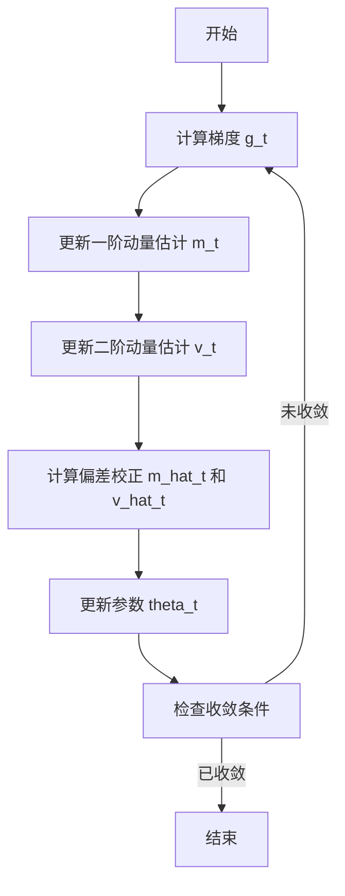

# Adam优化器在卷积神经网络中的应用

作者：禅与计算机程序设计艺术

## 1. 背景介绍

### 1.1 深度学习与优化器的关系

深度学习的成功离不开优化算法的进步。优化器在训练神经网络时起到了至关重要的作用，直接影响模型的收敛速度和最终的性能。传统的优化方法如梯度下降法在处理复杂模型和大规模数据时往往显得力不从心。因此，研究和开发更高效的优化算法成为了深度学习领域的一个重要方向。

### 1.2 Adam优化器的诞生

Adam（Adaptive Moment Estimation）优化器是由Diederik P. Kingma和Jimmy Ba提出的一种基于一阶梯度的随机优化方法。自2015年提出以来，Adam优化器由于其在处理大规模数据和高维参数空间时表现出的高效性和稳定性，迅速成为了深度学习领域的主流优化算法之一。

### 1.3 卷积神经网络（CNN）的重要性

卷积神经网络（CNN）是深度学习中的一种特殊结构，广泛应用于图像识别、目标检测、自然语言处理等领域。CNN通过卷积层、池化层和全连接层的组合，能够自动提取和学习数据中的特征。然而，训练CNN模型通常需要大量的计算资源和时间，这使得选择合适的优化器显得尤为重要。

## 2. 核心概念与联系

### 2.1 Adam优化器的核心概念

Adam优化器结合了动量（Momentum）和RMSProp两种优化算法的优点，通过对一阶动量（梯度的指数移动平均）和二阶动量（梯度平方的指数移动平均）的估计，动态调整每个参数的学习率。Adam优化器的更新规则如下：

$$
m_t = \beta_1 m_{t-1} + (1 - \beta_1) g_t
$$

$$
v_t = \beta_2 v_{t-1} + (1 - \beta_2) g_t^2
$$

$$
\hat{m}_t = \frac{m_t}{1 - \beta_1^t}
$$

$$
\hat{v}_t = \frac{v_t}{1 - \beta_2^t}
$$

$$
\theta_t = \theta_{t-1} - \frac{\alpha \hat{m}_t}{\sqrt{\hat{v}_t} + \epsilon}
$$

其中，$m_t$ 和 $v_t$ 分别是梯度的一阶和二阶动量估计，$\beta_1$ 和 $\beta_2$ 是动量衰减系数，$\alpha$ 是学习率，$\epsilon$ 是为了防止分母为零的一个小常数。

### 2.2 卷积神经网络的结构

卷积神经网络的基本结构包括卷积层、激活函数、池化层和全连接层。每一层的作用如下：

- **卷积层**：通过卷积运算提取图像的局部特征。
- **激活函数**：引入非线性特性，使得网络可以拟合复杂的函数。
- **池化层**：通过下采样操作减少特征图的尺寸，降低计算复杂度。
- **全连接层**：将提取的特征进行分类或回归任务。

### 2.3 Adam优化器与CNN的结合

Adam优化器在CNN中的应用非常广泛。其动态调整学习率的特性，使得在训练过程中能够更快地找到最优解，并且在处理高维参数空间时表现出色。Adam优化器在CNN中的应用主要体现在以下几个方面：

- **加快收敛速度**：通过动态调整学习率，Adam优化器能够加快CNN模型的收敛速度。
- **提高模型性能**：Adam优化器能够在较少的训练轮次内达到较好的模型性能。
- **稳定性**：Adam优化器在处理高维参数空间和大规模数据时表现出较好的稳定性。

## 3. 核心算法原理具体操作步骤

### 3.1 梯度计算

在每一次迭代中，首先需要计算损失函数相对于模型参数的梯度。对于卷积神经网络，这一步通常通过反向传播算法（Backpropagation）来完成。

### 3.2 动量估计

Adam优化器使用一阶动量和二阶动量来估计梯度的期望值和方差。具体计算如下：

$$
m_t = \beta_1 m_{t-1} + (1 - \beta_1) g_t
$$

$$
v_t = \beta_2 v_{t-1} + (1 - \beta_2) g_t^2
$$

### 3.3 偏差校正

由于动量估计在初始阶段存在偏差，Adam优化器引入了偏差校正项：

$$
\hat{m}_t = \frac{m_t}{1 - \beta_1^t}
$$

$$
\hat{v}_t = \frac{v_t}{1 - \beta_2^t}
$$

### 3.4 参数更新

最后，使用校正后的动量估计值来更新模型参数：

$$
\theta_t = \theta_{t-1} - \frac{\alpha \hat{m}_t}{\sqrt{\hat{v}_t} + \epsilon}
$$

### 3.5 算法流程图

以下是Adam优化器的算法流程图：



## 4. 数学模型和公式详细讲解举例说明

### 4.1 梯度计算示例

假设我们有一个简单的卷积神经网络，用于对MNIST数据集进行分类。损失函数为交叉熵损失，模型参数为 $\theta$。在第 $t$ 次迭代中，计算梯度 $g_t$ 如下：

$$
g_t = \nabla_\theta L(\theta_t)
$$

其中，$L(\theta_t)$ 是损失函数。

### 4.2 动量估计示例

假设 $\beta_1 = 0.9$ 和 $\beta_2 = 0.999$，初始动量 $m_0 = 0$ 和 $v_0 = 0$。在第 $t$ 次迭代中，更新动量估计：

$$
m_t = 0.9 m_{t-1} + 0.1 g_t
$$

$$
v_t = 0.999 v_{t-1} + 0.001 g_t^2
$$

### 4.3 偏差校正示例

在第 $t$ 次迭代中，计算校正后的动量估计：

$$
\hat{m}_t = \frac{m_t}{1 - 0.9^t}
$$

$$
\hat{v}_t = \frac{v_t}{1 - 0.999^t}
$$

### 4.4 参数更新示例

假设学习率 $\alpha = 0.001$，在第 $t$ 次迭代中，更新模型参数：

$$
\theta_t = \theta_{t-1} - \frac{0.001 \hat{m}_t}{\sqrt{\hat{v}_t} + \epsilon}
$$

## 5. 项目实践：代码实例和详细解释说明

### 5.1 数据准备

首先，我们需要准备训练数据。以下是使用PyTorch框架加载MNIST数据集的代码：

```python
import torch
import torchvision
import torchvision.transforms as transforms

transform = transforms.Compose([
    transforms.ToTensor(),
    transforms.Normalize((0.5,), (0.5,))
])

trainset = torchvision.datasets.MNIST(root='./data', train=True, download=True, transform=transform)
trainloader = torch.utils.data.DataLoader(trainset, batch_size=32, shuffle=True)

testset = torchvision.datasets.MNIST(root='./data', train=False, download=True, transform=transform)
testloader = torch.utils.data.DataLoader(testset, batch_size=32, shuffle=False)
```

### 5.2 模型定义

定义一个简单的卷积神经网络模型：

```python
import torch.nn as nn
import torch.nn.functional as F

class Net(nn.Module):
    def __init__(self):
        super(Net, self).__init__()
        self.conv1 = nn.Conv2d(1,