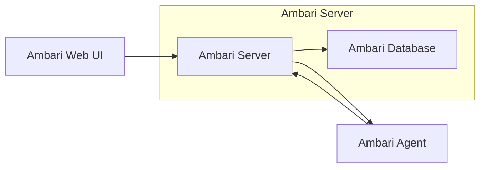

# Ambari原理与代码实例讲解

作者：禅与计算机程序设计艺术

## 1. 背景介绍

### 1.1 大数据时代的运维挑战

随着大数据技术的快速发展，企业内部部署的 Hadoop 集群规模越来越大，节点数量动辄成百上千，这给集群的部署、管理和监控带来了巨大的挑战。传统的运维方式已经无法满足大规模集群的需求，迫切需要一种自动化、智能化的运维平台来简化集群管理工作。

### 1.2 Ambari：Hadoop 集群的福音

Apache Ambari 正是为了解决上述问题而诞生的。它是一个基于 Web 的开源 Hadoop 集群管理平台，提供了一套直观、易用的界面，用于配置、管理和监控 Hadoop 集群。

### 1.3 Ambari 的优势

相比于传统的运维方式，Ambari 具有以下优势：

* **自动化部署:** Ambari 提供了图形化的向导式界面，可以自动化完成 Hadoop 集群的部署，无需手动配置复杂的配置文件。
* **集中式管理:** Ambari 可以集中管理整个 Hadoop 集群的生命周期，包括服务的启动、停止、配置修改等操作。
* **实时监控:** Ambari 提供了丰富的监控指标和告警机制，可以实时监控集群的运行状态，及时发现和处理问题。
* **可扩展性:** Ambari 支持插件化扩展，可以方便地集成第三方服务和工具。

## 2. 核心概念与联系

### 2.1 架构概览

Ambari 采用典型的 Master/Slave 架构，主要包括以下组件：

* **Ambari Server:** 负责接收用户请求，管理集群配置信息，并将任务下发给 Agent 执行。
* **Ambari Agent:** 部署在每个集群节点上，负责执行 Ambari Server 下发的任务，并收集节点的运行状态信息。
* **Ambari Web UI:** 基于 Web 的用户界面，用于与 Ambari Server 交互，进行集群管理和监控操作。
* **Ambari Database:** 存储 Ambari 的元数据信息，例如集群配置、服务信息、主机信息等。



### 2.2 核心概念

* **Cluster:** 代表一个 Hadoop 集群，包含多个节点。
* **Service:** 代表一个 Hadoop 服务，例如 HDFS、YARN、MapReduce 等。
* **Component:** 代表一个服务的组成部分，例如 NameNode、DataNode、ResourceManager、NodeManager 等。
* **Host:** 代表集群中的一个节点。
* **Configuration:** 代表服务的配置参数。

### 2.3 组件之间的联系

* Ambari Server 维护着整个集群的配置信息，并通过 Ambari Agent 将配置信息分发到各个节点。
* Ambari Agent 负责启动、停止、监控各个节点上的服务组件。
* Ambari Web UI 提供了用户界面，用于管理集群、服务、主机和配置信息。

## 3. 核心算法原理具体操作步骤

### 3.1 集群部署

1. **准备工作:** 安装 Ambari Server 和 Agent，配置数据库连接信息。
2. **创建集群:** 通过 Ambari Web UI 创建集群，指定集群名称、节点信息等。
3. **选择服务:** 选择需要安装的服务，例如 HDFS、YARN、MapReduce 等。
4. **配置服务:** 配置服务的参数，例如 HDFS 的块大小、YARN 的内存分配等。
5. **启动集群:** 启动集群，Ambari 会自动将配置信息分发到各个节点，并启动相应的服务组件。

### 3.2 服务管理

* **启动/停止服务:** 通过 Ambari Web UI 可以方便地启动、停止整个服务或单个服务组件。
* **添加/删除服务:** 可以动态地添加或删除服务，Ambari 会自动更新集群配置信息。
* **配置修改:** 可以修改服务的配置参数，Ambari 会将修改后的配置信息分发到各个节点。

### 3.3 集群监控

* **指标监控:** Ambari 提供了丰富的监控指标，可以实时监控集群的运行状态，例如 CPU 使用率、内存使用率、网络流量等。
* **告警机制:** 可以设置告警规则，当监控指标超过阈值时，Ambari 会发送告警通知。
* **日志分析:** 可以查看各个服务组件的日志信息，方便定位和解决问题。

## 4. 数学模型和公式详细讲解举例说明

Ambari 本身不涉及复杂的数学模型和算法，但它管理的 Hadoop 生态系统中包含许多复杂的算法，例如：

* **PageRank 算法:** 用于计算网页的重要性，应用于搜索引擎。
* **K-Means 算法:** 用于数据聚类，应用于推荐系统、图像识别等领域。
* **协同过滤算法:** 用于推荐系统，根据用户的历史行为预测用户的喜好。

### 4.1 PageRank 算法

PageRank 算法的核心思想是：一个网页的重要性由链接到它的其他网页的重要性决定。算法通过迭代计算每个网页的 PageRank 值，直到收敛。

PageRank 的计算公式如下：

$$PR(A) = (1-d) + d \sum_{i=1}^{n} \frac{PR(T_i)}{C(T_i)}$$

其中：

* $PR(A)$ 表示网页 A 的 PageRank 值。
* $d$ 是阻尼系数，通常设置为 0.85。
* $T_i$ 表示链接到网页 A 的网页。
* $C(T_i)$ 表示网页 $T_i$ 链接到的网页数量。

### 4.2 K-Means 算法

K-Means 算法是一种常用的聚类算法，它将数据集划分成 K 个簇，使得每个簇内的样本尽可能相似，而不同簇之间的样本尽可能不同。

K-Means 算法的步骤如下：

1. 随机选择 K 个样本作为初始聚类中心。
2. 计算每个样本到各个聚类中心的距离，将样本分配到距离最近的聚类中心所在的簇。
3. 重新计算每个簇的聚类中心。
4. 重复步骤 2 和 3，直到聚类中心不再发生变化。

## 5. 项目实践：代码实例和详细解释说明

### 5.1 安装 Ambari

```bash
# 下载 Ambari 安装包
wget http://apache.mirrors.tds.net/ambari/ambari-2.7.5/ambari-2.7.5-centos7.tar.gz

# 解压安装包
tar -zxvf ambari-2.7.5-centos7.tar.gz

# 进入 Ambari 安装目录
cd ambari-2.7.5

# 安装 Ambari Server 和 Agent
./ambari-server setup
./ambari-agent setup
```

### 5.2 创建集群

```bash
# 通过 Ambari Web UI 创建集群，指定集群名称、节点信息等。
# 选择需要安装的服务，例如 HDFS、YARN、MapReduce 等。
# 配置服务的参数，例如 HDFS 的块大小、YARN 的内存分配等。
# 启动集群。
```

### 5.3 使用 Ambari REST API

```python
import requests

# 设置 Ambari Server 地址和认证信息
ambari_url = "http://<ambari_server_hostname>:8080"
ambari_user = "admin"
ambari_password = "admin"

# 获取集群列表
response = requests.get(
    f"{ambari_url}/api/v1/clusters", auth=(ambari_user, ambari_password)
)
clusters = response.json()["items"]

# 打印集群名称
for cluster in clusters:
    print(cluster["Clusters"]["cluster_name"])

# 获取 HDFS 服务的配置信息
response = requests.get(
    f"{ambari_url}/api/v1/clusters/cluster_name/configurations?type=hdfs-site&tag=version1",
    auth=(ambari_user, ambari_password),
)
hdfs_config = response.json()["items"][0]["properties"]

# 打印 HDFS 块大小
print(hdfs_config["dfs.blocksize"])
```

## 6. 实际应用场景

Ambari 广泛应用于各种大数据场景，例如：

* **数据仓库:** 使用 Ambari 管理 Hadoop 集群，构建企业级数据仓库，用于存储和分析海量数据。
* **实时计算:** 使用 Ambari 管理 Spark、Flink 等实时计算框架，构建实时数据处理平台。
* **机器学习:** 使用 Ambari 管理 TensorFlow、PyTorch 等机器学习框架，构建机器学习平台。

## 7. 工具和资源推荐

* **Apache Ambari 官网:** https://ambari.apache.org/
* **Ambari 官方文档:** https://cwiki.apache.org/confluence/display/AMBARI/Ambari
* **Hadoop 官网:** https://hadoop.apache.org/

## 8. 总结：未来发展趋势与挑战

随着云计算和人工智能技术的快速发展，Ambari 也面临着新的机遇和挑战：

### 8.1 未来发展趋势

* **云原生化:** 支持部署和管理云上的 Hadoop 集群，例如 AWS EMR、Azure HDInsight 等。
* **智能化:** 利用机器学习技术，实现集群的自动优化、故障预测和智能告警。
* **容器化:** 支持部署和管理容器化的 Hadoop 集群，例如使用 Docker 和 Kubernetes。

### 8.2 面临的挑战

* **安全性:** 保证 Ambari 自身以及 Hadoop 集群的安全性。
* **可扩展性:** 支持管理更大规模、更复杂的 Hadoop 集群。
* **易用性:** 进一步简化 Ambari 的使用，降低用户学习成本。

## 9. 附录：常见问题与解答

### 9.1 如何解决 Ambari Agent 失联问题？

* 检查 Agent 节点的网络连接是否正常。
* 检查 Agent 的日志文件，查看是否有错误信息。
* 重启 Agent 服务。
* 重新注册 Agent 到 Ambari Server。

### 9.2 如何修改 HDFS 的块大小？

* 通过 Ambari Web UI 修改 hdfs-site.xml 文件中的 dfs.blocksize 参数。
* 重启 HDFS 服务。

### 9.3 如何添加新的节点到集群？

* 通过 Ambari Web UI 添加新的节点信息。
* 在新的节点上安装 Ambari Agent。
* 将新的 Agent 注册到 Ambari Server。
* 通过 Ambari Web UI 将新的节点分配到相应的服务组件。