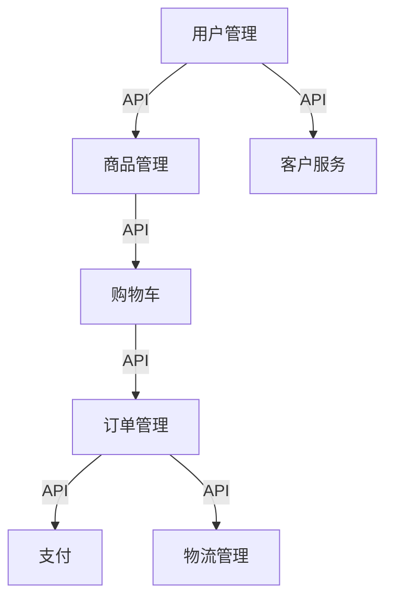

# B2C电子商务平台系统详细设计与具体代码实现

作者：禅与计算机程序设计艺术

## 1. 背景介绍

### 1.1 电子商务的兴起与发展

电子商务（E-commerce）作为现代商业模式的重要组成部分，已经深刻影响了全球经济。随着互联网技术的迅猛发展，电子商务平台从初期的简单买卖交易，逐步演变成了涵盖物流、支付、客户服务等多方面的复杂系统。B2C（Business to Consumer）电子商务平台作为其中的重要类型，直接面向消费者，提供便捷的购物体验和丰富的商品选择。

### 1.2 B2C电子商务平台的核心需求

B2C平台的核心需求主要包括以下几个方面：
- 用户友好的界面设计
- 高效的商品管理系统
- 安全的支付系统
- 稳定的订单处理系统
- 灵活的物流管理
- 完善的客户服务

### 1.3 本文目的与结构

本文旨在详细介绍一个B2C电子商务平台的系统设计与具体代码实现。文章将从系统的整体架构、核心概念、算法原理、数学模型、项目实践、实际应用、工具和资源推荐、未来发展趋势与挑战等多个方面进行深入探讨。

## 2. 核心概念与联系

### 2.1 系统架构

一个完整的B2C电子商务平台通常包括以下几个主要模块：
- 用户管理模块
- 商品管理模块
- 购物车模块
- 订单管理模块
- 支付模块
- 物流管理模块
- 客户服务模块

### 2.2 模块间的联系

各个模块之间通过API进行通信，形成一个有机的整体。以下是一个简化的系统架构图：



### 2.3 技术栈选择

为了实现上述系统架构，我们需要选择合适的技术栈。常见的技术栈包括：
- 前端：React.js, Vue.js, Angular
- 后端：Node.js, Spring Boot, Django
- 数据库：MySQL, MongoDB, PostgreSQL
- 缓存：Redis, Memcached
- 消息队列：RabbitMQ, Kafka

## 3. 核心算法原理具体操作步骤

### 3.1 用户管理模块

#### 3.1.1 用户注册与登录

用户注册与登录是用户管理模块的基本功能。其核心算法包括：
- 用户名和密码验证
- 密码加密存储
- 用户会话管理

具体操作步骤如下：
1. 用户提交注册信息（用户名、密码、邮箱等）。
2. 服务器验证信息的合法性。
3. 使用加密算法（如bcrypt）对密码进行加密存储。
4. 生成用户会话信息，存储在数据库中。

### 3.2 商品管理模块

#### 3.2.1 商品分类与搜索

商品分类与搜索是商品管理模块的核心功能。其算法包括：
- 商品分类树的构建
- 全文搜索与过滤

具体操作步骤如下：
1. 构建商品分类树，使用树形结构存储分类信息。
2. 通过关键词进行全文搜索，使用倒排索引提高搜索效率。
3. 根据用户选择的过滤条件（如价格区间、品牌等）进行商品筛选。

### 3.3 购物车模块

#### 3.3.1 购物车操作

购物车模块的核心功能包括商品添加、删除和修改。其算法包括：
- 购物车数据结构设计
- 购物车操作的事务管理

具体操作步骤如下：
1. 用户添加商品到购物车，更新购物车数据结构。
2. 购物车操作需要保证事务性，确保数据一致性。
3. 用户删除或修改购物车中的商品信息，实时更新购物车状态。

### 3.4 订单管理模块

#### 3.4.1 订单生成与处理

订单管理模块的核心功能包括订单生成、支付和物流信息管理。其算法包括：
- 订单生成算法
- 支付状态管理
- 物流信息跟踪

具体操作步骤如下：
1. 用户提交订单，系统生成唯一订单编号。
2. 系统验证订单信息的合法性（如库存检查）。
3. 用户进行支付，系统更新订单支付状态。
4. 订单进入物流环节，系统实时跟踪物流信息。

### 3.5 支付模块

#### 3.5.1 支付网关集成

支付模块的核心功能是与第三方支付网关集成。其算法包括：
- 支付请求的生成与发送
- 支付结果的回调处理

具体操作步骤如下：
1. 系统生成支付请求，包含订单信息和支付金额。
2. 将支付请求发送至第三方支付网关。
3. 接收支付结果的回调通知，更新订单支付状态。

### 3.6 物流管理模块

#### 3.6.1 物流信息跟踪

物流管理模块的核心功能是物流信息的跟踪与更新。其算法包括：
- 物流信息的获取与解析
- 物流状态的更新

具体操作步骤如下：
1. 系统通过API从物流服务提供商获取物流信息。
2. 解析物流信息，更新订单的物流状态。
3. 向用户推送物流状态更新通知。

### 3.7 客户服务模块

#### 3.7.1 在线客服系统

客户服务模块的核心功能是在线客服系统。其算法包括：
- 客服请求的分配
- 客服会话的管理

具体操作步骤如下：
1. 用户发起客服请求，系统根据请求类型分配给相应的客服人员。
2. 生成客服会话，记录会话内容。
3. 客服人员与用户进行实时沟通，解决用户问题。

## 4. 数学模型和公式详细讲解举例说明

### 4.1 商品推荐算法

#### 4.1.1 协同过滤算法

协同过滤算法是商品推荐系统的核心算法之一。其数学模型包括：
- 用户-商品矩阵
- 相似度计算

具体公式如下：

$$
\text{相似度} = \frac{\sum_{i=1}^{n} (r_{ui} - \bar{r_u})(r_{vi} - \bar{r_v})}{\sqrt{\sum_{i=1}^{n} (r_{ui} - \bar{r_u})^2} \sqrt{\sum_{i=1}^{n} (r_{vi} - \bar{r_v})^2}}
$$

其中，$r_{ui}$ 和 $r_{vi}$ 分别表示用户 $u$ 和用户 $v$ 对商品 $i$ 的评分，$\bar{r_u}$ 和 $\bar{r_v}$ 分别表示用户 $u$ 和用户 $v$ 的平均评分。

### 4.2 库存管理模型

#### 4.2.1 安全库存模型

安全库存模型用于确定库存的最小安全量，以避免缺货。其数学模型包括：
- 需求预测
- 安全库存计算

具体公式如下：

$$
\text{安全库存} = Z \times \sigma_d \times \sqrt{L}
$$

其中，$Z$ 是服务水平系数，$\sigma_d$ 是需求的标准差，$L$ 是提前期。

### 4.3 物流优化模型

#### 4.3.1 路径优化算法

路径优化算法用于确定最优的物流配送路径。其数学模型包括：
- 路径选择
- 成本优化

具体公式如下：

$$
\text{最优路径} = \arg \min \sum_{i=1}^{n} C_{ij} \cdot x_{ij}
$$

其中，$C_{ij}$ 表示从节点 $i$ 到节点 $j$ 的成本，$x_{ij}$ 表示路径选择变量。

## 5. 项目实践：代码实例和详细解释说明

### 5.1 用户管理模块

#### 5.1.1 注册与登录代码实现

以下是用户注册与登录功能的代码实现：

```python
# 用户注册
from flask import Flask, request, jsonify
from werkzeug.security import generate_password_hash, check_password_hash
from models import User

app = Flask(__name__)

@app.route('/register', methods=['POST'])
def register():
    data = request.get_json()
    username = data['username']
    password = data['password']
    hashed_password = generate_password_hash(password, method='sha256')
    new_user = User(username=username, password=hashed_password)
    db.session.add(new_user)
    db.session.commit()
    return jsonify({'message': 'User registered successfully'}), 201

# 用户登录
@app.route('/login', methods=['POST'])
def login():
    data = request.get_json