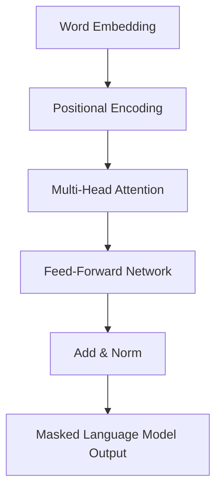

# BLOOM原理与代码实例讲解

## 1. 背景介绍

### 1.1 人工智能的发展历程

人工智能(Artificial Intelligence, AI)是一个旨在使机器能够模拟人类智能行为的研究领域。自20世纪50年代诞生以来,AI经历了几个重要的发展阶段:

- 早期阶段(1950s-1960s):专家系统、博弈理论等传统AI技术
- 知识驱动阶段(1970s-1980s):知识表示、机器学习、自然语言处理等
- 统计学习阶段(1990s-2000s):神经网络、支持向量机等
- 深度学习时代(2010s-至今):卷积神经网络、循环神经网络、生成对抗网络等

近年来,benefiting from大量数据、强大计算能力和新算法,深度学习取得了令人惊叹的进展,在计算机视觉、自然语言处理、语音识别等领域取得了突破性成就。

### 1.2 大型语言模型的兴起

作为深度学习的一个分支,大型语言模型(Large Language Model, LLM)凭借其强大的文本生成能力,成为当前AI发展的一个热点方向。LLM通过在海量文本数据上预训练获得了广博的知识,并能生成看似人性化的文本输出,展现出惊人的泛化能力。

代表性的LLM包括:

- GPT(Generative Pre-trained Transformer)系列:GPT、GPT-2、GPT-3
- BERT(Bidirectional Encoder Representations from Transformers)
- XLNet(Generalized Autoregressive Pretraining for Language Understanding)
- ALBERT(A Lite BERT for Self-supervised Learning of Language Representations)
- ...

这些模型通过自监督预训练学习文本的语义和上下文关系,具备出色的文本理解和生成能力,为自然语言处理领域带来了革命性进展。

### 1.3 BLOOM: 一款开源多语言LLM

在众多LLM中,BLOOM(Bigscience Large Open-science Open-access Multilingual Language Model)凭借其开源、多语言和高性能的特点而备受关注。BLOOM是一个176B参数的自回归语言模型,由BigScience组织训练,支持46种语言和13B多语种标记。它使用了类似于GPT-3的自回归语言建模,但采用了更高效的模型并行训练方法,在保持较高性能的同时降低了训练成本。

BLOOM的出现为研究人员和开发者提供了一个免费使用的大型语言模型,有助于推动AI在各领域的应用,也为语言模型的开源发展做出了贡献。本文将重点介绍BLOOM模型的核心原理、算法细节、代码实现以及应用场景,为读者提供全面的BLOOM模型解析。

## 2. 核心概念与联系

### 2.1 自然语言处理(NLP)基础

在深入探讨BLOOM之前,我们先回顾一下NLP的基础概念:

- **词嵌入(Word Embedding)**: 将单词映射到一个连续的向量空间,使语义相似的词对应相近的向量。常用的词嵌入方法有Word2Vec、GloVe等。
- **语言模型(Language Model)**: 根据上文给出一个单词序列,估计该序列概率的概率分布模型。是NLP的基础模型。
- **序列到序列模型(Seq2Seq)**: 将一个序列(如一段文本)映射到另一个序列(如一段译文)的模型,广泛应用于机器翻译、文本摘要等任务。
- **注意力机制(Attention Mechanism)**: 一种对输入序列中不同位置的信息赋予不同权重的机制,能够更好地捕获长距离依赖关系。
- **Transformer**: 一种全注意力架构的序列到序列模型,由编码器(Encoder)和解码器(Decoder)组成,在机器翻译、文本生成等任务中表现出色。

### 2.2 BLOOM的核心架构

BLOOM的核心架构继承自GPT-3,采用了Transformer解码器(Decoder-only Transformer)的结构。具体来说,它由以下几个关键部分组成:

- **词嵌入层(Word Embedding)**: 将输入文本的每个词token映射到一个连续的向量空间。
- **位置编码(Positional Encoding)**: 因为Transformer没有递归或卷积结构,无法直接获取序列的位置信息,因此需要添加位置编码将位置信息编码到序列中。
- **多头注意力模块(Multi-Head Attention)**: 对输入序列计算注意力权重,捕获长距离依赖关系。
- **前馈网络(Feed-Forward Network)**: 对注意力模块的输出进行进一步处理和非线性变换。
- **规范化层(Normalization Layer)**: 对每一层的输入输出进行归一化,以加速模型收敛。
- **掩码自回归语言模型(Masked Auto-regressive Language Model)**: 与GPT-3类似,BLOOM通过掩码自回归的方式在大规模文本语料上预训练获得语言理解能力。

BLOOM的编码器-解码器结构如下的流程图所示:

通过上述层层传递计算,BLOOM能够从大规模文本语料中学习到丰富的语义和上下文知识,并在下游任务中发挥强大的文本生成能力。

### 2.3 BLOOM与GPT-3的区别

虽然BLOOM的架构借鉴了GPT-3,但二者在以下几个方面有所不同:

1. **模型规模**: GPT-3是一个175B参数的大型模型,而BLOOM的参数量为176B,规模相当。
2. **训练数据**: GPT-3使用网络爬取的大量英文数据训练,而BLOOM使用46种语言的多语种语料,更加注重多语言能力。
3. **训练方式**: GPT-3采用传统的数据并行训练,而BLOOM使用更高效的模型并行方法,降低了训练成本。
4. **开源与私有**: GPT-3作为商业产品只提供API访问,而BLOOM则完全开源,任何人都可以免费使用和研究。

BLOOM较之GPT-3最大的优势在于开源和多语言支持,但在单一语言的表现上可能略逊于GPT-3。总的来说,BLOOM为学术界和工业界提供了一个免费使用的高质量语言模型选择。

## 3. 核心算法原理具体操作步骤

### 3.1 掩码自回归语言模型

BLOOM的核心训练目标是最大化掩码自回归语言模型的条件概率:

$$P(x_t|x_{<t}, \theta)$$

其中$x_t$表示当前时间步的词token, $x_{<t}$表示之前的词序列, $\theta$为模型参数。通过最大化该条件概率,模型可以学习到生成任意文本序列的能力。

具体地,训练过程包括以下步骤:

1. **数据预处理**: 将训练语料进行词tokenize,构建词表。
2. **掩码采样**: 随机选择部分词token,用特殊的[MASK]标记替换。
3. **前向计算**: 将带有[MASK]的序列输入BLOOM模型,计算[MASK]位置的条件概率分布。
4. **损失计算**: 将预测的概率分布与真实词的one-hot编码计算交叉熵损失。
5. **反向传播**: 计算损失对模型参数的梯度,使用优化器(如AdamW)更新参数。
6. **迭代训练**: 重复上述过程,使模型在海量语料上进行预训练。

通过上述自监督的方式,BLOOM能够在大规模语料上学习到丰富的语义和上下文知识,形成强大的文本生成能力。

### 3.2 模型并行训练

传统的数据并行方法将训练数据分片分发到多个GPU进行并行训练。但对于超大规模模型如BLOOM,单个GPU显存往往无法容纳整个模型。因此BLOOM采用了模型并行的训练方式:

1. **模型切分**: 将BLOOM模型按层切分成多个部分,分别放在不同的GPU上。
2. **前向传播**: 输入数据从第一块GPU开始,经过计算后将结果传递给下一块GPU,如此迭代直至最后一层。
3. **反向传播**: 从最后一层开始按相反顺序传播梯度,每个GPU计算并更新自己的那部分参数。
4. **通信与同步**: 不同GPU之间需要通过高速网络进行参数和梯度的通信与同步。

通过模型并行,BLOOM可以在多个GPU上高效地并行训练,突破了单GPU显存的限制。这使得训练如此大规模的语言模型成为可能,同时也降低了整体的训练成本。

### 3.3 高效注意力机制

注意力机制是Transformer模型的核心,但在超大规模模型中,标准的Self-Attention操作存在较高的计算复杂度(平方级别)。为此,BLOOM采用了两种高效注意力机制:

1. **Reformer注意力**:
    - 将注意力分成局部和全局两部分,局部部分只计算相邻词的注意力以降低复杂度。
    - 使用可逆的哈希注意力代替全局部分,将序列划分到多个哈希桶,只需计算每个桶内的注意力。
    - 在训练中使用反向注意力掩码,避免未来信息泄露。
2. **BigBird注意力**:
    - 将注意力划分为若干个稀疏注意力模式,包括滑动窗口局部注意力、全局注意力和随机注意力。
    - 通过有限的计算量就能捕获长距离依赖,同时保留局部相关性。

上述注意力机制在降低计算复杂度的同时,也最大限度地保留了Transformer注意力机制的优势,从而使BLOOM在保持高性能的同时降低了训练开销。

## 4. 数学模型和公式详细讲解举例说明

### 4.1 Transformer编码器-解码器架构

Transformer的编码器-解码器架构是序列到序列模型的核心,通过自注意力机制捕获输入和输出序列的长距离依赖关系。我们以机器翻译任务为例,介绍Transformer的数学原理:

1. **输入嵌入**:
   将源语言句子$X=\{x_1,x_2,...,x_n\}$映射为嵌入向量序列$\boldsymbol{X}=\{\boldsymbol{x}_1,\boldsymbol{x}_2,...,\boldsymbol{x}_n\}$。

2. **编码器**:
   编码器是由$N$个相同的层组成的,每一层包括两个子层:多头自注意力机制和前馈全连接网络。
   
   编码器的计算过程为:
   
   $$\boldsymbol{Z}^0=\boldsymbol{X}$$
   $$\boldsymbol{Z}^l=\text{EncoderLayer}(\boldsymbol{Z}^{l-1}),\quad l=1,...,N$$
   
   其中$\text{EncoderLayer}$的具体计算为:
   
   $$\begin{aligned}
   \boldsymbol{Z}_1^l&=\text{MultiHeadAttn}(\boldsymbol{Z}^{l-1},\boldsymbol{Z}^{l-1},\boldsymbol{Z}^{l-1})\\
   \boldsymbol{Z}_2^l&=\text{FeedForward}(\boldsymbol{Z}_1^l)\\
   \boldsymbol{Z}^l&=\text{LayerNorm}(\boldsymbol{Z}_2^l+\boldsymbol{Z}_1^l,\boldsymbol{Z}^{l-1})
   \end{aligned}$$
   
   其中$\text{MultiHeadAttn}$为多头注意力机制,$\text{FeedForward}$为前馈网络,$\text{LayerNorm}$为层归一化。

3. **解码器**:
   解码器的结构与编码器类似,不同之处在于它还包含一个对编码器输出的注意力子层,以捕获源语言和目标语言之间的依赖关系。
   
   解码器的计算过程为:
   
   $$\begin{aligned}
   \boldsymbol{Y}_1^l&=\text{MultiHeadAttn}(\boldsymbol{Y}^{l-1},\boldsymbol{Y}^{l-1},\boldsymbol{Y}^{l-1})\\
   \boldsymbol{Y}_2^l&=\text{MultiHeadAttn}(\boldsymbol{Y}_1^l,\boldsymbol{Z}^N,\boldsymbol{Z}^N)\\