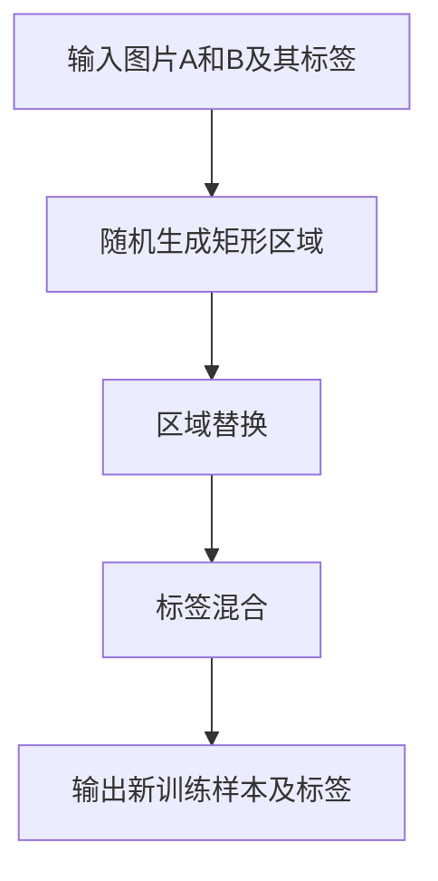

# Cutmix原理与代码实例讲解

作者：禅与计算机程序设计艺术

## 1. 背景介绍

### 1.1 深度学习与数据增强

在深度学习的发展过程中，数据增强技术逐渐成为提升模型性能的重要手段之一。数据增强通过对训练数据进行各种变换，增加数据的多样性，从而提升模型的泛化能力。常见的数据增强方法包括旋转、翻转、裁剪、缩放等。

### 1.2 Cutmix的提出

Cutmix是一种新颖的数据增强方法，由Yun等人在2019年提出。它通过将两张图片进行混合，并相应地混合标签，从而在保持数据多样性的同时，增强了模型的鲁棒性。Cutmix不仅在图像分类任务中表现出色，还在目标检测和语义分割等任务中展示了其潜力。

### 1.3 文章目的

本文旨在深入探讨Cutmix的原理与实现，详细讲解其核心算法和数学模型，并通过代码实例展示其在实际项目中的应用。希望读者通过本文能够对Cutmix有一个全面的了解，并能够在自己的项目中灵活应用这一技术。

## 2. 核心概念与联系

### 2.1 数据增强概述

数据增强（Data Augmentation）是指通过对原始数据进行各种变换，生成新的训练样本，从而增加数据集的多样性。常见的数据增强方法包括：

- **几何变换**：旋转、翻转、缩放、裁剪等。
- **颜色变换**：亮度、对比度、饱和度等。
- **合成变换**：Cutout、Mixup、Cutmix等。

### 2.2 Mixup与Cutmix的联系

Mixup是一种数据增强方法，通过将两张图片按一定比例进行线性混合，并相应地混合标签，从而生成新的训练样本。Cutmix在此基础上进一步发展，通过将一张图片的部分区域替换为另一张图片的对应区域，并混合标签，生成新的训练样本。两者的主要区别在于混合方式的不同。

### 2.3 Cutmix的基本思想

Cutmix的基本思想是将两张图片按照一定的规则进行区域替换，并相应地混合标签。具体步骤如下：

1. 随机选择两张图片 $A$ 和 $B$。
2. 在图片 $A$ 上随机选择一个矩形区域，并将该区域替换为图片 $B$ 中对应的区域。
3. 根据替换区域的大小，按比例混合两张图片的标签。

这种混合方式不仅增加了数据的多样性，还能够保留更多的原始图像信息，从而提升模型的鲁棒性。

## 3. 核心算法原理具体操作步骤

### 3.1 算法步骤概述

Cutmix算法的具体操作步骤如下：

1. **输入**：两张图片 $A$ 和 $B$ 及其对应的标签 $y_A$ 和 $y_B$。
2. **随机生成矩形区域**：在图片 $A$ 上随机选择一个矩形区域。
3. **区域替换**：将图片 $A$ 的选定区域替换为图片 $B$ 的对应区域。
4. **标签混合**：根据替换区域的大小，按比例混合两张图片的标签。
5. **输出**：生成新的训练样本及其标签。

### 3.2 详细步骤

#### 3.2.1 随机生成矩形区域

首先，在图片 $A$ 上随机选择一个矩形区域。假设图片的尺寸为 $(H, W)$，矩形区域的宽高分别为 $r_H$ 和 $r_W$，则区域的左上角坐标 $(x_1, y_1)$ 和右下角坐标 $(x_2, y_2)$ 可以通过以下公式计算：

$$
x_1 = \text{randint}(0, W - r_W)
$$

$$
y_1 = \text{randint}(0, H - r_H)
$$

$$
x_2 = x_1 + r_W
$$

$$
y_2 = y_1 + r_H
$$

其中，$r_H$ 和 $r_W$ 是根据预设的比例参数 $\lambda$ 随机生成的。

#### 3.2.2 区域替换

将图片 $A$ 的选定区域替换为图片 $B$ 的对应区域。假设图片 $A$ 和 $B$ 的像素值分别为 $I_A$ 和 $I_B$，则替换后的图片 $I_{AB}$ 可以表示为：

$$
I_{AB}(x, y) = 
\begin{cases} 
I_B(x, y) & \text{if } (x_1 \le x \le x_2) \text{ and } (y_1 \le y \le y_2) \\
I_A(x, y) & \text{otherwise}
\end{cases}
$$

#### 3.2.3 标签混合

根据替换区域的大小，按比例混合两张图片的标签。假设图片 $A$ 和 $B$ 的标签分别为 $y_A$ 和 $y_B$，则混合后的标签 $y_{AB}$ 可以表示为：

$$
y_{AB} = \lambda y_A + (1 - \lambda) y_B
$$

其中，$\lambda$ 是根据替换区域的面积与图片总面积的比例计算得到的。

### 3.3 Mermaid流程图

## 4. 数学模型和公式详细讲解举例说明

### 4.1 随机生成矩形区域的数学模型

假设图片的尺寸为 $(H, W)$，矩形区域的宽高分别为 $r_H$ 和 $r_W$，则区域的左上角坐标 $(x_1, y_1)$ 和右下角坐标 $(x_2, y_2)$ 可以通过以下公式计算：

$$
x_1 = \text{randint}(0, W - r_W)
$$

$$
y_1 = \text{randint}(0, H - r_H)
$$

$$
x_2 = x_1 + r_W
$$

$$
y_2 = y_1 + r_H
$$

其中，$r_H$ 和 $r_W$ 是根据预设的比例参数 $\lambda$ 随机生成的。

### 4.2 区域替换的数学模型

将图片 $A$ 的选定区域替换为图片 $B$ 的对应区域。假设图片 $A$ 和 $B$ 的像素值分别为 $I_A$ 和 $I_B$，则替换后的图片 $I_{AB}$ 可以表示为：

$$
I_{AB}(x, y) = 
\begin{cases} 
I_B(x, y) & \text{if } (x_1 \le x \le x_2) \text{ and } (y_1 \le y \le y_2) \\
I_A(x, y) & \text{otherwise}
\end{cases}
$$

### 4.3 标签混合的数学模型

根据替换区域的大小，按比例混合两张图片的标签。假设图片 $A$ 和 $B$ 的标签分别为 $y_A$ 和 $y_B$，则混合后的标签 $y_{AB}$ 可以表示为：

$$
y_{AB} = \lambda y_A + (1 - \lambda) y_B
$$

其中，$\lambda$ 是根据替换区域的面积与图片总面积的比例计算得到的：

$$
\lambda = \frac{r_H \times r_W}{H \times W}
$$

### 4.4 举例说明

假设有两张图片 $A$ 和 $B$，尺寸均为 $256 \times 256$。在图片 $A$ 上随机选择一个矩形区域，宽高分别为 $128 \times 128$，则区域的左上角坐标 $(x_1, y_1)$ 和右下角坐标 $(x_2, y_2)$ 可以通过以下公式计算：

$$
x_1 = \text{randint}(0, 128)
$$

$$
y_1 = \text{randint}(0, 128)
$$

假设随机生成的坐标为 $(64, 64)$，则右下角坐标为 $(192, 192)$。将图片 $A$ 的该区域替换为图片 $B$ 的对应区域，并混合标签。假设图片 $A$ 和 $B$ 的标签分别为 $0.7$ 和 $0.3$，则混