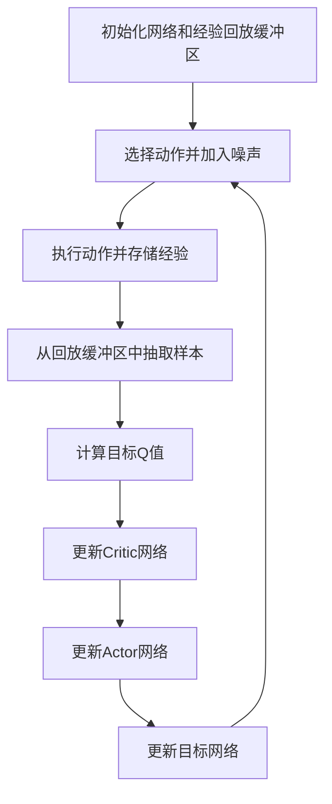

# DDPG代码实例：解决连续控制问题

作者：禅与计算机程序设计艺术

## 1. 背景介绍

### 1.1 强化学习的兴起
近年来，强化学习（Reinforcement Learning, RL）作为人工智能的一个重要分支，受到了广泛的关注。其在游戏、机器人控制、自动驾驶等领域的成功应用，使得研究者和工程师们对其充满了兴趣。特别是在处理连续控制问题时，传统的离散动作空间的RL算法显得力不从心，而深度确定性策略梯度（Deep Deterministic Policy Gradient, DDPG）算法则展现出了强大的能力。

### 1.2 连续控制问题的挑战
连续控制问题的挑战在于动作空间是连续的，这意味着每一个动作都可以取无穷多个值。这种情况下，传统的Q-learning等离散动作空间的算法无法直接应用。DDPG作为一种Actor-Critic方法，通过结合策略梯度和Q-learning的优点，成功地解决了这一问题。

### 1.3 DDPG算法的优势
DDPG算法的优势在于其能够处理高维连续动作空间，同时具有较高的样本效率和稳定性。它通过引入经验回放和目标网络，极大地提升了算法的性能和稳定性。本篇文章将深入探讨DDPG算法的核心概念、算法原理、数学模型，并通过代码实例详细解释其实现过程，帮助读者更好地理解和应用这一强大的算法。

## 2. 核心概念与联系

### 2.1 强化学习基础

#### 2.1.1 强化学习的基本框架
强化学习的基本框架包括智能体（Agent）、环境（Environment）、状态（State）、动作（Action）和奖励（Reward）。智能体通过与环境交互，根据当前状态选择动作，并从环境中获得奖励和新的状态，目标是通过最大化累积奖励来学习最优策略。

#### 2.1.2 策略（Policy）
策略是智能体在每一个状态下选择动作的规则，可以是确定性的（Deterministic）或随机的（Stochastic）。在DDPG算法中，策略是确定性的，即在每一个状态下选择一个确定的动作。

### 2.2 DDPG的基本概念

#### 2.2.1 Actor-Critic方法
DDPG是一种Actor-Critic方法，其中Actor负责选择动作，Critic负责评估动作的价值。Actor网络输出一个确定性的动作，Critic网络则输出该动作在当前状态下的Q值。

#### 2.2.2 经验回放（Experience Replay）
经验回放用于存储智能体与环境交互的经验，以便在训练时随机抽取样本进行训练，从而打破数据的相关性，提升训练的稳定性和样本效率。

#### 2.2.3 目标网络（Target Network）
目标网络用于生成稳定的目标值，其参数由主网络的参数软更新而来，避免了训练过程中目标值的剧烈波动。

### 2.3 DDPG与其他算法的联系

#### 2.3.1 DDPG与DQN
DDPG可以看作是DQN（Deep Q-Network）在连续动作空间上的扩展。DQN通过深度神经网络来近似Q值函数，而DDPG则通过Actor-Critic结构来处理连续动作空间。

#### 2.3.2 DDPG与策略梯度算法
DDPG结合了策略梯度算法的优点，通过策略梯度直接优化策略，同时利用Critic网络来减少策略梯度的方差，提升了算法的稳定性和效率。

## 3. 核心算法原理具体操作步骤

### 3.1 初始化

#### 3.1.1 初始化网络
初始化Actor网络和Critic网络，以及对应的目标网络。目标网络的参数与主网络相同。

#### 3.1.2 初始化经验回放缓冲区
初始化一个经验回放缓冲区，用于存储智能体与环境交互的经验。

### 3.2 交互与存储

#### 3.2.1 选择动作
根据当前状态，通过Actor网络选择一个动作，并加入噪声以进行探索。

#### 3.2.2 执行动作并存储经验
执行选择的动作，从环境中获得新的状态和奖励，并将经验存储到回放缓冲区中。

### 3.3 训练网络

#### 3.3.1 抽取样本
从经验回放缓冲区中随机抽取一个批次的样本。

#### 3.3.2 计算目标Q值
通过目标Critic网络计算目标Q值。

#### 3.3.3 更新Critic网络
利用均方误差损失函数，最小化实际Q值与目标Q值之间的误差，更新Critic网络。

#### 3.3.4 更新Actor网络
通过策略梯度，最大化Critic网络输出的Q值，更新Actor网络。

#### 3.3.5 更新目标网络
通过软更新，将主网络的参数更新到目标网络中。

### 3.4 算法流程图
以下是DDPG算法的流程图，用于更直观地理解其操作步骤：



## 4. 数学模型和公式详细讲解举例说明

### 4.1 策略梯度

#### 4.1.1 策略梯度定理
策略梯度定理用于计算策略的梯度，以最大化累积奖励。其公式为：

$$
\nabla_{\theta^{\mu}} J = \mathbb{E}_{s \sim \rho^{\pi}} \left[ \nabla_{\theta^{\mu}} \mu(s|\theta^{\mu}) \nabla_a Q(s,a|\theta^Q) |_{a=\mu(s|\theta^{\mu})} \right]
$$

其中，$\mu(s|\theta^{\mu})$是策略网络，$Q(s,a|\theta^Q)$是Critic网络。

### 4.2 Q值函数

#### 4.2.1 Bellman方程
Bellman方程用于递归地定义Q值函数，其公式为：

$$
Q(s_t, a_t) = r_t + \gamma \mathbb{E}_{s_{t+1} \sim P} \left[ Q(s_{t+1}, \mu(s_{t+1})) \right]
$$

其中，$r_t$是即时奖励，$\gamma$是折扣因子，$P$是状态转移概率。

### 4.3 损失函数

#### 4.3.1 Critic网络的损失函数
Critic网络的损失函数为实际Q值与目标Q值之间的均方误差，其公式为：

$$
L = \mathbb{E} \left[ (Q(s_t, a_t|\theta^Q) - y_t)^2 \right]
$$

其中，$y_t = r_t + \gamma Q'(s_{t+1}, \mu'(s_{t+1}|\theta^{\mu'}))$，$Q'$和$\mu'$分别是目标Critic网络和目标Actor网络。

### 4.4 软更新

#### 4.4.1 软更新公式
软更新用于将主网络的参数更新到目标网络中，其公式为：

$$
\theta' \leftarrow \tau \theta + (1 - \tau) \theta'
$$

其中，$\tau$是软更新系数，通常取值较小，如0.001。

## 5. 项目实践：代码实例和详细解释说明

### 5.1 环境准备

#### 5.1.1 安装依赖
在开始代码实现之前，需要安装必要的依赖包。可以使用以下命令安装：

```bash
pip install gym
pip install tensorflow
pip install numpy
```

### 5.2 Actor和Critic网络的实现

#### 5.2.1 Actor网络
以下是一个简单的Actor网络实现：

```python
import tensorflow as tf
from tensorflow.keras import layers

def create_actor(state_shape, action_shape):
    state_input = layers.Input(shape=state_shape)
    h1 = layers.Dense(400, activation='relu')(state_input)
    h2 = layers.Dense(300, activation='relu')(h1)
    output = layers.Dense(action_shape, activation='tanh')(h2)
    
    model = tf.keras.Model(inputs=state_input, outputs=output)
    return model
```

#### 5.2.2 Critic网络
以下是一个简单的Critic网络实现：

```python
def create_critic(state_shape, action_shape):
    state_input =