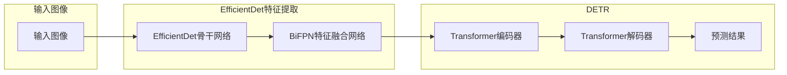
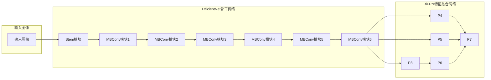
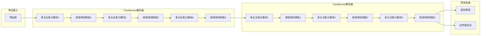

# DETR 的改进版：DETR-EfficientDet

## 1. 背景介绍

### 1.1. 目标检测的挑战

目标检测是计算机视觉领域的一项基础性任务，其目的是识别图像或视频中所有感兴趣的目标，并确定它们的位置和类别。近年来，随着深度学习技术的快速发展，目标检测技术取得了显著的进步，涌现出一系列优秀的算法，如Faster R-CNN、YOLO、SSD等。然而，这些算法仍然面临着一些挑战：

* **特征提取的效率和精度之间的平衡**:  传统目标检测算法通常采用多阶段的特征金字塔网络来提取多尺度特征，虽然能够提高检测精度，但也增加了计算复杂度，降低了检测速度。
* **目标定位的准确性**:  许多目标检测算法在处理小目标、遮挡目标和密集目标时，定位精度仍然有待提高。
* **模型的复杂度和可解释性**:  一些目标检测模型结构复杂，参数量巨大，训练和推理成本高，同时可解释性较差。

### 1.2. DETR的突破与局限性

2020年，Facebook AI Research团队提出了DETR（Detection Transformer），将Transformer架构应用于目标检测领域，取得了令人瞩目的成果。与传统目标检测算法相比，DETR具有以下优势：

* **端到端的目标检测**:  DETR采用基于集合预测的方式，无需生成候选框，简化了目标检测流程。
* **全局建模能力**:  Transformer的自注意力机制能够捕捉图像中的全局上下文信息，有利于提高目标检测的精度。
* **简单的后处理**:  DETR的后处理过程非常简单，只需进行非极大值抑制即可得到最终的检测结果。

然而，DETR也存在一些局限性：

* **训练收敛速度慢**:  由于Transformer需要学习全局注意力，DETR的训练收敛速度比传统目标检测算法慢。
* **对小目标检测效果不佳**:  Transformer的感受野受限，对小目标的检测效果不如传统目标检测算法。
* **计算复杂度高**:  Transformer的计算复杂度较高，限制了DETR在实时目标检测场景中的应用。

### 1.3. EfficientDet的优势

EfficientDet是谷歌团队提出的一种高效的目标检测算法，其核心思想是设计一种高效的特征金字塔网络，并在不同尺度的特征图上进行目标检测。EfficientDet具有以下优势：

* **高效的特征金字塔网络**:  EfficientDet采用了一种新的特征金字塔网络结构，能够在保证检测精度的同时，显著降低计算复杂度。
* **可扩展性强**:  EfficientDet可以根据不同的计算资源预算，灵活地调整模型的深度、宽度和分辨率，以满足不同的应用需求。

### 1.4. DETR-EfficientDet的提出

为了结合DETR和EfficientDet的优势，本文提出了一种新的目标检测算法：DETR-EfficientDet。该算法将EfficientDet的特征金字塔网络引入到DETR中，以提高DETR的检测精度和效率，并增强其对小目标的检测能力。

## 2. 核心概念与联系

### 2.1. DETR

DETR的核心思想是将目标检测任务视为一个集合预测问题。DETR模型主要由以下三个部分组成：

* **特征提取器**:  用于提取输入图像的多尺度特征。
* **Transformer编码器**:  用于对提取的特征进行全局建模。
* **Transformer解码器**:  用于预测目标的类别和边界框。

DETR的输入是一张图像，输出是一个固定长度的预测集合，每个预测包含一个类别标签和一个边界框。DETR使用匈牙利算法将预测集合与 ground truth 进行匹配，并计算损失函数。

### 2.2. EfficientDet

EfficientDet的核心思想是设计一种高效的特征金字塔网络，并在不同尺度的特征图上进行目标检测。EfficientDet的特征金字塔网络主要由以下三个部分组成：

* **骨干网络**:  用于提取输入图像的多尺度特征。
* **特征融合网络**:  用于融合不同尺度的特征。
* **类别预测网络和边界框回归网络**:  用于在不同尺度的特征图上进行目标检测。

EfficientDet采用了一种新的特征融合方法，称为加权双向特征金字塔网络（BiFPN），能够更加有效地融合不同尺度的特征。

### 2.3. DETR-EfficientDet

DETR-EfficientDet将EfficientDet的特征金字塔网络引入到DETR中，以提高DETR的检测精度和效率，并增强其对小目标的检测能力。DETR-EfficientDet的模型结构如下图所示：

DETR-EfficientDet的主要改进包括：

* **使用EfficientDet作为特征提取器**:  将DETR中的ResNet特征提取器替换为EfficientDet的特征金字塔网络，能够提取更加丰富、多尺度的特征，提高目标检测的精度，特别是对小目标的检测精度。
* **在BiFPN的不同尺度特征图上进行目标检测**:  在BiFPN的不同尺度特征图上分别进行目标检测，能够更好地处理不同尺度的目标。
* **使用GIOU Loss作为边界框回归损失函数**:  将DETR中的L1 Loss替换为GIOU Loss，能够更好地度量预测边界框与真实边界框之间的重叠程度，提高边界框回归的精度。

## 3. 核心算法原理具体操作步骤

### 3.1. EfficientDet特征提取

DETR-EfficientDet使用EfficientDet作为特征提取器，EfficientDet的特征金字塔网络结构如下图所示：

EfficientDet的骨干网络采用EfficientNet，EfficientNet是一种高效的卷积神经网络，其核心思想是通过复合缩放的方式，同时调整网络的深度、宽度和分辨率，以达到更高的精度和效率。

BiFPN是一种加权双向特征金字塔网络，它能够更加有效地融合不同尺度的特征。BiFPN的主要特点包括：

* **双向跨尺度连接**:  BiFPN不仅将高层特征传递到低层，还将低层特征传递到高层，使得不同尺度的特征能够更加充分地融合。
* **加权特征融合**:  BiFPN为不同的特征赋予不同的权重，使得更加重要的特征在融合过程中占据更大的比重。

### 3.2. DETR目标检测

DETR-EfficientDet将EfficientDet提取的多尺度特征输入到DETR中进行目标检测。DETR的模型结构如下图所示：

DETR的编码器和解码器均采用Transformer架构，Transformer是一种基于自注意力机制的神经网络，它能够捕捉输入序列中的长距离依赖关系。

DETR的编码器将输入特征图转换为一个固定长度的特征序列，解码器接收编码器的输出和一个可学习的查询嵌入，预测目标的类别和边界框。

### 3.3. 损失函数

DETR-EfficientDet使用匈牙利算法将预测集合与 ground truth 进行匹配，并计算损失函数。损失函数由类别预测损失函数和边界框回归损失函数组成。

类别预测损失函数采用交叉熵损失函数，边界框回归损失函数采用GIOU Loss。

## 4. 数学模型和公式详细讲解举例说明

### 4.1. EfficientDet的复合缩放方法

EfficientDet的骨干网络采用EfficientNet，EfficientNet的复合缩放方法可以表示为：

$$
\begin{aligned}
\text{Depth}: d &= \alpha^{\phi} \\
\text{Width}: w &= \beta^{\phi} \\
\text{Resolution}: r &= \gamma