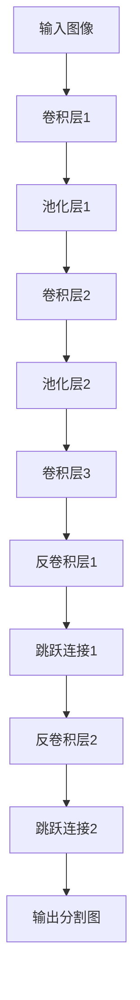

# FCN原理与代码实例讲解

作者：禅与计算机程序设计艺术

## 1.背景介绍

### 1.1 什么是FCN？

全卷积网络（Fully Convolutional Network，简称FCN）是一类用于图像分割任务的深度学习模型。与传统的卷积神经网络（CNN）不同，FCN完全由卷积层和池化层组成，去掉了全连接层，使得网络可以接受任意尺寸的输入图像并输出相同尺寸的分割图。

### 1.2 发展历程

FCN的概念最早由Long等人在2015年提出，他们的论文《Fully Convolutional Networks for Semantic Segmentation》在计算机视觉领域引起了广泛关注和研究。FCN的出现解决了传统CNN在图像分割任务中的局限性，使得图像分割的精度和效率得到了极大的提升。

### 1.3 应用场景

FCN在医学影像分析、自动驾驶、遥感图像处理等多个领域有着广泛的应用。例如，在医学影像中，FCN可以用于自动识别和分割病变区域；在自动驾驶中，FCN可以用于道路和障碍物的识别和分割。

## 2.核心概念与联系

### 2.1 卷积层与池化层

FCN的基本构建块是卷积层和池化层。卷积层通过卷积操作提取图像的特征，池化层则通过下采样操作减少特征图的尺寸，从而提高计算效率。

### 2.2 上采样与反卷积

与传统CNN不同，FCN在最后使用了上采样（Upsampling）或反卷积（Deconvolution）操作，将特征图恢复到原始图像的尺寸。这一步骤对于生成与输入图像同尺寸的分割图至关重要。

### 2.3 跳跃连接

为了提高分割的精度，FCN引入了跳跃连接（Skip Connection）。跳跃连接将浅层特征与深层特征进行融合，使得网络能够同时利用低级和高级特征，从而提高分割的准确性。



## 3.核心算法原理具体操作步骤

### 3.1 数据预处理

在进行训练之前，需要对图像数据进行预处理。常见的预处理步骤包括图像归一化、数据增强等。

### 3.2 网络架构设计

FCN的网络架构主要由卷积层、池化层、反卷积层和跳跃连接组成。以下是一个典型的FCN网络架构：

1. 输入层：接受任意尺寸的输入图像。
2. 卷积层和池化层：提取图像特征并进行下采样。
3. 反卷积层：对特征图进行上采样。
4. 跳跃连接：融合不同层次的特征。
5. 输出层：生成与输入图像同尺寸的分割图。

### 3.3 训练过程

1. **损失函数**：常用的损失函数包括交叉熵损失（Cross-Entropy Loss）和Dice损失（Dice Loss）。
2. **优化器**：常用的优化器包括随机梯度下降（SGD）和Adam。
3. **训练策略**：包括学习率调整、早停等。

### 3.4 推理过程

在推理过程中，将输入图像通过训练好的FCN模型，生成分割图。然后对分割图进行后处理，如阈值化、形态学操作等，得到最终的分割结果。

## 4.数学模型和公式详细讲解举例说明

### 4.1 卷积操作

卷积操作是FCN的核心计算步骤。对于输入图像 $I$ 和卷积核 $K$，卷积操作的公式为：

$$
(I * K)(i, j) = \sum_{m} \sum_{n} I(i+m, j+n) \cdot K(m, n)
$$

### 4.2 池化操作

池化操作用于下采样，常见的池化操作包括最大池化（Max Pooling）和平均池化（Average Pooling）。最大池化的公式为：

$$
P(i, j) = \max_{m, n} I(i+m, j+n)
$$

### 4.3 反卷积操作

反卷积操作用于上采样，其公式为：

$$
(I * K^T)(i, j) = \sum_{m} \sum_{n} I(i-m, j-n) \cdot K(m, n)
$$

### 4.4 损失函数

交叉熵损失的公式为：

$$
L_{CE} = -\sum_{i} \sum_{j} y_{ij} \log(p_{ij})
$$

其中，$y_{ij}$ 是真实标签，$p_{ij}$ 是预测概率。

Dice损失的公式为：

$$
L_{Dice} = 1 - \frac{2 \sum_{i} y_{i} p_{i}}{\sum_{i} y_{i} + \sum_{i} p_{i}}
$$

## 5.项目实践：代码实例和详细解释说明

### 5.1 数据准备

首先，我们需要准备训练数据，通常使用图像和对应的标签进行训练。以下是一个简单的数据准备示例：

```python
import os
import cv2
import numpy as np

def load_data(data_dir):
    images = []
    masks = []
    for filename in os.listdir(data_dir):
        if filename.endswith(".png"):
            img = cv2.imread(os.path.join(data_dir, filename))
            mask = cv2.imread(os.path.join(data_dir, filename.replace(".png", "_mask.png")), 0)
            images.append(img)
            masks.append(mask)
    return np.array(images), np.array(masks)

data_dir = "path/to/data"
images, masks = load_data(data_dir)
```

### 5.2 网络定义

接下来，我们定义一个简单的FCN网络架构：

```python
import tensorflow as tf
from tensorflow.keras import layers, models

def create_fcn(input_shape):
    inputs = tf.keras.Input(shape=input_shape)

    # 下采样路径
    x = layers.Conv2D(64, (3, 3), activation='relu', padding='same')(inputs)
    x = layers.MaxPooling2D((2, 2))(x)
    x = layers.Conv2D(128, (3, 3), activation='relu', padding='same')(x)
    x = layers.MaxPooling2D((2, 2))(x)
    x = layers.Conv2D(256, (3, 3), activation='relu', padding='same')(x)
    x = layers.MaxPooling2D((2, 2))(x)

    # 上采样路径
    x = layers.Conv2DTranspose(128, (3, 3), strides=(2, 2), padding='same')(x)
    x = layers.Conv2DTranspose(64, (3, 3), strides=(2, 2), padding='same')(x)
    outputs = layers.Conv2DTranspose(1, (3, 3), strides=(2, 2), activation='sigmoid', padding='same')(x)

    model = models.Model(inputs, outputs)
    return model

input_shape = (256, 256, 3)
model = create_fcn(input_shape)
model.summary()
```

### 5.3 模型训练

定义损失函数和优化器，然后进行模型训练：

```python
model.compile(optimizer='adam', loss='binary_crossentropy', metrics=['accuracy'])

history = model.fit(images, masks, epochs=50, batch_size=16, validation_split=0.2)
```

### 5.4 模型评估

使用测试数据评估模型性能：

```python
test_images, test_masks = load_data("path/to/test/data")
model.evaluate(test_images, test_masks)
```

## 6.实际应用场景

### 6.1 医学影像分析

在医学影像分析中，FCN可以用于自动分割CT、MRI等医学图像中的病变区域，从而辅助医生进行诊断和治疗。

### 6.2 自动驾驶

在自动驾驶领域，FCN可以用于道路、车道线、行人和障碍物的分割，为自动驾驶系统提供精确的环境感知信息。

### 6.3 遥感图像处理

在遥感图像处理中，FCN可以用于土地覆盖分类、目标检测和变化检测等任务，帮助科学家和工程师分析和解读遥感数据。

## 7.工具