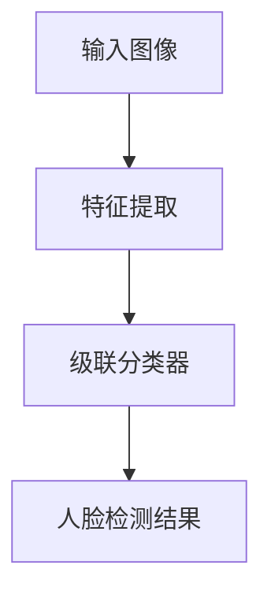

# Face Recognition原理与代码实例讲解

作者：禅与计算机程序设计艺术

## 1. 背景介绍

### 1.1 人脸识别的历史与发展

人脸识别技术的起源可以追溯到20世纪60年代，当时Woodrow W. Bledsoe首次提出了通过计算机分析人脸图像的概念。随着计算机视觉和机器学习技术的不断进步，人脸识别技术经历了几个重要的发展阶段。从最早的基于几何特征的方法，到后来的基于统计学的模型，再到如今的深度学习方法，人脸识别技术已经取得了长足的进步。

### 1.2 人脸识别的应用领域

人脸识别技术在实际生活中有着广泛的应用，包括但不限于以下几个方面：

- 安全监控：在公共场所和重要设施中，通过人脸识别技术进行实时监控和身份验证。
- 移动支付：通过人脸识别技术进行身份验证，确保支付的安全性。
- 智能家居：通过人脸识别技术识别家庭成员，实现个性化服务。
- 社交媒体：自动标记照片中的人物，提高用户体验。

### 1.3 现有技术的挑战

尽管人脸识别技术已经取得了显著的进步，但在实际应用中仍然面临一些挑战：

- 光照变化：不同光照条件下的人脸图像可能有很大差异，影响识别准确性。
- 姿态变化：人脸的不同角度和表情变化也会影响识别效果。
- 遮挡问题：部分遮挡的人脸图像（如戴口罩、眼镜等）会增加识别难度。
- 数据隐私：人脸数据的收集和使用涉及隐私保护问题，需要严格的法律和技术保障。

## 2. 核心概念与联系

### 2.1 人脸检测与人脸识别

人脸识别技术通常包括两个主要步骤：人脸检测和人脸识别。人脸检测是指在图像或视频中检测出人脸的位置，而人脸识别则是进一步识别出检测到的人脸属于哪个人。

### 2.2 特征提取与特征匹配

特征提取是人脸识别的关键步骤，通过算法从人脸图像中提取出能够区分不同人脸的特征。特征匹配则是将提取到的特征与数据库中的特征进行匹配，从而确定人脸的身份。

### 2.3 深度学习与卷积神经网络

近年来，深度学习特别是卷积神经网络（CNN）的发展极大地推动了人脸识别技术的进步。CNN能够自动学习和提取图像中的特征，大大提高了人脸识别的准确性和鲁棒性。

### 2.4 评价指标

在评估人脸识别算法的性能时，常用的评价指标包括准确率、召回率、F1值等。此外，还需要考虑算法的计算复杂度和实时性。

## 3. 核心算法原理具体操作步骤

### 3.1 人脸检测算法

#### 3.1.1 Haar特征级联分类器

Haar特征级联分类器是由Paul Viola和Michael Jones提出的一种基于机器学习的人脸检测方法。该方法通过训练一系列的分类器级联来快速检测人脸。

#### 3.1.2 基于深度学习的检测方法

近年来，基于深度学习的检测方法如MTCNN（Multi-task Cascaded Convolutional Networks）和SSD（Single Shot MultiBox Detector）等在检测精度和速度上都有显著提升。

### 3.2 人脸识别算法

#### 3.2.1 PCA（主成分分析）

主成分分析（PCA）是一种常用的特征提取方法，通过线性变换将高维数据映射到低维空间，从而保留数据的主要特征。

#### 3.2.2 LDA（线性判别分析）

线性判别分析（LDA）是一种监督学习方法，通过最大化类间方差和最小化类内方差来进行特征提取。

#### 3.2.3 深度学习方法

基于深度学习的方法如DeepFace、FaceNet和ArcFace等，通过训练深度神经网络来提取人脸特征，并进行特征匹配。

### 3.3 特征匹配算法

#### 3.3.1 欧氏距离

欧氏距离是最简单的特征匹配方法，通过计算两个特征向量之间的欧氏距离来判断它们的相似度。

#### 3.3.2 余弦相似度

余弦相似度通过计算两个特征向量之间的夹角余弦值来判断它们的相似度。

## 4. 数学模型和公式详细讲解举例说明

### 4.1 PCA算法原理

主成分分析（PCA）通过线性变换将高维数据映射到低维空间。假设我们有一个数据矩阵 $X$，其维度为 $n \times d$，其中 $n$ 为样本数，$d$ 为特征数。PCA的目标是找到一个变换矩阵 $W$，使得变换后的数据矩阵 $Y = XW$ 的方差最大。

#### 4.1.1 协方差矩阵

首先计算数据矩阵 $X$ 的协方差矩阵 $C$：

$$
C = \frac{1}{n} X^T X
$$

#### 4.1.2 特征值分解

对协方差矩阵 $C$ 进行特征值分解，得到特征值 $\lambda_i$ 和特征向量 $v_i$：

$$
C v_i = \lambda_i v_i
$$

#### 4.1.3 选择主成分

选择前 $k$ 个最大的特征值对应的特征向量，构成变换矩阵 $W$：

$$
W = [v_1, v_2, \ldots, v_k]
$$

### 4.2 LDA算法原理

线性判别分析（LDA）通过最大化类间方差和最小化类内方差来进行特征提取。假设我们有 $c$ 类数据，每类数据的均值为 $\mu_i$，总均值为 $\mu$。

#### 4.2.1 类内散布矩阵

类内散布矩阵 $S_W$ 定义为：

$$
S_W = \sum_{i=1}^c \sum_{x \in C_i} (x - \mu_i)(x - \mu_i)^T
$$

#### 4.2.2 类间散布矩阵

类间散布矩阵 $S_B$ 定义为：

$$
S_B = \sum_{i=1}^c N_i (\mu_i - \mu)(\mu_i - \mu)^T
$$

其中 $N_i$ 为第 $i$ 类的数据样本数。

#### 4.2.3 优化目标

LDA的优化目标是找到一个变换矩阵 $W$，使得变换后的类间散布矩阵和类内散布矩阵的比值最大：

$$
\arg \max_W \frac{|W^T S_B W|}{|W^T S_W W|}
$$

### 4.3 深度学习方法

#### 4.3.1 卷积神经网络

卷积神经网络（CNN）是深度学习中常用的模型，通过卷积层、池化层和全连接层的组合来提取图像特征。

#### 4.3.2 损失函数

在训练人脸识别模型时，常用的损失函数包括交叉熵损失和三元组损失。三元组损失通过最小化同一类样本之间的距离和最大化不同类样本之间的距离来提高模型的识别能力。

$$
L = \sum_{i=1}^N \max(0, \alpha + d(f(x_i^a), f(x_i^p)) - d(f(x_i^a), f(x_i^n)))
$$

其中，$x_i^a$ 为锚点样本，$x_i^p$ 为正样本，$x_i^n$ 为负样本，$d$ 为距离函数，$\alpha$ 为超参数。

## 5. 项目实践：代码实例和详细解释说明

### 5.1 环境准备

在开始编写代码之前，我们需要安装一些必要的库。这里我们使用Python语言和OpenCV库进行人脸检测和识别。

