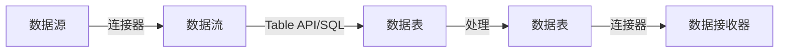

# Flink Table API和SQL原理与代码实例讲解

作者：禅与计算机程序设计艺术

## 1. 背景介绍

### 1.1 大数据处理的演变

在过去的十年中，大数据处理技术经历了显著的演变。从最初的批处理系统如Hadoop，到实时流处理系统如Apache Storm，再到如今的混合处理系统如Apache Flink，数据处理的速度和效率不断提升。随着数据量的爆炸性增长，企业需要更高效、更灵活的工具来处理和分析数据。

### 1.2 Apache Flink简介

Apache Flink是一个开源的流处理框架，能够处理无界和有界的数据流。它支持事件驱动的应用程序，并能够提供低延迟、高吞吐量的处理能力。Flink的核心功能包括状态管理、容错机制和丰富的连接器支持，使其成为现代数据处理的首选工具之一。

### 1.3 Table API和SQL的作用

Flink的Table API和SQL模块为用户提供了一种更高层次的抽象，使得数据处理任务可以通过声明性语句来实现。这种方式不仅降低了编程复杂度，还提高了代码的可读性和维护性。Table API和SQL的设计灵感来自于传统的关系数据库系统，但它们在流处理的背景下进行了优化和扩展。

## 2. 核心概念与联系

### 2.1 Table API概述

Table API是一种关系化的API，允许用户使用类似SQL的查询来操作数据表。它支持一系列丰富的操作，如选择、过滤、聚合和连接等。Table API的设计目标是简化数据流处理任务，使开发者能够专注于业务逻辑，而不是底层实现细节。

### 2.2 SQL在Flink中的应用

Flink SQL是对Table API的进一步抽象，允许用户直接使用标准SQL语句进行数据查询和操作。Flink SQL支持完整的SQL语法，包括窗口函数、聚合函数和用户自定义函数等。通过SQL，用户可以快速上手并高效地编写复杂的数据处理任务。

### 2.3 Table API与SQL的关系

Table API和SQL在Flink中是紧密结合的。Table API提供了底层的编程接口，而SQL则是对这些接口的封装和扩展。用户可以在同一个应用程序中混合使用Table API和SQL，从而享受两者的优势。

### 2.4 数据流与数据表的映射

在Flink中，数据流（Stream）和数据表（Table）是两个核心概念。数据流表示不断输入的数据序列，而数据表则是对这些数据的关系化表示。通过Table API和SQL，用户可以在数据流和数据表之间进行转换，从而实现灵活的数据处理。

## 3. 核心算法原理具体操作步骤

### 3.1 数据源和数据接收器

Flink支持多种数据源和数据接收器，如Kafka、HDFS、JDBC等。用户可以通过连接器将外部数据导入Flink的流处理环境，并将处理结果输出到指定的目标位置。



### 3.2 数据流与数据表的转换

通过Table API，用户可以将数据流转换为数据表，反之亦然。这种转换使得用户可以在流处理和批处理之间自由切换，从而实现灵活的数据处理。

```java
// 将数据流转换为数据表
DataStream<Row> dataStream = ...
Table table = tableEnv.fromDataStream(dataStream);

// 将数据表转换为数据流
Table table = ...
DataStream<Row> dataStream = tableEnv.toAppendStream(table, Row.class);
```

### 3.3 查询和操作

使用Table API和SQL，用户可以对数据表执行各种查询和操作，如选择、过滤、聚合和连接等。这些操作可以组合使用，从而实现复杂的数据处理逻辑。

```java
// 使用Table API进行查询
Table result = table
    .select("name, age")
    .where("age > 30");

// 使用SQL进行查询
Table result = tableEnv.sqlQuery("SELECT name, age FROM table WHERE age > 30");
```

### 3.4 窗口操作

窗口操作是流处理中的一个重要概念，允许用户对数据流进行分组和聚合。Flink支持多种窗口类型，如滚动窗口、滑动窗口和会话窗口等。

```java
// 滚动窗口
Table result = table
    .window(Tumble.over("10.minutes").on("timestamp").as("w"))
    .groupBy("w, name")
    .select("name, count(1) as cnt");

// 滑动窗口
Table result = table
    .window(Slide.over("10.minutes").every("5.minutes").on("timestamp").as("w"))
    .groupBy("w, name")
    .select("name, count(1) as cnt");
```

### 3.5 状态管理

Flink的状态管理机制允许用户在流处理过程中存储和更新中间状态。状态可以是有界的，也可以是无界的。Flink提供了丰富的状态操作API，使得用户可以灵活地管理和查询状态。

```java
// 定义状态
ValueState<Integer> state = getRuntimeContext().getState(new ValueStateDescriptor<>("state", Integer.class));

// 更新状态
state.update(newValue);

// 查询状态
Integer currentState = state.value();
```

## 4. 数学模型和公式详细讲解举例说明

### 4.1 数据流和数据表的数学表示

在数学上，数据流可以表示为一个函数 $f(t)$，其中 $t$ 是时间。数据表则可以表示为一个关系 $R$，其中包含若干元组（行）。通过Table API和SQL，用户可以在 $f(t)$ 和 $R$ 之间进行转换。

### 4.2 窗口操作的数学模型

窗口操作可以看作是对数据流进行分段，并对每个分段进行聚合。假设数据流 $f(t)$ 在时间区间 $[t_1, t_2]$ 内的值为 $f(t_1, t_2)$，那么滚动窗口的结果可以表示为：

$$
W(t, \Delta) = \{ f(t_i, t_i + \Delta) \mid t_i = k \Delta, k \in \mathbb{Z} \}
$$

其中，$\Delta$ 是窗口大小，$t_i$ 是窗口的起始时间。

### 4.3 状态管理的数学模型

状态管理可以看作是一个映射 $S: K \rightarrow V$，其中 $K$ 是键，$V$ 是值。在流处理过程中，状态 $S$ 会随着数据的到来而更新。假设数据流 $f(t)$ 在时间 $t$ 到达，状态更新的公式可以表示为：

$$
S_{new} = U(S_{old}, f(t))
$$

其中，$U$ 是状态更新函数。

## 5. 项目实践：代码实例和详细解释说明

### 5.1 环境搭建

在开始编写代码之前，首先需要搭建Flink的开发环境。可以使用Maven或Gradle来管理依赖，并下载Flink的相关库。

```xml
<!-- Maven依赖 -->
<dependency>
    <groupId>org.apache.flink</groupId>
    <artifactId>flink-java</artifactId>
    <version>1.14.0</version>
</dependency>
<dependency>
    <groupId>org.apache.flink</groupId>
    <artifactId>flink-streaming-java_2.12</artifactId>
    <version>1.14.0</version>
</dependency>
<dependency>
    <groupId>org.apache.flink</groupId>
    <artifactId>flink-table-api-java-bridge_2.12</artifactId>
    <version>1.14.0</version>
</dependency>
<dependency>
    <groupId>org.apache.flink</groupId>
    <artifactId>flink-table-planner-blink_2.12</artifactId>
    <version>1.14.0</version>
</dependency>
<dependency>
    <groupId>org.apache.flink</groupId>
    <artifactId>flink-connector-kafka_2.12</artifactId>
    <version>1.14.0</version>
</dependency>
```

### 5.2 数据流处理示例

以下是一个简单的数据流处理示例，展示了如何使用Table API和SQL进行数据处理。

```java
import org.apache.flink.streaming.api.environment.StreamExecutionEnvironment;
import org.apache.flink.table.api.*;
import org.apache.flink.table.api.bridge.java.StreamTableEnvironment;
import org.apache.flink.types.Row;

public class FlinkTableAPIDemo {
    public static void main(String[] args) throws Exception {
        // 创建执行环境