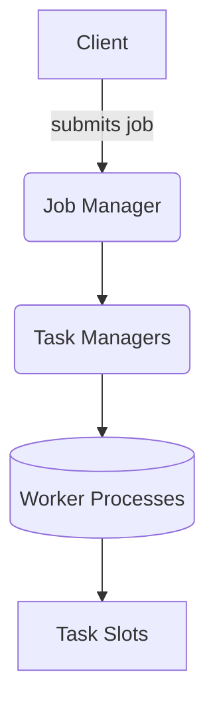
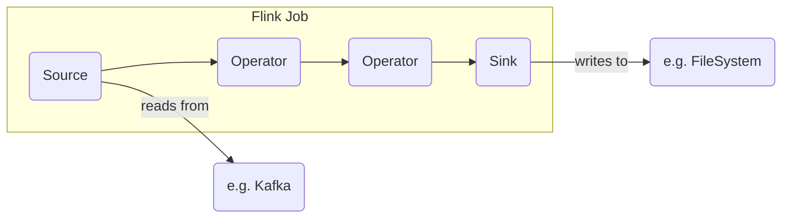
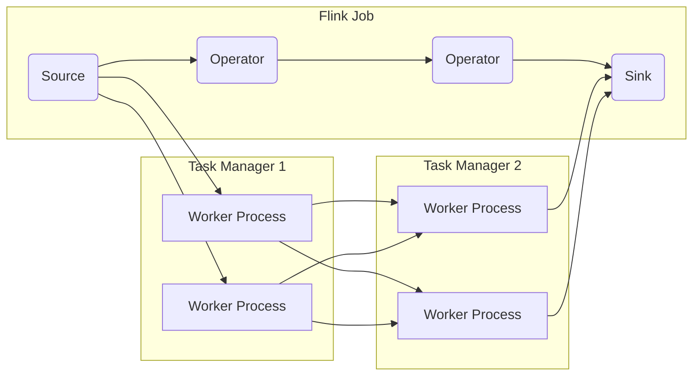
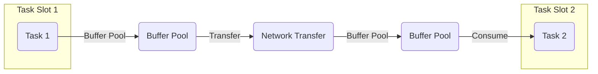

# Flink流处理框架原理与代码实例讲解

## 1. 背景介绍

### 1.1 大数据时代的到来

在当今时代,随着互联网、物联网、移动设备的快速发展,海量的数据每时每刻都在被产生。这些数据来源广泛,形式多样,包括网页点击流、服务器日志、社交媒体信息、传感器数据等。传统的批处理系统如Apache Hadoop已经无法满足实时数据处理的需求。因此,流式数据处理应运而生,成为大数据领域的一个热门话题。

### 1.2 流式数据处理的重要性

流式数据处理系统能够及时处理持续到来的数据流,从而实现近乎实时的数据分析和响应。这对于许多应用场景都是至关重要的,例如:

- 网络安全监控和入侵检测
- 物联网设备的实时监控和控制
- 电商网站的实时用户行为分析
- 社交媒体上的热点事件检测
- 金融交易的实时风险评估
- 实时推荐系统

可以看出,流式数据处理已经渗透到了各个领域,成为了支撑实时智能应用的核心技术。

### 1.3 Apache Flink简介

Apache Flink是一个开源的分布式流式数据处理框架,最初由柏林理工大学的研究团队所开发。它具有低延迟、高吞吐、精确一次语义等优秀特性,被广泛应用于实时分析、事件驱动应用等领域。

Flink不仅支持纯流处理,还支持批处理,能够统一处理有界和无界数据流。它采用了先进的窗口模型和状态管理机制,为复杂事件处理提供了强大的支持。此外,Flink还拥有优雅的内存管理、灵活的部署模式、友好的API等优势。

本文将深入探讨Flink的核心概念、原理和实践,帮助读者全面理解这一领先的流处理框架。

## 2. 核心概念与联系

在深入Flink的原理之前,我们需要先了解一些核心概念,它们贯穿于整个Flink框架。

### 2.1 流(Stream)和数据集(DataSet)

在Flink中,有两种主要的数据类型:流(Stream)和数据集(DataSet)。

**流**代表连续无界的数据流,可以持续不断地产生新的数据,如网站点击流、传感器数据等。流具有实时性和无边界的特点。

**数据集**表示有界数据集合,是静态的、一次性的数据,如文件中的记录或关系型数据库中的表。数据集适用于批处理场景。

Flink统一了流处理和批处理,能够对流和数据集执行相同的操作。不过本文主要关注流处理。

### 2.2 流分区(Stream Partitioning)

流分区决定了数据流如何在并行实例之间进行分布和移动。Flink支持多种分区策略:

- **重分区(Rebalance)**:数据流按照轮训的方式均匀分布到下游的并行实例中。
- **散列分区(Hash Partitioning)**:根据数据流中特定字段的哈希值将数据分配到不同的并行实例。
- **广播(Broadcasting)**:将数据复制到下游的所有并行实例。
- **转发(Forwarding)**:直接将数据转发到下游的相同索引的并行实例。

合理的分区策略对于充分利用并行度、实现负载均衡至关重要。

### 2.3 窗口(Window)

在流处理中,我们往往需要对一段时间内的数据进行聚合或连接等操作。窗口模型提供了一种对无界数据流进行切分、聚合的方式。

Flink支持多种窗口类型:

- **滚动窗口(Tumbling Window)**:固定大小、无重叠的窗口。
- **滑动窗口(Sliding Window)**:固定窗口大小,窗口之间有重叠。
- **会话窗口(Session Window)**:根据数据活动模式动态合并窗口。
- **全局窗口(Global Window)**:将所有数据收集到一个全局窗口中。

窗口可以根据时间或数据条数进行划分,并提供了诸如窗口函数(如sum、min、max等)、窗口连接等丰富功能。

### 2.4 状态管理(State Management)

在流处理中,我们往往需要维护一些状态信息,如窗口聚合时的中间结果、连接时的对应关系等。Flink提供了可靠、高效的状态管理机制。

Flink将状态划分为不同的范畴:

- **算子状态(Operator State)**:属于某个特定算子的状态,如窗口聚合的中间结果。
- **键控状态(Keyed State)**:根据键(Key)进行分区的状态,如键值对的连接关系。

Flink将状态持久化存储在可配置的State Backend中,如本地内存或分布式存储系统。这确保了状态数据在发生故障时的一致性和恢复能力。

### 2.5 时间语义

在流处理中,时间是一个极其重要的概念。Flink支持三种时间语义:

- **事件时间(Event Time)**:数据记录本身携带的时间戳,通常代表事件实际发生的时间。
- **提取时间(Ingestion Time)**:数据进入Flink的时间。
- **处理时间(Processing Time)**:Flink实际处理数据的时间。

事件时间最能反映数据的真实时间顺序,但需要对乱序事件进行特殊处理。Flink提供了多种处理乱序事件的机制,如设置延迟时间等。

## 3. 核心算法原理具体操作步骤

### 3.1 Flink架构概览

在深入探讨Flink的核心原理之前,我们先来了解一下Flink的整体架构。

Flink采用了主从式架构:

1. **Client**负责提交作业(Job)到集群,并与JobManager进行通信。
2. **JobManager**负责协调整个作业的执行,包括调度Task、协调Checkpoint、监控Task状态等。
3. **TaskManager**实际执行作业的Worker进程,负责执行具体的Task子任务。
4. **Worker Processes**是TaskManager中的工作线程,用于执行具体的Task子任务。
5. **Task Slots**是TaskManager的并行执行槽,用于限制并行执行的Task数量。

接下来我们将重点关注Flink的核心执行引擎,即作业是如何被执行的。

### 3.2 作业执行流程

一个Flink作业会经历以下几个主要阶段:

1. **Source**阶段:读取数据源(如Kafka、文件等)中的数据,形成数据流。
2. **Operator**阶段:在数据流上应用各种算子(如map、flatMap、filter等)进行转换和计算。
3. **Sink**阶段:将计算结果输出到外部系统(如文件系统、数据库等)。

下面用一个具体的例子来说明整个执行流程:

1. **Source**从Kafka读取数据流,构建Source。
2. **Operator1**接收Source的数据流,应用某种算子进行转换,输出新的数据流。
3. **Operator2**接收Operator1的输出数据流,再次应用算子进行转换。
4. **Sink**接收Operator2的输出数据流,将结果写入文件系统。

在整个过程中,Flink会自动进行**链式优化**(Chaining Optimization)和**数据本地化**(Data Locality),以提高性能和降低数据传输开销。

### 3.3 Task并行执行

Flink支持将作业中的算子链(Operator Chain)进行并行化执行,以提高吞吐量。

上图展示了一个并行度为2的作业:

1. **Source**的并行子任务运行在TaskManager 1的两个Worker Processes中。
2. **Operator1**也有两个并行子任务,分别接收Source的输出。
3. **Operator2**同样有两个并行子任务,接收Operator1的输出。
4. **Sink**的输出被收集到一个单一的Worker Process中。

通过调整算子链的并行度,可以充分利用集群资源,实现更高的吞吐量。同时,Flink还提供了自动重分区(Rebalancing)机制,在数据分区不均匀时自动重新分区,以实现更好的负载均衡。

### 3.4 数据传输与缓冲

在Flink中,不同算子之间需要通过网络进行数据传输。为了提高效率,Flink采用了基于**缓冲区(Buffer)**的数据传输机制。

1. **Task 1**将数据写入本地的**Buffer Pool**。
2. **Buffer Pool**将数据通过网络传输给下游的**Buffer Pool**。
3. **Task 2**从本地**Buffer Pool**中读取数据进行处理。

这种基于缓冲区的数据传输机制有以下优势:

- 减少了数据复制的次数,提高了效率。
- 支持异步传输,避免了阻塞等待。
- 支持流控(Flow Control),防止下游被淹没。

同时,Flink还提供了可插拔的传输模块,支持基于不同的传输协议(如Netty、gRPC等)进行数据传输。

## 4. 数学模型和公式详细讲解举例说明

在流式数据处理中,往往需要对数据进行聚合和统计等操作。这些操作通常涉及到一些数学模型和公式,本节将对此进行详细讲解。

### 4.1 滑动窗口聚合

滑动窗口是Flink中常用的窗口类型之一。给定窗口大小 $w$ 和滑动步长 $s$,滑动窗口可以表示为:

$$
W_t = [t - w + s, t)
$$

其中 $t$ 表示当前窗口的结束时间戳。例如,当 $w=10min$, $s=5min$ 时,第一个窗口为 $[0, 10min)$,第二个窗口为 $[5min, 15min)$,依此类推。

在滑动窗口内,我们可以对数据进行各种聚合操作,如求和、计数、最大/最小值等。以计数为例,给定一个事件流 $E$,窗口内的事件计数可以表示为:

$$
\text{count}(W_t) = \sum_{e \in E, e.ts \in W_t} 1
$$

其中 $e.ts$ 表示事件 $e$ 的时间戳。

### 4.2 会话窗口聚合

会话窗口是根据数据活动模式动态合并的窗口。给定会话间隔时间 $gap$,如果两个相邻事件的时间间隔超过 $gap$,则认为是新的会话。

形式化地,给定一个事件流 $E$,会话窗口可以定义为:

$$
S_i = \{e_j \in E | e_j.ts - e_{j-1}.ts \leq gap, j \in [i+1, k]\}
$$

其中 $S_i$ 表示第 $i$ 个会话窗口, $e_j$ 表示第 $j$ 个事件, $k$ 是事件流中最后一个事件的索引。

在会话窗口内,我们同样可以进行各种聚合操作。例如,计算每