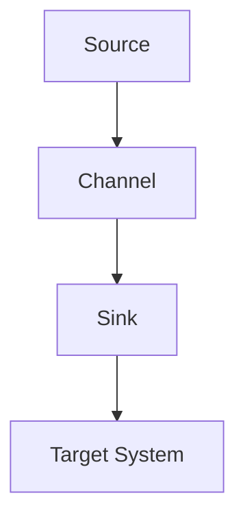

# Flume Sink原理与代码实例讲解

作者：禅与计算机程序设计艺术

## 1.背景介绍

### 1.1 Flume简介

Apache Flume 是一个分布式、可靠且高可用的系统，用于高效地收集、聚合和移动大量日志数据。Flume 的设计目标是简化日志数据的收集和传输过程，提供了灵活的架构和强大的扩展性，能够满足不同规模的日志数据处理需求。

### 1.2 Flume架构概述

Flume 的核心架构由三个主要组件组成：Source、Channel 和 Sink。Source 负责接收数据，Channel 负责存储数据，而 Sink 则负责将数据传输到目标存储系统。本文将重点讲解 Flume Sink 的原理和实现，并通过代码实例来展示其具体的操作步骤。

### 1.3 Flume在大数据生态系统中的角色

在大数据生态系统中，Flume 常用于从各种数据源（如日志文件、网络流量等）收集数据，并将数据传输到 HDFS、HBase、Kafka 等存储系统。Flume 的高可用性和可扩展性使其成为大数据流处理的关键组件之一。

## 2.核心概念与联系

### 2.1 Source、Channel 和 Sink 的关系

Flume 的数据流动是通过 Source、Channel 和 Sink 三个组件的协作来实现的。Source 从外部数据源接收数据，并将数据推送到 Channel；Channel 作为数据的缓冲区，存储数据直到 Sink 将其消费；Sink 从 Channel 中读取数据，并将数据写入目标存储系统。



### 2.2 Sink 的作用和分类

Sink 是 Flume 中负责将数据传输到目标存储系统的组件。根据目标系统的不同，Sink 可以分为多种类型，如 HDFS Sink、HBase Sink、Kafka Sink 等。Sink 的选择取决于具体的应用场景和数据存储需求。

### 2.3 Sink 的工作机制

Sink 的工作机制通常包括以下几个步骤：

1. 从 Channel 中读取数据。
2. 将数据转换为目标系统所需的格式。
3. 将数据写入目标存储系统。
4. 确认数据写入成功，并从 Channel 中删除已处理的数据。

## 3.核心算法原理具体操作步骤

### 3.1 Sink 初始化

在 Flume 启动时，Sink 会被初始化。初始化过程包括配置参数的加载、资源的分配等。以下是一个简单的 HDFS Sink 初始化示例：

```java
public void configure(Context context) {
    hdfsPath = context.getString("hdfs.path");
    filePrefix = context.getString("file.prefix", "flume");
    // 其他配置参数的初始化
}
```

### 3.2 数据读取与转换

Sink 从 Channel 中读取数据，并根据目标系统的需求对数据进行转换。以下是一个从 Channel 中读取数据并转换为字符串的示例：

```java
public void process() throws EventDeliveryException {
    ChannelTransaction transaction = channel.getTransaction();
    try {
        transaction.begin();
        Event event = channel.take();
        if (event != null) {
            String data = new String(event.getBody(), StandardCharsets.UTF_8);
            // 数据转换和处理逻辑
        }
        transaction.commit();
    } catch (Exception e) {
        transaction.rollback();
        throw new EventDeliveryException("Failed to process event", e);
    } finally {
        transaction.close();
    }
}
```

### 3.3 数据写入与确认

Sink 将转换后的数据写入目标存储系统，并确认数据写入成功。以下是一个将数据写入 HDFS 的示例：

```java
public void process() throws EventDeliveryException {
    ChannelTransaction transaction = channel.getTransaction();
    try {
        transaction.begin();
        Event event = channel.take();
        if (event != null) {
            String data = new String(event.getBody(), StandardCharsets.UTF_8);
            Path filePath = new Path(hdfsPath, filePrefix + System.currentTimeMillis());
            try (FSDataOutputStream out = fileSystem.create(filePath)) {
                out.writeBytes(data);
            }
            transaction.commit();
        }
    } catch (Exception e) {
        transaction.rollback();
        throw new EventDeliveryException("Failed to process event", e);
    } finally {
        transaction.close();
    }
}
```

## 4.数学模型和公式详细讲解举例说明

### 4.1 数据传输模型

在 Flume 中，数据传输可以被建模为一个生产者-消费者问题，其中 Source 是生产者，Sink 是消费者，Channel 则是两者之间的缓冲区。假设在单位时间内，Source 产生数据的速率为 $\lambda$，Sink 处理数据的速率为 $\mu$，则系统的稳定性取决于 $\lambda$ 和 $\mu$ 的关系。

$$
\text{系统稳定性} = \begin{cases} 
\text{稳定} & \text{如果} \ \lambda \leq \mu \\
\text{不稳定} & \text{如果} \ \lambda > \mu 
\end{cases}
$$

### 4.2 数据丢失率计算

如果 $\lambda > \mu$，则系统会出现数据堆积，最终导致数据丢失。假设 Channel 的容量为 $C$，则数据丢失率可以表示为：

$$
\text{数据丢失率} = \frac{\lambda - \mu}{\lambda} \times \frac{1}{C}
$$

### 4.3 例子说明

假设某个 Flume 系统中，Source 的数据产生速率为 1000 条/秒，Sink 的处理速率为 800 条/秒，Channel 的容量为 10000 条。则该系统的数据丢失率为：

$$
\text{数据丢失率} = \frac{1000 - 800}{1000} \times \frac{1}{10000} = 0.02\%
$$

## 4.项目实践：代码实例和详细解释说明

### 4.1 环境配置

在进行 Flume Sink 的项目实践之前，我们需要配置 Flume 环境。以下是一个简单的 Flume 配置文件示例：

```properties
# Define agent
agent.sources = source1
agent.channels = channel1
agent.sinks = sink1

# Configure source
agent.sources.source1.type = netcat
agent.sources.source1.bind = localhost
agent.sources.source1.port = 44444

# Configure channel
agent.channels.channel1.type = memory
agent.channels.channel1.capacity = 10000
agent.channels.channel1.transactionCapacity = 1000

# Configure sink
agent.sinks.sink1.type = hdfs
agent.sinks.sink1.hdfs.path = hdfs://localhost:9000/flume/events
agent.sinks.sink1.hdfs.filePrefix = events
agent.sinks.sink1.channel = channel1
```

### 4.2 自定义 Sink 实现

以下是一个自定义 Sink 的实现示例，该 Sink 将数据写入本地文件系统：

```java
public class CustomFileSink extends AbstractSink implements Configurable {
    private String filePath;
    private String filePrefix;

    @Override
    public void configure(Context context) {
        filePath = context.getString("file.path");
        filePrefix = context.getString("file.prefix", "flume");
    }

    @Override
    public Status process() throws EventDeliveryException {
        Channel channel = getChannel();
        ChannelTransaction transaction = channel.getTransaction();
        try {
            transaction.begin();
            Event event = channel.take();
            if (event != null) {
                String data = new String(event.getBody(), StandardCharsets.UTF_8);
                Path file = Paths.get(filePath, filePrefix + System.currentTimeMillis() + ".log");
                Files.write(file, data.getBytes(), StandardOpenOption.CREATE);
            }
            transaction.commit();
            return Status.READY;
        } catch (Exception e) {
            transaction.rollback();
            throw new EventDeliveryException("Failed to process event", e);
        } finally {
            transaction.close();
        }
    }
}
```

### 4.3 注册自定义 Sink

在 Flume 配置文件中注册自定义 Sink：

```properties
# Configure custom sink
agent.sinks.sink1.type = com.example.CustomFileSink
agent.sinks.sink1.file.path = /var/log/flume
agent.sinks.sink1.file.prefix = events
```

### 4.4 启动 Flume Agent

使用以下命令启动 Flume Agent：

```sh
flume-ng agent --conf conf --conf-file example.conf --name agent -Dflume.root.logger=INFO,console
```

## 5.实际应用场景

### 5.1 日志数据收集

Flume 常用于收集分布式系统中的日志数据，并将其传输到集中存储系统（如 HDFS、Elasticsearch 等）进行分析和处理。通过 Flume，开发者可以轻松实现日志数据的实时收集和处理，提高系统的可