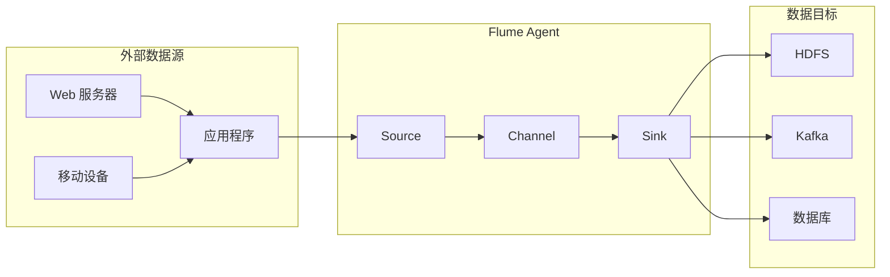

# Flume原理与代码实例讲解

作者：禅与计算机程序设计艺术

## 1. 背景介绍

### 1.1 海量数据与实时分析的挑战

随着互联网和物联网的快速发展，企业产生的数据量呈爆炸式增长。如何高效地采集、存储和分析这些海量数据，成为了企业面临的巨大挑战。传统的批处理方式已经无法满足实时性要求，实时流处理技术应运而生。

### 1.2 Flume：分布式日志收集系统

Apache Flume是一个分布式、可靠、可用的系统，用于高效地收集、聚合和移动大量的日志数据。它具有灵活的架构、可扩展性和容错性，能够处理各种来源和格式的数据。

## 2. 核心概念与联系

### 2.1 Agent、Source、Channel 和 Sink

* **Agent**: Flume 的基本单元，负责接收、处理和转发数据。每个 Agent 都是一个独立的 JVM 进程，包含 Source、Channel 和 Sink 三个核心组件。
* **Source**: 数据源，负责从外部系统接收数据，并将其转换为 Flume Event。常见的 Source 类型包括 Avro Source、Kafka Source、Spooling Directory Source 等。
* **Channel**: 数据缓冲区，用于临时存储 Source 接收到的数据，并将其传递给 Sink。常见的 Channel 类型包括 Memory Channel、File Channel、Kafka Channel 等。
* **Sink**: 数据目标，负责将 Channel 中的数据写入到外部系统。常见的 Sink 类型包括 HDFS Sink、Logger Sink、Kafka Sink 等。

### 2.2 Flume Event

Flume Event 是 Flume 中数据传输的基本单元，由一个字节数组和可选的 Header 组成。Header 是一个键值对集合，用于存储事件的元数据信息。

### 2.3 Flume 架构



## 3. 核心算法原理具体操作步骤

### 3.1 数据采集与传输流程

1. Source 从外部系统接收数据，并将其转换为 Flume Event。
2. Source 将 Flume Event 写入到 Channel。
3. Sink 从 Channel 读取 Flume Event。
4. Sink 将 Flume Event 写入到外部系统。

### 3.2 事务机制

Flume 使用事务机制保证数据传输的可靠性。每个 Agent 内部都维护一个事务管理器，负责协调 Source、Channel 和 Sink 之间的数据传输。

* **put 事务**: Source 将数据写入 Channel 时，会开启一个 put 事务。
* **take 事务**: Sink 从 Channel 读取数据时，会开启一个 take 事务。

只有当 put 事务和 take 事务都成功提交时，数据才会真正从 Source 传输到 Sink。

## 4. 数学模型和公式详细讲解举例说明

Flume 没有涉及复杂的数学模型和公式。

## 5. 项目实践：代码实例和详细解释说明

### 5.1 需求分析

假设我们需要将 Web 服务器的访问日志实时收集到 HDFS 中，可以使用 Flume 构建如下数据采集管道：

```
Web 服务器 --> Flume Agent --> HDFS
```

### 5.2 Flume 配置文件

```
# 定义 Agent 名称
agent.sources = r1
agent.sinks = k1
agent.channels = c1

# 配置 Source
agent.sources.r1.type = exec
agent.sources.r1.command = tail -F /var/log/nginx/access.log
agent.sources.r1.channels = c1

# 配置 Channel
agent.channels.c1.type = memory
agent.channels.c1.capacity = 10000

# 配置 Sink
agent.sinks.k1.type = hdfs
agent.sinks.k1.hdfs.path = hdfs://localhost:9000/flume/events
agent.sinks.k1.hdfs.fileType = DataStream
agent.sinks.k1.hdfs.writeFormat = Text
agent.sinks.k1.channel = c1

# 绑定 Source、Channel 和 Sink
agent.sources.r1.channel = c1
agent.sinks.k1.channel = c1
```

### 5.3 代码解释

* **agent.sources**: 定义数据源，这里使用 exec source，通过执行 tail 命令实时读取 Web 服务器的访问日志。
* **agent.channels**: 定义数据缓冲区，这里使用 memory channel，将数据存储在内存中。
* **agent.sinks**: 定义数据目标，这里使用 hdfs sink，将数据写入到 HDFS 中。
* **agent.sources.r1.channels、agent.sinks.k1.channel**: 将 Source、Channel 和 Sink 绑定在一起。

## 6. 实际应用场景

### 6.1 日志收集与分析

Flume 可以用于收集各种类型的日志数据，例如应用程序日志、系统日志、安全日志等，并将它们存储到 HDFS、Elasticsearch 等系统中进行分析。

### 6.2 数据仓库 ETL

Flume 可以作为数据仓库 ETL 的一部分，将来自不同数据源的数据收集到一起，并进行清洗、转换和加载到数据仓库中。

### 6.3 实时监控与告警

Flume 可以与其他实时计算框架（例如 Spark Streaming、Flink）集成，实现实时监控和告警功能。

## 7. 总结：未来发展趋势与挑战

### 7.1 未来发展趋势

* **云原生支持**: 随着云计算的普及，Flume 需要更好地支持云原生环境，例如 Kubernetes。
* **边缘计算**: 随着物联网的发展，Flume 需要能够在边缘设备上运行，并支持边缘计算场景。
* **机器学习**: Flume 可以与机器学习算法集成，实现更智能的数据采集和分析。

### 7.2 面临的挑战

* **性能优化**: Flume 需要不断优化性能，以处理更大规模的数据。
* **安全性**: Flume 需要提供更强大的安全机制，以保护数据的安全性。
* **易用性**: Flume 需要简化配置和使用，以降低使用门槛。

## 8. 附录：常见问题与解答

### 8.1 Flume 如何保证数据不丢失？

Flume 使用事务机制和可靠的 Channel 实现数据不丢失。

### 8.2 Flume 如何处理数据积压？

可以通过增加 Channel 的容量、使用更快的 Channel 类型、增加 Sink 的并行度等方式解决数据积压问题。

### 8.3 Flume 与 Kafka 的区别是什么？

Flume 和 Kafka 都是分布式消息队列系统，但 Flume 更侧重于数据采集和聚合，而 Kafka 更侧重于消息传递和流处理。
