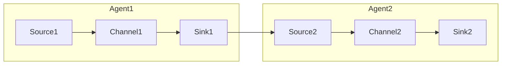

# Flume性能优化：打造高效数据流

## 1.背景介绍

### 1.1 大数据时代的数据传输挑战

在当今的大数据时代，海量的数据不断被产生和收集。这些数据来源于各种渠道,如网络日志、社交媒体、物联网设备等。有效地收集和传输这些大量的数据对于许多企业和组织来说至关重要。然而,传统的数据传输方式往往效率低下,无法满足大数据场景下的高吞吐量和低延迟的需求。

### 1.2 Flume的作用和优势

Apache Flume是一个分布式、可靠、高可用的数据收集系统,旨在高效地收集、聚合和移动大量的日志数据。它是Apache Hadoop生态系统中的一个重要组件,为Hadoop的数据引入提供了高性能的服务。Flume的设计理念是基于简单、可靠且容错的数据流模型,能够从各种数据源高效地收集数据,并将其传输到HDFS、HBase、Solr等目的地。

Flume具有以下主要优势:

- **可靠性**:使用事务机制确保数据传输的一致性,并支持故障恢复机制。
- **高吞吐量**:通过优化IO操作和并行处理,实现高效的数据收集和传输。
- **可扩展性**:可以通过添加更多agent实例来水平扩展,满足大数据量的需求。
- **灵活性**:支持多种数据源和接收器,可以适应不同的数据收集场景。

### 1.3 性能优化的重要性

尽管Flume具有诸多优势,但在实际生产环境中,仍然会遇到一些性能瓶颈,影响数据传输的效率。常见的性能问题包括:

- 低吞吐量
- 高延迟
- 频繁的数据重复
- 资源利用率低下

因此,对Flume进行性能优化至关重要,可以确保数据以高效、可靠的方式流动,满足业务需求,并降低运维成本。

## 2.核心概念与联系

在优化Flume性能之前,我们需要了解Flume的核心概念和它们之间的关系。

### 2.1 Flume的核心组件

Flume由以下三个核心组件组成:

1. **Source(源头)**:数据进入Flume的接口,可以是日志文件、网络流或其他数据源。
2. **Channel(通道)**:一个事务性的可靠传输队列,用于缓冲Source端接收的事件,直到被Sink端安全地持久化。
3. **Sink(下游)**:从Channel中移除事件并将其传输到下一个目的地(如HDFS、HBase等)的接口。

这三个组件通过Source->Channel->Sink的方式组成一个数据流水线,数据从Source进入Channel,最终被Sink写入目的地。


### 2.2 Flume Agent

Flume Agent是一个独立的进程,包含一个Source、一个Sink和一个Channel。Agent可以运行在独立的物理节点上,也可以与其他Agent共存于同一台机器。多个Agent可以串联在一起,形成一个复杂的数据流拓扑结构。



### 2.3 Flume事务机制

Flume使用事务机制来确保数据传输的可靠性。每个事务都包含以下三个步骤:

1. 从Source获取事件,并暂存在Channel中。
2. 将事件从Channel传输到Sink。
3. 提交事务,从Channel中删除已传输的事件。

如果任何一个步骤失败,事务将被回滚,确保数据的一致性。这种事务机制使Flume具有高度的容错能力,即使在故障情况下也不会丢失数据。

## 3.核心算法原理具体操作步骤

在了解了Flume的核心概念后,我们来探讨Flume的一些核心算法原理和优化方法。

### 3.1 Channel选择器算法

Channel选择器算法决定了事件如何被分配到不同的Channel中。Flume提供了两种默认的Channel选择器算法:

1. **Replicating Channel Selector**:将每个事件复制到所有Channel中。这种方式可以提高可靠性,但会导致数据冗余。
2. **Multiplexing Channel Selector**:根据事件的属性(如主机名或日志类型)将事件分配到不同的Channel中。这种方式可以实现更好的负载均衡和隔离,但需要合理地划分Channel。

除了默认算法,Flume还允许用户自定义Channel选择器算法,以满足特定的需求。例如,基于事件内容的哈希值进行分配,或者根据事件大小进行分配等。

```java
public class CustomChannelSelector extends AbstractChannelSelector {
    @Override
    public List<String> getRequiredChannels(Event event) {
        // 自定义Channel选择逻辑
        ...
    }
}
```

合理选择和配置Channel选择器算法,可以提高Channel的利用率,避免Channel之间的数据倾斜,从而优化整体性能。

### 3.2 批处理和事件分组

Flume默认以事件为单位进行传输,但频繁的小事件传输会导致高开销和低吞吐量。为了解决这个问题,Flume支持批处理和事件分组功能。

**批处理(Batch Size)**是指在一次传输中包含的事件数量。增加批处理大小可以减少网络开销,但也会增加延迟。需要在吞吐量和延迟之间进行权衡。

**事件分组(Channel Capacity)**是指Channel中可以存储的最大事件数。增加Channel容量可以提高吞吐量,但也会占用更多内存。需要根据实际情况合理配置Channel容量。

以下是一个配置示例:

```properties
# Source配置
agent.sources.src.type = avro
agent.sources.src.channels = ch1 ch2

# Sink配置
agent.sinks.sink.type = hdfs
agent.sinks.sink.hdfs.batchSize = 1000
agent.sinks.sink.channel = ch1 ch2

# Channel配置
agent.channels = ch1 ch2
agent.channels.ch1.type = memory
agent.channels.ch1.capacity = 100000
agent.channels.ch2.type = memory
agent.channels.ch2.capacity = 100000
```

在上述配置中,我们使用了两个内存Channel,每个Channel的容量为100000个事件。Sink的批处理大小设置为1000,这意味着每次传输时会将1000个事件作为一个批次进行处理。通过合理配置批处理和事件分组参数,可以显著提高Flume的吞吐量和效率。

### 3.3 Channel类型选择

Flume提供了多种Channel类型,每种类型都有其特点和适用场景。选择合适的Channel类型对于优化性能至关重要。

1. **Memory Channel**:使用内存作为事件存储,速度快但容量有限。适用于低延迟、高吞吐量的场景。
2. **File Channel**:使用本地文件系统作为事件存储,容量大但速度较慢。适用于需要持久化和容错的场景。
3. **Kafka Channel**:使用Apache Kafka作为事件存储,具有高吞吐量和可靠性。适用于分布式和高可用的场景。
4. **JDBC Channel**:使用关系数据库作为事件存储,具有持久性和可靠性,但性能较差。适用于需要高度持久化和事务支持的场景。

选择Channel类型时,需要考虑数据量、吞吐量要求、可靠性需求和资源限制等因素。例如,对于高吞吐量和低延迟的场景,可以选择Memory Channel;对于需要持久化和容错的场景,可以选择File Channel或Kafka Channel。

### 3.4 Sink类型选择和优化

Sink决定了数据的最终目的地,也是整个数据流水线的最后一环。选择合适的Sink类型,并进行相应的优化,对于提高整体性能至关重要。

Flume支持多种Sink类型,包括:

1. **HDFS Sink**:将数据写入HDFS。可以通过调整文件滚动策略、压缩格式等参数进行优化。
2. **Hbase Sink**:将数据写入HBase。可以调整批处理大小、线程池大小等参数进行优化。
3. **Kafka Sink**:将数据写入Kafka。可以调整批处理大小、压缩格式等参数进行优化。
4. **AvroSink**:通过Avro序列化数据,并将其发送到下一个Flume Agent。可以调整批处理大小、压缩格式等参数进行优化。

以HDFS Sink为例,我们可以通过以下方式进行优化:

- **调整文件滚动策略**:控制HDFS文件的滚动频率,避免过于频繁的小文件生成。
- **启用压缩**:使用压缩格式(如Snappy或LZO)可以减小文件大小,提高传输和存储效率。
- **调整内存缓冲区大小**:增加内存缓冲区大小可以减少磁盘IO操作,但也会占用更多内存。
- **使用HDFS小文件存档**:将多个小文件合并为一个大文件,减少HDFS的元数据开销。

```properties
# HDFS Sink配置示例
agent.sinks.sink.type = hdfs
agent.sinks.sink.hdfs.path = /flume/events/%Y/%m/%d/%H
agent.sinks.sink.hdfs.filePrefix = events-
agent.sinks.sink.hdfs.fileSuffix = .log
agent.sinks.sink.hdfs.rollInterval = 3600
agent.sinks.sink.hdfs.rollSize = 134217728
agent.sinks.sink.hdfs.batchSize = 1000
agent.sinks.sink.hdfs.codeC = snappy
```

在上述配置中,我们设置了HDFS Sink的文件路径、前缀、后缀、滚动策略、批处理大小和压缩格式等参数,以优化HDFS的写入性能。

### 3.5 并行处理和负载均衡

为了充分利用多核CPU和多台机器的计算资源,Flume支持并行处理和负载均衡机制。

**并行处理**是指在同一个Agent内,多个Source、Channel和Sink之间可以并行执行,提高整体吞吐量。例如,可以配置多个Source实例并行接收数据,或者配置多个Sink实例并行写入数据。

**负载均衡**是指在多个Agent之间进行数据分发,避免单点瓶颈。Flume提供了多种负载均衡机制,如基于主机名的哈希负载均衡、基于事件内容的哈希负载均衡等。

以下是一个并行处理和负载均衡的配置示例:

```properties
# 并行处理配置
agent.sources = src1 src2
agent.sinks = sink1 sink2

agent.channels = ch1 ch2

# 负载均衡配置
agent.sinkgroups = group1
agent.sinkgroups.group1.sinks = sink1 sink2
agent.sinkgroups.group1.processor.type = load_balancing
agent.sinkgroups.group1.processor.selector = round_robin
```

在上述配置中,我们使用了两个Source实例和两个Sink实例进行并行处理。同时,我们将两个Sink实例组合成一个Sink Group,并使用Round-Robin负载均衡策略在它们之间进行数据分发。

通过合理配置并行处理和负载均衡机制,可以充分利用集群资源,提高Flume的吞吐量和可扩展性。

## 4.数学模型和公式详细讲解举例说明

在优化Flume性能时,我们需要考虑多个因素之间的权衡,如吞吐量、延迟、资源利用率等。使用数学模型和公式可以帮助我们更好地理解和分析这些因素之间的关系。

### 4.1 小文件问题建模

在Flume的HDFS Sink中,频繁生成小文件会导致HDFS的元数据开销增加,从而影响性能。我们可以使用数学模型来分析小文件问题的影响。

假设:

- 单个小文件的大小为$S$字节
- HDFS块大小为$B$字节
- 每个HDFS块的元数据开销为$M$字节
- 写入$N$个小文件

那么,写入$N$个小文件所需的总空间为:

$$
T = N \times S + \lceil \frac{N \times S}{B} \rceil \times M
$$

其中,$\lceil \frac{N \times S}{B} \rceil$表示需要的HDFS块数量。

如果我们将小文件合并