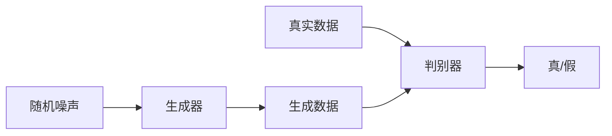

# GAN在医疗影像领域的应用

作者：禅与计算机程序设计艺术

## 1.背景介绍

### 1.1 医疗影像的重要性

医疗影像技术在现代医学中扮演着至关重要的角色。通过影像技术，医生可以非侵入性地观察人体内部结构，帮助诊断疾病、规划治疗方案和评估治疗效果。常见的医疗影像技术包括X射线成像、计算机断层扫描（CT）、磁共振成像（MRI）和超声成像等。

### 1.2 传统方法的局限性

尽管医疗影像技术取得了显著进步，但传统方法仍然存在一些局限性。例如，影像质量可能受到噪声、伪影和分辨率的影响。此外，影像的解释和分析通常依赖于经验丰富的放射科医生，这不仅费时费力，还可能受到主观因素的影响。

### 1.3 人工智能在医疗影像中的应用

近年来，人工智能（AI）技术，尤其是深度学习（Deep Learning）技术，在医疗影像领域展现出了巨大的潜力。通过自动化图像处理和分析，AI可以提高影像质量、减少噪声、增强细节，并辅助医生进行诊断。然而，深度学习模型的训练通常需要大量标注数据，这在医疗领域可能难以获取。

### 1.4 GAN的引入

生成对抗网络（GAN）是由Ian Goodfellow等人在2014年提出的一种深度学习模型。GAN通过两个神经网络——生成器（Generator）和判别器（Discriminator）——相互对抗的方式进行训练，能够生成逼真的数据样本。GAN在图像生成、图像增强和数据增强等方面表现出色，因而在医疗影像领域也得到了广泛关注。

## 2.核心概念与联系

### 2.1 生成对抗网络（GAN）

生成对抗网络（GAN）由两个主要部分组成：生成器（Generator）和判别器（Discriminator）。生成器的任务是生成逼真的假数据，而判别器的任务是辨别数据的真伪。两者通过相互对抗的方式进行训练，生成器不断改进生成的数据质量，直到判别器难以区分真伪数据。

### 2.2 GAN的基本结构

GAN的基本结构可以表示为：

- **生成器（Generator）**：生成器接受一个随机噪声向量（通常是从标准正态分布中采样的向量），并通过一系列神经网络层将其转换为逼真的数据样本。
- **判别器（Discriminator）**：判别器接受输入数据（可能是真实数据，也可能是生成器生成的假数据），并输出一个概率值，表示输入数据是真实数据的概率。

### 2.3 GAN的训练过程

GAN的训练过程可以描述为一个两步循环：

1. **训练判别器**：使用真实数据和生成数据训练判别器，使其能够正确区分真伪数据。
2. **训练生成器**：使用判别器的反馈训练生成器，使其生成的数据能够欺骗判别器。

这种对抗训练的目标是找到一个纳什均衡点，即生成器生成的数据与真实数据在统计上难以区分。

### 2.4 GAN在医疗影像中的应用

在医疗影像领域，GAN的应用主要集中在以下几个方面：

- **图像增强**：通过生成高质量的医疗影像，提升影像的清晰度和分辨率。
- **数据增强**：生成多样化的影像数据，缓解数据匮乏的问题，提升模型的泛化能力。
- **图像分割**：辅助医生进行影像分割，提高分割的准确性和效率。
- **异常检测**：通过生成正常影像与实际影像进行对比，检测异常区域。

## 3.核心算法原理具体操作步骤

### 3.1 生成器的设计

生成器的设计通常包括以下步骤：

1. **输入噪声向量**：生成器接受一个随机噪声向量 $z$，通常从标准正态分布中采样。
2. **全连接层**：将噪声向量通过一个全连接层，扩展到较高维度。
3. **卷积层**：通过一系列反卷积（转置卷积）层，将高维向量转换为图像数据。
4. **激活函数**：使用非线性激活函数（如ReLU或Leaky ReLU）增加模型的非线性能力。
5. **输出层**：最后一层通常使用tanh激活函数，将输出值限制在[-1, 1]范围内。

### 3.2 判别器的设计

判别器的设计通常包括以下步骤：

1. **输入图像**：判别器接受一个图像作为输入，可以是真实图像或生成图像。
2. **卷积层**：通过一系列卷积层，提取图像的特征。
3. **批归一化**：使用批归一化层（Batch Normalization）稳定训练过程。
4. **激活函数**：使用非线性激活函数（如Leaky ReLU）增加模型的非线性能力。
5. **全连接层**：将提取的特征通过全连接层，转换为一个标量值。
6. **输出层**：最后一层通常使用sigmoid激活函数，输出一个概率值，表示图像为真实图像的概率。

### 3.3 GAN的训练步骤

1. **初始化参数**：随机初始化生成器和判别器的参数。
2. **训练判别器**：
    - 从真实数据集中随机抽取一个批次的样本。
    - 从生成器中生成一个批次的假样本。
    - 使用真实样本和假样本训练判别器，更新判别器的参数。
3. **训练生成器**：
    - 从生成器中生成一个批次的假样本。
    - 使用判别器的反馈训练生成器，更新生成器的参数。
4. **重复步骤2和步骤3**，直到生成器生成的样本逼真度达到要求。

## 4.数学模型和公式详细讲解举例说明

### 4.1 GAN的目标函数

GAN的目标是通过对抗训练，使生成器生成的数据与真实数据在统计上难以区分。其目标函数可以表示为：

$$
\min_G \max_D V(D, G) = \mathbb{E}_{x \sim p_{\text{data}}(x)}[\log D(x)] + \mathbb{E}_{z \sim p_z(z)}[\log(1 - D(G(z)))]
$$

其中：
- $G$ 表示生成器
- $D$ 表示判别器
- $p_{\text{data}}(x)$ 表示真实数据的分布
- $p_z(z)$ 表示噪声向量的分布

### 4.2 判别器的损失函数

判别器的损失函数可以表示为：

$$
L_D = -\mathbb{E}_{x \sim p_{\text{data}}(x)}[\log D(x)] - \mathbb{E}_{z \sim p_z(z)}[\log(1 - D(G(z)))]
$$

判别器的目标是最大化 $L_D$，即尽可能正确地区分真实数据和生成数据。

### 4.3 生成器的损失函数

生成器的损失函数可以表示为：

$$
L_G = -\mathbb{E}_{z \sim p_z(z)}[\log D(G(z))]
$$

生成器的目标是最小化 $L_G$，即生成的数据能够欺骗判别器，使其认为生成数据是真实数据。

### 4.4 数学模型举例

假设我们有一个简单的GAN模型，其生成器和判别器分别由两层神经网络组成。生成器的输入是一个100维的随机噪声向量，输出是一个28x28的灰度图像。判别器的输入是一个28x28的灰度图像，输出是一个概率值。

生成器的结构如下：

$$
G(z) = \text{tanh}(W_2 \cdot \text{ReLU}(W_1 \cdot z + b_1) + b_2)
$$

判别器的结构如下：

$$
D(x) = \sigma(W_4 \cdot \text{LeakyReLU}(W_3 \cdot x + b_3) + b_4)
$$

其中：
- $W_1, W_2, W_3, W_4$ 表示权