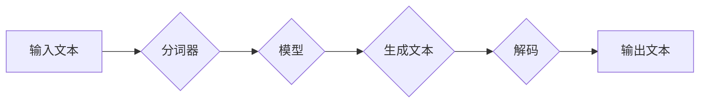

## 1. 背景介绍

### 1.1 人工智能与自然语言处理的简要发展史

人工智能(AI) 的目标是使机器能够像人类一样思考和行动。自20世纪50年代诞生以来，人工智能经历了数次兴衰，但近年来，随着计算能力的提升、数据量的爆炸式增长以及算法的突破，人工智能进入了快速发展的新阶段。自然语言处理(NLP) 作为人工智能的一个重要分支，致力于让机器理解和处理人类语言，其应用场景也日益广泛，例如机器翻译、语音识别、文本摘要等。

### 1.2 GPT系列模型的诞生与发展

近年来，深度学习技术的兴起为自然语言处理带来了革命性的变化。其中，基于Transformer架构的预训练语言模型，如GPT系列模型，凭借其强大的语言理解和生成能力，在众多NLP任务中取得了突破性进展。从最初的GPT到GPT-2，再到参数量高达1.75万亿的GPT-3，GPT系列模型不断刷新着人们对自然语言处理的认知。

### 1.3 GPT模型的优势与应用

相较于传统的NLP模型，GPT模型具有以下优势：

* **强大的语言理解能力**: GPT模型能够学习到丰富的语言知识，并将其应用于各种NLP任务。
* **出色的文本生成能力**: GPT模型能够生成流畅、自然的文本，甚至可以完成一些创造性的写作任务。
* **高效的迁移学习能力**: GPT模型可以被微调用于各种下游任务，无需从头开始训练。

这些优势使得GPT模型在机器翻译、文本摘要、问答系统、对话生成等领域展现出巨大的应用潜力。

## 2. 核心概念与联系

### 2.1 Transformer架构

Transformer架构是GPT模型的核心，它抛弃了传统的循环神经网络(RNN)结构，完全基于注意力机制来建模文本序列之间的依赖关系。

#### 2.1.1 自注意力机制

自注意力机制(Self-Attention) 允许模型在处理一个词时，关注句子中其他词的信息，从而更好地理解词语的上下文语义。

#### 2.1.2 多头注意力机制

多头注意力机制(Multi-Head Attention) 通过将自注意力机制并行执行多次，并对结果进行整合，进一步提升了模型的表达能力。

#### 2.1.3 位置编码

由于Transformer架构没有显式地建模词序信息，因此需要引入位置编码(Positional Encoding) 来为模型提供词序信息。

### 2.2 预训练与微调

GPT模型采用预训练-微调的训练方式。

#### 2.2.1 预训练

在预训练阶段，GPT模型使用海量无标注文本数据进行训练，学习通用的语言知识。

#### 2.2.2 微调

在微调阶段，使用特定任务的标注数据对预训练好的GPT模型进行微调，使其适应具体的应用场景。

### 2.3 词嵌入与词向量

词嵌入(Word Embedding) 是将词语映射到低维向量空间的技术，词向量(Word Vector) 是词语在向量空间中的表示。

#### 2.3.1 独热编码

独热编码(One-Hot Encoding) 将每个词语表示为一个长度为词典大小的向量，其中只有一个元素为1，其余元素均为0。

#### 2.3.2 分布式表示

分布式表示(Distributed Representation) 将每个词语表示为一个低维稠密向量，向量中的每个元素都包含一定的语义信息。

## 3. 核心算法原理具体操作步骤

### 3.1 Transformer编码器-解码器结构

GPT模型采用Transformer的编码器-解码器结构。

#### 3.1.1 编码器

编码器由多个Transformer Block堆叠而成，每个Transformer Block包含多头注意力层、前馈神经网络层以及残差连接和层归一化等组件。

#### 3.1.2 解码器

解码器与编码器结构类似，但解码器中的多头注意力层只能关注已经生成的词语，以保证文本生成的顺序性。

### 3.2 自回归语言模型

GPT模型是一个自回归语言模型(Autoregressive Language Model)，它根据已有的词语序列预测下一个词语的概率分布。

#### 3.2.1 条件概率

GPT模型使用条件概率来建模语言，即根据已有的词语序列计算下一个词语的概率。

#### 3.2.2 词汇表

词汇表(Vocabulary) 是模型所能理解的所有词语的集合。

### 3.3 训练过程

GPT模型的训练过程包括预训练和微调两个阶段。

#### 3.3.1 预训练阶段

在预训练阶段，使用海量无标注文本数据对模型进行训练，目标是最大化模型对文本数据的预测概率。

#### 3.3.2 微调阶段

在微调阶段，使用特定任务的标注数据对预训练好的模型进行微调，目标是最小化模型在该任务上的损失函数。

## 4. 数学模型和公式详细讲解举例说明

### 4.1 自注意力机制

自注意力机制的计算过程可以表示为：

$$
\text{Attention}(Q, K, V) = \text{softmax}(\frac{QK^T}{\sqrt{d_k}})V
$$

其中，$Q$、$K$、$V$ 分别表示查询矩阵、键矩阵和值矩阵，$d_k$ 表示键向量的维度，$\text{softmax}$ 函数用于将注意力权重归一化到0到1之间。

### 4.2 多头注意力机制

多头注意力机制将自注意力机制并行执行多次，并对结果进行拼接，最后通过一个线性变换得到最终的输出：

$$
\text{MultiHeadAttention}(Q, K, V) = \text{Concat}(\text{head}_1, ..., \text{head}_h)W^O
$$

其中，$\text{head}_i = \text{Attention}(QW_i^Q, KW_i^K, VW_i^V)$，$W_i^Q$、$W_i^K$、$W_i^V$ 和 $W^O$ 都是可学习的参数矩阵。

### 4.3 交叉熵损失函数

在预训练阶段，GPT模型使用交叉熵损失函数来衡量模型预测的概率分布与真实概率分布之间的差异：

$$
\text{Loss} = -\frac{1}{N}\sum_{i=1}^N \sum_{j=1}^V y_{ij} \log(\hat{y}_{ij})
$$

其中，$N$ 表示训练样本的数量，$V$ 表示词汇表的大小，$y_{ij}$ 表示第 $i$ 个样本的第 $j$ 个词语的真实概率，$\hat{y}_{ij}$ 表示模型预测的概率。

## 5. 项目实践：代码实例和详细解释说明

### 5.1 使用Python和Transformers库实现GPT文本生成

```python
from transformers import GPT2Tokenizer, GPT2LMHeadModel

# 加载预训练的GPT-2模型和分词器
tokenizer = GPT2Tokenizer.from_pretrained("gpt2")
model = GPT2LMHeadModel.from_pretrained("gpt2")

# 定义输入文本
text = "The quick brown fox jumps over the"

# 对输入文本进行编码
input_ids = tokenizer.encode(text, add_special_tokens=True)

# 使用模型生成文本
output = model.generate(input_ids=input_ids, max_length=50, num_return_sequences=3)

# 对生成的文本进行解码
for i, sequence in enumerate(output):
    print(f"Generated text {i+1}: {tokenizer.decode(sequence, skip_special_tokens=True)}")
```

### 5.2 代码解释

* 首先，我们使用 `transformers` 库加载预训练的GPT-2模型和分词器。
* 然后，我们定义输入文本 "The quick brown fox jumps over the"，并使用分词器对其进行编码。
* 接下来，我们使用 `model.generate()` 方法生成文本，其中 `max_length` 参数指定生成文本的最大长度，`num_return_sequences` 参数指定生成文本的数量。
* 最后，我们使用分词器的 `decode()` 方法对生成的文本进行解码，并打印出来。

### 5.3  Mermaid 流程图



## 6. 实际应用场景

### 6.1 机器翻译

GPT模型可以用于机器翻译，将一种语言的文本翻译成另一种语言的文本。

### 6.2 文本摘要

GPT模型可以用于文本摘要，将一篇长文本压缩成简短的摘要，保留关键信息。

### 6.3 问答系统

GPT模型可以用于问答系统，根据用户提出的问题，从知识库中检索相关信息并生成答案。

### 6.4 对话生成

GPT模型可以用于对话生成，模拟人类之间的对话，例如聊天机器人。

## 7. 总结：未来发展趋势与挑战

### 7.1 模型规模与计算效率

未来的GPT模型将会更大、更复杂，需要更高的计算能力和更优化的算法来支持。

### 7.2 数据质量与多样性

GPT模型的性能很大程度上取决于训练数据的质量和多样性，未来需要更多高质量、多样化的数据来训练更强大的模型。

### 7.3 模型的可解释性与可控性

GPT模型的可解释性和可控性仍然是一个挑战，未来需要开发新的技术来解释模型的决策过程，并控制模型的输出。

## 8. 附录：常见问题与解答

### 8.1 GPT模型与BERT模型的区别是什么？

GPT模型和BERT模型都是基于Transformer架构的预训练语言模型，但它们在预训练任务和模型结构上有所不同。GPT模型是一个自回归语言模型，而BERT模型是一个双向编码器模型。

### 8.2 如何微调GPT模型？

微调GPT模型需要使用特定任务的标注数据，并调整模型的参数以适应新的任务。

### 8.3 GPT模型有哪些局限性？

GPT模型也存在一些局限性，例如：

* **缺乏常识推理能力**
* **容易生成有偏见或不道德的文本**
* **对长文本的处理能力有限**

## 
