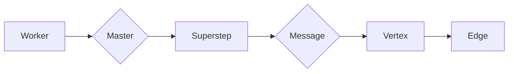

# Giraph原理与代码实例讲解

作者：禅与计算机程序设计艺术

## 1. 背景介绍

### 1.1 图数据处理的挑战

近年来，随着社交网络、电子商务、生物信息等领域的快速发展，图数据规模呈爆炸式增长，如何高效地存储、处理和分析海量图数据成为一个巨大的挑战。传统的单机系统难以满足日益增长的数据规模和计算需求，分布式图计算应运而生。

### 1.2 分布式图计算框架

分布式图计算框架旨在利用集群的计算资源来处理大规模图数据。这些框架通常采用**顶点中心计算模型**，将图数据划分为多个子图，并分配到不同的计算节点进行并行处理。

### 1.3 Giraph简介

Giraph是Google开发的一个开源的迭代图处理系统，基于Pregel模型实现。它利用Hadoop的分布式文件系统HDFS存储大规模图数据，并使用MapReduce计算模型进行并行计算。Giraph能够高效地处理各种图算法，如PageRank、最短路径、连通图等。

## 2. 核心概念与联系

### 2.1 顶点中心计算模型

Giraph采用**顶点中心计算模型**，每个顶点代表图中的一个实体，边代表实体之间的关系。在每次迭代中，每个顶点都会接收到来自邻居顶点的消息，并根据接收到的消息更新自身状态，然后发送消息给邻居顶点。这个过程不断重复，直到达到预设的迭代次数或收敛条件。

### 2.2 Pregel模型

Pregel模型是一种基于消息传递的迭代计算模型，它将图算法抽象为三个步骤：

1. **初始化阶段:** 每个顶点初始化自身状态。
2. **迭代计算阶段:** 每个顶点接收来自邻居顶点的消息，并根据消息更新自身状态，然后发送消息给邻居顶点。
3. **终止阶段:** 当所有顶点都处于非活跃状态时，算法终止。

### 2.3 Giraph中的核心概念

* **Worker:** Giraph集群中的计算节点，负责执行图计算任务。
* **Master:** Giraph集群中的主节点，负责协调Worker节点的工作，管理图数据分区，以及监控任务执行进度。
* **Superstep:** Giraph计算过程中的一个迭代步骤。
* **Message:** 顶点之间传递的信息。
* **Vertex:** 图中的一个顶点，包含顶点ID、值和边信息。
* **Edge:** 图中的一条边，连接两个顶点。

### 2.4 核心概念联系图



## 3. 核心算法原理与操作步骤

### 3.1 PageRank算法原理

PageRank算法用于评估网页的重要性，其基本思想是：一个网页越重要，访问它的其他网页就越多，而且这些网页的重要性也越高。PageRank算法通过迭代计算每个网页的PR值来评估网页的重要性。

### 3.2 PageRank算法在Giraph中的实现步骤

1. **初始化阶段:** 每个顶点初始化自身的PR值为1/N，其中N为图中顶点的总数。
2. **迭代计算阶段:** 每个顶点接收来自邻居顶点的消息，消息内容为邻居顶点的PR值除以邻居顶点的出度。每个顶点将接收到的所有消息求和，乘以阻尼系数(通常设置为0.85)，再加上(1-阻尼系数)/N，得到新的PR值。
3. **终止阶段:** 当所有顶点的PR值变化小于预设的阈值时，算法终止。

### 3.3 PageRank算法代码实例

```java
public class PageRankVertex extends BasicComputationGraphVertex<LongWritable, DoubleWritable, FloatWritable, DoubleWritable> {

    private static final double DAMPING_FACTOR = 0.85;

    @Override
    public void compute(Iterable<DoubleWritable> messages) throws IOException {
        if (getSuperstep() == 0) {
            // 初始化PR值
            setValue(new DoubleWritable(1.0 / getTotalNumVertices()));
        } else {
            // 计算新的PR值
            double sum = 0;
            for (DoubleWritable message : messages) {
                sum += message.get();
            }
            double newPr = (1 - DAMPING_FACTOR) / getTotalNumVertices() + DAMPING_FACTOR * sum;
            setValue(new DoubleWritable(newPr));
        }

        // 发送消息给邻居顶点
        if (getSuperstep() < 30) {
            sendMessageToAllEdges(new DoubleWritable(getValue().get() / getNumEdges()));
        } else {
            voteToHalt();
        }
    }
}
```

## 4. 数学模型和公式详细讲解与举例说明

### 4.1 PageRank算法数学模型

PageRank算法的数学模型可以表示为一个线性方程组：

$$
\mathbf{R} = (1 - d) \mathbf{E} + d \mathbf{A} \mathbf{R}
$$

其中：

* $\mathbf{R}$ 是一个向量，表示每个网页的PR值。
* $d$ 是阻尼系数，通常设置为0.85。
* $\mathbf{E}$ 是一个向量，所有元素都为1/N，表示每个网页的初始PR值。
* $\mathbf{A}$ 是图的转移矩阵，表示从一个网页跳转到另一个网页的概率。

### 4.2 转移矩阵的计算

转移矩阵 $\mathbf{A}$ 的计算方法如下：

$$
\mathbf{A}_{ij} = \left\{
\begin{array}{ll}
\frac{1}{L(p_j)} & \text{如果网页} p_j \text{有指向网页} p_i \text{的链接} \\
0 & \text{否则}
\end{array}
\right.
$$

其中：

* $L(p_j)$ 表示网页 $p_j$ 的出度，即网页 $p_j$ 指向的网页数量。

### 4.3 举例说明

假设有一个由四个网页组成的网络，其链接关系如下图所示：

```
   +---+     +---+
   | 1 | ---->| 2 |
   +---+     +---+
    ^  \      /  |
    |   \    /   |
    |    \  /    |
   +---+  \/   +---+
   | 4 | ----->| 3 |
   +---+     +---+
```

则其转移矩阵为：

$$
\mathbf{A} = \begin{bmatrix}
0 & 1 & 0 & 0 \\
0 & 0 & 1 & 0 \\
1 & 0 & 0 & 1 \\
1 & 0 & 0 & 0
\end{bmatrix}
$$

假设阻尼系数 $d$ 为 0.85，则 PageRank 算法的线性方程组为：

$$
\begin{bmatrix}
R_1 \\
R_2 \\
R_3 \\
R_4
\end{bmatrix} = 0.15 \begin{bmatrix}
0.25 \\
0.25 \\
0.25 \\
0.25
\end{bmatrix} + 0.85 \begin{bmatrix}
0 & 1 & 0 & 0 \\
0 & 0 & 1 & 0 \\
1 & 0 & 0 & 1 \\
1 & 0 & 0 & 0
\end{bmatrix} \begin{bmatrix}
R_1 \\
R_2 \\
R_3 \\
R_4
\end{bmatrix}
$$

解得：

$$
\begin{bmatrix}
R_1 \\
R_2 \\
R_3 \\
R_4
\end{bmatrix} = \begin{bmatrix}
0.15 \\
0.2125 \\
0.425 \\
0.2125
\end{bmatrix}
$$

因此，网页 3 的 PR 值最高，为 0.425，其次是网页 2 和网页 4，PR 值均为 0.2125，网页 1 的 PR 值最低，为 0.15。

## 5. 项目实践：代码实例和详细解释说明

### 5.1 构建Giraph项目

使用Maven构建Giraph项目，需要在pom.xml文件中添加Giraph依赖：

```xml
<dependency>
  <groupId>org.apache.giraph</groupId>
  <artifactId>giraph-core</artifactId>
  <version>1.3.0</version>
</dependency>
```

### 5.2 编写Giraph应用程序

编写Giraph应用程序需要继承`BasicComputationGraphVertex`类，并实现`compute()`方法。在`compute()`方法中，可以访问顶点的值、边信息以及接收到的消息，并根据算法逻辑更新顶点值和发送消息。

### 5.3 运行Giraph应用程序

可以使用Hadoop命令行工具运行Giraph应用程序，例如：

```
hadoop jar giraph-examples-1.3.0-jar-with-dependencies.jar org.apache.giraph.examples.SimpleShortestPathsComputation -vif org.apache.giraph.io.formats.JsonLongDoubleFloatDoubleVertexInputFormat -vip input/graph.json -vof org.apache.giraph.io.formats.IdWithValueTextOutputFormat -op output/shortestpaths -workers 2
```

其中：

* `giraph-examples-1.3.0-jar-with-dependencies.jar` 是Giraph应用程序jar包。
* `org.apache.giraph.examples.SimpleShortestPathsComputation` 是Giraph应用程序主类。
* `-vif` 指定输入数据格式。
* `-vip` 指定输入数据路径。
* `-vof` 指定输出数据格式。
* `-op` 指定输出数据路径。
* `-workers` 指定Worker节点数量。

### 5.4 代码实例

以下是一个简单的Giraph应用程序示例，用于计算图中每个顶点到指定源顶点的最短路径：

```java
import org.apache.giraph.graph.BasicComputationGraphVertex;
import org.apache.giraph.conf.LongConfOption;
import org.apache.hadoop.io.DoubleWritable;
import org.apache.hadoop.io.FloatWritable;
import org.apache.hadoop.io.LongWritable;
import java.io.IOException;

public class SimpleShortestPathsComputation extends BasicComputationGraphVertex<LongWritable, DoubleWritable, FloatWritable, DoubleWritable> {

    /** The shortest paths id */
    public static final LongConfOption SOURCE_ID =
        new LongConfOption("SimpleShortestPathsVertex.sourceId", 1,
            "The shortest paths id");

    /**
     * Is this vertex the source id?
     *
     * @param vertex Vertex
     * @return True if the source id
     */
    private boolean isSource(BasicComputationGraphVertex<LongWritable, ?, ?, ?> vertex) {
        return vertex.getId().get() == SOURCE_ID.get(getConf());
    }

    @Override
    public void compute(Iterable<DoubleWritable> messages) throws IOException {
        if (getSuperstep() == 0) {
            // 初始化距离
            setValue(new DoubleWritable(isSource(this) ? 0d : Double.MAX_VALUE));
        }

        // 查找最短路径
        double minDist = isSource(this) ? 0d : Double.MAX_VALUE;
        for (DoubleWritable message : messages) {
            minDist = Math.min(minDist, message.get());
        }

        // 如果找到更短路径，则更新距离并发送消息
        if (minDist < getValue().get()) {
            setValue(new DoubleWritable(minDist));
            for (Edge<LongWritable, FloatWritable> edge : getEdges()) {
                double distance = minDist + edge.getValue().get();
                sendMessage(edge.getTargetVertexId(), new DoubleWritable(distance));
            }
        }

        // 投票结束
        voteToHalt();
    }
}
```

## 6. 实际应用场景

Giraph 在实际应用中有着广泛的应用，例如：

* **社交网络分析:** 分析用户之间的关系，识别社区结构，进行用户推荐等。
* **网页排名:** 计算网页的重要性，用于搜索引擎结果排序。
* **交通流量预测:** 分析道路网络交通流量，预测拥堵情况。
* **机器学习:** 进行图数据上的机器学习任务，例如节点分类、链接预测等。

## 7. 工具和资源推荐

* **Giraph官网:** https://giraph.apache.org/
* **Giraph文档:** https://giraph.apache.org/documentation.html
* **Giraph源码:** https://github.com/apache/giraph

## 8. 总结：未来发展趋势与挑战

### 8.1 未来发展趋势

* **图数据库:** 图数据库将成为存储和管理大规模图数据的标准解决方案。
* **图神经网络:** 图神经网络将在图数据上的机器学习任务中发挥越来越重要的作用。
* **实时图计算:** 实时图计算将成为处理动态图数据的关键技术。

### 8.2 面临的挑战

* **图数据规模:** 图数据的规模将持续增长，对图计算框架的性能和可扩展性提出更高要求。
* **图数据复杂性:** 图数据将变得更加复杂，例如包含多种类型的节点和边，需要更加灵活和强大的图计算模型。
* **图计算效率:** 如何提高图计算效率，降低计算成本，是未来需要解决的关键问题。

## 9. 附录：常见问题与解答

### 9.1 Giraph与其他图计算框架的比较

| 特性 | Giraph | Spark GraphX | Pregel |
|---|---|---|---|
| 计算模型 | 顶点中心 | 顶点中心 | 顶点中心 |
| 编程模型 | Pregel | Pregel | Pregel |
| 数据存储 | HDFS | 分布式内存 | 分布式文件系统 |
| 容错机制 | 基于Hadoop | 基于RDD | 基于checkpoint |
| 社区活跃度 | 活跃 | 活跃 | 不活跃 |

### 9.2 Giraph的优缺点

**优点:**

* 成熟稳定：由Google开发并开源，经过大规模实际应用验证。
* 高效可扩展：基于Hadoop平台，能够处理数十亿级别的顶点和边。
* 易于使用：提供丰富的API和示例代码，方便用户开发图算法。

**缺点:**

* 迭代计算开销大：每次迭代都需要进行全局同步，通信开销较大。
* 不适用于实时计算：Giraph主要用于离线批处理，不适用于实时图计算。


## 10. 后记

本文详细介绍了Giraph的原理、架构、算法实现以及应用场景，并结合代码实例进行了讲解。Giraph作为一款成熟的分布式图计算框架，在处理大规模图数据方面具有显著优势，但也存在一些不足之处。未来，随着图数据规模和复杂性的不断增加，Giraph需要不断优化和改进，以满足日益增长的图计算需求。
