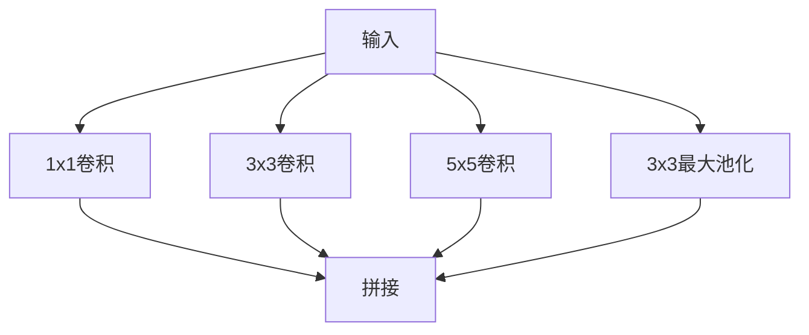
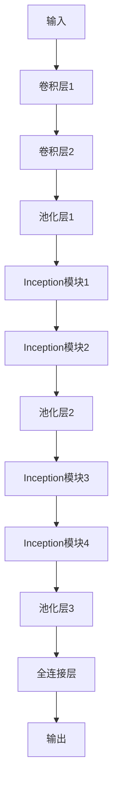

# GoogLeNet：模块化设计的典范

作者：禅与计算机程序设计艺术

## 1. 背景介绍

### 1.1 深度学习的崛起

在过去的十年里，深度学习已经成为人工智能领域最为重要的技术之一。特别是在计算机视觉领域，深度学习的表现尤为突出。从AlexNet到VGG，再到ResNet，深度学习模型不断在ImageNet等大型数据集上刷新记录。GoogLeNet作为其中的一个重要里程碑，以其独特的模块化设计，极大地提升了模型的性能和效率。

### 1.2 GoogLeNet的诞生

GoogLeNet是由Google团队在2014年提出的，其名字来源于其开发团队Google和其网络结构（Network）的结合。GoogLeNet的核心创新在于引入了一种名为“Inception”的模块化设计，这种设计极大地提升了模型的计算效率和准确性。

### 1.3 研究目标

本篇文章将深入探讨GoogLeNet的设计理念、核心算法、数学模型及其实际应用。通过对这些内容的详细解析，读者将能够全面理解GoogLeNet的技术细节，并能够在实际项目中应用这些知识。

## 2. 核心概念与联系

### 2.1 Inception模块

Inception模块是GoogLeNet的核心组件。其设计理念是通过并行的卷积操作，捕捉不同尺度的信息。Inception模块通过1x1、3x3、5x5卷积以及3x3最大池化操作，并将这些操作的输出在通道维度上进行拼接。



### 2.2 模块化设计的优势

模块化设计使得GoogLeNet在多个方面具有显著优势：

1. **计算效率**：通过并行计算，Inception模块能够更高效地利用计算资源。
2. **特征提取能力**：不同尺度的卷积操作可以捕捉到不同层次的特征信息。
3. **参数优化**：模块化设计使得模型参数更加易于优化，从而提升了模型的性能。

### 2.3 GoogLeNet与其他模型的对比

与AlexNet和VGG等传统模型相比，GoogLeNet在参数数量和计算效率上具有显著优势。其通过引入Inception模块，大幅减少了模型参数，同时提升了模型的表现。

## 3. 核心算法原理具体操作步骤

### 3.1 GoogLeNet的整体架构

GoogLeNet的整体架构由多个Inception模块组成，每个模块之间通过卷积层和池化层连接。整个网络结构如下：



### 3.2 Inception模块的详细操作

每个Inception模块内部的操作步骤如下：

1. **输入**：接收来自上一层的特征图。
2. **并行卷积操作**：进行1x1、3x3、5x5卷积操作，同时进行3x3最大池化操作。
3. **拼接**：将所有并行操作的输出在通道维度上进行拼接，形成新的特征图。

### 3.3 参数选择与优化

在设计Inception模块时，需要对以下参数进行选择与优化：

1. **卷积核大小**：选择合适的卷积核大小，以平衡计算效率和特征提取能力。
2. **通道数**：确定每个卷积操作的输出通道数，以控制模型的参数数量和计算复杂度。
3. **池化操作**：选择合适的池化操作，以减少特征图的尺寸，同时保留重要的特征信息。

## 4. 数学模型和公式详细讲解举例说明

### 4.1 卷积操作的数学模型

卷积操作是GoogLeNet的核心计算单元，其数学模型如下：

$$
Y[i, j] = \sum_{m=0}^{M-1} \sum_{n=0}^{N-1} X[i+m, j+n] \cdot W[m, n]
$$

其中，$Y[i, j]$ 表示输出特征图的元素，$X[i+m, j+n]$ 表示输入特征图的元素，$W[m, n]$ 表示卷积核的元素。

### 4.2 Inception模块的数学描述

Inception模块的输出可以表示为以下数学公式的组合：

$$
Y_{1x1}[i, j] = \sum_{m=0}^{0} \sum_{n=0}^{0} X[i+m, j+n] \cdot W_{1x1}[m, n]
$$

$$
Y_{3x3}[i, j] = \sum_{m=0}^{2} \sum_{n=0}^{2} X[i+m, j+n] \cdot W_{3x3}[m, n]
$$

$$
Y_{5x5}[i, j] = \sum_{m=0}^{4} \sum_{n=0}^{4} X[i+m, j+n] \cdot W_{5x5}[m, n]
$$

$$
Y_{pool}[i, j] = \max_{m=0}^{2} \max_{n=0}^{2} X[i+m, j+n]
$$

最终输出特征图为上述各个输出的拼接：

$$
Y = [Y_{1x1}, Y_{3x3}, Y_{5x5}, Y_{pool}]
$$

### 4.3 参数优化的数学方法

在训练GoogLeNet时，使用标准的反向传播算法进行参数优化。其损失函数为交叉熵损失：

$$
L = -\sum_{i=1}^{N} y_i \log(\hat{y}_i)
$$

其中，$y_i$ 表示真实标签，$\hat{y}_i$ 表示预测概率。

## 5. 项目实践：代码实例和详细解释说明

### 5.1 环境配置

在进行GoogLeNet的项目实践之前，需要配置好开发环境。以下是所需的主要工具和库：

- Python 3.x
- TensorFlow 或 PyTorch
- NumPy
- Matplotlib

### 5.2 GoogLeNet的实现代码

以下是使用TensorFlow实现GoogLeNet的代码示例：

```python
import tensorflow as tf
from tensorflow.keras import layers, models

def inception_module(x, filters):
    f1, f3_r, f3, f5_r, f5, pool_proj = filters

    conv1 = layers.Conv2D(f1, (1, 1), padding='same', activation='relu')(x)

    conv3 = layers.Conv2D(f3_r, (1, 1), padding='same', activation='relu')(x)
    conv3 = layers.Conv2D(f3, (3, 3), padding='same', activation='relu')(conv3)

    conv5 = layers.Conv2D(f5_r, (1, 1), padding='same', activation='relu')(x)
    conv5 = layers.Conv2D(f5, (5, 5), padding='same', activation='relu')(conv5)

    pool = layers.MaxPooling2D((3, 3), strides=(1, 1), padding='same')(x)
    pool = layers.Conv2D(pool_proj, (1, 1), padding='same', activation='relu')(pool)

    output = layers.concatenate([conv1, conv3, conv5, pool], axis=-1)
    return output

def build_googlenet(input_shape):
    input_layer = layers.Input(shape=input_shape)

    x = layers.Conv2D(64, (7, 7), strides=(2, 2), padding='same', activation='relu')(input_layer)
    x = layers.MaxPooling2D((3, 3), strides=(2, 2), padding='same')(x)
    x = layers.Conv2D(192, (3, 3), padding='same', activation='relu')(