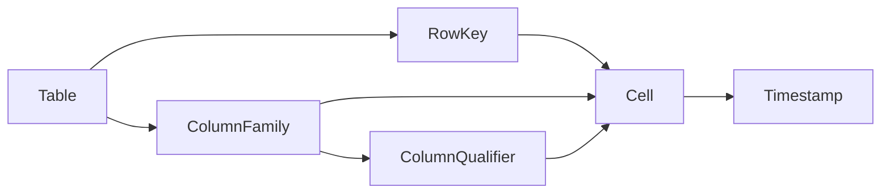

## 1. 背景介绍

### 1.1 大数据时代的存储挑战

随着互联网和移动互联网的飞速发展，全球数据量呈爆炸式增长，传统的数据库技术已经难以满足海量数据的存储和处理需求。关系型数据库（RDBMS）在处理结构化数据方面表现出色，但面对海量数据的扩展性和性能瓶颈逐渐显现。

### 1.2 非关系型数据库的崛起

为了应对大数据带来的挑战，NoSQL（Not Only SQL）数据库应运而生。NoSQL数据库放弃了传统关系型数据库的 ACID 特性，以牺牲部分一致性为代价，换取更高的性能、可扩展性和可用性。

### 1.3 HBase：面向列的分布式存储系统

HBase 是一种开源的、面向列的分布式存储系统，构建在 Hadoop 生态系统之上。它可以存储海量结构化和半结构化数据，并提供高可靠性、高性能和可扩展性。

## 2. 核心概念与联系

### 2.1 表（Table）

HBase 中的数据以表的形式组织，表由行和列组成。

### 2.2 行键（Row Key）

行键是 HBase 表中的唯一标识符，用于对数据进行排序和检索。

### 2.3 列族（Column Family）

列族是 HBase 表中列的逻辑分组，同一列族中的列存储在一起。

### 2.4 列限定符（Column Qualifier）

列限定符用于标识列族中的特定列。

### 2.5 单元格（Cell）

单元格是 HBase 表中的最小数据单元，由行键、列族、列限定符和时间戳唯一标识。

### 2.6 时间戳（Timestamp）

时间戳用于标识单元格的不同版本，HBase 默认保存数据的多个版本。

### 2.7 核心概念联系



## 3. 核心算法原理具体操作步骤

### 3.1 数据写入流程

1. 客户端发起写入请求，指定要写入数据的表名、行键、列族、列限定符和值。
2. HBase 找到对应 RegionServer 上的 Region。
3. RegionServer 将数据写入内存中的 MemStore。
4. 当 MemStore 大小达到阈值时，数据会被刷写到磁盘上的 HFile 文件中。
5. HBase 会定期合并多个 HFile 文件，以减少文件数量和提高读性能。

### 3.2 数据读取流程

1. 客户端发起读取请求，指定要读取数据的表名、行键、列族和列限定符。
2. HBase 找到对应 RegionServer 上的 Region。
3. RegionServer 首先检查内存中的 MemStore 是否缓存了请求的数据。
4. 如果 MemStore 中没有缓存数据，则会从磁盘上的 HFile 文件中读取数据。
5. RegionServer 将读取到的数据返回给客户端。

## 4. 数学模型和公式详细讲解举例说明

### 4.1 数据存储模型

HBase 使用的是 Key-Value 数据模型，其中 Key 由行键、列族、列限定符和时间戳组成，Value 是存储的数据。

### 4.2 数据分布模型

HBase 使用的是基于 Region 的数据分布模型，每个 Region 负责存储一部分数据。当 Region 大小超过阈值时，会自动分裂成两个 Region。

### 4.3 数据一致性模型

HBase 支持最终一致性，即数据写入操作完成后，其他客户端可能无法立即读取到最新数据。

## 5. 项目实践：代码实例和详细解释说明

### 5.1 Java API 示例

```java
// 创建 HBase 连接
Configuration config = HBaseConfiguration.create();
Connection connection = ConnectionFactory.createConnection(config);

// 获取 HBase 表
Table table = connection.getTable(TableName.valueOf("test_table"));

// 插入数据
Put put = new Put(Bytes.toBytes("row_key_1"));
put.addColumn(Bytes.toBytes("cf"), Bytes.toBytes("cq"), Bytes.toBytes("value"));
table.put(put);

// 读取数据
Get get = new Get(Bytes.toBytes("row_key_1"));
Result result = table.get(get);
byte[] value = result.getValue(Bytes.toBytes("cf"), Bytes.toBytes("cq"));

// 关闭连接
table.close();
connection.close();
```

### 5.2 代码解释

- `Configuration` 类用于配置 HBase 连接参数。
- `ConnectionFactory` 类用于创建 HBase 连接。
- `Table` 类表示 HBase 表。
- `Put` 类表示插入数据操作。
- `Get` 类表示读取数据操作。
- `Result` 类表示读取到的数据。

## 6. 实际应用场景

### 6.1 日志存储

HBase 可以存储海量日志数据，并提供高效的查询和分析功能。

### 6.2 电商推荐系统

HBase 可以存储用户的浏览历史、购买记录等信息，用于构建个性化推荐系统。

### 6.3 社交网络数据分析

HBase 可以存储用户的社交关系、发布内容等信息，用于分析用户行为和社交网络结构。

## 7. 工具和资源推荐

### 7.1 HBase Shell

HBase Shell 是 HBase 提供的命令行工具，可以用于管理 HBase 集群、操作 HBase 表数据等。

### 7.2 Apache Phoenix

Apache Phoenix 是构建在 HBase 之上的 SQL 查询引擎，可以使用标准 SQL 语句查询 HBase 数据。

### 7.3 HBase 官方文档

HBase 官方文档提供了详细的 HBase 介绍、安装部署、API 使用等信息。

## 8. 总结：未来发展趋势与挑战

### 8.1 未来发展趋势

- 云原生 HBase
- 更高的性能和可扩展性
- 更丰富的功能和生态系统

### 8.2 面临的挑战

- 数据一致性问题
- 运维管理复杂度

## 9. 附录：常见问题与解答

### 9.1 如何选择 HBase 行键？

- 行键应该尽可能短，以减少存储空间和提高查询性能。
- 行键应该能够区分不同的行，避免数据冲突。
- 行键应该尽量保持均匀分布，避免数据倾斜。

### 9.2 如何优化 HBase 读写性能？

- 合理设置 HBase 参数，例如缓存大小、块大小等。
- 使用预分区技术，避免 Region 热点问题。
- 使用数据压缩技术，减少存储空间和网络传输量。

### 9.3 HBase 与其他 NoSQL 数据库的区别？

- HBase 是面向列的存储系统，而 Cassandra 和 MongoDB 是面向文档的存储系统。
- HBase 支持强一致性，而 Cassandra 和 MongoDB 只支持最终一致性。
- HBase 更适合存储海量结构化和半结构化数据，而 Cassandra 和 MongoDB 更适合存储非结构化数据。
