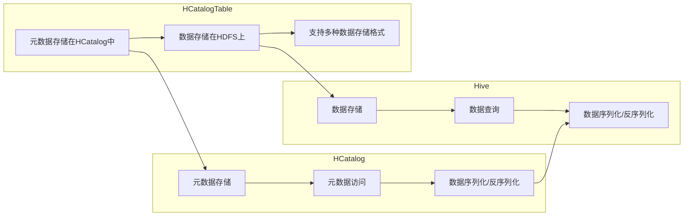

# HCatalogTable数据仓库架构：构建企业级数据仓库

作者：禅与计算机程序设计艺术

## 1. 背景介绍

### 1.1 数据仓库的演进与挑战

随着企业信息化程度的不断提高，数据量呈现爆炸式增长，如何有效地存储、管理和分析海量数据成为了企业面临的巨大挑战。传统的关系型数据库难以满足海量数据的存储和查询需求，数据仓库应运而生。数据仓库经历了从简单的数据集市到复杂的数据湖的发展历程，其架构也在不断演进以适应不断变化的需求。

### 1.2 HCatalogTable的优势与适用场景

HCatalogTable是基于Hadoop生态系统构建的数据仓库解决方案，它结合了Hive的元数据管理能力和Hadoop的分布式存储和计算能力，为企业构建高性能、高可扩展、高可靠的数据仓库提供了新的选择。

HCatalogTable的优势主要体现在：

* **高扩展性:** HCatalogTable基于Hadoop分布式文件系统（HDFS）存储数据，可以轻松扩展至PB级甚至EB级的数据规模。
* **高性能:** HCatalogTable支持多种数据存储格式，包括ORC、Parquet等列式存储格式，并可以利用Hive的查询优化器进行查询加速。
* **高可靠性:** HCatalogTable的数据存储在HDFS上，具有高容错性和数据安全性。
* **易用性:** HCatalogTable提供了类似于传统关系型数据库的SQL接口，用户可以使用熟悉的SQL语句进行数据查询和分析。

HCatalogTable适用于以下场景：

* 需要存储和分析海量结构化和半结构化数据的企业。
* 需要构建高性能、高可扩展、高可靠的数据仓库的企业。
* 需要使用SQL进行数据查询和分析的企业。

## 2. 核心概念与联系

### 2.1 HCatalog

HCatalog是Hadoop生态系统中的元数据管理服务，它提供了一个统一的接口来访问存储在不同数据存储系统中的元数据，例如Hive、HBase等。HCatalog的主要功能包括：

* **元数据存储:** HCatalog将元数据存储在一个集中式的数据库中，例如MySQL、PostgreSQL等。
* **元数据访问:** HCatalog提供了一套API和命令行工具，方便用户访问和管理元数据。
* **数据序列化/反序列化:** HCatalog支持多种数据序列化/反序列化格式，例如Avro、Thrift等，可以方便地将数据存储到不同的数据存储系统中。

### 2.2 Hive

Hive是构建在Hadoop上的数据仓库工具，它提供了一种类似于SQL的查询语言（HiveQL）来查询和分析存储在Hadoop上的数据。Hive的主要功能包括：

* **数据存储:** Hive支持将数据存储在不同的数据存储系统中，例如HDFS、HBase等。
* **数据查询:** Hive提供了一种类似于SQL的查询语言（HiveQL）来查询和分析数据。
* **数据序列化/反序列化:** Hive支持多种数据序列化/反序列化格式，例如TextFile、ORC、Parquet等。

### 2.3 HCatalogTable

HCatalogTable是Hive中的一种表类型，它将Hive的元数据管理能力和Hadoop的分布式存储和计算能力结合起来，提供了一种高性能、高可扩展、高可靠的数据存储方案。HCatalogTable的主要特点包括：

* **元数据存储在HCatalog中:** HCatalogTable的元数据存储在HCatalog中，可以方便地与其他Hadoop工具集成。
* **数据存储在HDFS上:** HCatalogTable的数据存储在HDFS上，可以利用HDFS的高容错性和数据安全性。
* **支持多种数据存储格式:** HCatalogTable支持多种数据存储格式，包括ORC、Parquet等列式存储格式，并可以利用Hive的查询优化器进行查询加速。

### 2.4 核心概念联系

HCatalog、Hive和HCatalogTable之间的关系可以用下图表示：



## 3. 核心算法原理具体操作步骤

### 3.1 创建HCatalogTable

创建HCatalogTable的步骤如下：

1. **创建数据库:** 使用HiveQL语句创建数据库，例如：

```sql
CREATE DATABASE IF NOT EXISTS my_database;
```

2. **创建HCatalogTable:** 使用HiveQL语句创建HCatalogTable，并指定表的名称、字段、数据存储格式等信息，例如：

```sql
CREATE TABLE my_database.my_table (
    id INT,
    name STRING,
    age INT
)
STORED AS ORC
TBLPROPERTIES (
    'transactional'='true'
);
```

### 3.2 数据加载

数据加载到HCatalogTable的步骤如下：

1. **将数据上传到HDFS:** 可以使用Hadoop命令行工具或者其他数据传输工具将数据上传到HDFS上。
2. **创建外部表:** 使用HiveQL语句创建外部表，并指定数据所在的HDFS路径、数据格式等信息，例如：

```sql
CREATE EXTERNAL TABLE my_database.my_external_table (
    id INT,
    name STRING,
    age INT
)
ROW FORMAT DELIMITED
FIELDS TERMINATED BY ','
STORED AS TEXTFILE
LOCATION '/user/hive/warehouse/my_data';
```

3. **将数据加载到HCatalogTable:** 使用HiveQL语句将数据从外部表加载到HCatalogTable中，例如：

```sql
INSERT INTO TABLE my_database.my_table
SELECT * FROM my_database.my_external_table;
```

### 3.3 数据查询

查询HCatalogTable中的数据的步骤如下：

1. **使用HiveQL语句查询数据:** 可以使用类似于SQL的HiveQL语句查询HCatalogTable中的数据，例如：

```sql
SELECT * FROM my_database.my_table WHERE age > 30;
```

2. **使用其他数据分析工具查询数据:** 可以使用Spark、Impala等其他数据分析工具连接到HCatalogTable，并使用相应的API或者查询语言查询数据。

## 4. 数学模型和公式详细讲解举例说明

HCatalogTable的性能优化主要涉及以下几个方面：

### 4.1 数据存储格式

HCatalogTable支持多种数据存储格式，包括TextFile、ORC、Parquet等。其中，ORC和Parquet是列式存储格式，它们将相同列的数据存储在一起，可以有效地减少磁盘IO，提高查询性能。

### 4.2 数据分区

数据分区是将数据按照某个字段的值进行划分，并将不同分区的数据存储在不同的目录下。数据分区可以有效地减少查询时需要扫描的数据量，提高查询性能。

### 4.3 数据桶

数据桶是将数据按照某个字段的值进行哈希，并将哈希值相同的数据存储在同一个桶中。数据桶可以有效地减少数据倾斜，提高查询性能。

## 5. 项目实践：代码实例和详细解释说明

### 5.1 数据准备

假设我们有一份用户信息数据，存储在CSV文件中，数据格式如下：

```
id,name,age,city
1,Alice,20,New York
2,Bob,30,London
3,Charlie,40,Tokyo
```

### 5.2 创建HCatalogTable

```sql
CREATE DATABASE IF NOT EXISTS user_db;

CREATE TABLE user_db.user_info (
    id INT,
    name STRING,
    age INT,
    city STRING
)
STORED AS ORC
TBLPROPERTIES (
    'transactional'='true'
);
```

### 5.3 数据加载

1. 将数据上传到HDFS：

```
hadoop fs -put user_info.csv /user/hive/warehouse/user_data
```

2. 创建外部表：

```sql
CREATE EXTERNAL TABLE user_db.user_info_ext (
    id INT,
    name STRING,
    age INT,
    city STRING
)
ROW FORMAT DELIMITED
FIELDS TERMINATED BY ','
STORED AS TEXTFILE
LOCATION '/user/hive/warehouse/user_data';
```

3. 将数据加载到HCatalogTable：

```sql
INSERT INTO TABLE user_db.user_info
SELECT * FROM user_db.user_info_ext;
```

### 5.4 数据查询

```sql
SELECT * FROM user_db.user_info WHERE age > 30;
```

## 6. 实际应用场景

### 6.1 电商网站用户行为分析

电商网站可以使用HCatalogTable存储用户的浏览、搜索、购买等行为数据，并使用HiveQL或者其他数据分析工具进行用户行为分析，例如：

* 分析用户的购买习惯，为用户推荐个性化的商品。
* 分析用户的浏览路径，优化网站的页面设计。
* 分析用户的搜索关键词，优化网站的搜索引擎。

### 6.2 金融行业风险控制

金融行业可以使用HCatalogTable存储用户的交易记录、信用记录等数据，并使用机器学习算法进行风险控制，例如：

* 识别高风险用户，防止欺诈交易。
* 评估用户的信用等级，为用户提供个性化的金融服务。
* 预测市场风险，制定相应的投资策略。

## 7. 工具和资源推荐

* **Apache Hive:** https://hive.apache.org/
* **Apache HCatalog:** https://cwiki.apache.org/confluence/display/Hive/HCatalog
* **Apache Hadoop:** https://hadoop.apache.org/
* **Cloudera Manager:** https://www.cloudera.com/products/cloudera-manager.html
* **Hortonworks Data Platform:** https://hortonworks.com/products/data-platforms/hdp/

## 8. 总结：未来发展趋势与挑战

### 8.1 未来发展趋势

* **云原生数据仓库:** 随着云计算技术的不断发展，云原生数据仓库成为了未来发展趋势，例如Amazon Redshift、Google BigQuery等。
* **数据湖:** 数据湖是一种集中存储所有类型数据的数据仓库，它可以存储结构化、半结构化和非结构化数据，并支持多种数据分析工具。
* **人工智能与数据仓库的融合:** 人工智能技术可以应用于数据仓库的各个环节，例如数据清洗、数据分析、数据可视化等，提高数据仓库的智能化水平。

### 8.2 面临的挑战

* **数据治理:** 数据仓库中存储的数据量越来越大，数据来源也越来越复杂，如何保证数据的质量和安全成为了一个挑战。
* **数据安全:** 数据仓库中存储着企业的核心数据，如何保证数据的安全成为了一个重要的问题。
* **人才短缺:** 数据仓库技术发展迅速，相关人才比较缺乏，如何培养和引进优秀的数据仓库人才成为了一个挑战。


## 9. 附录：常见问题与解答

### 9.1 HCatalogTable和Hive表的区别是什么？

HCatalogTable是Hive中的一种表类型，它将Hive的元数据管理能力和Hadoop的分布式存储和计算能力结合起来。Hive表是Hive中的基本数据单元，它可以存储在不同的数据存储系统中，例如HDFS、HBase等。

### 9.2 HCatalogTable支持哪些数据存储格式？

HCatalogTable支持多种数据存储格式，包括TextFile、ORC、Parquet等。

### 9.3 如何优化HCatalogTable的查询性能？

优化HCatalogTable的查询性能可以从以下几个方面入手：

* 使用列式存储格式，例如ORC、Parquet等。
* 对数据进行分区和分桶。
* 使用Hive的查询优化器。


##  结束语

HCatalogTable作为一种高性能、高可扩展、高可靠的数据仓库解决方案，可以帮助企业有效地存储、管理和分析海量数据。随着数据仓库技术的不断发展，HCatalogTable将会得到更广泛的应用。
