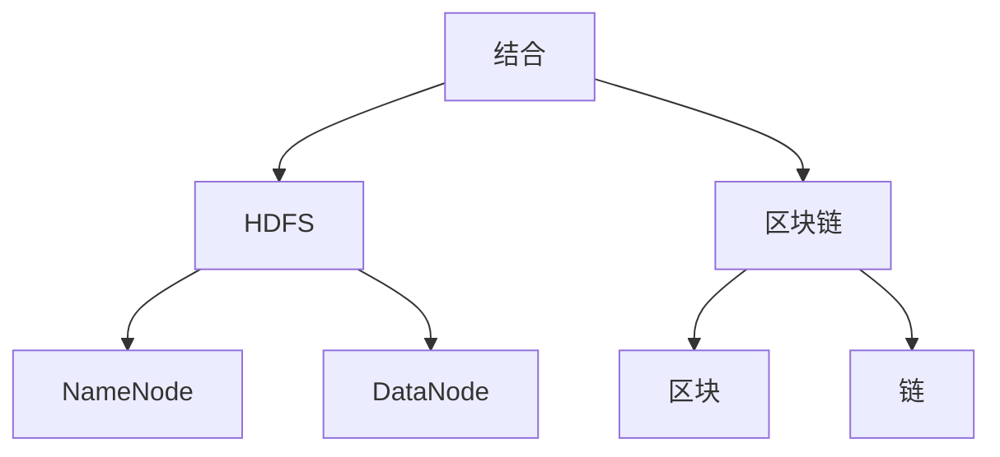

# HDFS与区块链：探索数据存储新方向

作者：禅与计算机程序设计艺术

## 1. 背景介绍

### 1.1 数据存储的演变

在现代信息技术发展的过程中，数据存储技术经历了从磁盘存储、网络存储到分布式存储的多次变革。随着数据量的爆炸性增长，传统的集中式存储系统逐渐无法满足需求，分布式存储技术应运而生。Hadoop分布式文件系统（HDFS）作为分布式存储领域的代表性技术，解决了大规模数据存储和处理的问题。

### 1.2 区块链技术的崛起

区块链技术最初因比特币而被广泛关注，其去中心化、不可篡改和透明的特性使其在金融、供应链管理和数据存储等多个领域展现出巨大的潜力。区块链通过分布式账本技术，实现了数据的安全存储和共享。

### 1.3 HDFS与区块链的结合

HDFS和区块链分别在大数据存储和数据安全性方面展现出各自的优势。将两者结合，探索一种新的数据存储方式，既可以利用HDFS的高效存储和处理能力，又可以借助区块链的安全性和透明性，构建出一种更为先进的数据存储解决方案。

## 2. 核心概念与联系

### 2.1 HDFS的基本概念

HDFS是Hadoop生态系统中的核心组件，其设计初衷是为了存储和处理大规模数据集。HDFS采用主从架构，由一个NameNode和多个DataNode组成。NameNode负责管理文件系统的元数据，而DataNode则负责存储实际的数据块。

#### 2.1.1 NameNode与DataNode

- **NameNode**：负责管理文件系统的命名空间和元数据，包括文件和目录的结构、文件块的位置等。
- **DataNode**：负责存储实际的数据块，并定期向NameNode汇报其存储状态。

#### 2.1.2 数据冗余与容错机制

HDFS通过数据块的冗余存储实现高可用性和容错性。每个数据块通常会被复制到多个DataNode上，以确保在某个DataNode失效时，数据仍然可以从其他DataNode上恢复。

### 2.2 区块链的基本概念

区块链是一种分布式账本技术，通过链式结构将数据块连接在一起，每个数据块包含一组交易记录。区块链的去中心化、不可篡改和透明性使其在数据存储和共享方面具有独特的优势。

#### 2.2.1 区块与链

- **区块**：每个区块包含一组交易记录和一个指向前一个区块的哈希值。
- **链**：区块通过哈希值连接在一起，形成一条链式结构，确保数据的完整性和不可篡改性。

#### 2.2.2 共识机制

区块链通过共识机制确保数据的一致性和安全性。常见的共识机制包括工作量证明（PoW）、权益证明（PoS）等。

### 2.3 HDFS与区块链的联系

HDFS和区块链虽然在技术实现上有所不同，但在分布式存储和数据可靠性方面有着共同的目标。将HDFS的高效存储与区块链的安全性结合，可以构建出一种新的数据存储解决方案，既能满足大规模数据存储的需求，又能保证数据的安全性和透明性。



## 3. 核心算法原理具体操作步骤

### 3.1 HDFS数据存储流程

#### 3.1.1 数据分块

在HDFS中，文件被划分为固定大小的数据块（默认64MB或128MB），每个数据块独立存储在不同的DataNode上。这样可以并行处理大文件，提高系统的吞吐量。

#### 3.1.2 数据冗余与副本管理

每个数据块通常会被复制到多个DataNode上（默认3个副本），以确保数据的高可用性和容错性。NameNode负责管理这些副本的分布和状态。

#### 3.1.3 数据写入与读取

- **写入流程**：客户端将文件拆分为多个数据块，并将每个数据块写入到多个DataNode上。NameNode负责协调和管理这些数据块的存储。
- **读取流程**：客户端从NameNode获取文件的元数据和数据块的位置，然后直接从DataNode读取数据块。

### 3.2 区块链数据存储流程

#### 3.2.1 数据打包成区块

在区块链中，交易记录被打包成区块，每个区块包含一组交易记录和一个指向前一个区块的哈希值。区块通过链式结构连接在一起，形成一条不可篡改的链。

#### 3.2.2 共识机制

区块链通过共识机制确保数据的一致性和安全性。常见的共识机制包括工作量证明（PoW）、权益证明（PoS）等。共识机制的主要作用是防止双重支付和其他恶意行为。

#### 3.2.3 数据写入与读取

- **写入流程**：交易记录被打包成区块，并通过共识机制验证后，添加到区块链中。
- **读取流程**：用户可以通过区块链浏览器或节点查询区块链中的交易记录。

### 3.3 HDFS与区块链结合的操作步骤

#### 3.3.1 数据分块与打包

将HDFS的数据块和区块链的区块结合起来，数据在存储前先进行分块处理，并打包成区块。

#### 3.3.2 数据写入与验证

数据块通过HDFS存储到多个DataNode上，同时生成区块链交易记录，并通过共识机制验证后，添加到区块链中。

#### 3.3.3 数据读取与校验

用户读取数据时，通过HDFS获取数据块，同时通过区块链验证数据的完整性和一致性。

## 4. 数学模型和公式详细讲解举例说明

### 4.1 HDFS的数据冗余模型

HDFS的数据冗余模型通过副本机制实现高可用性和容错性。假设每个数据块有 $r$ 个副本，系统中有 $n$ 个DataNode，则数据块的存储概率为：

$$
P = 1 - (1 - \frac{n-r}{n})^r
$$

### 4.2 区块链的共识机制模型

以工作量证明（PoW）为例，假设矿工的计算能力为 $C$，网络的总计算能力为 $T$，则矿工成功挖到一个区块的概率为：

$$
P = \frac{C}{T}
$$

### 4.3 HDFS与区块链结合的数据存储模型

将HDFS的数据冗余模型与区块链的共识机制结合，可以构建出一种新的数据存储模型。假设数据块的副本数为 $r$，区块链的共识机制成功概率为 $P$，则数据存储的可靠性为：

$$
R = 1 - (1 - P)^r
$$

## 5. 项目实践：代码实例和详细解释说明

### 5.1 HDFS数据存储代码示例

```java
import org.apache.hadoop.conf.Configuration;
import org.apache.hadoop.fs.FileSystem;
import org.apache.hadoop.fs.Path;

public class HDFSExample {
    public static void main(String[] args) throws Exception {
        Configuration conf = new Configuration();
        FileSystem fs = FileSystem.get(conf);

        // 上传文件到HDFS
        Path srcPath = new Path("/local/path/to/file");
        Path dstPath = new Path("/hdfs/path/to/file");
        fs.copyFromLocalFile(srcPath, dstPath);

        // 读取文件
        fs.open(dstPath).read();
    }
}
```

### 5.2 区块链数据存储代码示例

```python
from hashlib import sha256
import time

class Block:
    def __init__(self, index, previous_hash, timestamp, data, hash):
        self.index = index
        self.previous_hash = previous_hash
        self.timestamp = timestamp
        self.data = data
        self.hash = hash

def create_genesis_block():
    return Block(0, "0", int(time.time()), "Genesis Block", "0")

def create_new