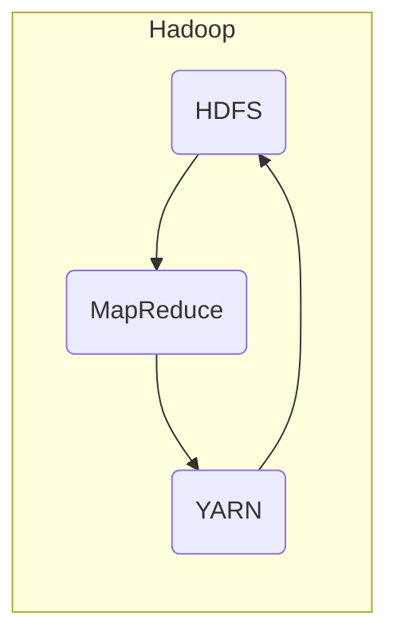

## Hadoop原理与代码实例讲解

### 1. 背景介绍

#### 1.1 大数据时代的到来

随着互联网、移动互联网、物联网等技术的飞速发展，全球数据量呈爆炸式增长。据IDC预测，到2025年，全球数据量将达到惊人的175ZB。海量数据的出现，给传统的数据库技术带来了巨大挑战，也催生了大数据技术的蓬勃发展。

#### 1.2 Hadoop的诞生

Hadoop是一个开源的分布式计算框架，由Apache软件基金会开发。它最初是由Google发表的关于GFS、MapReduce和BigTable的三篇论文启发而来，旨在解决海量数据的存储和处理问题。Hadoop的核心思想是将大规模数据集分布存储在由普通计算机组成的集群上，并利用MapReduce编程模型对数据进行并行处理。

#### 1.3 Hadoop的优势

* **高可靠性：** Hadoop采用分布式存储和计算，数据被复制到多个节点上，即使某个节点发生故障，也不会影响整个系统的运行。
* **高扩展性：** Hadoop集群可以根据需要轻松地添加或删除节点，从而实现水平扩展，满足不断增长的数据处理需求。
* **高效率：** Hadoop的MapReduce编程模型支持大规模数据的并行处理，能够显著提高数据处理效率。
* **低成本：** Hadoop可以使用廉价的普通服务器构建集群，降低了硬件成本。
* **开源：** Hadoop是一个开源项目，拥有庞大的社区支持，可以免费使用和修改。


### 2. 核心概念与联系

#### 2.1 HDFS（Hadoop Distributed File System）

HDFS是Hadoop的分布式文件系统，负责数据的存储。它将大文件分割成多个数据块，并将这些数据块存储在集群中的不同节点上。HDFS采用主从架构，由一个NameNode和多个DataNode组成。

* **NameNode:**  管理文件系统的命名空间和数据块到DataNode的映射关系。
* **DataNode:**  存储实际的数据块，并执行文件系统的读写操作。

#### 2.2 MapReduce

MapReduce是Hadoop的并行计算模型，负责数据的处理。它将一个计算任务分解成多个Map任务和Reduce任务，并在集群中的多个节点上并行执行。

* **Map任务：**  对输入数据进行处理，生成键值对形式的中间结果。
* **Reduce任务：**  对Map任务输出的中间结果进行合并和汇总，生成最终结果。

#### 2.3 YARN（Yet Another Resource Negotiator）

YARN是Hadoop的资源管理系统，负责管理集群中的计算资源，并为应用程序分配资源。它将资源抽象成容器，每个容器可以运行一个应用程序的任务。

#### 2.4 核心概念之间的联系

HDFS负责存储数据，MapReduce负责处理数据，YARN负责管理集群资源，三者协同工作，构成了Hadoop的核心架构。



### 3. 核心算法原理具体操作步骤

#### 3.1 MapReduce工作原理

MapReduce的核心思想是“分而治之”，即将一个大任务分解成多个小任务，并利用集群的计算能力并行处理这些小任务，最终将结果合并得到最终结果。

MapReduce程序的执行流程如下：

1. **输入阶段：**  将输入数据分割成多个数据块，每个数据块作为Map任务的输入。
2. **Map阶段：**  每个Map任务并行处理一个数据块，生成键值对形式的中间结果。
3. **Shuffle阶段：**  将Map任务输出的中间结果按照键进行分组，并将相同键的中间结果发送到同一个Reduce任务。
4. **Reduce阶段：**  每个Reduce任务并行处理一组具有相同键的中间结果，生成最终结果。
5. **输出阶段：**  将Reduce任务输出的最终结果写入到指定的输出路径。

#### 3.2 HDFS读写数据流程

**写数据流程：**

1. 客户端将文件上传到HDFS时，首先将文件分割成多个数据块。
2. 客户端向NameNode请求上传数据块，NameNode会选择合适的DataNode存储数据块。
3. 客户端将数据块并行上传到DataNode，每个DataNode会将数据块复制到其他DataNode上，以保证数据可靠性。
4. 当所有数据块上传完成后，客户端通知NameNode文件上传完成。

**读数据流程：**

1. 客户端向NameNode请求下载文件。
2. NameNode返回文件的数据块所在DataNode列表。
3. 客户端并行从DataNode下载数据块，并将数据块合并成完整的文件。


### 4. 数学模型和公式详细讲解举例说明

#### 4.1 TF-IDF算法

TF-IDF（Term Frequency-Inverse Document Frequency）是一种用于信息检索和文本挖掘的常用算法，用于评估一个词语对于一个文档集或语料库中的其中一份文档的重要程度。

**TF（词频）：** 指某个词语在当前文档中出现的频率。

$$
TF(t,d) = \frac{f_{t,d}}{\sum_{t' \in d} f_{t',d}}
$$

其中，$f_{t,d}$ 表示词语 $t$ 在文档 $d$ 中出现的次数，$\sum_{t' \in d} f_{t',d}$ 表示文档 $d$ 中所有词语出现的总次数。

**IDF（逆文档频率）：** 指包含某个词语的文档在所有文档中所占的比例的倒数的对数。

$$
IDF(t,D) = log \frac{|D|}{|\{d \in D: t \in d\}|}
$$

其中，$|D|$ 表示文档集 $D$ 中的文档总数，$|\{d \in D: t \in d\}|$ 表示包含词语 $t$ 的文档数量。

**TF-IDF：**  将词频和逆文档频率相乘，得到词语 $t$ 在文档 $d$ 中的TF-IDF值。

$$
TF-IDF(t,d,D) = TF(t,d) * IDF(t,D)
$$

#### 4.2 TF-IDF算法在文本分类中的应用

TF-IDF算法可以用于文本分类，例如将新闻文章分类为体育、娱乐、科技等不同类别。

1. 首先，对所有新闻文章进行分词，统计每个词语在每篇文章中出现的频率，计算每个词语的TF值。
2. 然后，统计每个词语在所有文章中出现的文档频率，计算每个词语的IDF值。
3. 最后，计算每个词语在每篇文章中的TF-IDF值，将每篇文章表示成一个向量，其中每个元素代表一个词语的TF-IDF值。
4. 使用机器学习算法，例如支持向量机（SVM）或朴素贝叶斯（Naive Bayes），对文本向量进行分类。


### 5. 项目实践：代码实例和详细解释说明

#### 5.1 WordCount程序

WordCount是Hadoop自带的经典示例程序，用于统计文本文件中每个单词出现的次数。

**Mapper类：**

```java
import java.io.IOException;
import java.util.StringTokenizer;

import org.apache.hadoop.io.IntWritable;
import org.apache.hadoop.io.LongWritable;
import org.apache.hadoop.io.Text;
import org.apache.hadoop.mapreduce.Mapper;

public class WordCountMapper extends Mapper<LongWritable, Text, Text, IntWritable> {

    private final static IntWritable one = new IntWritable(1);
    private Text word = new Text();

    @Override
    public void map(LongWritable key, Text value, Context context) throws IOException, InterruptedException {
        String line = value.toString();
