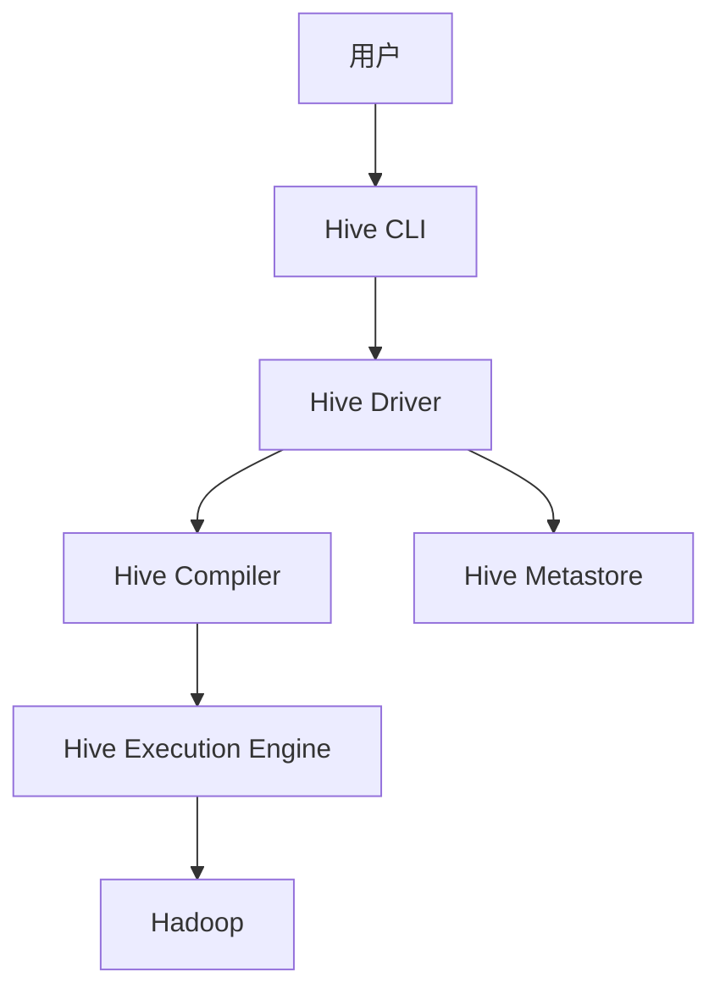

# Hive原理与代码实例讲解

作者：禅与计算机程序设计艺术

## 1.背景介绍

### 1.1 大数据时代的挑战

在大数据时代，数据量的爆炸式增长给数据存储和处理带来了巨大的挑战。传统的关系型数据库在处理大规模数据时显得力不从心，无法高效地进行数据存储和查询操作。这就催生了新的数据处理技术和工具的出现，Apache Hive便是其中之一。

### 1.2 Apache Hive简介

Apache Hive是一个基于Hadoop的数仓工具，可以将结构化数据文件映射为一张表，并提供类SQL查询功能。Hive通过将SQL查询转换为MapReduce任务，使得用户可以在熟悉的SQL环境中进行大数据分析，而不必编写复杂的MapReduce代码。

### 1.3 Hive的历史发展

Hive最初由Facebook开发，用于解决其内部数据处理需求。2008年，Facebook将Hive开源，并将其贡献给Apache软件基金会。自此之后，Hive迅速发展，成为大数据处理领域的重要工具之一。

## 2.核心概念与联系

### 2.1 Hive架构概述

Hive的架构主要包括以下几个核心组件：

- **Hive CLI（Command Line Interface）**：用户通过CLI与Hive进行交互。
- **Hive Metastore**：存储关于数据表、分区、列等元数据。
- **Hive Driver**：解析、优化和执行Hive查询。
- **Hive Compiler**：将HiveQL查询编译为MapReduce任务。
- **Hive Execution Engine**：负责执行MapReduce任务。



### 2.2 数据模型

Hive的数据模型与传统的关系型数据库类似，主要包括以下几个概念：

- **Database**：数据库，用于组织和隔离数据。
- **Table**：表，数据存储的基本单位。
- **Partition**：分区，用于对表中的数据进行水平划分。
- **Bucket**：桶，用于对分区中的数据进行进一步划分。

### 2.3 HiveQL

HiveQL（Hive Query Language）是Hive提供的一种类似SQL的查询语言。HiveQL支持大多数SQL的查询功能，如SELECT、INSERT、UPDATE、DELETE等，同时还提供了一些特定于Hive的功能，如分区和桶的管理。

## 3.核心算法原理具体操作步骤

### 3.1 查询解析

Hive的查询解析过程包括以下几个步骤：

1. **语法解析**：将用户输入的HiveQL查询解析为抽象语法树（AST）。
2. **语义解析**：对AST进行语义检查，确保查询的正确性。
3. **逻辑计划生成**：将AST转换为逻辑执行计划。
4. **物理计划生成**：将逻辑执行计划转换为物理执行计划。

### 3.2 查询优化

Hive的查询优化过程主要包括以下几个方面：

- **谓词下推**：将过滤条件尽可能下推到数据源，减少数据传输量。
- **列裁剪**：只读取查询中涉及的列，减少I/O开销。
- **分区裁剪**：只读取查询中涉及的分区，减少数据扫描量。

### 3.3 执行计划生成

Hive的执行计划生成过程包括以下几个步骤：

1. **逻辑计划优化**：对逻辑执行计划进行优化。
2. **物理计划生成**：将优化后的逻辑执行计划转换为物理执行计划。
3. **任务划分**：将物理执行计划划分为多个MapReduce任务。
4. **任务调度**：将MapReduce任务提交给Hadoop集群执行。

## 4.数学模型和公式详细讲解举例说明

### 4.1 MapReduce模型

Hive的底层依赖于Hadoop的MapReduce模型。MapReduce是一种编程模型，用于处理大规模数据集。其核心思想是将数据处理任务分为两个阶段：Map阶段和Reduce阶段。

#### Map阶段

在Map阶段，输入数据被分割成若干个小块（split），每个小块由一个Map任务处理。Map任务对输入数据进行处理，并生成一系列键值对（key-value pairs）。

$$
\text{Map} : (K1, V1) \rightarrow \text{list}(K2, V2)
$$

#### Reduce阶段

在Reduce阶段，所有Map任务生成的键值对根据键（key）进行分组，然后由Reduce任务对每个分组进行处理，生成最终的结果。

$$
\text{Reduce} : (K2, \text{list}(V2)) \rightarrow \text{list}(K3, V3)
$$

### 4.2 示例：Word Count

以经典的Word Count问题为例，展示MapReduce模型的工作原理。

#### 输入数据

```
Hello Hive
Hello Hadoop
```

#### Map阶段

Map任务对输入数据进行处理，生成以下键值对：

```
(Hello, 1)
(Hive, 1)
(Hello, 1)
(Hadoop, 1)
```

#### Reduce阶段

Reduce任务对Map任务生成的键值对进行分组和处理，生成最终结果：

```
(Hello, 2)
(Hive, 1)
(Hadoop, 1)
```

## 5.项目实践：代码实例和详细解释说明

### 5.1 环境搭建

在开始Hive的项目实践之前，需要搭建好Hive的运行环境。以下是搭建Hive环境的基本步骤：

1. 安装Hadoop：Hive依赖于Hadoop，因此需要首先安装并配置好Hadoop。
2. 安装Hive：从Apache官网下载安装包，并进行配置。
3. 配置Metastore：Hive需要一个关系型数据库来存储元数据，可以选择MySQL、PostgreSQL等。

### 5.2 创建数据库和表

以下是创建数据库和表的HiveQL示例：

```sql
-- 创建数据库
CREATE DATABASE mydb;

-- 使用数据库
USE mydb;

-- 创建表
CREATE TABLE mytable (
    id INT,
    name STRING,
    age INT
)
ROW FORMAT DELIMITED
FIELDS TERMINATED BY ','
STORED AS TEXTFILE;
```

### 5.3 数据导入

将本地文件中的数据导入Hive表：

```sql
-- 加载数据到表
LOAD DATA LOCAL INPATH '/path/to/data.csv' INTO TABLE mytable;
```

### 5.4 查询数据

使用HiveQL查询数据：

```sql
-- 查询表中的所有数据
SELECT * FROM mytable;

-- 查询年龄大于30的数据
SELECT * FROM mytable WHERE age > 30;
```

### 5.5 分区和桶

创建分区表和桶表：

```sql
-- 创建分区表
CREATE TABLE partitioned_table (
    id INT,
    name STRING,
    age INT
)
PARTITIONED BY (country STRING)
ROW FORMAT DELIMITED
FIELDS TERMINATED BY ','
STORED AS TEXTFILE;

-- 创建桶表
CREATE TABLE bucketed_table (
    id INT,
    name STRING,
    age INT
)
CLUSTERED BY (id) INTO 4 BUCKETS
ROW FORMAT DELIMITED
FIELDS TERMINATED BY ','
STORED AS TEXTFILE;
```

### 5.6 Hive UDF

Hive允许用户定义自定义函数（UDF）来扩展其功能。以下是创建和使用UDF的示例：

```java
import org.apache.hadoop.hive.ql.exec.UDF;
import org.apache.hadoop.io.Text;

public class MyUDF extends UDF {
    public Text evaluate(Text input) {
        if (input == null) {
            return null;
        }
        return new Text(input.toString().toUpperCase());
    }
}
```

编译并将UDF添加到Hive：

```sql
-- 添加JAR文件
ADD JAR /path/to/myudf.jar;

-- 创建临时函数
CREATE TEMPORARY FUNCTION myudf AS 'com.example.MyUDF';

-- 使用UDF
SELECT myudf(name) FROM mytable;
```

## 6.实际应用场景

### 6.1 数据仓库

Hive常用于构建数据仓库，通过将结构化数据存储在HDFS中，并提供SQL查询功能，使得数据分析和报表生成更加方便。

### 6.2 数据分析

Hive可以处理大规模数据集，适用于各种数据分析任务，如用户行为分析、日志分析等。

### 6.3 ETL处理

Hive可以与其他数据处理工具结合，完成数据的抽取、转换和加载（ETL）任务。

## 7.工具和资源推荐

### 7.1 工具

- **Apache Hadoop**：Hive的底层数据存储和处理框架。
- **Apache Hive**：数据仓库工具，提供SQL查询功能。
- **MySQL/PostgreSQL**：Hive Metastore的存储引擎。

### 