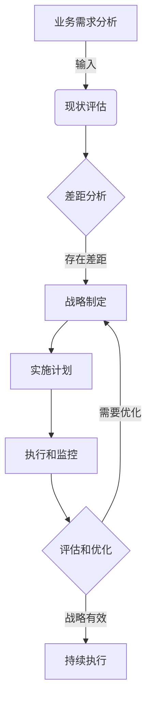

# IT战略规划：制定并执行与公司业务目标相一致的IT战略计划

## 1.背景介绍

### 1.1 IT战略规划的重要性

在当今快节奏的数字时代，信息技术(IT)已成为推动企业创新、提高效率和保持竞争力的关键驱动力。有效的IT战略规划对于确保IT投资与企业的总体战略目标保持一致至关重要。它有助于优化资源分配、降低运营成本、提高客户满意度并支持业务增长。

### 1.2 IT与业务战略的融合

过去,IT部门常被视为一个独立的支持性职能部门,但现在它已成为推动业务转型的核心。有效的IT战略规划需要与企业的总体业务战略紧密融合,以确保技术投资与公司的长期愿景、目标和优先事项保持一致。

### 1.3 数字化转型的驱动力

数字化转型正在重塑各行各业,企业必须采用创新的技术解决方案来适应不断变化的市场需求。IT战略规划为组织提供了一个蓝图,帮助它们制定数字化转型路线图,利用新兴技术(如云计算、大数据分析、人工智能和物联网)来重塑业务模式、优化流程并提高客户体验。

## 2.核心概念与联系  

### 2.1 IT战略与业务战略的关系

IT战略是指导组织如何利用技术资源来实现业务目标的总体计划。它应该与企业的总体业务战略保持一致,并支持其实现。业务战略确定了公司的愿景、使命和战略目标,而IT战略则规定了如何利用技术来实现这些目标。

### 2.2 IT战略规划流程

制定IT战略规划是一个循环的过程,包括以下关键步骤:

1. **业务需求分析**: 评估当前业务环境、机遇、挑战和未来需求。
2. **现状评估**: 审查现有的IT基础设施、应用程序、流程和能力。
3. **差距分析**: 确定业务需求与现有IT能力之间的差距。
4. **战略制定**: 根据差距分析,制定IT战略以解决这些差距。
5. **实施计划**: 制定详细的实施计划,包括时间表、资源分配和风险缓解策略。
6. **执行和监控**: 执行战略计划并持续监控进度和效果。
7. **评估和优化**: 定期评估战略的有效性并进行必要的调整。

### 2.3 IT治理

IT治理是指导和控制IT活动的框架,以确保IT投资与业务目标保持一致。它包括决策权限、问责制、政策和程序,旨在优化IT资源的使用并减轻风险。有效的IT治理对于成功执行IT战略计划至关重要。

### 2.4 IT投资组合管理

IT投资组合管理是一种系统方法,用于评估、优先排序和管理IT项目和资源投入,以实现最大的业务价值。它有助于确保IT投资与战略目标保持一致,并优化资源分配。

## 3.核心算法原理具体操作步骤

虽然IT战略规划不涉及算法,但它包括一些关键步骤和最佳实践,可确保战略规划过程的有效性。以下是一些核心步骤:

### 3.1 业务需求分析

1. **识别关键业务驱动因素**: 分析市场趋势、竞争格局、客户需求、法规要求等外部因素,以及企业的愿景、使命、战略目标等内部因素。
2. **确定业务优先事项**: 根据这些驱动因素,确定企业的主要业务目标和优先事项。
3. **制定业务需求**: 基于优先事项,明确具体的业务需求,包括流程优化、新产品/服务开发、客户体验提升等。

### 3.2 现状评估

1. **IT基础设施审查**: 评估现有的IT基础设施,包括硬件、软件、网络、存储等,以确定其是否满足业务需求。
2. **应用程序评估**: 审查现有的应用程序及其与业务流程的集成情况,识别任何差距或重复。
3. **能力评估**: 评估IT团队的技能和能力,确定是否需要进行培训或招聘以填补空白。
4. **成本和效率分析**: 分析IT运营成本和效率,识别任何浪费或优化机会。

### 3.3 差距分析

1. **确定差距**: 基于业务需求和现状评估,确定现有IT能力与业务需求之间的差距。
2. **优先排序差距**: 根据其对业务影响的程度,对识别出的差距进行优先排序。
3. **制定解决方案**: 为每个优先差距制定潜在的解决方案,包括升级现有系统、实施新技术或外包特定功能。

### 3.4 战略制定

1. **定义战略目标**: 根据差距分析,制定IT战略目标,以解决确定的差距并支持业务目标。
2. **制定路线图**: 为实现战略目标制定分阶段的路线图,包括具体的里程碑和时间表。
3. **评估替代方案**: 评估不同的技术解决方案、供应商和实施模式,选择最佳选项。
4. **制定治理框架**: 建立IT治理框架,包括决策权限、政策和程序,以确保战略的有效执行。

### 3.5 实施计划

1. **项目规划**: 为每个战略计划制定详细的项目计划,包括里程碑、任务、资源分配和风险缓解策略。
2. **资源分配**: 确定所需的人力、财务和技术资源,并制定资源分配计划。
3. **变更管理**: 建立变更管理流程,以有效管理实施过程中的任何变更或偏差。
4. **沟通计划**: 制定沟通计划,确保所有利益相关方都知情并参与实施过程。

### 3.6 执行和监控

1. **项目执行**: 根据计划执行各个项目,密切监控进度并解决任何问题或障碍。
2. **绩效测量**: 建立关键绩效指标(KPI)来衡量战略执行的效果和进展情况。
3. **持续改进**: 基于绩效数据和反馈,持续优化流程和做出必要的调整。

### 3.7 评估和优化

1. **战略评审**: 定期评审战略的有效性,确保它与不断变化的业务需求保持一致。
2. **回顾和学习**: 从实施过程中吸取经验教训,并将其纳入未来的战略规划周期。
3. **持续优化**: 根据评估结果和反馈,持续优化IT战略和实施计划。

## 4.数学模型和公式详细讲解举例说明

虽然IT战略规划本身不直接涉及复杂的数学模型或公式,但在某些特定领域,可以应用一些量化模型和分析技术来支持决策过程。以下是一些常见的模型和公式:

### 4.1 投资组合优化模型

投资组合优化模型用于评估和优化IT项目投资组合,以实现最大的投资回报率(ROI)。一种常见的模型是马科维茨投资组合理论,它试图通过最小化风险来最大化预期回报。

假设有 $n$ 个项目,每个项目 $i$ 具有预期回报率 $R_i$ 和风险 $\sigma_i$。令 $w_i$ 表示分配给项目 $i$ 的权重,则投资组合的预期回报率和风险分别为:

$$
\begin{aligned}
E(R_p) &= \sum_{i=1}^{n} w_i R_i \\
\sigma_p^2 &= \sum_{i=1}^{n} \sum_{j=1}^{n} w_i w_j \sigma_{ij}
\end{aligned}
$$

其中 $\sigma_{ij}$ 是项目 $i$ 和 $j$ 之间的协方差。

投资组合优化问题可以表示为:

$$
\begin{aligned}
\max_{w_1, \ldots, w_n} &\quad E(R_p) \\
\text{s.t.} &\quad \sigma_p^2 \leq \sigma_0^2 \\
&\quad \sum_{i=1}^{n} w_i = 1 \\
&\quad w_i \geq 0, \quad i = 1, \ldots, n
\end{aligned}
$$

其中 $\sigma_0^2$ 是可接受的最大风险水平。通过求解这个优化问题,可以得到最优的投资组合权重分配。

### 4.2 总拥有成本(TCO)模型

总拥有成本模型用于估算IT资产在其整个生命周期内的成本,包括采购、实施、运营、维护和退役成本。这有助于做出更明智的投资决策。

TCO可以用以下公式表示:

$$
\text{TCO} = C_\text{acq} + C_\text{imp} + \sum_{t=1}^{T} \frac{C_\text{op}(t) + C_\text{main}(t)}{(1+r)^t} + C_\text{ret}
$$

其中:

- $C_\text{acq}$ 是采购成本
- $C_\text{imp}$ 是实施成本
- $C_\text{op}(t)$ 是第 $t$ 年的运营成本
- $C_\text{main}(t)$ 是第 $t$ 年的维护成本
- $r$ 是折现率
- $T$ 是资产的预期使用寿命(年)
- $C_\text{ret}$ 是退役成本

通过估算每个成本组成部分,可以计算出IT资产的TCO,从而做出更明智的投资决策。

### 4.3 业务连续性分析

业务连续性分析(BCA)是一种量化风险分析技术,用于评估IT系统中断对业务运营的潜在影响。它可以帮助确定适当的恢复时间目标(RTO)和恢复点目标(RPO),从而制定适当的业务连续性计划(BCP)。

BCA通常涉及以下步骤:

1. **识别关键业务流程**: 确定对业务运营至关重要的流程。
2. **评估影响**: 对每个关键流程中断造成的潜在影响进行评估和量化,包括财务损失、声誉损害等。
3. **计算最大可容忍中断时间(MTPD)**: 根据影响评估,确定每个流程可容忍的最长中断时间,超过该时间将导致不可接受的损失。
4. **确定RTO和RPO**: 根据MTPD,确定适当的RTO(将系统恢复到运行状态所需的时间)和RPO(可接受的最大数据丢失量)。

通过BCA,组织可以量化IT中断的潜在影响,并制定适当的BCP来减轻风险和保护关键业务功能。

虽然IT战略规划过程中可能不直接使用这些数学模型和公式,但它们可以作为支持性工具,帮助做出更明智的决策,并量化和优化IT投资的价值。

## 5.项目实践:代码实例和详细解释说明

虽然IT战略规划本身不直接涉及编程或代码实现,但我们可以使用一些可视化工具来支持规划过程并更好地交流和呈现战略。在这里,我将使用 Mermaid 流程图来展示一个典型的 IT 战略规划过程。

让我们逐步解释这个流程图:

1. **业务需求分析**:这是整个过程的起点。在这一步,我们需要评估当前的业务环境、机遇、挑战和未来需求,以确定企业的主要业务目标和优先事项。这些业务需求将为后续的 IT 战略规划提供输入。

2. **现状评估**:在这一步,我们需要审查现有的 IT 基础设施、应用程序、流程和能力,以了解它们是否满足业务需求。这包括评估硬件、软件、网络、存储、IT 团队技能等各个方面。

3. **差距分析**:通过对比业务需求和现状评估结果,我们可以确定现有 IT 能力与业务需求之间的差距。这些差距需要通过实施新技术或优