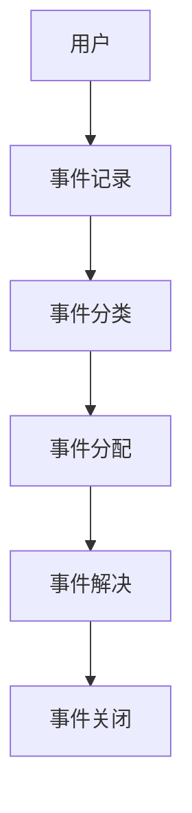

# IT服务管理：提升IT服务质量和客户满意度

## 1. 背景介绍

### 1.1 IT服务管理的定义与重要性

IT服务管理（IT Service Management，简称ITSM）是指通过实施和管理IT服务来满足业务需求的一套系统化方法。它涵盖了从规划、设计、交付到运营和改进IT服务的全过程。ITSM的目标是确保IT服务能够高效、可靠地支持业务运作，从而提升客户满意度和业务价值。

### 1.2 ITSM的发展历程

ITSM的发展可以追溯到20世纪80年代，当时英国政府的中央计算机和电信局（CCTA）推出了IT基础设施库（ITIL），这是最早的一套系统化IT服务管理框架。随着时间的推移，ITSM逐渐演变，结合了敏捷开发、DevOps等现代化IT管理理念，形成了更加综合和灵活的管理体系。

### 1.3 ITSM在现代企业中的应用

在现代企业中，ITSM已经成为不可或缺的一部分。它不仅仅是IT部门的职责，更是整个企业提升运营效率和客户满意度的关键。通过实施ITSM，企业可以更好地管理IT资源、降低运营成本、提高服务质量，并且能够快速响应市场变化。

## 2. 核心概念与联系

### 2.1 服务生命周期

ITSM的核心在于服务生命周期管理，包括服务策略、服务设计、服务转型、服务运营和持续服务改进。这五个阶段相互关联，共同构成了一个闭环管理体系。

### 2.2 关键流程

在ITSM中，有几个关键流程需要重点关注：

- **事件管理**：处理和解决服务中断或降低服务质量的事件。
- **问题管理**：识别和解决导致事件的根本原因，防止问题再次发生。
- **变更管理**：控制和管理对IT基础设施的变更，确保变更过程的有序和安全。
- **配置管理**：维护和管理IT资源的配置项，确保信息的准确性和完整性。

### 2.3 角色和职责

ITSM的实施需要明确的角色和职责划分，包括服务经理、变更经理、配置经理、事件经理等。每个角色都有其特定的职责和权限，确保整个服务管理过程的顺利进行。

## 3. 核心算法原理具体操作步骤

### 3.1 事件管理流程

事件管理的目标是尽快恢复正常服务，最小化对业务的影响。其具体步骤如下：

1. **事件识别和记录**：通过监控系统或用户报告识别事件，并记录详细信息。
2. **事件分类和优先级设置**：根据事件的影响范围和紧急程度进行分类和优先级设置。
3. **事件诊断和分配**：初步诊断事件原因，并分配给相关的技术团队处理。
4. **事件解决和恢复**：技术团队进行问题解决，并恢复服务。
5. **事件关闭**：确认事件已解决，更新记录并关闭事件。

### 3.2 问题管理流程

问题管理的目标是预防问题的发生和复发，确保服务的稳定性。其具体步骤如下：

1. **问题识别和记录**：通过事件分析或监控系统识别问题，并记录详细信息。
2. **问题分类和优先级设置**：根据问题的影响范围和紧急程度进行分类和优先级设置。
3. **根本原因分析**：使用技术手段和分析工具查找问题的根本原因。
4. **解决方案制定和实施**：制定解决方案，并实施相应的措施。
5. **问题关闭**：确认问题已解决，更新记录并关闭问题。

### 3.3 变更管理流程

变更管理的目标是确保所有变更的有序和安全，最小化对服务的影响。其具体步骤如下：

1. **变更请求提交**：相关人员提交变更请求，记录变更的详细信息。
2. **变更评估和批准**：变更委员会评估变更的风险和影响，决定是否批准变更。
3. **变更计划和实施**：制定详细的变更计划，并按计划实施变更。
4. **变更验证和关闭**：验证变更是否成功，更新记录并关闭变更。

### 3.4 配置管理流程

配置管理的目标是确保IT资源的配置项信息准确和完整，支持其他管理流程。其具体步骤如下：

1. **配置项识别和记录**：识别和记录所有的配置项及其关系。
2. **配置项变更管理**：管理配置项的变更，确保信息的准确性。
3. **配置项审计和核查**：定期审计和核查配置项信息，确保其完整性和一致性。

## 4. 数学模型和公式详细讲解举例说明

### 4.1 服务水平管理中的数学模型

服务水平管理（Service Level Management，SLM）是ITSM的重要组成部分，其目标是确保服务质量符合业务需求。SLM中常用的数学模型包括服务水平协议（SLA）和关键绩效指标（KPI）。

#### 4.1.1 服务水平协议（SLA）

SLA是定义服务提供者和客户之间的服务质量标准的协议。SLA通常包括以下几个关键指标：

- **可用性（Availability）**：服务在规定时间内可用的比例。计算公式为：

$$
Availability = \frac{Uptime}{Total Time}
$$

其中，$Uptime$ 为服务正常运行的时间，$Total Time$ 为总时间。

- **响应时间（Response Time）**：服务请求从提交到开始处理的时间。

- **解决时间（Resolution Time）**：服务请求从提交到完全解决的时间。

#### 4.1.2 关键绩效指标（KPI）

KPI是用来衡量服务质量和效率的指标。常用的KPI包括：

- **平均响应时间（Average Response Time）**：所有服务请求的平均响应时间。计算公式为：

$$
Average Response Time = \frac{\sum Response Time}{Number of Requests}
$$

- **平均解决时间（Average Resolution Time）**：所有服务请求的平均解决时间。计算公式为：

$$
Average Resolution Time = \frac{\sum Resolution Time}{Number of Requests}
$$

### 4.2 问题管理中的数学模型

问题管理中的根本原因分析（Root Cause Analysis，RCA）常用的数学模型包括故障树分析（Fault Tree Analysis，FTA）和鱼骨图分析（Ishikawa Diagram）。

#### 4.2.1 故障树分析（FTA）

FTA是一种通过构建逻辑树来分析故障原因的方法。其基本思想是将故障事件分解为一系列子事件，通过逻辑关系（如与、或）将子事件组合起来，从而找到根本原因。

#### 4.2.2 鱼骨图分析（Ishikawa Diagram）

鱼骨图分析是一种通过图形化方式展示问题原因的方法。其基本思想是将问题分解为多个可能的原因，并将这些原因按类别排列在鱼骨图上，从而找到根本原因。

## 5. 项目实践：代码实例和详细解释说明

### 5.1 事件管理系统的实现

为了更好地理解ITSM的实际应用，我们将实现一个简单的事件管理系统。这个系统包括事件的记录、分类、分配和解决等功能。

#### 5.1.1 系统架构

系统架构如下图所示：



#### 5.1.2 代码实例

以下是一个简单的事件管理系统的代码实现：

```python
class Event:
    def __init__(self, id, description, priority):
        self.id = id
        self.description = description
        self.priority = priority
        self.status = 'Open'

class EventManager:
    def __init__(self):
        self.events = []

    def record_event(self, id, description, priority):
        event = Event(id, description, priority)
        self.events.append(event)
        return event

    def classify_event(self, event):
        if event.priority == 'High':
            event.category = 'Critical'
        elif event.priority == 'Medium':
            event.category = 'Major'
        else:
            event.category = 'Minor'
        return event

    def assign_event(self, event, team):
        event.assigned_team = team
        return event

    def resolve_event(self, event):
        event.status = 'Resolved'
        return event

    def close_event(self, event):
        event.status = 'Closed'
        return event

# 实例化事件管理器
event_manager = EventManager()

# 记录一个事件
event = event_manager.record_event(1, '服务器宕机', 'High')

# 分类事件
event = event_manager.class