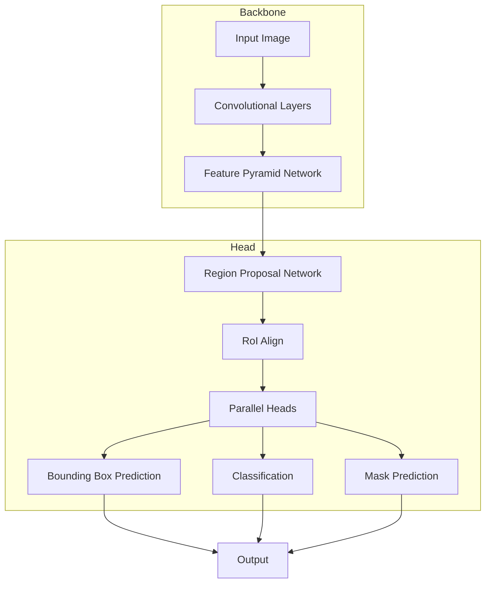

# Instance Segmentation原理与代码实例讲解

## 1. 背景介绍

### 1.1 计算机视觉任务概述

计算机视觉是人工智能领域的一个重要分支,旨在使机器能够从数字图像或视频中获取有意义的信息。它涉及多个任务,包括图像分类、目标检测、语义分割、实例分割等。其中,实例分割(Instance Segmentation)是一项极具挑战的任务,它要求模型不仅能够识别出图像中的目标,还需要对每个目标实例进行精确的像素级别分割。

### 1.2 实例分割的重要性

实例分割在许多领域有着广泛的应用,例如:

- **自动驾驶**: 准确分割行人、车辆、道路等对象,是实现自动驾驶的关键技术之一。
- **增强现实(AR)**: 通过实例分割,可以精准定位和识别真实世界中的目标,从而为它们添加虚拟信息和注释。
- **医疗影像分析**: 实例分割能够在医学影像中精确分割病灶、器官等目标,为疾病诊断和手术规划提供重要参考。
- **机器人视觉**: 实例分割使机器人能够理解复杂场景,从而实现更精准的物体抓取、导航等功能。

### 1.3 实例分割的挑战

与语义分割相比,实例分割需要解决以下额外的挑战:

1. **目标分离**: 模型需要能够将密集分布、相互遮挡的目标实例正确分开。
2. **同类区分**: 对于同一类别的多个目标实例,模型需要能够进行精确的实例级别识别和分割。
3. **实时性能**: 在保证分割精度的前提下,实现实时、高效的推理能力,以满足实际应用场景的需求。

## 2. 核心概念与联系  

### 2.1 实例分割与其他计算机视觉任务的关系

实例分割任务与其他计算机视觉任务密切相关,可以看作是多个任务的综合:

- **图像分类(Image Classification)**: 识别图像中存在的目标类别。
- **目标检测(Object Detection)**: 定位图像中目标的边界框位置。
- **语义分割(Semantic Segmentation)**: 对图像中的每个像素进行分类,获得目标的像素级别掩码。
- **实例分割(Instance Segmentation)**: 在语义分割的基础上,对属于同一类别的不同目标实例进行区分和分割。

实例分割任务集成了上述任务的能力,因此极具挑战性。同时,实例分割的发展也推动了其他任务的进步。

### 2.2 实例分割的核心概念

实例分割任务的核心概念包括:

1. **目标实例(Object Instance)**: 指图像中的单个目标实体,如一个人、一辆车等。
2. **语义类别(Semantic Class)**: 目标实例所属的语义类别,如人、车辆等。
3. **像素级别分割(Pixel-level Segmentation)**: 将图像中的每个像素精确地分配给相应的目标实例,而不是简单的边界框检测。
4. **实例掩码(Instance Mask)**: 对于每个目标实例,生成一个二值掩码,用于表示该实例在图像中的像素级分布。

### 2.3 实例分割算法分类

根据算法流程和网络结构,实例分割算法可分为以下几类:

1. **基于区域的方法**: 首先生成目标候选区域,然后分类和分割每个区域,常见算法有Mask R-CNN等。
2. **基于密集预测的方法**: 直接在像素级别预测每个像素所属的实例,常见算法有SOLO等。
3. **基于transformer的方法**: 利用transformer的自注意力机制捕获目标实例的全局信息,例如DETR等。
4. **基于图神经网络的方法**: 将图像建模为图结构,通过图神经网络进行实例分割,如Graph R-CNN等。

这些算法各有优缺点,通常需要根据具体应用场景选择合适的方法。接下来,我们将重点介绍基于区域的Mask R-CNN算法。

## 3. 核心算法原理具体操作步骤

### 3.1 Mask R-CNN概述

Mask R-CNN是Facebook AI研究院在2017年提出的一种基于区域的实例分割算法,它扩展了著名的目标检测算法Faster R-CNN,在检测目标边界框的同时,还并行地预测目标的语义分割掩码。

Mask R-CNN的整体网络结构如下所示:

Mask R-CNN主要包括以下几个模块:

1. **骨干网络(Backbone Network)**: 通常采用预训练的模型如ResNet、VGG等,用于提取图像的特征映射。
2. **特征金字塔网络(Feature Pyramid Network, FPN)**: 通过自顶向下和自底向上的连接,融合不同尺度的特征,增强了模型对不同尺寸目标的表示能力。
3. **区域候选网络(Region Proposal Network, RPN)**: 在特征金字塔上滑动窗口,生成目标候选区域(Region Proposals)。
4. **RoIAlign层**: 根据候选区域,从特征金字塔中提取对应的特征,并使用双线性插值进行对齐,避免了量化导致的误差。
5. **并行头(Parallel Heads)**: 包括边界框预测头、分类头和掩码预测头,分别用于预测目标边界框、语义类别和实例分割掩码。

Mask R-CNN的优势在于,通过共享骨干网络和大部分特征提取模块,实现了目标检测和实例分割的高效并行预测。下面我们详细介绍核心步骤。

### 3.2 区域候选网络(RPN)

RPN的作用是从输入图像中生成一系列目标候选区域(Region Proposals),供后续的分类和掩码预测使用。它的工作原理如下:

1. 在特征金字塔的每一层上,使用滑动窗口的方式,在每个位置生成多个不同尺度和宽高比的锚框(Anchors)。
2. 对于每个锚框,通过一个小型卷积神经网络,分别预测该锚框是否包含目标(二分类)和精细修正该锚框的位置(边界框回归)。
3. 根据分类得分和边界框回归结果,选择得分较高的锚框作为候选区域。
4. 使用非极大值抑制(Non-Maximum Suppression, NMS)去除重叠区域,得到最终的候选区域集合。

RPN的优势在于,通过共享骨干网络的特征,实现了高效的区域候选生成。同时,它还可以通过调整锚框的设置,有效处理不同尺度的目标。

### 3.3 RoIAlign层

RoIAlign层的作用是根据RPN生成的候选区域,从特征金字塔中提取对应的特征,为后续的分类和掩码预测做准备。

传统的RoIPooling层存在两个主要问题:

1. 量化误差: 在将候选区域映射到特征图上时,由于像素坐标的量化,可能会导致一些位置偏移,影响特征提取的精度。
2. 几何失真: 由于使用了最大池化操作,会丢失一些细节信息,影响分割质量。

为了解决这些问题,Mask R-CNN提出了RoIAlign层。它的核心思想是:

1. 通过双线性插值,避免了量化导致的位置偏移。
2. 直接计算候选区域内特征点的值,而不是使用最大池化操作。

具体操作步骤如下:

1. 将候选区域均匀分割为 $k \times k$ 个子区域。
2. 对于每个子区域,通过双线性插值计算其在特征图上的精确对应位置,并提取该位置的特征值。
3. 将所有子区域的特征拼接,形成该候选区域的特征表示。

通过这种方式,RoIAlign层能够精确地从特征金字塔中提取候选区域的特征,为后续的分类和分割任务提供高质量的输入。

### 3.4 并行头:分类、边界框回归和掩码预测

Mask R-CNN的并行头包括三个分支:分类头、边界框回归头和掩码预测头。它们的作用分别是:

1. **分类头(Classification Head)**: 对每个候选区域进行语义分类,预测其所属的目标类别。
2. **边界框回归头(Bounding Box Regression Head)**: 根据RPN生成的粗略候选框,进一步精细调整目标的边界框位置。
3. **掩码预测头(Mask Prediction Head)**: 对每个候选区域,生成一个 $m \times m$ 的二值掩码,表示该目标在原始图像中的像素级分布。

掩码预测头是Mask R-CNN的核心创新之处。它的工作流程如下:

1. 将RoIAlign层输出的候选区域特征输入到一系列卷积层中,进行特征提取和编码。
2. 通过一个 $2 \times 2$ 的去卷积(Deconvolution)层,将特征映射回 $m \times m$ 的空间分辨率。
3. 在每个空间位置上,通过一个 $1 \times 1$ 的卷积核,预测该位置是否属于目标实例(二分类)。
4. 对于同一个候选区域,重复上述步骤 $k^2$ 次(对应 $k \times k$ 个空间位置),得到一个完整的 $m \times m$ 的实例掩码。

通过这种方式,Mask R-CNN能够高效地预测出目标实例的精确像素级分割掩码,实现了实例分割任务。

## 4. 数学模型和公式详细讲解举例说明

### 4.1 RPN损失函数

RPN的损失函数包括两部分:分类损失和边界框回归损失。

#### 分类损失

对于每个锚框,RPN需要预测它是否包含目标(前景或背景)。这是一个二分类问题,通常使用交叉熵损失函数:

$$
L_{cls}(p, p^*) = -p^* \log(p) - (1 - p^*) \log(1 - p)
$$

其中 $p$ 是预测的前景概率, $p^*$ 是真实标签(0或1)。对于一个批次中的所有锚框,分类损失为:

$$
L_{rpn\_cls} = \frac{1}{N_{cls}} \sum_{i} L_{cls}(p_i, p_i^*)
$$

其中 $N_{cls}$ 是锚框的总数。

#### 边界框回归损失

对于包含目标的锚框,RPN还需要预测一个边界框回归值,以精细修正锚框的位置。通常使用平滑 $L_1$ 损失函数:

$$
L_{reg}(t_u, v) = \sum_{i \in \{x, y, w, h\}} \text{smooth}_{L_1}(t_u^i - v^i)
$$

其中 $t_u$ 是预测的边界框回归值, $v$ 是与真实边界框的编码差值,例如中心坐标偏移、宽高比等。 $\text{smooth}_{L_1}$ 函数定义如下:

$$
\text{smooth}_{L_1}(x) = \begin{cases}
0.5x^2, & \text{if } |x| < 1 \\
|x| - 0.5, & \text{otherwise}
\end{cases}
$$

对于一个批次中的所有锚框,边界框回归损失为:

$$
L_{rpn\_reg} = \frac{1}{N_{reg}} \sum_{i} p_i^* L_{reg}(t_{u_i}, v_i)
$$

其中 $N_{reg}$ 是包含目标的锚框数量。

最终,RPN的总损失是分类损失和边界框回归损失的加权和:

$$
L_{rpn} = L_{rpn\_cls} + \lambda L_{rpn\_reg}
$$

其中 $\lambda$ 是一个平衡参数,用于控制两个损失项的相对重要性。

### 4.2 Mask R-CNN损失函数

Mask R-CNN的损失函数包括三部分:分类损失、边界框回归