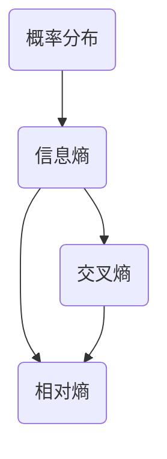

# KL散度：衡量概率分布差异的利器

作者：禅与计算机程序设计艺术

## 1. 背景介绍

在统计学和信息论中，衡量两个概率分布之间的差异是一个基础且重要的任务。无论是在机器学习模型的训练过程中，还是在数据分析的过程中，理解和计算分布之间的差异能够帮助我们更好地理解数据的特性和模型的表现。KL散度（Kullback-Leibler Divergence）作为一种衡量概率分布差异的工具，因其理论基础扎实、应用广泛而备受关注。

### 1.1 什么是KL散度？

KL散度是一种非对称的度量，用于衡量两个概率分布之间的差异。它描述了一个分布 $Q$ 相对于另一个分布 $P$ 的信息损失。简单来说，KL散度衡量了使用分布 $Q$ 来近似分布 $P$ 时所带来的信息损失。

### 1.2 KL散度的历史背景

KL散度由Solomon Kullback和Richard Leibler在1951年提出，最初用于信息论中衡量信息量的变化。随着时间的推移，KL散度在机器学习、统计学和数据科学等领域得到了广泛应用。

### 1.3 应用场景概览

KL散度在许多实际应用中扮演着重要角色，包括但不限于：

- 机器学习中的模型评估
- 自然语言处理中的语言模型对比
- 图像处理中的分布匹配
- 金融数据分析中的风险评估

## 2. 核心概念与联系

为了深入理解KL散度的机制和应用，我们需要掌握一些核心概念，并了解它们之间的联系。

### 2.1 概率分布

概率分布描述了一个随机变量可能取值的集合及其对应的概率。常见的概率分布包括离散分布（如二项分布）和连续分布（如正态分布）。

### 2.2 信息熵

信息熵是衡量一个随机变量的不确定性的度量。对于一个离散随机变量 $X$，其熵定义为：

$$
H(X) = - \sum_{x \in X} P(x) \log P(x)
$$

### 2.3 相对熵

相对熵，即KL散度，是熵的推广，用于衡量两个概率分布之间的差异。对于两个离散概率分布 $P$ 和 $Q$，KL散度定义为：

$$
D_{KL}(P \| Q) = \sum_{x \in X} P(x) \log \frac{P(x)}{Q(x)}
$$

### 2.4 交叉熵

交叉熵是衡量两个概率分布之间差异的另一种方法，定义为：

$$
H(P, Q) = - \sum_{x \in X} P(x) \log Q(x)
$$

KL散度与交叉熵的关系为：

$$
D_{KL}(P \| Q) = H(P, Q) - H(P)
$$

### 2.5 核心概念关系图

以下是这些核心概念之间的关系图：



## 3. 核心算法原理具体操作步骤

KL散度的计算过程可以分为以下几个步骤：

### 3.1 确定概率分布

首先，我们需要确定两个概率分布 $P$ 和 $Q$。这些分布可以是离散的或连续的，具体形式取决于问题的实际情况。

### 3.2 计算概率比值

对于每一个可能的事件 $x$，计算 $P(x)$ 和 $Q(x)$ 的比值 $\frac{P(x)}{Q(x)}$。

### 3.3 计算对数

对每一个概率比值取对数，得到 $\log \frac{P(x)}{Q(x)}$。

### 3.4 计算加权和

将每一个对数值乘以对应的 $P(x)$，然后求和，得到KL散度：

$$
D_{KL}(P \| Q) = \sum_{x \in X} P(x) \log \frac{P(x)}{Q(x)}
$$

### 3.5 连续分布的处理

对于连续分布，KL散度的计算需要使用积分形式：

$$
D_{KL}(P \| Q) = \int_{-\infty}^{\infty} p(x) \log \frac{p(x)}{q(x)} dx
$$

## 4. 数学模型和公式详细讲解举例说明

为了更好地理解KL散度的计算过程，我们以一个具体的例子来详细讲解。

### 4.1 离散分布例子

假设我们有两个离散概率分布 $P$ 和 $Q$，它们的概率值如下：

$$
P = \{0.2, 0.5, 0.3\}
$$

$$
Q = \{0.1, 0.6, 0.3\}
$$

计算KL散度的步骤如下：

1. 计算概率比值：

$$
\frac{P(1)}{Q(1)} = \frac{0.2}{0.1} = 2
$$

$$
\frac{P(2)}{Q(2)} = \frac{0.5}{0.6} \approx 0.833
$$

$$
\frac{P(3)}{Q(3)} = \frac{0.3}{0.3} = 1
$$

2. 计算对数：

$$
\log \frac{P(1)}{Q(1)} = \log 2 \approx 0.693
$$

$$
\log \frac{P(2)}{Q(2)} = \log 0.833 \approx -0.182
$$

$$
\log \frac{P(3)}{Q(3)} = \log 1 = 0
$$

3. 计算加权和：

$$
D_{KL}(P \| Q) = 0.2 \cdot 0.693 + 0.5 \cdot (-0.182) + 0.3 \cdot 0
$$

$$
D_{KL}(P \| Q) \approx 0.2 \cdot 0.693 - 0.5 \cdot 0.182
$$

$$
D_{KL}(P \| Q) \approx 0.1386 - 0.091
$$

$$
D_{KL}(P \| Q) \approx 0.0476
$$

### 4.2 连续分布例子

对于连续分布，我们考虑两个正态分布 $P$ 和 $Q$，它们的概率密度函数分别为 $p(x)$ 和 $q(x)$。假设 $P$ 的均值为 $\mu_P$，方差为 $\sigma_P^2$，$Q$ 的均值为 $\mu_Q$，方差为 $\sigma_Q^2$。

KL散度的计算公式为：

$$
D_{KL}(P \| Q) = \int_{-\infty}^{\infty} p(x) \log \frac{p(x)}{q(x)} dx
$$

对于正态分布，KL散度的解析解为：

$$
D_{KL}(P \| Q) = \log \frac{\sigma_Q}{\sigma_P} + \frac{\sigma_P^2 + (\mu_P - \mu_Q)^2}{2\sigma_Q^2} - \frac{1}{2}
$$

假设 $\mu_P = 0, \sigma_P = 1, \mu_Q = 1, \sigma_Q = 2$，则有：

$$
D_{KL}(P \| Q) = \log \frac{2}{1} + \frac{1^2 + (0 - 1)^2}{2 \cdot 2^2} - \frac{1}{2}
$$

$$
D_{KL}(P \| Q) = \log 2 + \frac{1 + 1}{8} - \frac{1}{2}
$$

$$
D_{KL}(P \| Q) = 0.693 + 0.25 - 0.5
$$

$$
D_{KL}(P \| Q) = 0.443
$$

## 5. 项目实践：代码实例和详细解释说明

为了更好地理解KL散度的计算过程，我们将通过Python代码示例来实现KL散度的计算。

### 5.1 离散分布的KL散度计算

```python
import numpy as np

# 定义两个离散概率分布
P = np