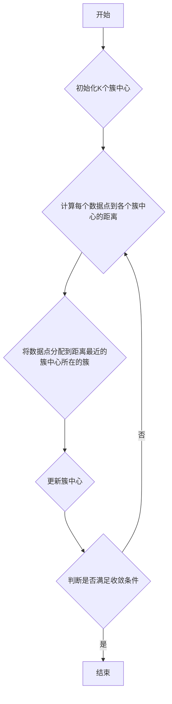

# K-Means聚类的未来发展趋势与研究方向展望

作者：禅与计算机程序设计艺术

## 1. 背景介绍

### 1.1 聚类分析概述
在机器学习和数据挖掘领域，聚类分析是一种无监督学习方法，旨在将数据集中的对象分组到不同的簇中，使得同一簇内的对象彼此相似，而不同簇之间的对象则不相似。作为一种基础性的数据分析技术，聚类分析在各个领域都有着广泛的应用，例如：

* **客户细分:**  根据客户的购买行为、人口统计信息等特征，将客户划分为不同的群体，以便进行精准营销。
* **图像分割:** 将图像中的像素点根据颜色、纹理等特征进行分组，以便识别不同的物体或区域。
* **异常检测:**  识别数据集中与其他数据点显著不同的异常点，例如信用卡欺诈检测。

### 1.2  K-Means算法的优势与局限性
K-Means算法作为一种简单高效的聚类算法，其基本思想是迭代地将数据点分配到最近的簇中心，并更新簇中心的位置，直到收敛。K-Means算法的主要优势包括：

* **简单易实现:**  算法原理简单直观，易于理解和实现。
* **计算效率高:**  算法的时间复杂度较低，适用于处理大规模数据集。
* **可解释性强:**  算法的结果易于解释，可以直观地理解数据点的分组情况。

然而，K-Means算法也存在一些局限性，例如：

* **需要预先指定簇的数量:**  算法需要预先指定簇的数量K，而实际应用中往往难以确定最佳的K值。
* **对初始簇中心的选择敏感:**  算法的结果对初始簇中心的选择较为敏感，不同的初始簇中心可能导致不同的聚类结果。
* **对噪声和异常值敏感:**  算法容易受到噪声和异常值的影响，导致聚类结果不准确。


## 2. 核心概念与联系

### 2.1 K-Means算法的基本原理
K-Means算法的核心思想是迭代地将数据点分配到最近的簇中心，并更新簇中心的位置，直到收敛。其具体步骤如下：

1. **初始化:** 随机选择K个数据点作为初始簇中心。
2. **分配数据点:**  计算每个数据点到各个簇中心的距离，将数据点分配到距离最近的簇中心所在的簇。
3. **更新簇中心:**  计算每个簇中所有数据点的平均值，将平均值作为新的簇中心。
4. **重复步骤2和步骤3，直到满足收敛条件。**  常用的收敛条件包括：
    * 簇中心不再发生变化。
    * 迭代次数达到预设的最大值。
    * 目标函数值不再显著下降。

### 2.2  距离度量方法
K-Means算法中常用的距离度量方法包括：

* **欧氏距离:**  欧氏距离是最常用的距离度量方法之一，用于计算两个点在欧几里得空间中的距离。
* **曼哈顿距离:**  曼哈顿距离也称为城市街区距离，用于计算两个点在网格状空间中的距离。
* **余弦相似度:**  余弦相似度用于计算两个向量之间的夹角余弦值，通常用于文本分析等领域。

### 2.3  目标函数
K-Means算法的目标是最小化所有数据点到其所属簇中心的距离平方和，也称为**簇内平方和**(Within-Cluster Sum of Squares, WCSS)。其数学表达式为：
$$WCSS = \sum_{i=1}^{K} \sum_{x_j \in C_i} ||x_j - \mu_i||^2$$
其中，$K$表示簇的数量，$C_i$表示第$i$个簇，$x_j$表示属于$C_i$的数据点，$\mu_i$表示第$i$个簇的中心。

## 3. 核心算法原理具体操作步骤

### 3.1  算法流程图



### 3.2  算法伪代码

```python
def kmeans(X, k, max_iters=100):
    """
    K-Means算法实现

    参数:
        X: 数据集，n行m列，n表示样本个数，m表示特征维度
        k: 簇的数量
        max_iters: 最大迭代次数

    返回值:
        centroids: 簇中心
        labels: 数据点所属的簇标签
    """

    # 1. 初始化K个簇中心
    centroids = X[np.random.choice(X.shape[0], k, replace=False)]

    # 迭代更新簇中心
    for _ in range(max_iters):
        # 2. 计算每个数据点到各个簇中心的距离
        distances = np.sqrt(((X[:, np.newaxis, :] - centroids) ** 2).sum(axis=2))

        # 3. 将数据点分配到距离最近的簇中心所在的簇
        labels = np.argmin(distances, axis=1)

        # 4. 更新簇中心
        for i in range(k):
            centroids[i] = X[labels == i].mean(axis=0)

    return centroids, labels
```

## 4. 数学模型和公式详细讲解举例说明

### 4.1  目标函数的推导
K-Means算法的目标是最小化所有数据点到其所属簇中心的距离平方和，也称为簇内平方和(WCSS)。其数学表达式为：
$$WCSS = \sum_{i=1}^{K} \sum_{x_j \in C_i} ||x_j - \mu_i||^2$$

为了推导目标函数，我们可以将每个数据点$x_j$表示为其所属簇中心$\mu_i$与误差项$\epsilon_j$的和：
$$x_j = \mu_i + \epsilon_j$$

将上式代入WCSS的表达式中，可以得到：

$$
\begin{aligned}
WCSS &= \sum_{i=1}^{K} \sum_{x_j \in C_i} ||\mu_i + \epsilon_j - \mu_i||^2 \\
&= \sum_{i=1}^{K} \sum_{x_j \in C_i} ||\epsilon_j||^2
\end{aligned}
$$

因此，最小化WCSS等价于最小化所有数据点的误差项平方和。

### 4.2  举例说明

假设我们有一个二维数据集，包含5个数据点：

```
X = np.array([[1, 2],
              [1.5, 1.8],
              [5, 8],
              [8, 8],
              [1, 0.6]])
```

我们要将这5个数据点分成2个簇。

**步骤1：初始化簇中心**

随机选择两个数据点作为初始簇中心：

```
centroids = np.array([[1, 2],
                      [8, 8]])
```

**步骤2：分配数据点**

计算每个数据点到两个簇中心的距离：

```
distances = np.sqrt(((X[:, np.newaxis, :] - centroids) ** 2).sum(axis=2))

print(distances)
```

输出：

```
[[0.         7.61577311]
 [0.53851648 7.07106781]
 [6.40312424 0.        ]
 [7.07106781 0.        ]
 [1.34164079 8.06225775]]
```

将每个数据点分配到距离最近的簇中心所在的簇：

```
labels = np.argmin(distances, axis=1)

print(labels)
```

输出：

```
[0 0 1 1 0]
```

**步骤3：更新簇中心**

计算每个簇中所有数据点的平均值，作为新的簇中心：

```
for i in range(k):
    centroids[i] = X[labels == i].mean(axis=0)

print(centroids)
```

输出：

```
[[ 1.16666667  1.26666667]
 [ 6.5        8.        ]]
```

**步骤4：重复步骤2和步骤3，直到满足收敛条件**

重复上述步骤，直到簇中心不再发生变化，或者迭代次数达到预设的最大值。

## 5. 项目实践：代码实例和详细解释说明

### 5.1  Python代码实现

```python
import numpy as np
import matplotlib.pyplot as plt

def kmeans(X, k, max_iters=100):
    """
    K-Means算法实现

    参数:
        X: 数据集，n行m列，n表示样本个数，m表示特征维度
        k: 簇的数量
        max_iters: 最大迭代次数

    返回值:
        centroids: 簇中心
        labels: 数据点所属的簇标签
    """

    # 1. 初始化K个簇中心
    centroids = X[np.random.choice(X.shape[0], k, replace=False)]

    # 迭代更新簇中心
    for _ in range(max_iters):
        # 2. 计算每个数据点到各个簇中心的距离
        distances = np.sqrt(((X[:, np.newaxis, :] - centroids) ** 2).sum(axis=2))

        # 3. 将数据点分配到距离最近的簇中心所在的簇
        labels = np.argmin(distances, axis=1)

        # 4. 更新簇中心
        for i in range(k):
            centroids[i] = X[labels == i].mean(axis=0)

    return centroids, labels


if __name__ == '__main__':
    # 生成示例数据集
    X = np.array([[1, 2],
                  [1.5, 1.8],
                  [5, 8],
                  [8, 8],
                  [1, 0.6]])

    # 设置簇的数量
    k = 2

    # 执行K-Means算法
    centroids, labels = kmeans(X, k)

    # 打印聚类结果
    print("簇中心：", centroids)
    print("数据点所属的簇标签：", labels)

    # 可视化聚类结果
    plt.scatter(X[:, 0], X[:, 1], c=labels)
    plt.scatter(centroids[:, 0], centroids[:, 1], marker='*', s=200, c='red')
    plt.show()
```

### 5.2  代码解释

* **导入必要的库：** 
    * `numpy`用于数值计算。
    * `matplotlib.pyplot` 用于数据可视化。
* **定义`kmeans`函数：** 
    *  实现K-Means算法，包括初始化簇中心、迭代更新簇中心、计算距离、分配数据点到簇等步骤。
* **主函数：** 
    * 生成示例数据集。
    * 设置簇的数量。
    * 调用`kmeans`函数执行聚类。
    * 打印聚类结果。
    * 使用`matplotlib.pyplot`可视化聚类结果。

## 6. 实际应用场景

K-Means 算法应用广泛，以下是一些常见的应用领域：

### 6.1  客户细分
电商平台可以根据用户的购买历史、浏览记录、 demographic 信息等，利用 K-Means 算法将用户分成不同的群体，进行精准营销。

### 6.2 图像分割
在计算机视觉领域，K-Means 算法可以用于图像分割，将图像分成不同的区域。例如，可以根据像素的颜色将图像分割成不同的区域，以便识别不同的物体。

### 6.3  异常检测
在网络安全、金融风控等领域，K-Means 算法可以用于异常检测。例如，可以根据用户的行为特征，将用户分成不同的群体，识别出行为异常的用户，及时采取措施。

### 6.4  文档聚类
在自然语言处理领域，K-Means 算法可以用于文档聚类。例如，可以根据文档的主题将文档分成不同的类别。

## 7. 总结：未来发展趋势与挑战

### 7.1 未来发展趋势
* **改进算法效率:** 随着数据规模的不断增大，如何提高 K-Means 算法的效率是一个重要的研究方向。例如，可以使用并行计算、近似算法等方法来加速 K-Means 算法。
* **增强算法鲁棒性:** K-Means 算法对噪声和异常值比较敏感，如何增强算法的鲁棒性也是一个重要的研究方向。例如，可以使用密度聚类、谱聚类等算法来代替 K-Means 算法。
* **结合深度学习:**  将 K-Means 算法与深度学习相结合，可以利用深度学习强大的特征提取能力来提高聚类的效果。例如，可以使用自编码器来学习数据的低维表示，然后使用 K-Means 算法对低维表示进行聚类。

### 7.2  挑战

* **高维数据的处理:**  K-Means 算法在处理高维数据时容易受到维度灾难的影响，导致聚类效果下降。
* **簇形状的限制:**  K-Means 算法倾向于找到球形的簇，对于非球形的簇，聚类效果可能不佳。
* **可解释性的问题:**  K-Means 算法的结果难以解释，特别是对于高维数据。


## 8. 附录：常见问题与解答

### 8.1 如何确定最佳的簇数量 K？

确定最佳的簇数量 K 是 K-Means 算法中的一个关键问题，常见的方法包括：

* **肘部法则（Elbow Method）:**  绘制 WCSS 值随 K 值变化的曲线，曲线的“肘部”位置对应的 K 值通常是一个较好的选择。
* **轮廓系数（Silhouette Coefficient）:**  轮廓系数衡量了数据点与其所属簇的凝聚度以及与其他簇的分离度，可以选择轮廓系数最高的 K 值。
* **Gap Statistic:**  Gap Statistic 方法比较了实际数据集的 WCSS 值与随机生成的数据集的 WCSS 值，可以选择使得 Gap Statistic 最大的 K 值。

### 8.2  如何处理 K-Means 算法对初始簇中心敏感的问题？

为了减少 K-Means 算法对初始簇中心敏感的影响，可以尝试以下方法：

* **多次运行 K-Means 算法:**  每次运行 K-Means 算法时使用不同的随机初始簇中心，然后选择 WCSS 值最小的结果。
* **使用 K-Means++ 算法初始化簇中心:**  K-Means++ 算法是一种改进的初始化方法，可以有效地减少初始簇中心对聚类结果的影响。

### 8.3  K-Means 算法有哪些优缺点？

**优点：**

* 简单易实现
* 计算效率高
* 可解释性强

**缺点：**

* 需要预先指定簇的数量
* 对初始簇中心的选择敏感
* 对噪声和异常值敏感
* 倾向于找到球形的簇


## 总结

K-Means 算法作为一种简单高效的聚类算法，在各个领域都有着广泛的应用。未来，随着数据规模的不断增大和应用场景的不断扩展，K-Means 算法也将面临着新的挑战和机遇。通过改进算法效率、增强算法鲁棒性、结合深度学习等方法，可以不断提升 K-Means 算法的性能和应用效果。
