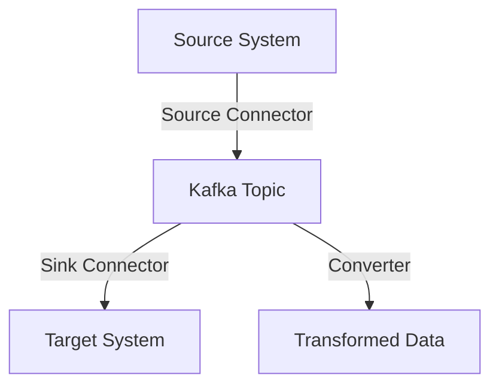

# KafkaConnect：对接MySQL的实践

作者：禅与计算机程序设计艺术

## 1.背景介绍

### 1.1 数据集成的挑战

在现代企业中，数据集成是一个关键的挑战。随着业务的扩展，数据源的多样性也在增加。企业需要将来自不同数据源的数据整合在一起，以便进行统一的分析和决策。传统的数据集成方法通常效率低下，难以扩展，并且需要大量的手动干预。

### 1.2 Apache Kafka和Kafka Connect

Apache Kafka是一种分布式流处理平台，广泛用于构建实时数据管道和流应用。Kafka的核心是一个高吞吐量、低延迟的分布式消息队列系统。Kafka Connect是Kafka生态系统中的一个组件，用于简化数据源和Kafka之间的数据流动。它提供了一种标准的方法来连接各种数据源和目标系统，使得数据集成变得更加简单和高效。

### 1.3 MySQL作为数据源

MySQL是最流行的开源关系数据库管理系统之一，广泛应用于各种应用场景。从中小型企业到大型互联网公司，MySQL都扮演着关键的角色。在许多情况下，企业需要将MySQL中的数据实时地传输到其他系统中进行处理和分析。

## 2.核心概念与联系

### 2.1 Kafka Connect架构概述

Kafka Connect的架构包括三个主要组件：源连接器（Source Connector）、汇连接器（Sink Connector）和转换器（Converter）。源连接器负责从外部系统读取数据并将其写入Kafka主题，汇连接器则从Kafka主题读取数据并写入外部系统。转换器用于在数据流动过程中对数据进行格式转换。



### 2.2 MySQL与Kafka的集成

将MySQL与Kafka集成通常涉及使用Kafka Connect的源连接器。Debezium是一个开源的分布式平台，专门用于捕获数据库变化数据（Change Data Capture，CDC），可以无缝地将MySQL中的数据变化捕获并发送到Kafka。

### 2.3 关键术语

- **CDC（Change Data Capture）**：捕获并记录数据库中的数据变化。
- **Connector**：Kafka Connect中的组件，用于连接数据源或目标系统。
- **Schema**：描述数据结构的元数据。
- **Offset**：Kafka中消息的唯一标识，用于跟踪消息处理进度。

## 3.核心算法原理具体操作步骤

### 3.1 数据捕获的工作原理

Debezium通过MySQL的binlog（binary log）来捕获数据变化。binlog记录了所有对数据库的更改操作，Debezium读取这些日志并将其转换为Kafka消息。

### 3.2 配置Kafka Connect

#### 3.2.1 安装Kafka和Kafka Connect

首先，我们需要安装并配置Kafka和Kafka Connect。可以使用Kafka的官方镜像或通过包管理工具安装。

```bash
# 下载Kafka
wget https://downloads.apache.org/kafka/3.0.0/kafka_2.13-3.0.0.tgz
# 解压缩
tar -xzf kafka_2.13-3.0.0.tgz
# 进入Kafka目录
cd kafka_2.13-3.0.0
```

#### 3.2.2 启动Kafka和ZooKeeper

Kafka依赖于ZooKeeper进行分布式协调，因此需要先启动ZooKeeper。

```bash
# 启动ZooKeeper
bin/zookeeper-server-start.sh config/zookeeper.properties
# 启动Kafka
bin/kafka-server-start.sh config/server.properties
```

#### 3.2.3 配置Kafka Connect

创建一个新的配置文件用于Kafka Connect。

```bash
# 创建Kafka Connect配置文件
touch config/connect-distributed.properties
```

在配置文件中添加以下内容：

```properties
bootstrap.servers=localhost:9092
group.id=connect-cluster
key.converter=org.apache.kafka.connect.json.JsonConverter
value.converter=org.apache.kafka.connect.json.JsonConverter
key.converter.schemas.enable=true
value.converter.schemas.enable=true
offset.storage.file.filename=/tmp/connect.offsets
```

### 3.3 配置Debezium MySQL Connector

#### 3.3.1 下载Debezium Connector

Debezium提供了多种数据库的连接器，我们需要下载MySQL的连接器。

```bash
# 下载Debezium MySQL Connector
wget https://repo1.maven.org/maven2/io/debezium/debezium-connector-mysql/1.6.0.Final/debezium-connector-mysql-1.6.0.Final-plugin.tar.gz
# 解压缩
tar -xzf debezium-connector-mysql-1.6.0.Final-plugin.tar.gz
# 将连接器放入Kafka Connect的插件目录
cp -r debezium-connector-mysql /usr/local/share/kafka/plugins/
```

#### 3.3.2 配置Debezium MySQL Connector

创建一个新的配置文件用于Debezium MySQL Connector。

```bash
touch config/debezium-mysql.properties
```

在配置文件中添加以下内容：

```properties
name=mysql-connector
connector.class=io.debezium.connector.mysql.MySqlConnector
tasks.max=1
database.hostname=localhost
database.port=3306
database.user=root
database.password=yourpassword
database.server.id=184054
database.server.name=my-app-connector
database.include.schema=yourdatabase
database.history.kafka.bootstrap.servers=localhost:9092
database.history.kafka.topic=schema-changes.my-app
```

### 3.4 启动Kafka Connect和Debezium

启动Kafka Connect和Debezium MySQL Connector。

```bash
# 启动Kafka Connect
bin/connect-distributed.sh config/connect-distributed.properties
# 注册Debezium MySQL Connector
curl -X POST -H "Content-Type: application/json" --data @config/debezium-mysql.properties http://localhost:8083/connectors
```

## 4.数学模型和公式详细讲解举例说明

### 4.1 数据流模型

Kafka Connect的数据流模型可以用以下公式表示：

$$
D_{out} = f(D_{in})
$$

其中，$D_{in}$ 是输入数据，$D_{out}$ 是输出数据，$f$ 是Kafka Connect的处理函数，包括数据捕获、转换和传输。

### 4.2 数据捕获公式

Debezium通过读取MySQL的binlog来捕获数据变化。假设$T$是时间，$C(T)$是时间$T$时捕获的数据变化，则有：

$$
C(T) = \Delta D(T)
$$

其中，$\Delta D(T)$表示时间$T$时数据的变化量。

### 4.3 数据传输延迟

数据从MySQL传输到Kafka的延迟可以表示为：

$$
L = T_{kafka} - T_{mysql}
$$

其中，$T_{kafka}$是数据到达Kafka的时间，$T_{mysql}$是数据在MySQL中发生变化的时间。

## 4.项目实践：代码实例和详细解释说明

### 4.1 完整代码示例

以下是一个完整的代码示例，展示了如何使用Debezium MySQL Connector将MySQL数据传输到Kafka。

#### 4.1.1 MySQL配置

确保MySQL的binlog已启用，并且配置正确。

```sql
-- 启用binlog
SET GLOBAL log_bin = 'mysql-bin';
-- 设置binlog格式
SET GLOBAL binlog_format = 'ROW';
-- 重启MySQL服务
```

#### 4.1.2 Kafka Connect配置

```json
{
  "name": "mysql-connector",
  "config": {
    "connector.class": "io.debezium.connector.mysql.MySqlConnector",
    "tasks.max": "1",
    "database.hostname": "localhost",
    "database.port": "3306",
    "database.user": "root",
    "database.password": "yourpassword",
    "database.server.id": "184054",
    "database.server.name": "my-app-connector",
    "database.include.schema": "yourdatabase",
    "database.history.kafka.bootstrap.servers": "localhost:9092",
    "database.history.kafka.topic": "schema-changes.my-app"
  }
}
```

### 4.2 代码解释

上述配置文件定义了Debezium MySQL Connector的参数，包括数据库连接信息、Kafka服务器信息以及需要捕获的数据表或数据库。

#### 4.2.1 关键参数解释

- **connector.class**：指定使用的连接器类，这里是`io.debezium.connector.mysql.MySqlConnector`。
- **tasks.max**：最大任务数，通常设置为1。
- **database.hostname**：MySQL数据库的主机名。
- **database.port**：MySQL数据库的端口号。
- **database.user**：连接MySQL的用户名。
- **database.password**：连接My