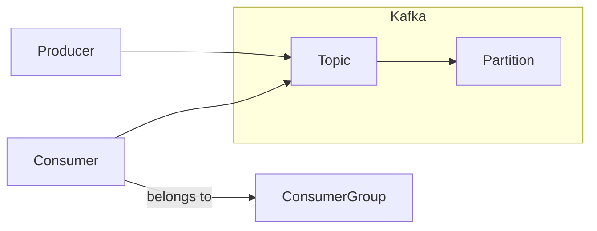

## KafkaGroup的分布式处理能力

作者：禅与计算机程序设计艺术

## 1. 背景介绍

### 1.1 分布式系统的消息处理挑战

随着互联网的快速发展，分布式系统已经成为现代软件架构的主流。在分布式系统中，消息传递扮演着至关重要的角色，它能够实现不同服务之间的解耦、异步通信以及数据的可靠传输。然而，分布式系统中的消息处理也面临着诸多挑战，例如：

* **消息的顺序性:** 如何保证消息按照预定的顺序被消费？
* **消息的可靠性:** 如何确保消息不会丢失，并且能够被至少消费一次？
* **系统的可扩展性:** 如何应对不断增长的消息量和消费者数量？

### 1.2 Kafka 简介

Apache Kafka 是一个开源的分布式流处理平台，它能够高效地处理大量的实时数据流。Kafka 的设计目标是提供高吞吐量、低延迟的消息发布和订阅系统。它具有以下特点：

* **高吞吐量:** Kafka 能够处理每秒数百万条消息。
* **低延迟:** Kafka 的消息延迟可以低至毫秒级别。
* **持久化:** Kafka 将消息持久化到磁盘，即使 Broker 节点宕机，消息也不会丢失。
* **可扩展性:** Kafka 集群可以轻松地进行水平扩展，以满足不断增长的业务需求。

### 1.3 KafkaGroup 的作用

KafkaGroup 是 Kafka 提供的一种消费者分组机制，它允许多个消费者实例组成一个逻辑上的消费组，共同消费同一个 Topic 的消息。KafkaGroup 能够有效地解决分布式系统中消息处理的挑战，它具有以下优势：

* **负载均衡:** KafkaGroup 会将 Topic 的分区均匀地分配给消费组中的各个消费者实例，从而实现负载均衡。
* **故障容错:** 当某个消费者实例宕机时，KafkaGroup 会将其负责的分区重新分配给其他消费者实例，从而保证消息的持续消费。
* **消息顺序性:** KafkaGroup 保证同一个分区内的消息会被同一个消费者实例按照顺序消费。

## 2. 核心概念与联系

### 2.1 Topic 和 Partition

* **Topic:** Kafka 中的消息按照主题进行分类，生产者将消息发送到特定的 Topic，消费者订阅感兴趣的 Topic 以接收消息。
* **Partition:** 为了提高吞吐量和可扩展性，Kafka 将每个 Topic 划分为多个 Partition。每个 Partition 都是一个有序的消息队列，消息按照写入顺序存储在 Partition 中。

### 2.2 Producer 和 Consumer

* **Producer:** 生产者负责将消息发布到 Kafka 的 Topic 中。
* **Consumer:** 消费者负责从 Kafka 的 Topic 中订阅并消费消息。

### 2.3 Consumer Group

* **Consumer Group:** 消费者组是一个逻辑上的概念，它将多个消费者实例组织在一起，共同消费同一个 Topic 的消息。
* **Group ID:** 每个消费者组都有一个唯一的 Group ID，用于标识该组。
* **Consumer Instance:** 消费者实例是实际消费消息的进程或线程。

### 2.4 关系图



## 3. 核心算法原理具体操作步骤

### 3.1 消费者组的 Rebalance 机制

Rebalance 是 KafkaGroup 中非常重要的一个机制，它负责将 Topic 的 Partition 分配给消费者组中的各个消费者实例。Rebalance 的触发条件包括：

* 新的消费者实例加入消费组。
* 现有的消费者实例离开消费组。
* Topic 的 Partition 数量发生变化。

Rebalance 的具体操作步骤如下：

1. **选举 Group Leader:** KafkaGroup 使用 ZooKeeper 或 Kafka 自身的 Group Coordinator 来选举一个消费者实例作为 Group Leader。
2. **收集成员信息:** Group Leader 负责收集消费组中所有成员的信息，包括成员 ID、订阅的 Topic 等。
3. **分配 Partition:** Group Leader 根据一定的分配策略，将 Topic 的 Partition 分配给各个消费者实例。
4. **同步分配结果:** Group Leader 将分配结果同步给所有成员。
5. **开始消费:** 各个消费者实例根据分配结果，开始消费自己负责的 Partition 中的消息。

### 3.2 常用的 Partition 分配策略

Kafka 提供了以下几种常用的 Partition 分配策略：

* **RangeAssignor:** 按照 Partition 的编号范围进行分配，例如，如果一个 Topic 有 3 个 Partition，消费者组中有 2 个消费者实例，则第一个消费者实例将被分配 Partition 0 和 Partition 1，第二个消费者实例将被分配 Partition 2。
* **RoundRobinAssignor:** 按照轮询的方式进行分配，例如，如果一个 Topic 有 3 个 Partition，消费者组中有 2 个消费者实例，则第一个消费者实例将被分配 Partition 0 和 Partition 2，第二个消费者实例将被分配 Partition 1。
* **StickyAssignor:** 尽可能地保持原有的 Partition 分配结果，以减少 Rebalance 带来的开销。

### 3.3 Rebalance 的问题与优化

Rebalance 是一个比较耗时的操作，因为它涉及到 Group Leader 的选举、成员信息的收集、Partition 的分配以及分配结果的同步等步骤。频繁的 Rebalance 会降低 Kafka 集群的性能。

为了减少 Rebalance 的频率，可以采取以下优化措施：

* **设置合理的 session.timeout.ms 参数:** session.timeout.ms 参数用于控制消费者实例的心跳超时时间，如果消费者实例在 session.timeout.ms 时间内没有发送心跳，则会被认为已经宕机，从而触发 Rebalance。
* **避免频繁地创建和销毁消费者实例:** 尽量使用长连接的方式创建消费者实例，并避免频繁地创建和销毁消费者实例。
* **使用 StickyAssignor 分配策略:** StickyAssignor 分配策略能够尽可能地保持原有的 Partition 分配结果，从而减少 Rebalance 的频率。

## 4. 数学模型和公式详细讲解举例说明

### 4.1 消息消费进度

Kafka 使用 Offset 来表示消息的消费进度。每个消费者实例都会维护一个 Offset 记录，记录它已经消费到的消息的位置。

### 4.2 消费者组的消费进度

KafkaGroup 的消费进度是指消费组中所有消费者实例消费到的消息的最小 Offset。

### 4.3 公式举例

假设一个 Topic 有 3 个 Partition，消费者组中有 2 个消费者实例，它们的消费进度如下：

| 消费者实例 | Partition 0 | Partition 1 | Partition 2 |
|---|---|---|---|
| Consumer 1 | 100 | 50 | 200 |
| Consumer 2 | 150 | 80 | 180 |

则该消费组的消费进度为：

```
min(100, 150) = 100 (Partition 0)
min(50, 80) = 50 (Partition 1)
min(200, 180) = 180 (Partition 2)
```

## 5. 项目实践：代码实例和详细解释说明

### 5.1 创建 Kafka 生产者

```java
import org.apache.kafka.clients.producer.KafkaProducer;
import org.apache.kafka.clients.producer.ProducerConfig;
import org.apache.kafka.clients.producer.ProducerRecord;
import org.apache.kafka.common.serialization.StringSerializer;

import java.util.Properties;

public class KafkaProducerDemo {

    public static void main(String[] args) {
        // 设置 Kafka Producer 的配置参数
        Properties props = new Properties();
        props.put(ProducerConfig.BOOTSTRAP_SERVERS_CONFIG, "localhost:9092");
        props.put(ProducerConfig.KEY_SERIALIZER_CLASS_CONFIG, StringSerializer.class.getName());
        props.put(ProducerConfig.VALUE_SERIALIZER_CLASS_CONFIG, StringSerializer.class.getName());

        // 创建 Kafka Producer 实例
        KafkaProducer<String, String> producer = new KafkaProducer<>(props);

        // 发送消息
        for (int i = 0; i < 10; i++) {
            String message = "Message-" + i;
            ProducerRecord<String, String> record = new ProducerRecord<>("my-topic", message);
            producer.send(record);
        }

        // 关闭 Kafka Producer 实例
        producer.close();
    }
}
```

### 5.2 创建 Kafka 消费者

```java
import org.apache.kafka.clients.consumer.ConsumerConfig;
import org.apache.kafka.clients.consumer.ConsumerRecord;
import org.apache.kafka.clients.consumer.ConsumerRecords;
import org.apache.kafka.clients.consumer.KafkaConsumer;
import org.apache.kafka.common.serialization.StringDeserializer;

import java.time.Duration;
import java.util.Arrays;
import java.util.Properties;

public class KafkaConsumerDemo {

    public static void main(String[] args) {
        // 设置 Kafka Consumer 的配置参数
        Properties props = new Properties();
        props.put(ConsumerConfig.BOOTSTRAP_SERVERS_CONFIG, "localhost:9092");
        props.put(ConsumerConfig.GROUP_ID_CONFIG, "my-group");
        props.put(ConsumerConfig.KEY_DESERIALIZER_CLASS_CONFIG, StringDeserializer.class.getName());
        props.put(ConsumerConfig.VALUE_DESERIALIZER_CLASS_CONFIG, StringDeserializer.class.getName());

        // 创建 Kafka Consumer 实例
        KafkaConsumer<String, String> consumer = new KafkaConsumer<>(props);

        // 订阅 Topic
        consumer.subscribe(Arrays.asList("my-topic"));

        // 消费消息
        while (true) {