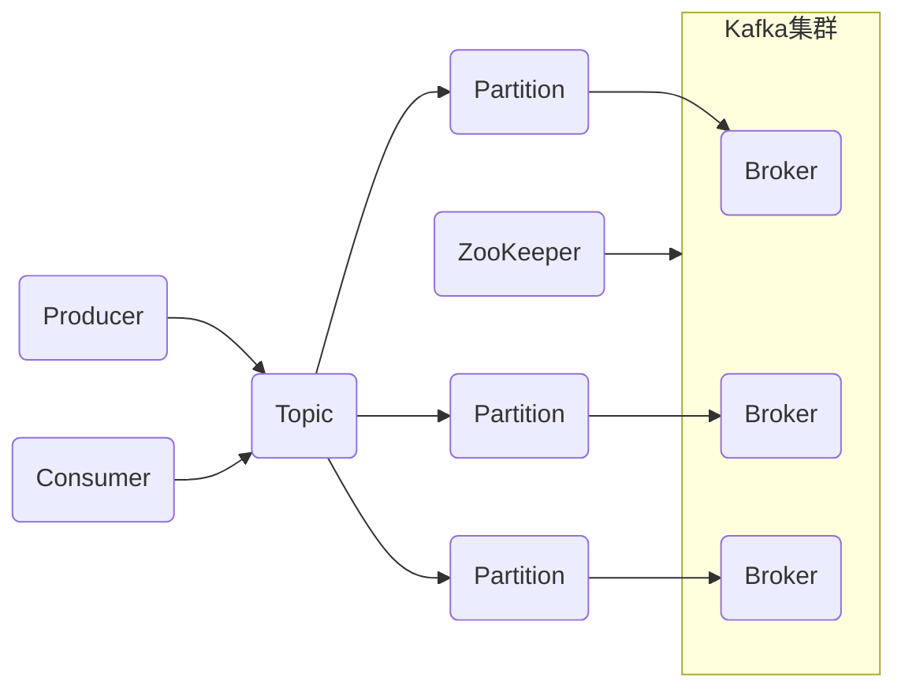

## Kafka分布式消息队列原理与代码实例讲解

## 1. 背景介绍

### 1.1 消息队列概述

消息队列（Message Queue，MQ）是一种应用程序对应用程序的通信方法，应用程序通过读写出入队列的消息（针对应用程序的数据）来进行通信，而无需专用连接来链接它们。消息传递指的是程序之间通过在消息队列中发送数据进行通信，而不是通过直接调用彼此来通信，队列的使用除去了接收和发送应用程序同时执行的要求。

### 1.2 Kafka的诞生背景

Kafka最初是由LinkedIn开发，用于处理高吞吐量的实时日志数据。随着互联网的快速发展，传统的企业级消息队列ActiveMQ、RabbitMQ等已经无法满足LinkedIn这样大规模的数据处理需求，因此LinkedIn的工程师们决定开发一套全新的消息队列系统来解决这些问题，Kafka应运而生。

### 1.3 Kafka的特点

Kafka具有以下几个显著的特点：

* **高吞吐量：** Kafka可以处理每秒百万级别的消息，这使得它非常适合处理实时数据流。
* **高可靠性：** Kafka的消息被持久化到磁盘，并且支持数据副本，这确保了即使在发生故障的情况下，数据也不会丢失。
* **可扩展性：** Kafka集群可以很容易地进行水平扩展，以处理不断增长的数据量。
* **持久性：** Kafka的消息被持久化到磁盘，这意味着即使消费者宕机，消息也不会丢失。
* **容错性：** Kafka具有很高的容错性，即使集群中的某些节点发生故障，也不会影响整个系统的运行。

## 2. 核心概念与联系

### 2.1 主题（Topic）

主题是发布消息的逻辑分类，例如，你可能有一个名为“订单”的主题，所有与订单相关的消息都将发布到该主题。

### 2.2 分区（Partition）

为了提高吞吐量和并发性，Kafka将每个主题划分为多个分区。每个分区都是一个有序的、不可变的消息序列。

### 2.3 生产者（Producer）

生产者是将消息发布到Kafka主题的应用程序。

### 2.4 消费者（Consumer）

消费者是从Kafka主题订阅和消费消息的应用程序。

### 2.5 Broker

Broker是Kafka集群中的服务器，每个Broker都负责存储一个或多个分区的数据。

### 2.6 ZooKeeper

ZooKeeper是一个分布式协调服务，Kafka使用ZooKeeper来管理集群元数据，例如Broker信息、主题信息等。

### 2.7 核心概念关系图



## 3. 核心算法原理具体操作步骤

### 3.1 生产者消息发送流程

1.  生产者将消息发送到指定的主题。
2.  Kafka根据消息的key计算出该消息应该发送到哪个分区。
3.  生产者将消息发送到指定的分区所在的Broker。
4.  Broker将消息追加到分区末尾。
5.  Broker返回消息发送结果给生产者。

### 3.2 消费者消息消费流程

1.  消费者订阅指定的主题。
2.  Kafka将该主题的所有分区分配给消费者组中的消费者。
3.  消费者从分配给它的分区中消费消息。
4.  消费者提交消费位移（offset），记录已经消费的消息位置。

### 3.3 数据可靠性保证

Kafka通过以下机制保证数据可靠性：

* **数据复制：** 每个分区都有多个副本，其中一个副本是Leader，其他副本是Follower。Leader负责处理所有读写请求，Follower从Leader同步数据。
* **数据持久化：** 消息被持久化到磁盘，即使Broker宕机，数据也不会丢失。
* **消费者位移管理：** 消费者提交消费位移，记录已经消费的消息位置，即使消费者宕机，也可以从上次提交的位移开始继续消费。

## 4. 数学模型和公式详细讲解举例说明

### 4.1 消息队列吞吐量模型

消息队列的吞吐量是指单位时间内可以处理的消息数量，通常用每秒钟处理的消息数（messages per second，MPS）来衡量。

消息队列的吞吐量主要受以下因素影响：

* **消息大小：** 消息越大，处理速度越慢。
* **网络带宽：** 网络带宽越大，数据传输速度越快。
* **磁盘I/O：** 磁盘I/O速度越快，消息持久化速度越快。
* **消费者数量：** 消费者越多，消费速度越快。

### 4.2 Kafka吞吐量优化

可以通过以下方式优化Kafka的吞吐量：

* **增加分区数量：** 分区越多，并发度越高，吞吐量越大。
* **使用压缩：** 压缩可以减小消息大小，提高网络传输效率。
* **优化磁盘I/O：** 使用更快的磁盘或RAID阵列可以提高磁盘I/O速度。
* **调整消费者数量：** 消费者数量应该与分区数量保持一致，以充分利用所有分区。

## 5. 项目实践：代码实例和详细解释说明

### 5.1 生产者代码示例

```java
import org.apache.kafka.clients.producer.KafkaProducer;
import org.apache.kafka.clients.producer.ProducerConfig;
import org.apache.kafka.clients.producer.ProducerRecord;
import org.apache.kafka.common.serialization.StringSerializer;

import java.util.Properties;

public class ProducerDemo {

    public static void main(String[] args) {
        // 设置Kafka集群地址
        Properties props = new Properties();
        props.put(ProducerConfig.BOOTSTRAP_SERVERS_CONFIG, "localhost:9092");
        // 设置key和value的序列化类
        props.put(ProducerConfig.KEY_SERIALIZER_CLASS_CONFIG, StringSerializer.class.getName());
        props.put(ProducerConfig.VALUE_SERIALIZER_CLASS_CONFIG, StringSerializer.class.getName());

        // 创建Kafka生产者
        KafkaProducer<String, String> producer = new KafkaProducer<>(props);

        // 发送消息
        for (int i = 0; i < 10; i++) {
            ProducerRecord<String, String> record = new ProducerRecord<>("my-topic", "message-" + i);
            producer.send(record);
        }

        // 关闭生产者
        producer.close();
    }
}
```

### 5.2 消费者代码示例

```java
import org.apache.kafka.clients.consumer.ConsumerConfig;
import org.apache.kafka.clients.consumer.ConsumerRecord;
import org.apache.kafka.clients.consumer.ConsumerRecords;
import org.apache.kafka.clients.consumer.KafkaConsumer;
import org.apache.kafka.common.serialization.StringDeserializer;

import java.time.Duration;
import java.util.Arrays;
import java.util.Properties;

public class ConsumerDemo {

    public static void main(String[] args) {
        // 设置Kafka集群地址
        Properties props = new Properties();
        props.put(ConsumerConfig.BOOTSTRAP_SERVERS_CONFIG, "localhost:9092");
        // 设置消费者组ID
        props.put(ConsumerConfig.GROUP_ID_CONFIG, "my-group");
        // 设置key和value的反序列化类
        props.put(ConsumerConfig.KEY_DESERIALIZER_CLASS_CONFIG, StringDeserializer.class.getName());
        props.put(ConsumerConfig.VALUE_DESERIALIZER_CLASS_CONFIG, StringDeserializer.class.getName());

        // 创建Kafka消费者
        KafkaConsumer<String, String> consumer = new KafkaConsumer<>(props);

        // 订阅主题
        consumer.subscribe(Arrays.asList("my-topic"));

        // 消费消息
        while (true) {
            