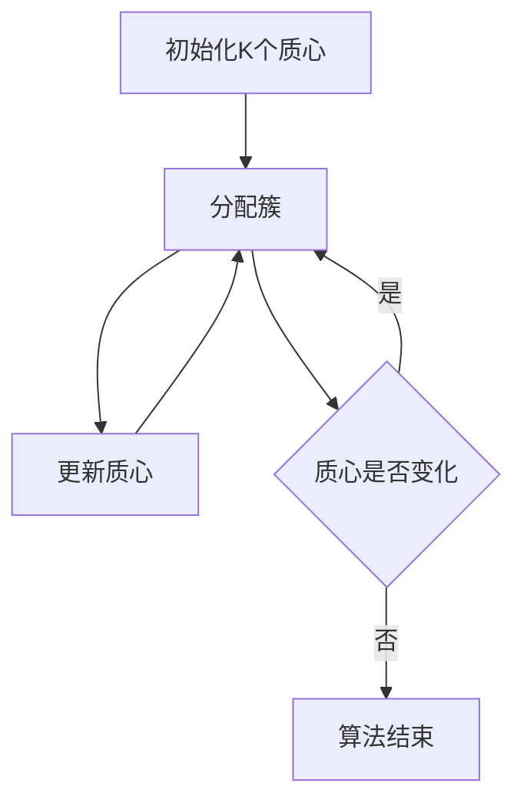

# K-均值聚类K-means原理与代码实例讲解

作者：禅与计算机程序设计艺术

## 1. 背景介绍

### 1.1 聚类分析的意义

聚类分析（Clustering Analysis）是数据挖掘和机器学习中的一种重要技术，它通过将数据集划分为若干个簇，使得同一簇内的数据对象具有较高的相似度，而不同簇之间的数据对象具有较低的相似度。聚类分析在市场营销、图像处理、基因分析等诸多领域都有广泛的应用。

### 1.2 K-均值算法的历史与发展

K-均值算法（K-means Algorithm）是聚类分析中最经典和最常用的一种算法。该算法最早由斯坦福大学的麦克奎因（MacQueen）于1967年提出，其后经过多次改进和优化，成为了数据挖掘和机器学习领域中的一个重要工具。

### 1.3 文章目标

本文旨在详细介绍K-均值算法的原理、操作步骤、数学模型及其在实际项目中的应用。通过代码实例和详细解释，帮助读者深入理解K-均值算法，并能够在实际项目中灵活运用。

## 2. 核心概念与联系

### 2.1 聚类与分类的区别

聚类和分类都是数据分析中的重要方法，但它们有着本质的区别。分类是有监督学习的一种方法，需要预先定义好的标签，而聚类是无监督学习方法，不需要预先定义标签，直接从数据中发现内在的结构。

### 2.2 K-均值算法的基本概念

K-均值算法是一种基于原型的聚类算法，其目标是将数据集划分为K个簇，使得簇内数据点到簇中心的距离之和最小。簇中心通常称为质心（Centroid）。

### 2.3 K-均值算法的优缺点

**优点：**
- 简单易懂，计算复杂度低。
- 对大数据集具有较好的伸缩性和效率。

**缺点：**
- 对初始值敏感，容易陷入局部最优。
- 需要预先指定K值。
- 对噪声和异常值敏感。

## 3. 核心算法原理具体操作步骤

### 3.1 算法步骤概述

K-均值算法的具体操作步骤如下：

1. **初始化：** 随机选择K个初始质心。
2. **分配簇：** 将每个数据点分配到距离最近的质心所在的簇。
3. **更新质心：** 重新计算每个簇的质心。
4. **重复步骤2和3，直到质心不再变化或达到最大迭代次数。**

### 3.2 算法流程图



### 3.3 详细操作步骤

#### 3.3.1 初始化

随机选择K个数据点作为初始质心，这些质心可以是数据集中的任意点。

#### 3.3.2 分配簇

对于每个数据点，计算其到K个质心的距离，并将该数据点分配到距离最近的质心所在的簇。常用的距离度量方法是欧氏距离（Euclidean Distance）。

#### 3.3.3 更新质心

对于每个簇，计算该簇中所有数据点的平均值作为新的质心。

#### 3.3.4 迭代

重复分配簇和更新质心的步骤，直到质心不再变化或达到预设的最大迭代次数。

## 4. 数学模型和公式详细讲解举例说明

### 4.1 欧氏距离的计算

在K-均值算法中，常用的距离度量方法是欧氏距离。对于两个n维向量 $\mathbf{x} = (x_1, x_2, \ldots, x_n)$ 和 $\mathbf{y} = (y_1, y_2, \ldots, y_n)$，它们之间的欧氏距离定义为：

$$
d(\mathbf{x}, \mathbf{y}) = \sqrt{\sum_{i=1}^n (x_i - y_i)^2}
$$

### 4.2 质心的更新

对于第 $k$ 个簇，其质心 $\mathbf{c}_k$ 的更新公式为：

$$
\mathbf{c}_k = \frac{1}{|C_k|} \sum_{\mathbf{x} \in C_k} \mathbf{x}
$$

其中，$C_k$ 表示第 $k$ 个簇中的所有数据点，$|C_k|$ 表示第 $k$ 个簇中的数据点数量。

### 4.3 目标函数

K-均值算法的目标是最小化簇内平方和误差（Sum of Squared Errors，SSE），其目标函数定义为：

$$
J = \sum_{k=1}^K \sum_{\mathbf{x} \in C_k} \|\mathbf{x} - \mathbf{c}_k\|^2
$$

其中，$\|\mathbf{x} - \mathbf{c}_k\|^2$ 表示数据点 $\mathbf{x}$ 到质心 $\mathbf{c}_k$ 的欧氏距离平方。

### 4.4 举例说明

假设有一个二维数据集，包含以下数据点：

$$
\mathbf{X} = \{(1, 2), (2, 3), (3, 4), (8, 8), (9, 9), (10, 10)\}
$$

我们希望将其划分为两个簇（K=2）。初始质心随机选择为 $(1, 2)$ 和 $(9, 9)$。根据K-均值算法的步骤进行迭代，直到质心不再变化。

## 5. 项目实践：代码实例和详细解释说明

### 5.1 Python实现K-均值算法

以下是使用Python实现K-均值算法的代码实例：

```python
import numpy as np

def initialize_centroids(X, K):
    return X[np.random.choice(X.shape[0], K, replace=False)]

def assign_clusters(X, centroids):
    distances = np.linalg.norm(X[:, np.newaxis] - centroids, axis=2)
    return np.argmin(distances, axis=1)

def update_centroids(X, labels, K):
    return np.array([X[labels == k].mean(axis=0) for k in range(K)])

def k_means(X, K, max_iters=100):
    centroids = initialize_centroids(X, K)
    for _ in range(max_iters):
        labels = assign_clusters(X, centroids)
        new_centroids = update_centroids(X, labels, K)
        if np.all(centroids == new_centroids):
            break
        centroids = new_centroids
    return centroids, labels

# 示例数据
X = np.array([[1, 2], [2, 3], [3, 4], [8, 8], [9, 9], [10, 10]])
K = 2

centroids, labels = k_means(X, K)
print("质心:", centroids)
print("标签:", labels)
```

### 5.2 代码解释

#### 5.2.1 初始化质心

```python
def initialize_centroids(X, K):
    return X[np.random.choice(X.shape[0], K, replace=False)]
```

该函数从数据集中随机选择K个数据点作为初始质心。

#### 5.2.2 分配簇

```python
def assign_clusters(X, centroids):
    distances = np.linalg.norm(X[:, np.newaxis] - centroids, axis=2)
    return np.argmin(distances, axis=1)
```

该函数计算每个数据点到质心的距离，并将数据点分配到最近的质心所在的簇。

#### 5.2.3 更新质心

```python
def update_centroids(X, labels, K):
    return np.array([X[labels == k].mean(axis=0) for k in range(K)])
```

该函数计算每个簇中所有数据点的平均值作为新的质心。

#### 5.2.4 K-均值算法主函数

```python
def k_means(X, K, max_iters=100):
    centroids = initialize_centroids(X, K)
    for _ in range(max_iters):
        labels = assign_clusters(X, centroids)
        new_centroids = update_centroids(X, labels, K)
        if np.all(centroids == new_centroids):
            break
        centroids = new_cent