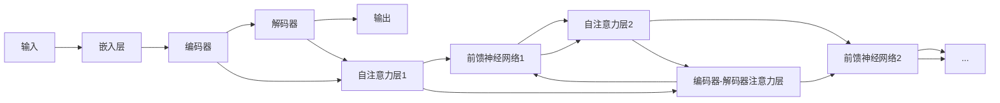

# LLM-based Agent

作者：禅与计算机程序设计艺术

## 1. 背景介绍

### 1.1  人工智能代理发展历程

人工智能代理（Artificial Intelligence Agent）一直是人工智能领域研究的热门话题，其目标是构建能够感知环境、做出决策并采取行动以实现特定目标的智能体。从早期的符号主义代理到基于规则的专家系统，再到近年来兴起的基于机器学习和深度学习的代理，人工智能代理技术经历了漫长的发展历程。

### 1.2  大语言模型 (LLM) 的兴起

近年来，随着深度学习技术，特别是自然语言处理（NLP）领域的突破，大语言模型（Large Language Model, LLM）如 GPT-3、BERT、PaLM 等的出现，为人工智能代理的发展带来了新的机遇。LLM 具备强大的文本理解、生成和推理能力，能够从海量数据中学习复杂的模式和知识，并将其应用于各种任务。

### 1.3  LLM-based Agent 的优势与挑战

将 LLM 应用于构建人工智能代理，即 LLM-based Agent，具有以下显著优势：

* **强大的语言理解和生成能力：** LLM 可以理解和生成自然语言，使得代理能够与人类进行更自然、更有效的交互。
* **丰富的知识储备：** LLM 在训练过程中学习了海量的文本数据，具备广泛的知识，可以应用于各种领域和任务。
* **强大的推理能力：** LLM 可以进行逻辑推理、问题求解等高级认知任务，使得代理能够处理更复杂的情况。

然而，LLM-based Agent 也面临着一些挑战：

* **缺乏常识和物理世界经验：** LLM 主要从文本数据中学习，缺乏对物理世界的直接经验，难以处理需要常识和物理交互的任务。
* **可解释性和可控性问题：** LLM 的决策过程通常不透明，难以解释其行为，也难以控制其输出。
* **安全性与伦理问题：** LLM 可能会生成虚假、有害或带有偏见的内容，需要采取措施确保其安全性和伦理性。

## 2. 核心概念与联系

### 2.1  LLM-based Agent 的基本架构

LLM-based Agent 通常采用模块化架构，主要包括以下几个核心组件：

* **感知模块（Perception Module）：** 负责感知和理解环境信息，例如文本、图像、音频等。
* **LLM 模块（LLM Module）：** 负责处理自然语言指令、生成文本、进行推理等任务。
* **规划与决策模块（Planning & Decision-Making Module）：**  根据感知到的信息和目标，制定行动计划并做出决策。
* **执行模块（Execution Module）：**  执行具体的行动，例如发送消息、搜索信息、控制设备等。

### 2.2  LLM-based Agent 的工作流程

LLM-based Agent 的工作流程通常如下：

1. **感知：** 代理通过感知模块接收来自环境的信息，例如用户的指令、当前的状态等。
2. **理解：**  代理将感知到的信息传递给 LLM 模块进行理解和分析。
3. **规划与决策：**  LLM 模块根据理解的信息和目标，制定行动计划并做出决策。
4. **执行：**  代理根据决策结果，通过执行模块执行具体的行动。
5. **反馈：**  环境对代理的行动做出反馈，代理感知到反馈信息后，更新自身状态，并进入下一轮循环。

## 3. 核心算法原理具体操作步骤

### 3.1  基于提示学习的 LLM-based Agent

基于提示学习（Prompt Engineering）是构建 LLM-based Agent 的常用方法，其核心思想是将任务目标和相关信息编码成提示（Prompt），引导 LLM 生成符合预期结果的文本。

以构建一个简单的问答代理为例，其具体操作步骤如下：

1. **定义任务目标：**  代理的目标是回答用户提出的问题。
2. **设计提示模板：**  设计一个提示模板，将问题和相关信息填充到模板中，例如：
   ```
   以下是关于 [主题] 的一段文本：
   [文本内容]
   问题：[问题]
   答案：
   ```
3. **调用 LLM 生成答案：**  将填充好的提示模板输入 LLM，LLM 会根据提示生成答案。
4. **解析答案：**  对 LLM 生成的答案进行解析，提取出最终的答案。

### 3.2  基于强化学习的 LLM-based Agent

强化学习（Reinforcement Learning, RL）是构建 LLM-based Agent 的另一种常用方法，其核心思想是让代理通过与环境交互，不断试错学习，找到最优的行动策略。

以构建一个简单的游戏代理为例，其具体操作步骤如下：

1. **定义环境和奖励函数：**  定义游戏的规则、状态空间、动作空间，以及代理在不同状态下采取不同行动获得的奖励。
2. **设计代理的策略网络：**  使用神经网络构建代理的策略网络，该网络将代理感知到的状态作为输入，输出不同行动的概率分布。
3. **训练代理：**  让代理与环境交互，根据环境反馈的奖励，使用强化学习算法（例如 Q-learning、Policy Gradient 等）更新代理的策略网络参数。
4. **评估代理性能：**  使用训练好的代理与环境交互，评估其在游戏中的表现，例如得分、胜率等。

## 4. 数学模型和公式详细讲解举例说明

### 4.1  基于 Transformer 的 LLM 模型

目前最先进的 LLM 模型大多基于 Transformer 架构，例如 GPT-3、BERT、PaLM 等。Transformer 模型的核心是自注意力机制（Self-Attention Mechanism），该机制允许模型在处理序列数据时，关注到序列中不同位置之间的依赖关系。

#### 4.1.1  自注意力机制

自注意力机制的计算过程可以表示为：

$$ Attention(Q, K, V) = softmax(\frac{QK^T}{\sqrt{d_k}})V $$

其中：

* $Q$ 表示查询矩阵，$K$ 表示键矩阵，$V$ 表示值矩阵。
* $d_k$ 表示键的维度。
* $softmax$ 函数用于将注意力权重归一化到 0 到 1 之间。

#### 4.1.2  Transformer 模型架构

Transformer 模型的整体架构如下图所示：



* **嵌入层：** 将输入的词序列转换成向量表示。
* **编码器：**  由多个相同的编码器层堆叠而成，每个编码器层包含自注意力层和前馈神经网络。
* **解码器：**  由多个相同的解码器层堆叠而成，每个解码器层包含自注意力层、编码器-解码器注意力层和前馈神经网络。

### 4.2  强化学习中的 Q-learning 算法

Q-learning 是一种常用的强化学习算法，其目标是学习一个状态-动作值函数（Q 函数），该函数表示代理在某个状态下采取某个行动的预期累积奖励。

Q-learning 算法的更新规则如下：

$$ Q(s_t, a_t) \leftarrow (1 - \alpha) Q(s_t, a_t) + \alpha [r_{t+1} + \gamma \max_{a} Q(s_{t+1}, a)] $$

其中：

* $Q(s_t, a_t)$ 表示代理在状态 $s_t$ 下采取行动 $a_t$ 的 Q 值。
* $\alpha$ 表示学习率。
* $r_{t+1}$ 表示代理在状态 $s_t$ 下采取行动 $a_t$ 后，在状态 $s_{t+1}$ 获得的奖励。
* $\gamma$ 表示折扣因子，用于平衡当前奖励和未来奖励的重要性。
* $\max_{a} Q(s_{t+1}, a)$ 表示代理在状态 $s_{t+1}$ 下，采取所有可能行动中 Q 值最大的行动的 Q 值。

## 5. 项目实践：代码实例和详细解释说明

### 5.1  使用 LangChain 构建简单的问答代理

LangChain 是一个用于构建 LLM 应用的 Python 库，提供了一系列工具和接口，方便开发者使用 LLM 进行文本生成、问答、聊天等任务。

以下代码演示了如何使用 LangChain 构建一个简单的问答代理：

```python
from langchain.agents import load_tools
from langchain.agents import initialize_agent
from langchain.llms import OpenAI

# 初始化 LLM 模型
llm = OpenAI(temperature=0.9)

# 加载工具
tools = load_tools(["wikipedia", "llm-math"], llm=llm)

# 初始化代理
agent = initialize_agent(tools, llm, agent="zero-shot-react-description", verbose=True)

# 运行代理
agent.run("世界上最高的山峰是什么？它的海拔是多少米？")
```

**代码解释：**

* 首先，我们使用 `OpenAI` 类初始化了一个 OpenAI 的 LLM 模型。
* 然后，我们使用 `load_tools` 函数加载了两个工具：`wikipedia` 和 `llm-math`。`wikipedia` 工具可以用来查询维基百科，`llm-math` 工具可以用来进行数学计算。
* 接着，我们使用 `initialize_agent` 函数初始化了一个代理。我们选择了 `zero-shot-react-description` 代理类型，该类型代理可以根据任务描述，自动选择合适的工具来完成任务。
* 最后，我们调用代理的 `run` 方法，输入问题，代理会自动调用相应的工具，并返回最终的答案。

**运行结果：**

```
> 世界上最高的山峰是什么？它的海拔是多少米？

```json
{
 "action": "WikipediaQuery",
 "action_input": "世界上最高的山峰"
}
```

```json
{
 "action": "WikipediaQuery",
 "action_input": "珠穆朗玛峰的高度"
}
```

```
珠穆朗玛峰是世界上海拔最高的山峰，海拔8848.86米。
```

### 5.2  使用 Transformers 库微调 LLM 模型

Transformers 库是 Hugging Face 公司开源的一个用于自然语言处理的 Python 库，提供了各种预训练的 LLM 模型，以及用于模型训练、评估和部署的工具。

以下代码演示了如何使用 Transformers 库微调一个预训练的 LLM 模型，用于情感分类任务：

```python
from transformers import AutoModelForSequenceClassification, Trainer, TrainingArguments
from datasets import load_dataset

# 加载数据集
dataset = load_dataset("imdb")

# 加载预训练模型
model_name = "bert-base-uncased"
model = AutoModelForSequenceClassification.from_pretrained(model_name, num_labels=2)

# 定义训练参数
training_args = TrainingArguments(
    output_dir="./results",
    num_train_epochs=3,
    per_device_train_batch_size=8,
    per_device_eval_batch_size=8,
    learning_rate=2e-5,
)

# 创建 Trainer 对象
trainer = Trainer(
    model=model,
    args=training_args,
    train_dataset=dataset["train"],
    eval_dataset=dataset["test"],
)

# 开始训练
trainer.train()
```

**代码解释：**

* 首先，我们使用 `load_dataset` 函数加载了 IMDB 电影评论情感分类数据集。
* 然后，我们使用 `AutoModelForSequenceClassification.from_pretrained` 方法加载了一个预训练的 BERT 模型，并将其用于情感分类任务。
* 接着，我们定义了训练参数，例如训练轮数、批大小、学习率等。
* 然后，我们使用 `Trainer` 类创建了一个 Trainer 对象，该对象用于管理模型训练过程。
* 最后，我们调用 `trainer.train()` 方法开始训练模型。

## 6. 实际应用场景

### 6.1  智能客服

LLM-based Agent 可以用于构建智能客服系统，例如：

* 自动回答用户常见问题。
* 根据用户需求，提供个性化的服务推荐。
* 处理用户投诉，并提供解决方案。

### 6.2  虚拟助手

LLM-based Agent 可以用于构建虚拟助手，例如：

* 管理用户的日程安排，提醒重要事项。
* 控制智能家居设备，例如开关灯、调节温度等。
* 提供娱乐服务，例如播放音乐、推荐电影等。

### 6.3  游戏 AI

LLM-based Agent 可以用于构建游戏 AI，例如：

* 控制游戏角色，与玩家进行交互。
* 生成游戏剧情，增强游戏的趣味性。
* 提供游戏攻略，帮助玩家更好地体验游戏。

## 7. 工具和资源推荐

### 7.1  LLM 模型

* **GPT-3 (Generative Pre-trained Transformer 3)：** OpenAI 开发的超大规模语言模型，具备强大的文本生成和理解能力。
* **BERT (Bidirectional Encoder Representations from Transformers)：** Google 开发的预训练语言模型，在各种 NLP 任务上都取得了很好的效果。
* **PaLM (Pathway Language Model)：** Google 开发的超大规模语言模型，在多项 NLP 基准测试中都取得了最先进的结果。

### 7.2  开发框架

* **LangChain：** 用于构建 LLM 应用的 Python 库，提供了一系列工具和接口，方便开发者使用 LLM 进行文本生成、问答、聊天等任务。
* **Transformers：** Hugging Face 公司开源的一个用于自然语言处理的 Python 库，提供了各种预训练的 LLM 模型，以及用于模型训练、评估和部署的工具。
* **DeepPavlov：** 用于构建对话系统的开源框架，支持使用 LLM 进行对话生成和理解。

### 7.3  学习资源

* **Stanford CS224N: Natural Language Processing with Deep Learning：** 斯坦福大学的自然语言处理课程，涵盖了 LLM 的基础知识和应用。
* **OpenAI API Documentation：** OpenAI API 的官方文档，提供了使用 GPT-3 进行文本生成的详细说明。
* **Hugging Face Transformers Documentation：** Hugging Face Transformers 库的官方文档，提供了使用 Transformers 库进行 LLM 模型训练、评估和部署的详细说明。

## 8. 总结：未来发展趋势与挑战

### 8.1  未来发展趋势

* **更强大的 LLM 模型：** 随着计算能力的提升和训练数据的增加，LLM 模型的规模和性能将会进一步提升。
* **多模态 LLM-based Agent：** 将 LLM 与其他模态（例如图像、音频、视频）的信息相结合，构建能够处理更复杂任务的代理。
* **更安全、更可靠的 LLM-based Agent：**  研究如何提高 LLM-based Agent 的安全性、可解释性和可控性，使其能够更好地服务于人类社会。

### 8.2  挑战

* **常识推理和物理世界交互：**  如何让 LLM-based Agent 具备常识推理能力，并能够与物理世界进行有效交互，仍然是一个挑战。
* **数据效率和计算成本：**  训练 LLM 模型需要大量的计算资源和数据，如何提高数据效率和降低计算成本是一个重要问题。
* **伦理和社会影响：**  LLM-based Agent 的发展可能会带来伦理和社会影响，例如偏见、歧视、隐私泄露等，需要制定相应的规范和措施。

## 9. 附录：常见问题与解答

### 9.1  什么是 LLM-based Agent？

LLM-based Agent 是指利用大语言模型 (LLM) 构建的人工智能代理，其特点是能够理解和生成自然语言，具备一定的推理能力，可以完成各种任务。

### 9.2  LLM-based Agent 的应用场景有哪些？

LLM-based Agent 的应用场景非常广泛，例如智能客服、虚拟助手、游戏 AI、教育、医疗等。

### 9.3  如何构建 LLM-based Agent？

构建 LLM-based Agent 的方法主要有两种：基于提示学习和基于强化学习。

### 9.4  LLM-based Agent 的未来发展趋势是什么？

LLM-based Agent 的未来发展趋势包括更强大的 LLM 模型、多模态 LLM-based Agent、更安全、更可靠的 LLM-based Agent 等。
