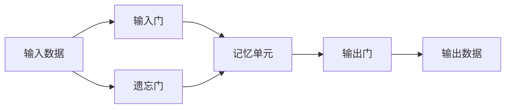

# LSTM的伦理问题：人工智能的责任与挑战

作者：禅与计算机程序设计艺术

## 1.背景介绍

### 1.1 人工智能的快速发展

近年来，人工智能（AI）技术取得了飞速发展，尤其是在深度学习领域。长短期记忆网络（LSTM）作为一种特殊的递归神经网络（RNN），在处理序列数据方面表现出色，被广泛应用于自然语言处理、语音识别、时间序列预测等领域。然而，随着LSTM及其他AI技术的广泛应用，伦理问题和责任挑战也逐渐显现。

### 1.2 LSTM的基本介绍

长短期记忆网络（LSTM）是由Hochreiter和Schmidhuber在1997年提出的一种递归神经网络结构，旨在解决传统RNN在处理长序列数据时存在的梯度消失问题。LSTM通过引入记忆单元和门控机制，能够有效地捕捉和保持长时间依赖信息。

### 1.3 伦理问题的初步探讨

随着LSTM在各个领域的广泛应用，其带来的伦理问题也逐渐引起了关注。例如，LSTM在预测金融市场、医疗诊断、自动驾驶等高风险领域的应用，可能会对社会产生深远的影响。本文将深入探讨LSTM的伦理问题，分析其在不同应用场景下的责任与挑战。

## 2.核心概念与联系

### 2.1 LSTM的基本结构

LSTM的基本结构包括输入门、遗忘门、输出门和记忆单元。其核心思想是通过这些门控机制，选择性地保留和更新信息，从而有效地解决长序列数据处理中的梯度消失问题。



### 2.2 LSTM与其他RNN的区别

与传统的RNN相比，LSTM在处理长序列数据时具有显著优势。传统RNN由于其简单的结构，在处理长序列数据时容易出现梯度消失或梯度爆炸问题，而LSTM通过引入门控机制，有效地缓解了这些问题。

### 2.3 LSTM与伦理问题的联系

LSTM的广泛应用不仅带来了技术上的突破，也引发了诸多伦理问题。例如，LSTM在自动驾驶中的应用，可能会面临如何平衡安全性与效率的伦理困境；在医疗诊断中的应用，可能会涉及患者隐私保护和诊断准确性的问题。

## 3.核心算法原理具体操作步骤

### 3.1 LSTM的门控机制

LSTM的核心在于其门控机制，包括输入门、遗忘门和输出门。每个门由一个sigmoid层和一个点乘操作组成，用于控制信息的流动。

### 3.2 记忆单元的更新

记忆单元的更新是LSTM的关键步骤。通过输入门和遗忘门的控制，LSTM能够选择性地保留或丢弃信息，从而实现对长时间依赖信息的捕捉和保持。

### 3.3 输出数据的生成

LSTM的输出数据是通过输出门和记忆单元的共同作用生成的。输出门控制记忆单元中的信息是否被传递到下一个时间步，从而实现对序列数据的有效处理。

## 4.数学模型和公式详细讲解举例说明

### 4.1 LSTM的数学模型

LSTM的数学模型可以用以下公式表示：

$$
\begin{align*}
f_t &= \sigma(W_f \cdot [h_{t-1}, x_t] + b_f) \\
i_t &= \sigma(W_i \cdot [h_{t-1}, x_t] + b_i) \\
\tilde{C}_t &= \tanh(W_C \cdot [h_{t-1}, x_t] + b_C) \\
C_t &= f_t * C_{t-1} + i_t * \tilde{C}_t \\
o_t &= \sigma(W_o \cdot [h_{t-1}, x_t] + b_o) \\
h_t &= o_t * \tanh(C_t)
\end{align*}
$$

### 4.2 公式的详细解释

- $f_t$ 是遗忘门的激活值，表示当前输入和前一时刻隐状态的线性组合经过sigmoid激活函数。
- $i_t$ 是输入门的激活值，表示当前输入和前一时刻隐状态的线性组合经过sigmoid激活函数。
- $\tilde{C}_t$ 是候选记忆单元，表示当前输入和前一时刻隐状态的线性组合经过tanh激活函数。
- $C_t$ 是当前时刻的记忆单元，表示前一时刻的记忆单元经过遗忘门的控制后，与当前时刻的候选记忆单元经过输入门的控制后的加权和。
- $o_t$ 是输出门的激活值，表示当前输入和前一时刻隐状态的线性组合经过sigmoid激活函数。
- $h_t$ 是当前时刻的隐状态，表示当前记忆单元经过输出门的控制后，经过tanh激活函数的结果。

### 4.3 举例说明

假设我们有一个简单的序列数据，$x = [x_1, x_2, x_3]$，我们可以通过LSTM网络来预测下一个时刻的值。具体步骤如下：

1. 初始化LSTM网络的权重和偏置。
2. 将序列数据依次输入LSTM网络，计算每个时间步的隐状态和记忆单元。
3. 根据最后一个时间步的隐状态和记忆单元，生成预测值。

## 4.项目实践：代码实例和详细解释说明

### 4.1 项目背景

为了更好地理解LSTM的工作原理和应用，我们将通过一个简单的项目实例来展示LSTM的实际应用。该项目将使用LSTM网络来预测股票价格。

### 4.2 数据准备

首先，我们需要准备股票价格数据。可以使用Yahoo Finance API获取股票历史数据。以下是一个简单的Python代码示例：

```python
import yfinance as yf

# 获取苹果公司股票历史数据
data = yf.download('AAPL', start='2020-01-01', end='2023-01-01')
```

### 4.3 数据预处理

在训练LSTM模型之前，我们需要对数据进行预处理。包括归一化、生成训练集和测试集等。以下是一个简单的代码示例：

```python
import numpy as np
from sklearn.preprocessing import MinMaxScaler

# 归一化数据
scaler = MinMaxScaler(feature_range=(0, 1))
scaled_data = scaler.fit_transform(data['Close'].values.reshape(-1, 1))

# 生成训练集和测试集
train_size = int(len(scaled_data) * 0.8)
train_data = scaled_data[:train_size]
test_data = scaled_data[train_size:]

# 生成时间序列数据
def create_dataset(dataset, time_step=1):
    dataX, dataY = [], []
    for i in range(len(dataset) - time_step - 1):
        a = dataset[i:(i + time_step), 0]
        dataX.append(a)
        dataY.append(dataset[i + time_step, 0])
    return np.array(dataX), np.array(dataY)

time_step = 60
X_train, y_train = create_dataset(train_data, time_step)
X_test, y_test = create_dataset(test_data, time_step)
```

### 4.4 模型构建与训练

接下来，我们将使用Keras库来构建和训练LSTM模型。以下是一个简单的代码示例：

```python
from keras.models import Sequential
from keras.layers import LSTM, Dense

# 构建LSTM模型
model = Sequential()
model.add(LSTM(50, return_sequences=True, input_shape=(time_step, 1)))
model.add(LSTM(50, return_sequences=False))
model.add(Dense(25))
model.add(Dense(1))

# 编译模型
model.compile(optimizer='adam', loss='mean_squared_error')

# 训练模型
model.fit(X_train, y_train, batch_size=1, epochs=1)
```

### 4.5 模型评估与预测

训练完成后，我们可以使用测试数据来评估模型的性能，并进行预测。以下是一个简单的代码示例：

```python
# 模型预测
train_predict = model.predict(X_train)
test_predict = model.predict(X_test)

# 反归一化预测值
train_predict = scaler.inverse_transform(train_predict)
test_predict = scaler.inverse_transform(test_predict)

# 计算均方误差
train_rmse = np.sqrt(np.mean(((train_predict