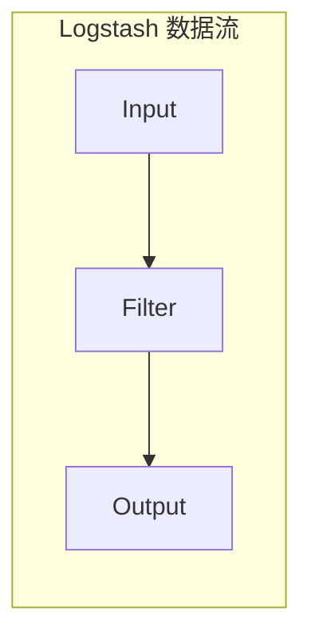

## Logstash原理与代码实例讲解

作者：禅与计算机程序设计艺术

## 1. 背景介绍

### 1.1 日志数据的价值

在信息爆炸的时代，海量的日志数据蕴藏着巨大的价值。无论是应用程序的运行状态、用户的行为轨迹，还是系统的安全事件，都被记录在各种类型的日志文件中。有效地收集、处理和分析这些日志数据，可以帮助我们：

* **监控系统运行状态：** 及时发现系统故障、性能瓶颈和安全风险。
* **优化业务流程：** 分析用户行为，挖掘潜在需求，提升产品体验。
* **辅助决策：** 基于数据分析结果，制定更科学合理的决策方案。

### 1.2 日志处理面临的挑战

然而，海量日志数据的处理并非易事，主要面临以下挑战：

* **数据量大、增长快：** 随着业务规模的扩大，日志数据量呈指数级增长，给存储和处理带来巨大压力。
* **数据格式多样：** 不同应用、不同平台产生的日志格式各异，难以统一处理和分析。
* **实时性要求高：** 对于一些关键业务，需要实时监控和分析日志数据，及时发现问题并采取措施。

### 1.3 Logstash的优势

为了应对上述挑战，我们需要一套高效、灵活、可扩展的日志处理系统。Logstash作为Elastic Stack中的重要成员，凭借其强大的数据采集、处理和传输能力，成为众多企业和开发者的首选方案。Logstash的主要优势包括：

* **灵活的数据采集：** 支持多种数据源，包括文件、数据库、消息队列等。
* **丰富的插件生态：** 提供数百种插件，涵盖数据解析、过滤、转换、输出等各个环节。
* **高性能、可扩展：** 支持多线程、分布式部署，轻松应对海量数据处理需求。

## 2. 核心概念与联系

### 2.1 数据流处理模型

Logstash采用数据流处理模型，将数据采集、处理和传输抽象为三个核心组件：

* **Input：** 负责从各种数据源采集数据，例如文件、数据库、网络协议等。
* **Filter：** 对采集到的数据进行过滤、转换、解析等操作，提取关键信息。
* **Output：** 将处理后的数据输出到指定的目的地，例如 Elasticsearch、文件、数据库等。

这三个组件之间通过数据管道进行连接，数据按照预定义的流程进行处理和传输。



### 2.2 配置文件

Logstash使用配置文件来定义数据处理流程，配置文件采用 YAML 或 JSON 格式。配置文件中包含三个主要部分：

* **Input：** 定义数据源的类型、地址、格式等信息。
* **Filter：** 定义数据处理的规则和逻辑，例如正则表达式匹配、字段提取等。
* **Output：** 定义数据输出的目的地和格式。

### 2.3 插件机制

Logstash的强大之处在于其丰富的插件生态，通过插件机制可以轻松扩展其功能。Logstash插件分为以下几种类型：

* **Input 插件：** 用于从不同数据源采集数据。
* **Codec 插件：** 用于解析和编码不同格式的数据。
* **Filter 插件：** 用于过滤、转换和解析数据。
* **Output 插件：** 用于将数据输出到不同目的地。

## 3. 核心算法原理具体操作步骤

### 3.1 数据采集

Logstash支持多种数据采集方式，例如：

* **文件采集：** 从指定路径读取文件内容，支持多种文件格式，例如文本文件、JSON 文件、CSV 文件等。
* **网络采集：** 监听指定端口，接收网络数据，支持多种网络协议，例如 TCP、UDP、Syslog 等。
* **数据库采集：** 从关系型数据库或 NoSQL 数据库中读取数据。
* **消息队列采集：** 从消息队列中读取数据，例如 Kafka、RabbitMQ 等。

### 3.2 数据过滤

Logstash提供了丰富的过滤插件，可以对数据进行各种操作，例如：

* **字段提取：** 使用正则表达式或 Grok 模式从数据中提取关键字段。
* **数据转换：** 对数据进行格式转换、类型转换、编码转换等操作。
* **数据过滤：** 根据条件过滤数据，例如保留特定字段、丢弃特定数据等。

### 3.3 数据输出

Logstash支持多种数据输出方式，例如：

* **Elasticsearch 输出：** 将数据索引到 Elasticsearch 集群中，用于后续的搜索和分析。
* **文件输出：** 将数据写入到指定的文件中，支持多种文件格式。
* **数据库输出：** 将数据写入到关系型数据库或 NoSQL 数据库中。
* **消息队列输出：** 将数据发送到消息队列中，例如 Kafka、RabbitMQ 等。

## 4. 数学模型和公式详细讲解举例说明

Logstash本身不涉及复杂的数学模型和算法，其核心在于数据流处理模型和插件机制。

## 5. 项目实践：代码实例和详细解释说明

### 5.1 安装Logstash

首先需要安装 Logstash，可以从官网下载对应操作系统的安装包进行安装。

### 5.2 编写配置文件

创建一个名为 `logstash.conf` 的配置文件，内容如下：

```yaml
input {
  file {
    path => "/var/log/messages"
    start_position => "beginning"
  }
}

filter {
  grok {
    match => { "message" => "%{SYSLOGTIMESTAMP:timestamp} %{SYSLOGHOST:hostname} %{DATA:message}" }
  }
}

output {
  elasticsearch {
    hosts => ["localhost:9200"]
    index => "system-logs-%{+YYYY.MM.dd}"
  }
}
```

该配置文件定义了以下数据处理流程：

1. **Input：** 从 `/var/log/messages` 文件中读取数据，从文件开头开始读取。
2. **Filter：** 使用 Grok 模式解析日志消息，提取 `timestamp`、`hostname` 和 `message` 三个字段。
3. **Output：** 将解析后的数据输出到 Elasticsearch 集群中，索引名为 `system-logs-YYYY.MM.dd`。

### 5.3 启动Logstash

执行以下命令启动 Logstash：

```bash
logstash -f logstash.conf
```

Logstash 将会读取配置文件，并启动数据处理流程。

## 6. 实际应用场景

Logstash 广泛应用于各种日志处理场景，例如：

* **系统监控：** 收集系统日志、应用程序日志，监控系统运行状态，及时发现故障和性能瓶颈。
* **安全审计：** 收集安全事件日志，分析攻击行为，提高系统安全性。
* **业务分析：** 收集用户行为日志、业务操作日志，分析用户行为模式，优化业务流程。
* **数据仓库：** 将各种来源的数据收集到数据仓库中，进行统一存储和分析。

## 7. 工具和资源推荐

* **Elasticsearch：** 用于存储和分析 Logstash 处理后的数据。
* **Kibana：** 用于可视化 Elasticsearch 中的数据。
* **Filebeat：** 轻量级日志采集器，可以将日志数据发送到 Logstash 或 Elasticsearch。
* **Metricbeat：** 用于收集系统和应用程序指标，例如 CPU 使用率、内存使用率等。

## 8. 总结：未来发展趋势与挑战

随着大数据技术的不断发展，Logstash 也在不断进化，未来发展趋势包括：

* **更强大的数据处理能力：** 支持更复杂的过滤规则、更丰富的插件生态。
* **更灵活的部署方式：** 支持云原生部署、边缘计算等场景。
* **更智能化的分析能力：** 集成机器学习算法，实现日志数据的自动分类、异常检测等功能。

## 9. 附录：常见问题与解答

### 9.1 如何调试 Logstash 配置文件？

可以使用 `--config.test_and_exit` 参数测试配置文件语法：

```bash
logstash -f logstash.conf --config.test_and_exit
```

可以使用 `-l` 参数指定日志级别，例如：

```bash
logstash -f logstash.conf -l debug
```

### 9.2 如何监控 Logstash 运行状态？

Logstash 提供了 REST API 和 Web UI 界面，可以监控其运行状态、查看统计信息等。

### 9.3 如何处理 Logstash 数据丢失问题？

可以使用 Logstash 的持久化队列机制，将数据持久化到磁盘上，防止数据丢失。