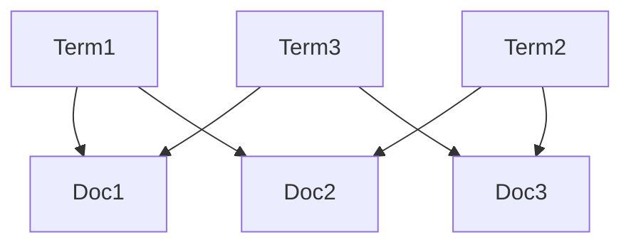
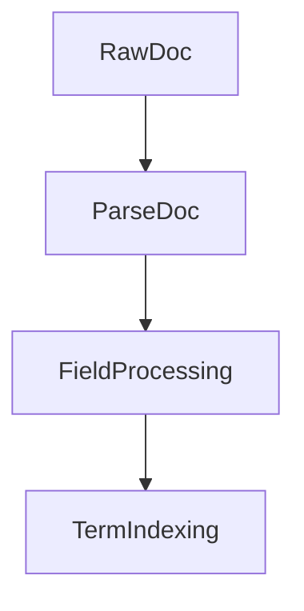
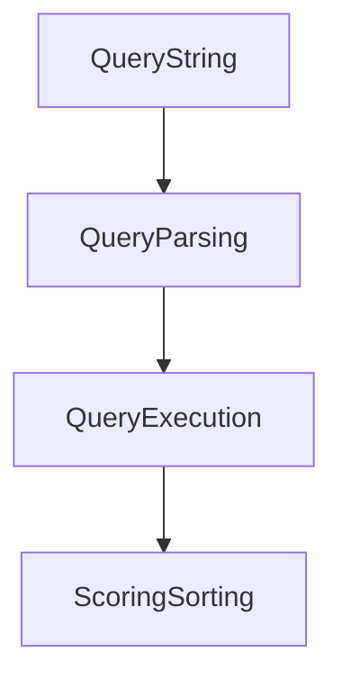

# Lucene应用案例：电商搜索、法律检索、学术搜索

作者：禅与计算机程序设计艺术

## 1. 背景介绍

Apache Lucene 是一个高性能、可扩展的信息检索库，广泛应用于各类搜索和数据分析场景。自其发布以来，Lucene 因其强大的查询能力和灵活性，迅速成为开发者在构建搜索引擎时的首选工具。在这篇文章中，我们将探讨 Lucene 在三个典型应用场景中的使用：电商搜索、法律检索和学术搜索。

### 1.1 什么是 Lucene

Lucene 是一个开源的全文搜索引擎库，由 Apache 软件基金会维护。它提供了一个简单但功能强大的 API，可以用于索引和搜索文本数据。Lucene 的核心是倒排索引（Inverted Index），这种数据结构使得搜索操作非常高效。

### 1.2 Lucene 的优势

- **高性能**：Lucene 能够快速处理大量文档和复杂查询。
- **灵活性**：支持多种数据类型和复杂的查询语法。
- **扩展性**：可以轻松扩展以满足不同的应用需求。
- **社区支持**：拥有活跃的开发者社区和丰富的文档资源。

### 1.3 典型应用场景

在实际应用中，Lucene 被广泛应用于各种搜索场景。本文将重点介绍以下三个领域的应用案例：

1. **电商搜索**：优化商品搜索和推荐系统。
2. **法律检索**：高效检索法律文档和案例。
3. **学术搜索**：支持学术论文和研究资料的快速检索。

## 2. 核心概念与联系

在理解 Lucene 的应用之前，我们需要掌握一些核心概念，这些概念是构建高效搜索系统的基础。

### 2.1 倒排索引

倒排索引是 Lucene 的核心数据结构。它将文档中的每个词条映射到包含该词条的文档列表，从而使得查询操作变得非常高效。



### 2.2 文档和字段

在 Lucene 中，所有的数据都存储在文档（Document）中。每个文档由多个字段（Field）组成，字段可以包含不同类型的数据，如文本、数字、日期等。

### 2.3 查询解析和评分

Lucene 提供了丰富的查询语法，支持布尔查询、短语查询、范围查询等。查询解析器将用户输入的查询字符串解析成 Lucene 内部的查询对象。评分机制则用于评估每个文档与查询的匹配程度，从而返回最相关的结果。

### 2.4 分析器和分词器

分析器（Analyzer）是 Lucene 中用于处理文本的组件。它包括分词器（Tokenizer）和过滤器（Filter），用于将文本分解成词条，并对词条进行规范化处理，如小写转换、去除停用词等。

## 3. 核心算法原理具体操作步骤

Lucene 的核心算法包括索引构建和查询处理两个主要部分。下面我们详细介绍这两个过程的具体操作步骤。

### 3.1 索引构建

索引构建是将原始文档转换为倒排索引的过程。主要步骤如下：

1. **文档解析**：将原始文档解析成 Lucene 的文档对象。
2. **字段处理**：对每个字段进行分析和处理，生成词条。
3. **词条索引**：将词条添加到倒排索引中。



### 3.2 查询处理

查询处理是将用户的查询转换为搜索结果的过程。主要步骤如下：

1. **查询解析**：将查询字符串解析成 Lucene 的查询对象。
2. **查询执行**：在倒排索引中查找匹配的文档。
3. **评分排序**：根据评分机制对结果进行排序。



### 3.3 详细操作步骤

#### 3.3.1 创建索引

```java
import org.apache.lucene.analysis.standard.StandardAnalyzer;
import org.apache.lucene.document.Document;
import org.apache.lucene.document.Field;
import org.apache.lucene.document.TextField;
import org.apache.lucene.index.IndexWriter;
import org.apache.lucene.index.IndexWriterConfig;
import org.apache.lucene.store.Directory;
import org.apache.lucene.store.RAMDirectory;

public class Indexer {
    public static void main(String[] args) throws Exception {
        // 创建内存目录
        Directory directory = new RAMDirectory();
        // 创建标准分析器
        StandardAnalyzer analyzer = new StandardAnalyzer();
        // 创建索引写入配置
        IndexWriterConfig config = new IndexWriterConfig(analyzer);
        // 创建索引写入器
        IndexWriter writer = new IndexWriter(directory, config);

        // 创建文档
        Document doc = new Document();
        doc.add(new TextField("title", "Lucene in Action", Field.Store.YES));
        doc.add(new TextField("content", "Lucene is a powerful search library", Field.Store.YES));
        
        // 添加文档到索引
        writer.addDocument(doc);
        writer.close();
    }
}
```

#### 3.3.2 执行查询

```java
import org.apache.lucene.analysis.standard.StandardAnalyzer;
import org.apache.lucene.document.Document;
import org.apache.lucene.index.DirectoryReader;
import org.apache.lucene.index.IndexReader;
import org.apache.lucene.queryparser.classic.QueryParser;
import org.apache.lucene.search.IndexSearcher;
import org.apache.lucene.search.Query;
import org.apache.lucene.search.ScoreDoc;
import org.apache.lucene.search.TopDocs;
import org.apache.lucene.store.Directory;
import org.apache.lucene.store.RAMDirectory;

public class Searcher {
    public static void main(String[] args) throws Exception {
        // 创建内存目录
        Directory directory = new RAMDirectory();
        // 创建标准分析器
        StandardAnalyzer analyzer = new StandardAnalyzer();
        // 创建索引读取器
        IndexReader reader = DirectoryReader.open(directory);
        // 创建索引搜索器
        IndexSearcher searcher = new IndexSearcher(reader);

        // 创建查询解析器
        QueryParser parser = new QueryParser("content", analyzer);
        // 解析查询
        Query query = parser.parse("powerful search library");
        
        // 执行查询
        TopDocs results = searcher.search(query, 10);
        for (ScoreDoc scoreDoc : results.scoreDocs) {
            Document doc = searcher.doc(scoreDoc.doc);
            System.out.println("Title: " + doc.get("title"));
        }
        
        reader.close();
    }
}
```

## 4. 数学模型和公式详细讲解举例说明

Lucene 的核心算法涉及到多个数学模型和公式，下面我们详细讲解其中的几个关键部分。

### 4.1 TF-IDF 模型

TF-IDF（Term Frequency-Inverse Document Frequency）是衡量词条重要性的常用方法。其公式如下：

$$
\text{TF-IDF}(t, d) = \text{TF}(t, d) \times \text{IDF}(t)
$$

其中，$\text{TF}(t, d)$ 表示词条 $t$ 在文档 $d$ 中出现的频率，$\text{IDF}(t)$ 表示词条 $t$ 的逆文档频率。

$$
\text{TF}(t, d) = \frac{f_{t,d}}{\sum_{t' \in d} f_{t',d}}
$$

$$
\text{IDF}(t) = \log \frac{N}{|\{d \in D : t \in d\}|}
$$

### 4.2 BM25 模型

BM25 是一种改进的 TF-IDF 模型，常用于信息检索系统。其公式如下：

$$
\text{BM25}(t, d) = \sum_{i=1}^{n} \frac{\text{IDF}(t_i) \cdot (k_1 + 1) \cdot f_{t_i, d}}{f_{t_i, d} + k_1 \cdot (1 - b + b \cdot \frac{|d|}{\text{avgdl}})}
$$

其中，$k_1$ 和 $b$ 是调节参数，$|d|$ 表示文档 $d$ 的长度，$\text{avgdl}$ 表示所有文档的平均长度。

### 4.3 向量空间模型

在向量空间模型中，文档和查询被表示为向量，文档与查询的相关性通过计算向量之间的余弦相似度来衡量。

$$
\text{cosine}(d, q) =