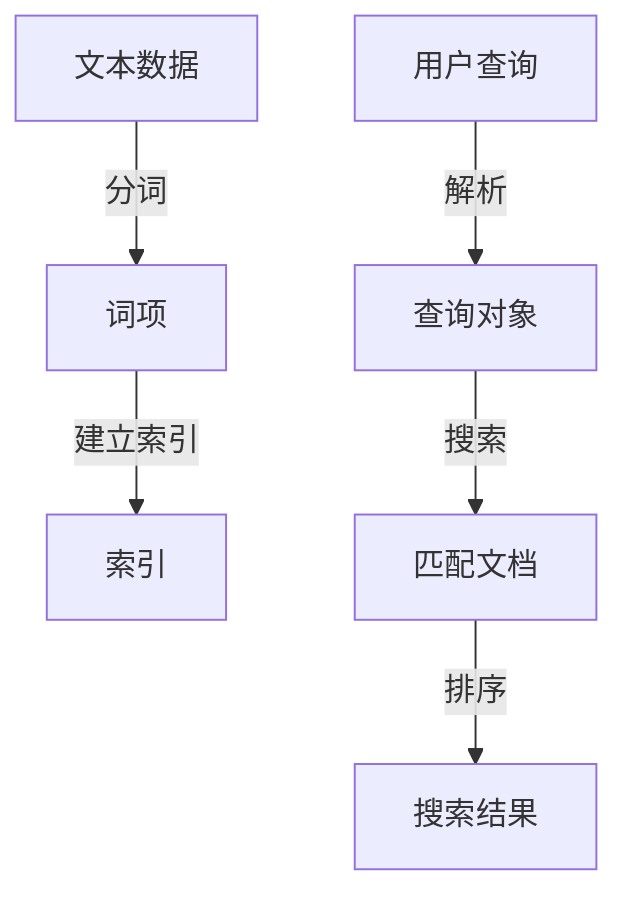

# Lucene搜索引擎原理与代码实例讲解

作者：禅与计算机程序设计艺术

## 1. 背景介绍

在当今信息爆炸的时代，搜索引擎已成为我们日常生活和工作中不可或缺的工具。无论是Google、Bing这样的互联网搜索引擎，还是企业内部的文档搜索系统，搜索引擎的高效性和准确性都直接影响用户体验和工作效率。Apache Lucene作为一个高性能、全功能的文本搜索引擎库，广泛应用于各种搜索解决方案中。

本篇文章旨在深入探讨Lucene的工作原理，分析其核心算法，并通过代码实例展示如何在实际项目中应用Lucene构建高效的搜索引擎。文章将从背景介绍、核心概念、算法原理、数学模型、项目实践、实际应用场景、工具和资源推荐、未来发展趋势与挑战、常见问题与解答等多个方面进行详细讲解。

## 2. 核心概念与联系

### 2.1 什么是Lucene？

Lucene是Apache软件基金会下的一个开源项目，最早由Doug Cutting于1999年创建。它提供了一个功能强大且灵活的搜索引擎库，允许开发者在应用程序中实现全文搜索功能。Lucene主要用于索引和搜索文本数据，支持多种语言和复杂的查询操作。

### 2.2 Lucene的架构

Lucene的架构可以分为以下几个核心组件：

- **索引器（Indexer）**：负责将文档内容进行分词、建立索引。
- **查询器（Searcher）**：处理用户查询，搜索索引并返回结果。
- **分析器（Analyzer）**：用于分词和处理文本。
- **文档（Document）**：Lucene中的基本数据单位，包含一个或多个字段（Field）。
- **索引（Index）**：存储文档的结构化数据，便于快速检索。

### 2.3 索引与搜索的基本流程

Lucene的索引与搜索流程可以简化为以下几个步骤：

1. **文本分析**：将文本数据分解为词项（Term）。
2. **索引构建**：将词项和文档的映射关系存储在索引中。
3. **查询解析**：将用户输入的查询转换为Lucene能够理解的查询对象。
4. **搜索匹配**：在索引中查找匹配的文档。
5. **结果排序**：根据相关性对搜索结果进行排序。

以下是Lucene索引与搜索流程的Mermaid流程图：



## 3. 核心算法原理具体操作步骤

### 3.1 分词（Tokenization）

分词是Lucene索引和搜索的第一步。分词器（Tokenizer）将文本数据分解为一个个词项（Term），每个词项代表一个独立的搜索单位。常见的分词器包括标准分词器（StandardTokenizer）、空格分词器（WhitespaceTokenizer）等。

### 3.2 建立索引（Indexing）

建立索引的过程包括以下步骤：

1. **创建文档对象**：将原始数据转换为Lucene的文档对象（Document）。
2. **添加字段**：将数据字段添加到文档对象中，每个字段可以是文本、数字等不同类型。
3. **分析文本**：使用分析器（Analyzer）对文本字段进行分词。
4. **写入索引**：将分词后的词项和文档映射关系写入索引。

```java
Document doc = new Document();
doc.add(new TextField("content", new StringReader(text)));
indexWriter.addDocument(doc);
```

### 3.3 查询解析（Query Parsing）

查询解析是将用户输入的查询字符串转换为Lucene的查询对象（Query），以便Lucene能够理解和处理。常用的查询解析器包括QueryParser、MultiFieldQueryParser等。

```java
QueryParser parser = new QueryParser("content", new StandardAnalyzer());
Query query = parser.parse("search terms");
```

### 3.4 搜索匹配（Searching）

搜索匹配是根据查询对象在索引中查找匹配的文档。Lucene使用布尔模型（Boolean Model）和向量空间模型（Vector Space Model）进行匹配和相关性计算。

```java
IndexSearcher searcher = new IndexSearcher(indexReader);
TopDocs results = searcher.search(query, 10);
```

### 3.5 结果排序（Ranking）

Lucene使用TF-IDF（Term Frequency-Inverse Document Frequency）和BM25等算法对搜索结果进行排序，保证最相关的文档排在前面。

## 4. 数学模型和公式详细讲解举例说明

### 4.1 TF-IDF算法

TF-IDF是衡量一个词项在文档集合中重要性的统计方法。TF表示词频，IDF表示逆文档频率。

$$
\text{TF}(t, d) = \frac{f_{t,d}}{\sum_{t' \in d} f_{t',d}}
$$

其中，$f_{t,d}$表示词项$t$在文档$d$中出现的次数。

$$
\text{IDF}(t, D) = \log \frac{N}{|d \in D : t \in d|}
$$

其中，$N$表示文档总数，$|d \in D : t \in d|$表示包含词项$t$的文档数。

$$
\text{TF-IDF}(t, d, D) = \text{TF}(t, d) \times \text{IDF}(t, D)
$$

### 4.2 BM25算法

BM25是基于概率检索模型的排序算法，被认为是TF-IDF的改进版。其公式如下：

$$
\text{BM25}(t, d) = \sum_{t \in q} \frac{IDF(t) \cdot (k_1 + 1) \cdot f_{t,d}}{f_{t,d} + k_1 \cdot (1 - b + b \cdot \frac{|d|}{avgdl})}
$$

其中，$k_1$和$b$是调节参数，$|d|$是文档长度，$avgdl$是平均文档长度。

## 5. 项目实践：代码实例和详细解释说明

### 5.1 环境搭建

在开始编码之前，需要搭建Lucene的开发环境。以下是基本的环境配置步骤：

1. **下载Lucene库**：可以从[Apache Lucene官网](https://lucene.apache.org/)下载最新版本的Lucene库。
2. **创建Maven项目**：使用Maven管理项目依赖。

```xml
<dependency>
    <groupId>org.apache.lucene</groupId>
    <artifactId>lucene-core</artifactId>
    <version>8.11.0</version>
</dependency>
<dependency>
    <groupId>org.apache.lucene</groupId>
    <artifactId>lucene-analyzers-common</artifactId>
    <version>8.11.0</version>
</dependency>
<dependency>
    <groupId>org.apache.lucene</groupId>
    <artifactId>lucene-queryparser</artifactId>
    <version>8.11.0</version>
</dependency>
```

### 5.2 创建索引

以下是一个简单的索引创建示例：

```java
public class Indexer {
    private IndexWriter writer;

    public Indexer(String indexDir) throws IOException {
        Directory dir = FSDirectory.open(Paths.get(indexDir));
        Analyzer analyzer = new StandardAnalyzer();
        IndexWriterConfig config = new IndexWriterConfig(analyzer);
        writer = new IndexWriter(dir, config);
    }

    public void close() throws IOException {
        writer.close();
    }

    public void indexFile(File file) throws IOException {
        Document doc = new Document();
        doc.add(new TextField("contents", new FileReader(file)));
        doc.add(new StringField("path", file.getPath(), Field.Store.YES));
        writer.addDocument(doc);
    }

    public static void main(String[] args) throws Exception {
        String indexDir = "index";
        String dataDir = "data";
        Indexer indexer = new Indexer(indexDir);
        File[] files = new File(dataDir).listFiles();
        for (File file : files) {
            indexer.indexFile(file);
        }
        indexer.close();
    }
}
```

### 5.3 执行搜索

以下是一个简单的搜索示例：

```java
public class Searcher {
    private IndexSearcher searcher;
    private QueryParser parser;

    public Searcher(String indexDir) throws IOException {
        Directory dir = FSDirectory.open