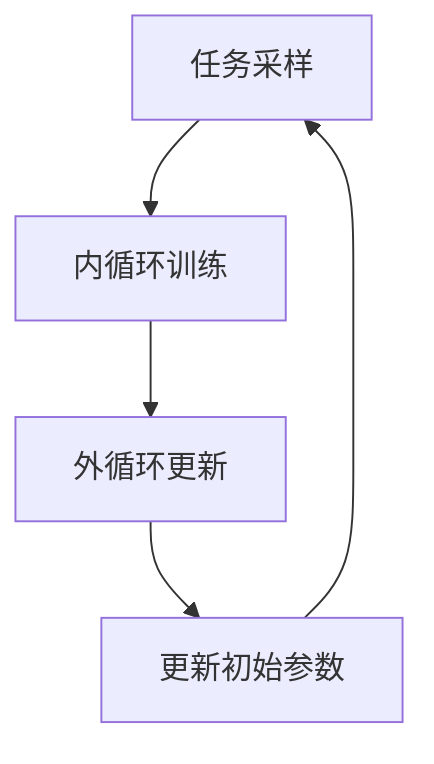

# MAML原理与代码实例讲解

作者：禅与计算机程序设计艺术

## 1.背景介绍

### 1.1 元学习与MAML的兴起

元学习（Meta-Learning），即“学习如何学习”，是一种旨在提升模型在新任务上快速适应能力的机器学习方法。随着深度学习的发展，传统的训练方法需要大量的数据和计算资源，且在面对新任务时往往表现不佳。元学习通过利用先验知识来加速学习过程，解决了这一问题。

模型-无关元学习（Model-Agnostic Meta-Learning，MAML）是元学习中的一种重要方法。由Chelsea Finn等人在2017年提出，MAML的核心思想是通过优化模型参数，使其能够在面对新任务时快速调整和适应。MAML的提出为元学习领域提供了一种通用且高效的解决方案。

### 1.2 研究动机与目标

MAML的主要动机是解决传统机器学习模型在面对新任务时需要大量数据和训练时间的问题。通过MAML，模型可以在少量数据和有限训练时间内快速适应新任务，极大地提升了模型的泛化能力和实用性。

本文的目标是详细介绍MAML的原理、算法步骤，并通过代码实例进行讲解，帮助读者深入理解MAML的工作机制和实际应用。

## 2.核心概念与联系

### 2.1 元学习的基本概念

元学习的核心思想是通过学习一组任务的共性，使模型能够在面对新任务时快速学习和适应。元学习通常包含两个主要阶段：元训练（Meta-Training）和元测试（Meta-Testing）。

- **元训练**：在元训练阶段，模型通过多次训练和调整参数，学习一组任务的共性。
- **元测试**：在元测试阶段，模型利用在元训练阶段学到的知识，快速适应和解决新任务。

### 2.2 MAML的基本原理

MAML是一种模型-无关的元学习方法，其基本原理是通过优化模型参数，使其在面对新任务时能够快速调整和适应。MAML的核心思想可以概括为以下几点：

1. **初始化参数的优化**：通过元训练，优化模型的初始化参数，使其能够在少量数据和有限训练时间内快速适应新任务。
2. **任务分布的利用**：利用一组任务的分布，通过在这些任务上反复训练和调整参数，学习任务间的共性。
3. **梯度更新的双重优化**：在元训练阶段，通过内循环和外循环的双重梯度更新，优化模型参数。

### 2.3 MAML与传统学习方法的区别

与传统学习方法相比，MAML具有以下显著区别：

- **快速适应能力**：MAML通过优化初始化参数，使模型能够在少量数据和有限训练时间内快速适应新任务。
- **任务间的共性学习**：MAML通过在一组任务上反复训练和调整参数，学习任务间的共性，提升模型的泛化能力。
- **双重梯度更新**：MAML在元训练阶段通过内循环和外循环的双重梯度更新，优化模型参数。

## 3.核心算法原理具体操作步骤

### 3.1 MAML算法概述

MAML的核心算法可以分为以下几个步骤：

1. **任务采样**：从任务分布中采样一组任务。
2. **内循环训练**：对于每个任务，通过梯度下降法在少量数据上训练模型，更新模型参数。
3. **外循环更新**：利用内循环训练后的模型参数，计算在新任务上的损失，通过梯度下降法更新初始模型参数。

### 3.2 内循环训练

内循环训练是MAML算法的第一步，其主要目的是通过梯度下降法在少量数据上训练模型，更新模型参数。具体步骤如下：

1. **初始化参数**：使用当前的初始化参数 $\theta$。
2. **计算梯度**：对于每个任务，计算在少量数据上的损失 $L(\theta)$ 和梯度 $\nabla_\theta L(\theta)$。
3. **更新参数**：利用梯度下降法更新模型参数 $\theta' = \theta - \alpha \nabla_\theta L(\theta)$。

### 3.3 外循环更新

外循环更新是MAML算法的第二步，其主要目的是利用内循环训练后的模型参数，计算在新任务上的损失，通过梯度下降法更新初始模型参数。具体步骤如下：

1. **计算新任务损失**：利用内循环训练后的模型参数 $\theta'$，计算在新任务上的损失 $L(\theta')$。
2. **计算梯度并更新初始参数**：通过梯度下降法更新初始模型参数 $\theta = \theta - \beta \nabla_\theta L(\theta')$。

### 3.4 MAML算法流程图



## 4.数学模型和公式详细讲解举例说明

### 4.1 内循环训练的数学模型

在内循环训练阶段，我们首先从任务分布 $p(\mathcal{T})$ 中采样一个任务 $\mathcal{T}_i$，然后在该任务的训练集上进行梯度下降更新。具体公式如下：

$$
\theta'_i = \theta - \alpha \nabla_\theta L_{\mathcal{T}_i}(f_\theta)
$$

其中，$\theta$ 是模型的初始化参数，$\alpha$ 是学习率，$L_{\mathcal{T}_i}$ 是任务 $\mathcal{T}_i$ 的损失函数，$f_\theta$ 是模型。

### 4.2 外循环更新的数学模型

在外循环更新阶段，我们利用内循环训练后的模型参数 $\theta'_i$，在任务 $\mathcal{T}_i$ 的验证集上计算损失，并通过梯度下降法更新初始模型参数。具体公式如下：

$$
\theta = \theta - \beta \nabla_\theta \sum_{\mathcal{T}_i \sim p(\mathcal{T})} L_{\mathcal{T}_i}(f_{\theta'_i})
$$

其中，$\beta$ 是外循环的学习率，$\sum_{\mathcal{T}_i \sim p(\mathcal{T})}$ 表示对所有采样任务的损失进行求和。

### 4.3 数学模型举例说明

假设我们有一个简单的二分类问题，模型为一个线性分类器，其损失函数为交叉熵损失函数。具体步骤如下：

1. **内循环训练**：对于每个任务 $\mathcal{T}_i$，我们在其训练集上进行一次梯度下降更新：

$$
\theta'_i = \theta - \alpha \nabla_\theta L_{\mathcal{T}_i}(f_\theta)
$$

2. **外循环更新**：利用内循环训练后的模型参数 $\theta'_i$，在任务 $\mathcal{T}_i$ 的验证集上计算损失，并更新初始模型参数：

$$
\theta = \theta - \beta \nabla_\theta \sum_{\mathcal{T}_i \sim p(\mathcal{T})} L_{\mathcal{T}_i}(f_{\theta'_i})
$$

## 4.项目实践：代码实例和详细解释说明

### 4.1 环境配置

在开始项目实践之前，我们需要配置好开发环境。本文将使用Python和PyTorch进行实现。首先，安装必要的库：

```bash
pip install torch torchvision
```

### 4.2 数据准备

为了简化问题，我们将使用PyTorch内置的MNIST数据集。该数据集包含手写数字的图像，我们将其分为多个任务，每个任务包含不同的数字分类。

```python
import torch
from torchvision import datasets, transforms

# 数据预处理
transform = transforms.Compose([
    transforms.ToTensor(),
    transforms.Normalize((0.5,), (0.5,))
])

# 加载MNIST数据集
train_dataset = datasets.MNIST(root='./data', train=True, download=True, transform=transform)
test_dataset = datasets.MNIST(root='./data', train=False, download=True, transform=transform)
```

### 4.3 模型定义

我们定义一个简单的线性分类器作为我们的模型：

```python
import torch.nn as nn
import torch.nn.functional as F

class LinearModel(nn.Module):
    def __init__(self):
        super(LinearModel, self).__init__()
        self.fc1 = nn.Linear(28 * 28, 10)

    def forward(self, x):
        x = x.view(-1, 28 * 28)
        x = self.fc1(x)
        return F.log_softmax(x, dim=1)
```

### 4.4 MAML算法实现

接下来，我们实现M