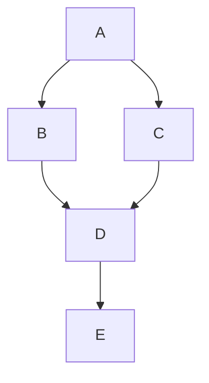

# MCTS在网络优化与路由中的应用

作者：禅与计算机程序设计艺术

## 1. 背景介绍

### 1.1 网络优化与路由的挑战

网络优化与路由是现代通信网络中的两个重要领域。随着互联网用户数量的增加和网络应用的多样化，如何高效地管理和优化网络资源成为一个关键问题。传统的网络优化与路由方法，如Dijkstra算法和Bellman-Ford算法，虽然在某些场景下表现良好，但在面对复杂的网络拓扑和动态变化的网络环境时，往往显得力不从心。

### 1.2 MCTS简介

蒙特卡洛树搜索（Monte Carlo Tree Search，MCTS）是一种基于随机模拟和树结构的搜索算法，最初用于游戏AI中，如围棋和国际象棋。MCTS通过在搜索树中进行大量的模拟，选择最优路径，从而达到优化决策的目的。近年来，MCTS逐渐被应用于其他领域，如机器人路径规划、自动驾驶和网络优化等。

### 1.3 MCTS在网络优化与路由中的潜力

网络优化与路由问题本质上是一个复杂的决策问题，涉及到多种因素的平衡，如带宽、延迟、可靠性和负载均衡等。MCTS的随机模拟和树搜索特性，使其在处理这些复杂决策问题时具有独特的优势。本文将深入探讨MCTS在网络优化与路由中的应用，并通过具体的实例和数学模型，展示其在实际场景中的效果。

## 2. 核心概念与联系

### 2.1 蒙特卡洛树搜索（MCTS）概述

MCTS是一种启发式搜索算法，主要包括四个步骤：选择（Selection）、扩展（Expansion）、模拟（Simulation）和回溯（Backpropagation）。这些步骤共同作用，逐步优化搜索树，找到最优解。

#### 2.1.1 选择（Selection）

在选择步骤中，算法从根节点开始，根据某种策略（如UCB1）选择一个子节点，直到到达一个未完全扩展的节点。

#### 2.1.2 扩展（Expansion）

在扩展步骤中，算法为选择的节点添加一个或多个子节点，表示可能的后续状态。

#### 2.1.3 模拟（Simulation）

在模拟步骤中，算法从新扩展的节点开始进行随机模拟，直到到达终止状态（如胜利或失败）。

#### 2.1.4 回溯（Backpropagation）

在回溯步骤中，算法将模拟的结果沿着路径返回到根节点，更新每个节点的值（如胜率）。

### 2.2 网络优化与路由的基本概念

网络优化与路由涉及到多个关键概念，如路由协议、网络拓扑、带宽管理和负载均衡等。这些概念共同作用，决定了数据包在网络中的传输路径和效率。

#### 2.2.1 路由协议

路由协议是决定数据包路径的规则和算法，常见的路由协议包括OSPF、BGP和RIP等。

#### 2.2.2 网络拓扑

网络拓扑是网络节点和链路的物理或逻辑结构，直接影响数据包的传输路径和效率。

#### 2.2.3 带宽管理

带宽管理是指分配和控制网络带宽资源，以确保关键应用的性能和服务质量。

#### 2.2.4 负载均衡

负载均衡是通过分配网络流量，避免某些节点或链路过载，从而提高网络的整体性能和可靠性。

### 2.3 MCTS与网络优化的联系

MCTS通过随机模拟和树搜索，可以在复杂的网络环境中找到最优路径和资源分配策略。其核心思想与网络优化中的决策问题高度契合，能够有效解决传统算法难以处理的问题。

## 3. 核心算法原理具体操作步骤

### 3.1 MCTS算法的基本流程

MCTS算法的基本流程可以概括为以下四个步骤：

1. **选择（Selection）**：从根节点开始，根据某种策略选择一个子节点，直到到达一个未完全扩展的节点。
2. **扩展（Expansion）**：为选择的节点添加一个或多个子节点，表示可能的后续状态。
3. **模拟（Simulation）**：从新扩展的节点开始进行随机模拟，直到到达终止状态。
4. **回溯（Backpropagation）**：将模拟的结果沿着路径返回到根节点，更新每个节点的值。

### 3.2 选择步骤的实现

选择步骤通常使用UCB1（Upper Confidence Bound 1）策略，该策略平衡了探索和利用之间的权衡。UCB1策略的公式为：

$$
UCB1 = \frac{w_i}{n_i} + C \sqrt{\frac{\ln N}{n_i}}
$$

其中，$w_i$ 是节点 $i$ 的胜利次数，$n_i$ 是节点 $i$ 的访问次数，$N$ 是根节点的总访问次数，$C$ 是一个常数，用于调节探索和利用的平衡。

### 3.3 扩展步骤的实现

在扩展步骤中，选择的节点会被添加一个或多个子节点，表示可能的后续状态。扩展的具体方法取决于具体应用场景，如在网络路由中，可能需要考虑带宽、延迟和链路状态等因素。

### 3.4 模拟步骤的实现

模拟步骤通过从新扩展的节点开始进行随机模拟，直到到达终止状态。在网络路由中，模拟可以通过随机选择下一跳节点，直到到达目标节点或超过最大跳数。

### 3.5 回溯步骤的实现

回溯步骤将模拟的结果沿着路径返回到根节点，更新每个节点的值。常见的更新方法是增加节点的胜利次数和访问次数。

## 4. 数学模型和公式详细讲解举例说明

### 4.1 MCTS的数学模型

MCTS的数学模型可以通过马尔可夫决策过程（MDP）来描述。MDP包括状态空间、行动空间、转移概率和奖励函数等要素。

#### 4.1.1 状态空间

状态空间表示网络中的所有可能状态，如节点的连接状态和链路的带宽利用率等。

#### 4.1.2 行动空间

行动空间表示在每个状态下可能的行动，如选择下一跳节点和调整带宽分配等。

#### 4.1.3 转移概率

转移概率表示在某个状态下选择某个行动后，转移到下一个状态的概率。

#### 4.1.4 奖励函数

奖励函数表示在某个状态下选择某个行动后，获得的即时奖励，如减少延迟和增加带宽利用率等。

### 4.2 UCB1策略的数学推导

UCB1策略的数学推导基于上置信界（Upper Confidence Bound）理论。其核心思想是通过平衡探索和利用，最大化累积奖励。

$$
UCB1 = \frac{w_i}{n_i} + C \sqrt{\frac{\ln N}{n_i}}
$$

其中，$w_i$ 是节点 $i$ 的胜利次数，$n_i$ 是节点 $i$ 的访问次数，$N$ 是根节点的总访问次数，$C$ 是一个常数，用于调节探索和利用的平衡。

### 4.3 示例：MCTS在网络路由中的应用

假设有一个简单的网络拓扑，如下图所示：



在这个网络中，节点 $A$ 需要找到到达节点 $E$ 的最优路径。通过MCTS算法，可以逐步优化搜索树，找到最优路径。

1. **选择**：从节点 $A$ 开始，根据UCB1策略选择下一跳节点。
2. **扩展**：为选择的节点添加一个或多个子节点，如从 $A$ 到 $B$ 和 $C$。
3. **模拟**：从新扩展的节点开始进行随机模拟，如从 $B$ 到 $D$，再到 $E$。
4. **回溯**：将模拟的结果沿着路径返回到根节点，更新每个节点的值。

通过多次模拟和回溯，最终可以找到从 $A$ 到 $E$ 的最优路径，如 $A \rightarrow C \rightarrow D \rightarrow E$。

## 5. 项目实践：代码实例和详细解释说明

### 5.1 MCTS算法的Python实现

以下是一个简单的MCTS算法在网络路由中的Python实现：

```python
import math
import random

class Node:
    def __init__(self,