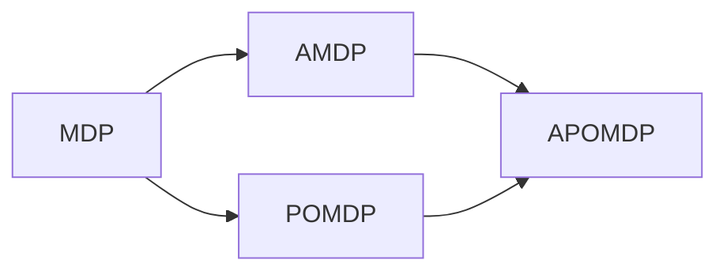

# MDP在对抗性环境中的应用

作者：禅与计算机程序设计艺术

## 1. 背景介绍

### 1.1 对抗性环境的定义与特点
对抗性环境是一类特殊的环境,其中智能体(Agent)需要与其他对手智能体进行博弈和对抗。在这种环境下,多个智能体之间存在竞争关系,每个智能体的决策和行动都会影响其他智能体的收益和反应。典型的对抗性环境包括国际象棋、围棋、德州扑克等棋牌游戏,以及网络安全、军事模拟等现实场景。

对抗性环境具有以下几个主要特点:

1. 多智能体参与博弈,存在竞争关系
2. 环境状态和转移受多方决策影响
3. 奖励函数依赖于所有参与方的联合行动
4. 不完全信息博弈,存在不确定性
5. 博弈过程具有动态性和复杂性

### 1.2 MDP在对抗性环境中面临的挑战
马尔可夫决策过程(Markov Decision Process, MDP)是强化学习和决策规划的经典框架。它假设环境满足马尔可夫性质,即下一时刻的状态只取决于当前状态和动作,与之前的历史状态无关。MDP的目标是寻找最优策略来最大化长期累积奖励。

然而,在对抗性环境中应用MDP时,会面临以下几个主要挑战:

1. 环境动态性:对手的策略会随时间动态变化,使得状态转移概率和奖励函数难以准确建模。
2. 信息不完全性:无法获知对手的完整信息(如私有状态、策略等),需要根据观测和互动进行推断和应对。
3. 策略适应性:需要在博弈过程中不断调整和优化自身策略,以应对对手策略的变化。
4. 计算复杂性:考虑对手反应导致状态和策略空间急剧扩大,给规划和学习带来巨大挑战。

### 1.3 MDP在对抗性环境中的应用意义
尽管在对抗性环境中应用MDP存在诸多挑战,但它仍然具有重要的理论和实践意义:

1. 理论基础:MDP提供了一种系统的数学框架来描述和分析对抗性博弈问题,有助于深入理解其内在机理。
2. 算法创新:针对对抗性环境的特点,可以在MDP框架下研发新的优化算法,如对抗性学习、多智能体强化学习等。
3. 实践应用:MDP及其扩展模型在国际象棋、围棋、网络安全、无人驾驶、金融交易等领域得到了广泛应用。

## 2. 核心概念与联系

### 2.1 马尔可夫决策过程(MDP)
马尔可夫决策过程由以下元素构成:

- 状态空间 $\mathcal{S}$:所有可能的环境状态集合。
- 动作空间 $\mathcal{A}$:智能体在每个状态下可采取的动作集合。
- 状态转移概率 $\mathcal{P}$:$\mathcal{P}(s'|s,a)$表示在状态$s$下执行动作$a$后转移到状态$s'$的概率。
- 奖励函数$\mathcal{R}$:$\mathcal{R}(s,a)$表示在状态$s$下执行动作$a$后获得的即时奖励。
- 折扣因子$\gamma \in [0,1]$:表示未来奖励的折现比例,用于平衡即时奖励和长期奖励。

MDP的目标是找到最优策略$\pi^*$,使得从任意初始状态出发,按照该策略与环境交互,获得的长期累积奖励最大化:

$$\pi^* = \arg\max_{\pi} \mathbb{E}\left[\sum_{t=0}^{\infty} \gamma^t \mathcal{R}(s_t, \pi(s_t)) \right]$$

其中,$\pi(s)$表示在状态$s$下按照策略$\pi$选择的动作。

### 2.2 对抗性马尔可夫决策过程(AMDP)
对抗性马尔可夫决策过程是经典MDP在对抗性博弈环境下的扩展。相比MDP,AMDP引入了以下新元素:

- 玩家集合$\mathcal{N}=\{1,2,...,n\}$:表示参与博弈的$n$个玩家(智能体)。
- 联合动作空间$\mathcal{A}=\mathcal{A}_1 \times \mathcal{A}_2 \times ... \times \mathcal{A}_n$:表示所有玩家动作的笛卡尔积。
- 联合奖励函数$\mathcal{R}_i(s,\mathbf{a})$:表示在状态$s$下,玩家$i$在联合动作$\mathbf{a}=(a_1,...,a_n)$下获得的即时奖励。

AMDP考虑了多个玩家在博弈过程中的策略互动和奖励依赖关系。每个玩家的目标不仅取决于自身的决策,还受其他玩家决策的影响。求解AMDP的核心是找到纳什均衡(Nash Equilibrium),即所有玩家的联合策略$\pi^*=(\pi_1^*,...,\pi_n^*)$满足:

$$\mathbb{E}\left[\sum_{t=0}^{\infty} \gamma^t \mathcal{R}_i(s_t, \mathbf{a}_t) | \pi_i^*, \pi_{-i}^*  \right] \geq \mathbb{E}\left[\sum_{t=0}^{\infty} \gamma^t \mathcal{R}_i(s_t, \mathbf{a}_t) | \pi_i, \pi_{-i}^*  \right], \forall \pi_i$$

其中,$\pi_{-i}^*$表示其他玩家的均衡策略。这意味着在均衡时,任何一个玩家单方面改变策略都无法获得更高的期望累积奖励。

### 2.3 部分可观测马尔可夫决策过程(POMDP) 
在许多实际问题中,智能体无法完全观测环境状态,只能获得部分或噪声观测。部分可观测马尔可夫决策过程(POMDP)考虑了这种不完全观测性。POMDP在MDP的基础上引入了以下新元素:

- 观测空间$\mathcal{O}$:表示智能体可能获得的所有观测值的集合。 
- 观测概率$\mathcal{Z}(o|s)$:表示在状态$s$下获得观测$o$的概率。

在POMDP中,智能体无法直接观测状态$s$,而是根据观测历史$h_t=(a_0,o_1,...,a_{t-1},o_t)$来推断当前状态的信念分布$b(s_t|h_t)$。策略$\pi$定义为从信念分布到动作的映射,目标是最大化期望累积奖励:

$$\pi^* = \arg\max_{\pi} \mathbb{E}\left[\sum_{t=0}^{\infty} \gamma^t \mathcal{R}(s_t, \pi(b_t)) \right]$$

### 2.4 对抗性部分可观测马尔可夫决策过程(APOMDP)
对抗性部分可观测马尔可夫决策过程(APOMDP)综合考虑了对抗性博弈和部分可观测性两个因素,是AMDP和POMDP的进一步扩展。在APOMDP中,每个玩家根据自己的局部观测历史$h_t^i$来推断博弈状态,形成信念分布$b_i(s_t|h_t^i)$。玩家$i$的目标是寻找在所有可能的信念分布上最大化期望累积奖励的均衡策略:

$$\pi_i^* = \arg\max_{\pi_i} \mathbb{E}\left[\sum_{t=0}^{\infty} \gamma^t \mathcal{R}_i(s_t, \mathbf{a}_t) | b_t^i, \pi_i, \pi_{-i}^*  \right]$$

APOMDP的求解通常需要结合博弈论和贝叶斯推断,是一个非常具有挑战性的问题。常见的解决方法包括交互式POMDP、对抗性均衡算法等。

### 2.5 MDP、AMDP、POMDP和APOMDP之间的关系
下图展示了MDP及其几个变种之间的关系:

可以看出:
- AMDP在MDP的基础上引入了对抗性博弈;
- POMDP在MDP的基础上引入了部分可观测性;
- APOMDP同时考虑了对抗性博弈和部分可观测性,是AMDP和POMDP的综合。

这几个模型框架的核心区别在于对环境信息的掌握程度和智能体的数量。从MDP到APOMDP,问题复杂度逐步提高,对算法的要求也越来越高。

## 3. 核心算法原理与操作步骤

解决对抗性环境下的MDP问题,需要综合运用博弈论和强化学习的相关算法。以下是几种常见的核心算法。

### 3.1 交互式Q学习(Interactive Q-learning)

#### 3.1.1 算法原理
交互式Q学习是经典Q学习在多幕式博弈中的扩展。在交互式Q学习中,每个玩家维护自己的Q值函数$Q_i(s,a_i)$,表示在状态$s$下采取动作$a_i$的期望长期收益。Q值函数的更新公式如下:

$$Q_i(s,a_i) \leftarrow (1-\alpha) Q_i(s,a_i) + \alpha \left[r_i + \gamma \max_{a_i'} Q_i(s',a_i') \right]$$

其中,$\alpha \in (0,1]$是学习率,$\gamma \in [0,1]$是折扣因子。

在博弈过程中,每个玩家根据当前的Q值函数来选择动作(如$\epsilon-greedy$等)。随着不断的试错和学习,Q值函数逐步收敛,最终获得近似均衡的策略。

#### 3.1.2 算法步骤  

1. 初始化所有玩家的Q值函数$Q_i(s,a_i)$
2. 重复下述步骤直到收敛:
   1. 初始化博弈状态$s$
   2. 重复下述步骤直到博弈结束:
      1. 每个玩家根据$Q_i(s,\cdot)$选择动作$a_i$,形成联合动作$\mathbf{a}=(a_1,...,a_n)$
      2. 执行联合动作$\mathbf{a}$,获得下一状态$s'$和奖励$r_1,...,r_n$
      3. 每个玩家更新Q值函数:
         
         $Q_i(s,a_i) \leftarrow (1-\alpha) Q_i(s,a_i) + \alpha \left[r_i + \gamma \max_{a_i'} Q_i(s',a_i') \right]$
      4. $s \leftarrow s'$ 
   3. 更新策略$\pi_i(s) = \arg\max_{a_i} Q_i(s,a_i)$

### 3.2 对抗性策略梯度(Adversarial Policy Gradient) 

#### 3.2.1 算法原理
策略梯度算法通过参数化策略函数$\pi_{\theta}(a|s)$,并基于梯度上升来直接优化策略参数$\theta$。目标函数$J(\theta)$定义为该策略的期望累积奖励:

$$J(\theta)=\mathbb{E}_{\tau \sim \pi_{\theta}}\left[\sum_{t=0}^{\infty} \gamma^t r_t \right]$$ 

其中,$\tau=(s_0,a_0,r_0,s_1,a_1,r_1,...)$表示与环境交互的轨迹。根据策略梯度定理,目标函数$J(\theta)$相对于策略参数$\theta$的梯度为:

$$\nabla_{\theta} J(\theta) = \mathbb{E}_{\tau \sim \pi_{\theta}} \left[ \sum_{t=0}^{\infty} \nabla_{\theta} \log \pi_{\theta}(a_t|s_t) \cdot Q^{\pi_{\theta}}(s_t,a_t) \right]$$

其中,$Q^{\pi_{\theta}}(s_t,a_t)$表示在状态$s_t$下采取动作$a_t$的行动值函数。

在对抗性环境中,每个玩家分别优化自己