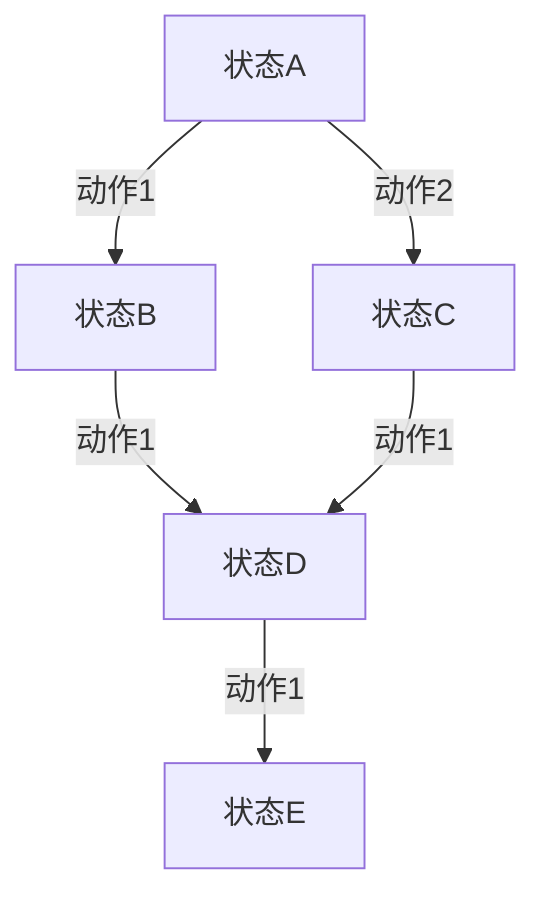

# MDP的价值函数和最优策略

作者：禅与计算机程序设计艺术

## 1. 背景介绍

### 1.1 马尔可夫决策过程 (MDP) 简介

马尔可夫决策过程（Markov Decision Process, MDP）是建模决策问题的一种数学框架，广泛应用于人工智能、机器人学、经济学等领域。MDP模型通过状态、动作、转移概率和奖励函数来描述一个系统在不同时间点的动态行为。MDP的核心目标是找到一种策略，使得在长期运行中，系统的期望累积奖励最大化。

### 1.2 MDP的基本组成

一个典型的MDP由以下四个元素组成：

- **状态集 \(S\)**：系统可能的所有状态的集合。
- **动作集 \(A\)**：在每个状态下，系统可以选择的动作集合。
- **转移概率 \(P(s'|s, a)\)**：从状态 \(s\) 选择动作 \(a\) 后转移到状态 \(s'\) 的概率。
- **奖励函数 \(R(s, a)\)**：在状态 \(s\) 执行动作 \(a\) 所获得的即时奖励。

### 1.3 价值函数与最优策略

在MDP中，价值函数用于评估每个状态或状态-动作对的“好坏”，从而指导系统选择最优策略。最优策略是指在每个状态下选择最优动作的规则，使得系统的长期累积奖励最大化。

## 2. 核心概念与联系

### 2.1 价值函数

价值函数是MDP中的一个关键概念，用于评估系统在某一状态下的期望累积奖励。价值函数主要有两种形式：

- **状态价值函数 \(V(s)\)**：表示系统从状态 \(s\) 开始，按照某一策略 \(\pi\) 行动所能获得的期望累积奖励。
- **状态-动作价值函数 \(Q(s, a)\)**：表示系统在状态 \(s\) 执行动作 \(a\) 后，按照某一策略 \(\pi\) 行动所能获得的期望累积奖励。

### 2.2 策略

策略是指系统在每个状态下选择动作的规则，通常表示为 \(\pi(a|s)\)，即在状态 \(s\) 下选择动作 \(a\) 的概率。策略可以是确定性的，也可以是随机的。

### 2.3 最优策略

最优策略 \(\pi^*\) 是指使得系统在每个状态下的期望累积奖励最大化的策略。最优策略对应的状态价值函数为 \(V^*(s)\)，状态-动作价值函数为 \(Q^*(s, a)\)。

### 2.4 贝尔曼方程

贝尔曼方程是求解MDP的核心工具，描述了价值函数的递归关系。对于状态价值函数 \(V(s)\) 和状态-动作价值函数 \(Q(s, a)\)，贝尔曼方程分别为：

$$
V(s) = \max_{a} \left[ R(s, a) + \gamma \sum_{s'} P(s'|s, a) V(s') \right]
$$

$$
Q(s, a) = R(s, a) + \gamma \sum_{s'} P(s'|s, a) \max_{a'} Q(s', a')
$$

其中，\(\gamma\) 为折扣因子，取值范围为 \([0, 1]\)。

## 3. 核心算法原理具体操作步骤

### 3.1 值迭代算法

值迭代算法是一种求解最优价值函数和最优策略的动态规划方法。其基本思想是通过迭代更新状态价值函数，直到收敛为止。值迭代算法的步骤如下：

1. 初始化状态价值函数 \(V(s)\) 为任意值（通常为0）。
2. 对每个状态 \(s\)，更新 \(V(s)\)：
   $$
   V(s) \leftarrow \max_{a} \left[ R(s, a) + \gamma \sum_{s'} P(s'|s, a) V(s') \right]
   $$
3. 重复步骤2，直到 \(V(s)\) 收敛。

### 3.2 策略迭代算法

策略迭代算法是另一种求解最优策略的方法，包含策略评估和策略改进两个阶段。其步骤如下：

1. 初始化策略 \(\pi(s)\) 为任意策略。
2. 策略评估：计算当前策略 \(\pi\) 对应的状态价值函数 \(V^{\pi}(s)\)，直到收敛。
3. 策略改进：对每个状态 \(s\)，更新策略 \(\pi(s)\)：
   $$
   \pi(s) \leftarrow \arg\max_{a} \left[ R(s, a) + \gamma \sum_{s'} P(s'|s, a) V^{\pi}(s') \right]
   $$
4. 重复步骤2和步骤3，直到策略 \(\pi\) 收敛。

### 3.3 Q-Learning算法

Q-Learning是一种无模型的强化学习算法，通过直接学习状态-动作价值函数 \(Q(s, a)\) 来找到最优策略。其步骤如下：

1. 初始化 \(Q(s, a)\) 为任意值（通常为0）。
2. 在状态 \(s\) 下选择动作 \(a\)（按照某一策略，如\(\epsilon\)-贪婪策略）。
3. 执行动作 \(a\)，观察奖励 \(r\) 和下一个状态 \(s'\)。
4. 更新 \(Q(s, a)\)：
   $$
   Q(s, a) \leftarrow Q(s, a) + \alpha \left[ r + \gamma \max_{a'} Q(s', a') - Q(s, a) \right]
   $$
5. 重复步骤2至步骤4，直到 \(Q(s, a)\) 收敛。

## 4. 数学模型和公式详细讲解举例说明

### 4.1 状态价值函数的贝尔曼方程

状态价值函数 \(V(s)\) 的贝尔曼方程为：

$$
V(s) = \max_{a} \left[ R(s, a) + \gamma \sum_{s'} P(s'|s, a) V(s') \right]
$$

这个方程表示，在状态 \(s\) 选择最优动作 \(a\) 后，所能获得的即时奖励 \(R(s, a)\) 加上从状态 \(s\) 转移到状态 \(s'\) 后的折扣价值 \(\gamma V(s')\) 的期望值。

### 4.2 状态-动作价值函数的贝尔曼方程

状态-动作价值函数 \(Q(s, a)\) 的贝尔曼方程为：

$$
Q(s, a) = R(s, a) + \gamma \sum_{s'} P(s'|s, a) \max_{a'} Q(s', a')
$$

这个方程表示，在状态 \(s\) 执行动作 \(a\) 后，所能获得的即时奖励 \(R(s, a)\) 加上从状态 \(s\) 转移到状态 \(s'\) 后选择最优动作 \(a'\) 所能获得的折扣价值 \(\gamma Q(s', a')\) 的期望值。

### 4.3 举例说明

假设有一个简单的MDP模型，如下图所示：

在这个模型中，状态A可以选择动作1转移到状态B，或者选择动作2转移到状态C。我们可以通过贝尔曼方程计算每个状态的价值函数。

假设奖励函数和转移概率如下：

- \(R(A, 1) = 5\)，\(R(A, 2) = 10\)
- \(P(B|A, 1) = 1\)，\(P(C|A, 2) = 1\)
- \(R(B, 1) = 2\)，\(R(C, 1) = 4\)
- \(P(D|B, 1) = 1\)，\(P(D|C, 1) = 1\)
- \(R(D, 1) = 3\)
- \(P(E|D, 1) = 1\)
- \(R(E, 1) = 0\)

折扣因子 \(\gamma = 0.9\)。

我们可以通过值迭代算法计算状态A的价值函数：

1. 初始化 \(V(A) = 0\)，\(