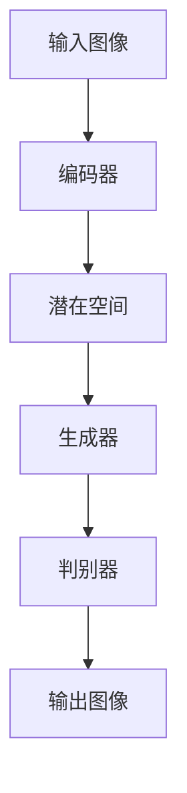

# Midjourney原理与代码实例讲解

作者：禅与计算机程序设计艺术

## 1.背景介绍

### 1.1 什么是Midjourney

Midjourney是一种先进的深度学习模型，主要用于图像生成和风格转换。它结合了生成对抗网络（GANs）和自编码器（Autoencoders）等多种技术，能够生成高质量的图像，并实现从一种图像风格到另一种图像风格的转换。Midjourney的出现，为计算机视觉领域带来了新的可能性，尤其是在艺术创作、广告设计和游戏开发等领域。

### 1.2 Midjourney的历史与发展

Midjourney的概念最早可以追溯到生成对抗网络的提出。GANs由Ian Goodfellow等人在2014年提出，随后在图像生成领域取得了显著的成果。随着技术的不断进步，研究人员逐渐将GANs与其他深度学习技术相结合，形成了Midjourney这样更为复杂和强大的模型。

### 1.3 Midjourney的应用领域

Midjourney在多个领域展现了其强大的应用潜力，包括但不限于：
- **艺术创作**：生成独特的艺术作品，帮助艺术家实现创意。
- **广告设计**：快速生成高质量的广告素材，提高设计效率。
- **游戏开发**：生成游戏中的场景和角色，提高游戏的视觉效果。
- **医学影像**：生成和增强医学影像，辅助医生进行诊断。

## 2.核心概念与联系

### 2.1 深度学习基础

深度学习是人工智能的一个分支，涉及多层神经网络的训练和应用。深度学习模型通过大量的数据训练，能够自动提取特征并进行复杂的任务，如图像识别、自然语言处理等。

### 2.2 生成对抗网络（GANs）

GANs由生成器（Generator）和判别器（Discriminator）组成。生成器负责生成假数据，判别器负责区分真假数据。两者通过对抗训练，生成器不断提高其生成数据的质量，最终生成逼真的图像。

### 2.3 自编码器（Autoencoders）

自编码器是一种无监督学习模型，主要用于数据降维和特征提取。自编码器由编码器（Encoder）和解码器（Decoder）组成，编码器将输入数据压缩到低维空间，解码器则从低维空间重建数据。

### 2.4 Midjourney的核心架构

Midjourney结合了GANs和自编码器的优点，通过复杂的网络结构和训练策略，实现了高质量的图像生成和风格转换。其核心架构如下图所示：



## 3.核心算法原理具体操作步骤

### 3.1 数据准备

首先，需要准备大量的图像数据进行训练。数据的质量和多样性直接影响模型的性能。常见的数据集包括CIFAR-10、ImageNet等。

### 3.2 模型设计

设计Midjourney的网络结构，包括编码器、生成器和判别器。编码器负责将输入图像压缩到潜在空间，生成器负责从潜在空间生成图像，判别器则负责区分真假图像。

### 3.3 模型训练

训练过程中，生成器和判别器通过对抗训练不断优化。生成器的目标是生成逼真的图像，判别器的目标是准确区分真假图像。训练过程如下：

1. 初始化生成器和判别器的权重。
2. 从真实数据集中抽取一批图像，作为判别器的真实样本。
3. 生成器生成一批假图像，作为判别器的假样本。
4. 判别器根据真实样本和假样本进行训练，更新权重。
5. 生成器根据判别器的反馈进行训练，更新权重。
6. 重复上述步骤，直到模型收敛。

### 3.4 模型评估

模型训练完成后，需要对其进行评估。常用的评估指标包括生成图像的质量、风格转换的效果等。可以通过视觉评估和定量评估相结合的方法，全面评估模型的性能。

## 4.数学模型和公式详细讲解举例说明

### 4.1 生成对抗网络的数学模型

GANs的目标是找到生成器 $G$ 和判别器 $D$ 的最优参数，使得生成器生成的图像尽可能真实，而判别器无法区分真假图像。其损失函数如下：

$$
\min_G \max_D V(D, G) = \mathbb{E}_{x \sim p_{data}(x)}[\log D(x)] + \mathbb{E}_{z \sim p_z(z)}[\log(1 - D(G(z)))]
$$

其中，$x$ 是真实数据，$z$ 是随机噪声，$p_{data}(x)$ 是真实数据的分布，$p_z(z)$ 是噪声的分布。

### 4.2 自编码器的数学模型

自编码器的目标是最小化输入数据和重建数据之间的误差。其损失函数如下：

$$
L(x, \hat{x}) = \| x - \hat{x} \|^2
$$

其中，$x$ 是输入数据，$\hat{x}$ 是重建数据。

### 4.3 Midjourney的数学模型

Midjourney结合了GANs和自编码器的优点，其损失函数包括生成对抗损失和重建损失。其总损失函数如下：

$$
L_{total} = \lambda_{GAN} L_{GAN} + \lambda_{recon} L_{recon}
$$

其中，$L_{GAN}$ 是生成对抗损失，$L_{recon}$ 是重建损失，$\lambda_{GAN}$ 和 $\lambda_{recon}$ 是权重参数。

## 5.项目实践：代码实例和详细解释说明

### 5.1 环境配置

首先，需要配置Python环境，并安装必要的库。可以使用以下命令安装所需库：

```bash
pip install tensorflow keras numpy matplotlib
```

### 5.2 数据加载与预处理

加载并预处理图像数据。以下是一个简单的示例，使用CIFAR-10数据集：

```python
import tensorflow as tf
from tensorflow.keras.datasets import cifar10
from tensorflow.keras.preprocessing.image import ImageDataGenerator

# 加载数据
(x_train, y_train), (x_test, y_test) = cifar10.load_data()

# 数据预处理
x_train = x_train.astype('float32') / 255.0
x_test = x_test.astype('float32') / 255.0

# 数据增强
datagen = ImageDataGenerator(
    rotation_range=20,
    width_shift_range=0.2,
    height_shift_range=0.2,
    horizontal_flip=True
)
datagen.fit(x_train)
```

### 5.3 模型构建

构建Midjourney的网络结构，包括编码器、生成器和判别器。以下是一个简单的示例：

```python
from tensorflow.keras.models import Model
from tensorflow.keras.layers import Input, Dense, Conv2D, Conv2DTranspose, LeakyReLU, Flatten, Reshape

# 编码器
def build_encoder(input_shape):
    inputs = Input(shape=input_shape)
    x = Conv2D(64, (3, 3), strides=(2, 2), padding='same')(inputs)
    x = LeakyReLU()(x)
    x = Conv2D(128, (3, 3), strides=(2, 2), padding='same')(x)
    x = LeakyReLU()(x)
    x = Flatten()(x)
    latent = Dense(128)(x)
    return Model(inputs, latent, name='encoder')

# 生成器
def build_generator(latent_dim):
    latent = Input(shape=(latent_dim,))
    x = Dense(8 * 8 * 128)(latent)
    x = LeakyReLU()(x)
    x = Reshape((8, 8, 128))(x)
    x = Conv2DTranspose(128, (3, 3), strides=(2, 2), padding='same')(x)
    x = LeakyReLU()(x)
    x = Conv2DTranspose(64, (3, 3), strides=(2, 2), padding='same')(x)
    x = LeakyReLU()(x)
    outputs = Conv2DTranspose(3, (3, 3), activation='sigmoid', padding='same')(x)
    return Model(latent, outputs, name='generator')

# 判别器
def build_discriminator(input_shape):
    inputs = Input(shape=input_shape)
    x = Conv2D(