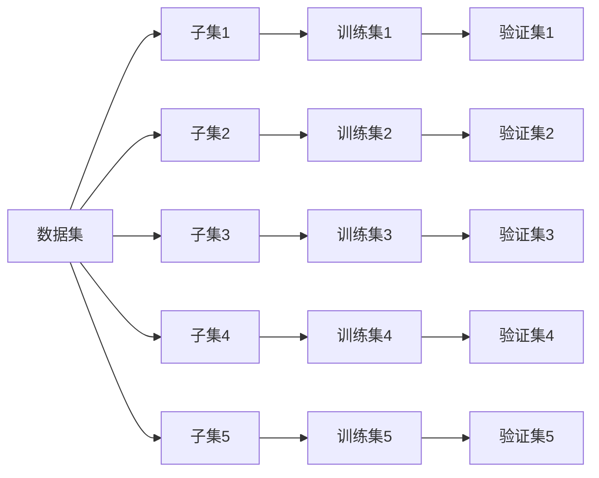

# Model Selection 原理与代码实战案例讲解

作者：禅与计算机程序设计艺术

## 1.背景介绍

### 1.1 什么是模型选择

在机器学习和统计学领域，模型选择（Model Selection）是指在一组候选模型中选择最优模型的过程。模型选择的目的是找到一个能够最好地解释数据并具有良好泛化能力的模型。模型选择在实践中至关重要，因为选择不当的模型可能导致过拟合或欠拟合，从而影响模型的预测性能。

### 1.2 为什么模型选择很重要

模型选择的重要性体现在以下几个方面：

- **泛化能力**：选择一个具有良好泛化能力的模型能够在未见过的数据上表现良好。
- **避免过拟合和欠拟合**：过拟合的模型在训练数据上表现很好，但在测试数据上表现差；欠拟合的模型则无法捕捉数据的复杂结构。
- **提高模型性能**：通过选择合适的模型，可以显著提高模型的预测性能和准确性。

### 1.3 常见的模型选择方法

常见的模型选择方法包括交叉验证（Cross-Validation）、信息准则（Information Criteria，如AIC、BIC）、正则化方法（Regularization，如Lasso、Ridge）等。这些方法各有优劣，适用于不同的应用场景。

## 2.核心概念与联系

### 2.1 模型复杂度

模型复杂度是指模型的参数数量或模型结构的复杂程度。复杂度越高，模型越容易过拟合；复杂度越低，模型越容易欠拟合。选择合适的模型复杂度是模型选择的关键。

### 2.2 偏差-方差权衡

偏差-方差权衡（Bias-Variance Tradeoff）是模型选择中的重要概念。偏差是指模型预测值与真实值的误差；方差是指模型预测值的波动。增加模型复杂度会降低偏差但增加方差，反之亦然。选择合适的模型需要在偏差和方差之间找到平衡。

### 2.3 交叉验证

交叉验证是一种评估模型性能的方法，通过将数据集划分为训练集和验证集，反复训练和验证模型，从而获得模型的稳定性能估计。常见的交叉验证方法包括k折交叉验证（k-fold cross-validation）和留一法交叉验证（leave-one-out cross-validation）。

### 2.4 正则化方法

正则化方法通过在损失函数中加入正则化项，限制模型的复杂度，从而避免过拟合。常见的正则化方法包括L1正则化（Lasso）和L2正则化（Ridge）。

## 3.核心算法原理具体操作步骤

### 3.1 交叉验证的操作步骤

#### 3.1.1 数据划分

将数据集划分为训练集和验证集。常见的划分方法是k折交叉验证，将数据集分为k个子集，每次选择一个子集作为验证集，其余子集作为训练集，重复k次。



#### 3.1.2 模型训练与验证

在每次划分中，使用训练集训练模型，使用验证集验证模型性能，记录每次验证的性能指标。

#### 3.1.3 性能评估

计算所有验证集上的平均性能指标，作为模型的最终性能评估。

### 3.2 正则化方法的操作步骤

#### 3.2.1 Lasso回归

Lasso回归通过在损失函数中加入L1正则化项，限制模型参数的绝对值之和，从而避免过拟合。Lasso回归的损失函数如下：

$$
L(\beta) = \sum_{i=1}^{n} (y_i - \beta_0 - \sum_{j=1}^{p} \beta_j x_{ij})^2 + \lambda \sum_{j=1}^{p} |\beta_j|
$$

其中，$\lambda$是正则化参数，控制正则化项的权重。

#### 3.2.2 Ridge回归

Ridge回归通过在损失函数中加入L2正则化项，限制模型参数的平方和，从而避免过拟合。Ridge回归的损失函数如下：

$$
L(\beta) = \sum_{i=1}^{n} (y_i - \beta_0 - \sum_{j=1}^{p} \beta_j x_{ij})^2 + \lambda \sum_{j=1}^{p} \beta_j^2
$$

其中，$\lambda$是正则化参数，控制正则化项的权重。

## 4.数学模型和公式详细讲解举例说明

### 4.1 线性回归模型

线性回归模型是最简单的回归模型之一，其数学表达式如下：

$$
y = \beta_0 + \beta_1 x_1 + \beta_2 x_2 + \cdots + \beta_p x_p + \epsilon
$$

其中，$y$是响应变量，$x_1, x_2, \ldots, x_p$是解释变量，$\beta_0, \beta_1, \ldots, \beta_p$是模型参数，$\epsilon$是误差项。

### 4.2 Lasso回归模型

Lasso回归模型在线性回归模型的基础上加入了L1正则化项，其数学表达式如下：

$$
L(\beta) = \sum_{i=1}^{n} (y_i - \beta_0 - \sum_{j=1}^{p} \beta_j x_{ij})^2 + \lambda \sum_{j=1}^{p} |\beta_j|
$$

Lasso回归通过优化上述损失函数，得到模型参数$\beta$。

### 4.3 Ridge回归模型

Ridge回归模型在线性回归模型的基础上加入了L2正则化项，其数学表达式如下：

$$
L(\beta) = \sum_{i=1}^{n} (y_i - \beta_0 - \sum_{j=1}^{p} \beta_j x_{ij})^2 + \lambda \sum_{j=1}^{p} \beta_j^2
$$

Ridge回归通过优化上述损失函数，得到模型参数$\beta$。

## 4.项目实践：代码实例和详细解释说明

### 4.1 数据集准备

首先，我们需要准备一个数据集。这里我们使用一个简单的线性回归数据集作为示例。

```python
import numpy as np
import pandas as pd
from sklearn.model_selection import train_test_split

# 生成数据集
np.random.seed(0)
X = np.random.rand(100, 1) * 10
y = 2.5 * X.squeeze() + np.random.randn(100) * 2

# 划分训练集和测试集
X_train, X_test, y_train, y_test = train_test_split(X, y, test_size=0.2, random_state=42)
```

### 4.2 交叉验证代码实现

我们使用k折交叉验证来评估模型性能。

```python
from sklearn.linear_model import LinearRegression
from sklearn.model_selection import cross_val_score

# 创建线性回归模型
model = LinearRegression()

# 使用k折交叉验证评估模型性能
scores = cross_val_score(model, X_train, y_train, cv=5, scoring='neg_mean_squared_error')
print("Cross-Validation MSE:", -scores.mean())
```

### 4.3 Lasso回归代码实现

我们使用Lasso回归模型并进行模型训练和评估。

```python
from sklearn.linear_model import Lasso
from sklearn.metrics import mean_squared_error

# 创建Lasso回归模型
lasso_model = Lasso(alpha=0.1)

# 训练模型
lasso_model.fit(X_train, y_train)

# 预测并评估模型性能
y_pred = lasso_model.predict(X_test)
print("Lasso MSE:", mean_squared_error(y_test, y_pred))
```

### 4.4 Ridge回归代码实现

我们使用Ridge回归模型并进行模型训练和评估。

```python
from