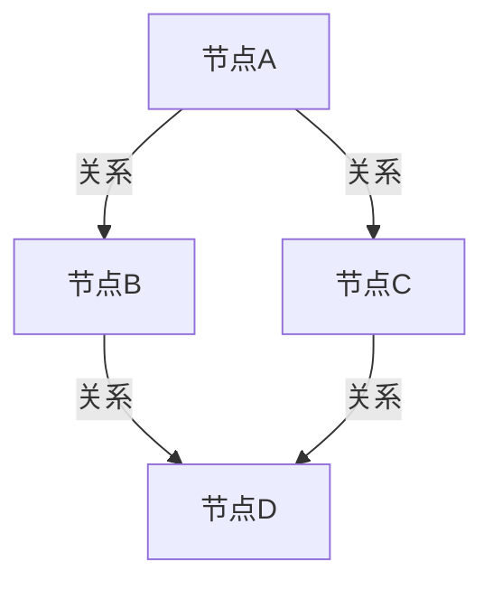
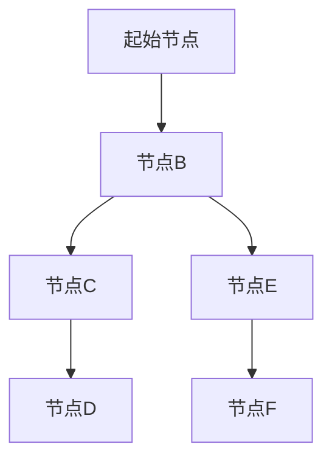
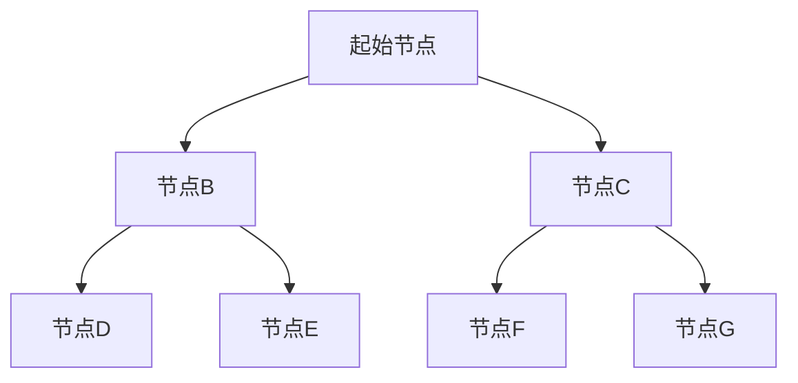
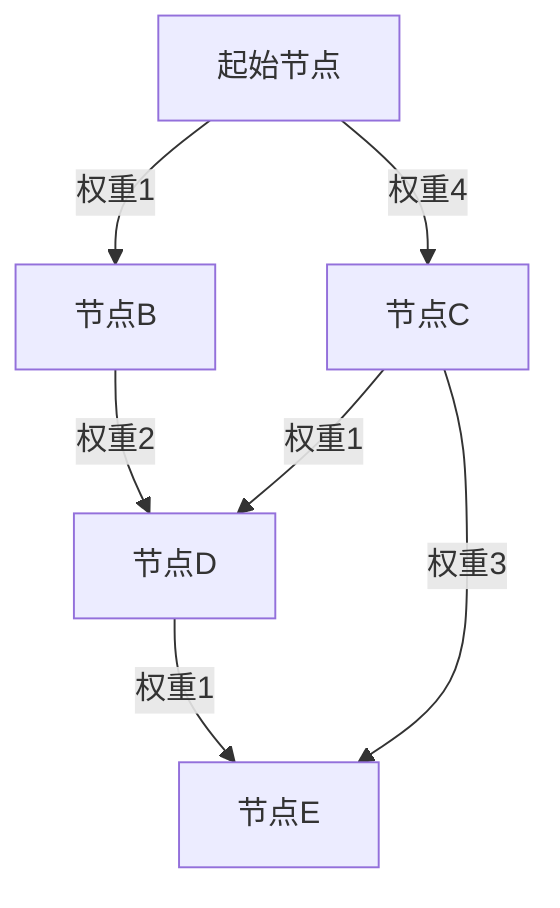

# Neo4j原理与代码实例讲解

作者：禅与计算机程序设计艺术

## 1.背景介绍

### 1.1 图数据库的兴起

在现代数据驱动的世界中，传统的关系型数据库（RDBMS）在处理高度互联的数据时往往显得力不从心。随着社交网络、推荐系统、知识图谱等应用的兴起，图数据库逐渐成为处理复杂关系数据的理想选择。图数据库能够高效地存储和查询节点及其之间的关系，使其在处理连接密集型数据时表现出色。

### 1.2 Neo4j简介

Neo4j是目前最流行的图数据库之一，由Neo Technology公司开发。作为一个原生图数据库，Neo4j采用了灵活的图数据模型，支持ACID事务，具备高性能的图查询能力。Neo4j广泛应用于社交网络分析、推荐系统、欺诈检测、网络安全等领域。

### 1.3 本文目的

本文旨在深入探讨Neo4j的原理，详细讲解其核心概念与联系，剖析其核心算法原理和具体操作步骤，并通过代码实例展示其实际应用。希望通过本文，读者能够全面了解Neo4j的工作机制，并掌握其在实际项目中的应用方法。

## 2.核心概念与联系

### 2.1 图数据模型

Neo4j采用图数据模型来表示数据。图数据模型由节点（Node）、关系（Relationship）和属性（Property）组成。

- **节点（Node）**：图中的实体，类似于关系型数据库中的表记录。
- **关系（Relationship）**：节点之间的连接，表示实体之间的关系。关系是有方向的，但可以双向查询。
- **属性（Property）**：节点和关系可以有属性，属性是键值对，用于描述节点和关系的特征。



### 2.2 Cypher查询语言

Cypher是Neo4j的查询语言，类似于SQL，但专为图数据库设计。Cypher语法直观、易学，能够高效地执行图查询操作。基本的Cypher查询包括匹配（MATCH）、创建（CREATE）、更新（SET）、删除（DELETE）等操作。

### 2.3 ACID事务

Neo4j支持ACID（Atomicity, Consistency, Isolation, Durability）事务，确保数据的可靠性和一致性。每个事务在Neo4j中都是原子的，即要么全部成功，要么全部失败。事务的隔离性确保了并发操作的正确性，而持久性保证了数据在系统故障后的恢复。

## 3.核心算法原理具体操作步骤

### 3.1 图遍历算法

图遍历是图数据库中最基础的操作之一。常见的图遍历算法包括深度优先搜索（DFS）和广度优先搜索（BFS）。

#### 3.1.1 深度优先搜索（DFS）

深度优先搜索是一种遍历或搜索图的算法，沿着图的深度进行搜索，直到找到目标节点或没有更多节点可访问为止。



#### 3.1.2 广度优先搜索（BFS）

广度优先搜索是一种遍历或搜索图的算法，沿着图的广度进行搜索，逐层访问节点，直到找到目标节点或没有更多节点可访问为止。



### 3.2 最短路径算法

最短路径算法用于计算图中两个节点之间的最短路径。常见的最短路径算法包括Dijkstra算法和A*算法。

#### 3.2.1 Dijkstra算法

Dijkstra算法是一种经典的最短路径算法，适用于加权图。其基本思想是从起始节点开始，逐步扩展到其他节点，直到找到目标节点的最短路径。



#### 3.2.2 A*算法

A*算法是一种启发式搜索算法，结合了Dijkstra算法和贪心算法的优点。A*算法在搜索过程中使用启发式函数估计每个节点到目标节点的距离，从而提高搜索效率。


## 4.数学模型和公式详细讲解举例说明

### 4.1 图的数学表示

图可以用数学语言表示为 $G = (V, E)$，其中 $V$ 是节点的集合，$E$ 是边的集合。每条边 $e \in E$ 可以表示为一个二元组 $(u, v)$，其中 $u, v \in V$。

### 4.2 路径和距离

在图中，路径是节点的序列，使得每对相邻节点之间都有边相连。路径的长度是路径中边的数量。在加权图中，路径的长度是路径中边的权重之和。

设 $P = (v_1, v_2, \ldots, v_k)$ 是从节点 $v_1$ 到节点 $v_k$ 的路径，则路径长度为：

$$
L(P) = \sum_{i=1}^{k-1} w(v_i, v_{i+1})
$$

其中，$w(v_i, v_{i+1})$ 是边 $(v_i, v_{i+1})$ 的权重。

### 4.3 最短路径问题

最短路径问题是寻找从起始节点到目标节点的路径，使得路径长度最短。设 $d(u, v)$ 是从节点 $u$ 到节点 $v$ 的最短路径长度，则有：

$$
d(u, v) = \min_{P \in \mathcal{P}(u, v)} L(P)
$$

其中，$\mathcal{P}(u, v)$ 是从节点 $u$ 到节点 $v$ 的所有路径的集合。

## 5.项目实践：代码实例和详细解释说明

### 5.1 环境搭建

在开始使用Neo4j之前，需要搭建Neo4j的运行环境。可以选择使用Neo4j Desktop、Docker容器或云服务来部署Neo4j。本文将以Neo4j Desktop为例进行讲解。

### 5.2 创建图数据库

首先，打开Neo4j Desktop，创建一个新的图数据库。启动数据库后，可以通过Neo4j Browser进行交互操作。

### 5.3 导入数据

使用Cypher查询语言导入数据。以下是一个简单的示例，创建节点和关系：

```cypher
CREATE (alice:Person {name: 'Alice', age: 30})
CREATE (bob:Person {name: 'Bob', age: 25})
CREATE (carol:Person {name: 'Carol', age: 35})
CREATE (alice)-[:KNOWS]->(bob)
CREATE (bob)-[:KNOWS]->(carol)
```

### 5.4 查询数据

使用Cypher查询语言查询数据。以下是一些基本的查询操作：

#### 5.4.1 匹配节点

```cypher
MATCH (p:Person) RETURN p
```

#### 5.4.2 匹配关系

```cypher
MATCH (a:Person)-[r:KNOWS]->(b:Person) RETURN a, r, b
```

#### 5.4.3 条件查询

```cypher
MATCH (p:Person) WHERE p.age > 30 RETURN p
```

### 5.5 最短路径查询

使用Cypher查询语言计算图中两个节点之间的最短路径。以下是一个示例：

```cypher
MATCH (a:Person {name: 'Alice'}), (b:Person {name: 'Carol'}),
p = shortestPath((a)-